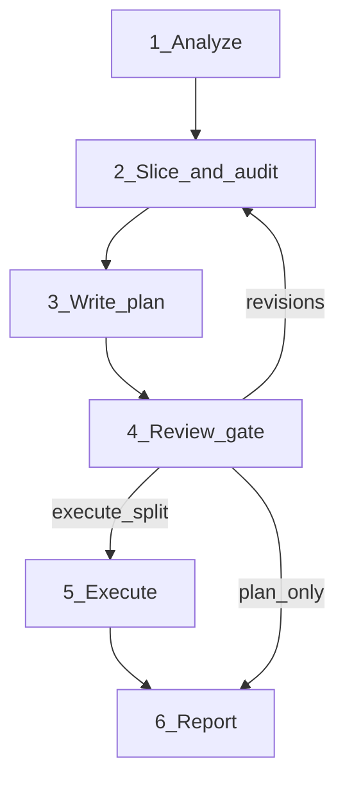

# Kibana split to PRs

**North star:** time-to-merged. Each PR = **one review question**, reviewable in one focused pass ([references/review.md](references/review.md)).

Turn local work into a **single stacked chain** (`upstream/main` → PR1 → PR2 → …). Deliverable is a **split plan**; git execution optional after approval. Design already reviewed.

**Not git-only:** when hunks or compile order block clean slices, **edit the code** (shims, dark-ship, extractions)—see [references/slicing.md](references/slicing.md) §splittability. Plan in the split plan; apply only after **execute split**.

Also read [AGENTS.md](../../../AGENTS.md) for module boundaries, plugin `server/index.ts`, testing, and mergeability guardrails.

## Hard rules

- **No git mutations** until the user approves the split plan or **execute split**.
- **No draft PRs** without explicit ask ([references/execution.md](references/execution.md)).
- **Never discard work.** No destructive git without explicit approval.
- **Recoverable snapshot** before Phase 5 (see table).
- **Stage only named files or hunks.** No `git add .` / `git add -A`.

## Workflow

Phases 1–3 are **git read-only** (may propose splittability edits; apply in Phase 5). Plans record validation as `not run — slice not materialized`; after **execute split**, each slice must pass `node scripts/check` before the next ([references/execution.md](references/execution.md)).

| Phase | Read | Do |
|-------|------|-----|
| **1 Analyze** | [slicing.md](references/slicing.md) §when-not, §hotspots | **`upstream`** = diff baseline, **`origin`** = push only—not `origin/main` unless user asks ([fork docs](../../../docs/extend/development-github.md)). `git remote -v`; if no `upstream`, stop. `git fetch upstream` && `git rev-parse --verify upstream/main`. Diff: `git diff upstream/main...HEAD`, `git diff`, `git diff --cached`, `git log upstream/main..HEAD --oneline`, `git status`. Chat history for intent. §when-not: if one PR suffices, say so. Per changed path: walk to `kibana.jsonc` (`@kbn/...`, owner, group, visibility). Record hotspots. |
| **2 Slice + audit** | [slicing.md](references/slicing.md), [review.md](references/review.md) | Slice per slicing order (CODEOWNERS → deps → mechanical/behavioral → BBA/dark-ship → noise). One chain only—no parallel PRs off `main`. Splittability edits when `git add -p` won't compile or yield one question. **Audit:** each PR passes [review.md](references/review.md) and has an answer for every Phase 4 row below. Revise or `NEEDS DECISION`. Flag mergeability per [AGENTS.md](../../../AGENTS.md) (SO: one model version/type/PR; privileges: deprecation skill ordering). |
| **3 Plan** | [plan-template.md](references/plan-template.md) | Write `split-plan-<slug>.md` (repo root or primary plugin dir—state path). Follow schema; **self-check:** every PR has all 7 fields. |
| **4 Gate** | — | **Stop.** No branches, commits, push, PRs. Present plan (see below). Ask: **Plan only** \| **Approve and execute split**. Do not bundle draft PRs. |
| **5 Execute** | [execution.md](references/execution.md) | Backup: `SHA=$(git stash create "pre-split"); [ -n "$SHA" ] && git update-ref "refs/backup/pre-split-$(date +%s)" "$SHA"`. `git fetch upstream`. Per PR in order: splittability edits → branch from `upstream/main` or prior split branch → stage planned hunks only → commit → **`node scripts/check --scope branch --base-ref upstream/main`**—stop on fail → record branch + SHA + outcome. No push/`gh` unless asked (`origin` only). Leave original branch recoverable. |
| **6 Report** | [execution.md](references/execution.md) | Plan path; branch names + SHAs; check outcomes; leftover hunks; suggest only: draft PRs on `origin`, or fix failed check before continuing. |

## Phase 4 — Review gate (mandatory)

Surface in chat — **lead with review questions**, not file lists:

1. Feature context + stack diagram + PR count (or single-PR recommendation)
2. **PR # → review question → bucket → attention**
3. Merge order (foundations vs behavioral—not approval urgency)
4. Hotspots + cross-PR hunk maps
5. Highest-attention PRs: one hint each
6. Splittability edits not in current diff
7. `NEEDS DECISION` items
