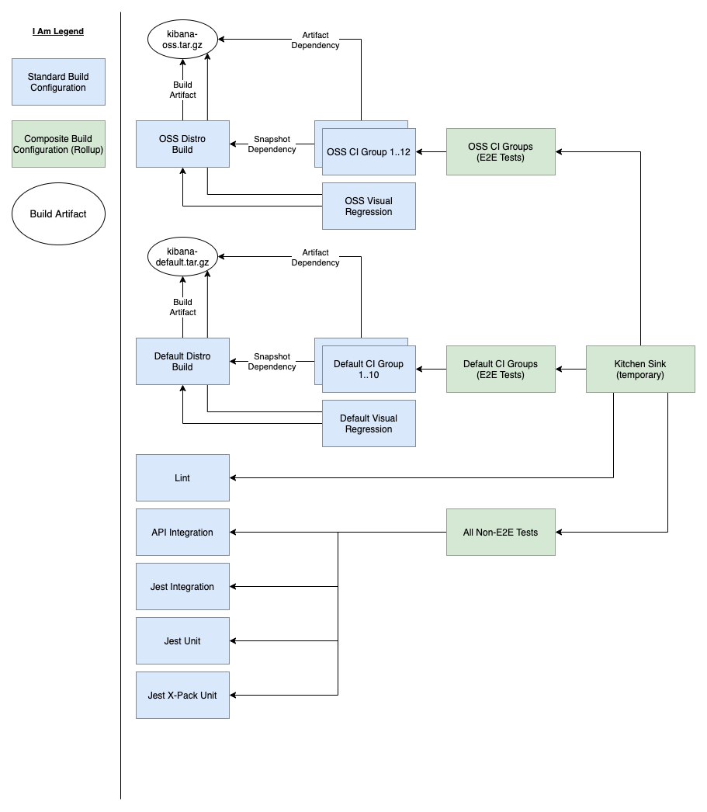

# Kibana TeamCity

## Implemented so far

- Project configuration with ability to provide configuration values that are unique per TeamCity instance (e.g. dev vs prod)
- Read-only configuration (no editing through the UI)
- Secrets stored in TeamCity outside of source control
- Setting secret environment variables (they get filtered from console if output on accident)
- GCP agent configurations
  - One-time use agents
  - Multiple agents configured, of different sizes (cpu, memory)
  - Require specific agents per build configuration
- Unit testable DSL code
- Build artifact generation and consumption
- DSL Extensions of various kinds to easily share common configuration between build configurations in the same repo
- Barebones Slack notifications via plugin
- Dynamically creating environment variables / secrets at runtime for subsequent steps
- "Baseline CI" job that runs a subset of CI for every commit
- "Hourly CI" job that runs full CI hourly, if changes are detected. Re-uses builds that ran during "Baseline CI" for same commit
- Performance monitoring enabled for all jobs
- Jobs with multiple VCS roots (Kibana + Elasticsearch)
- GCS uploading using service account key file and gsutil
- Job that has a version string as an "output", rather than an artifact/file, with consumption in a different job
- Clone a list of jobs and modify dependencies/configuration for a second pipeline
- Promote/deploy a built artifact through the UI by selecting previously built artifact (or automatically build a new one and deploy if successful)
- Custom Build IDs using service messages

## Pull Requests

The `Pull Request` feature in TeamCity:

- Automatically discovers pull request branches in GitHub
  - Option to filter by contributor type (members of same org, org+external contributor, everyone)
  - Option to filter by target branch (e.g. only discover Pull Requests targeting master)
  - Works by essentially modifying the VCS root branch spec (so you should NOT add anything related to PRs to branch spec if you are using this)
  - Draft PRs do get discovered
- Adds some Pull Request information to build overview pages
- Adds a few parameters available to build configurations:
  - teamcity.pullRequest.number
  - teamcity.pullRequest.title
  - teamcity.pullRequest.source.branch
  - teamcity.pullRequest.target.branch
  - (Notice that source owner is not available - there's no information for forks)
- Requires a token for API interaction

That's it. There's no interaction with labels/comments/etc. Triggering is handled via the standard triggering options.

So, if you only want to:

- Build on new commit (e.g. not via comment) or via the TeamCity UI
- Start builds for users not covered by the filter options using the TeamCity UI

The Pull Request feature may be enough to cover your needs. Otherwise, you'll need something additional (an external bot, or a new teamcity plugin, etc).

### Other PR notes

- TeamCity doesn't have the ability to cancel currently-running builds when a new commit is pushed
- TeamCity does not add fork information (e.g. the owner) to build configuration parameters
- Builds CAN be triggered for branches not yet discovered
  - You can turn off discovery altogether, and a branch will still be build-able. When triggered externally, it will show up in the UI and build.

How to [trigger a build via API](https://www.jetbrains.com/help/teamcity/rest-api-reference.html#Triggering+a+Build):

```
POST https://teamcity-server/app/rest/buildQueue

<build branchName="pull/78662">
  <buildType id="Your_Build_Configuration_ID" />
</build>
```

and with additional properties:

```
<build branchName="pull/78662">
  <buildType id="Your_Build_Configuration_ID" />
  <properties>
    <property name="env.GITHUB_PR_OWNER" value="cool-username"/>
    <property name="env.GITHUB_PR_REPO" value="kibana"/>
  </properties>
</build>
```

## Kibana Builds

### Baseline CI

- Generates baseline metrics needed for PR comparisons
- Only runs OSS and default builds, and generates default saved object field metrics
- Runs for each commit (each build should build a single commit)

### Full CI

- Runs everything in CI - all tests and builds
- Re-uses builds from Baseline CI if they are finished or in-progress
- Not generally triggered directly, is triggered by other jobs

### Hourly CI

- Triggers every hour and groups up all changes since the last run
- Runs whatever is in `Full CI`

### Pull Request CI

- Kibana TeamCity PR bot triggers this build for PRs (new commits, trigger comments)
- Sets many PR related parameters/env vars, then runs `Full CI`



### ES Snapshot Verification

Build Configurations:

- Build Snapshot
- Test Builds (e.g. OSS CI Group 1, Default CI Group 3, etc)
- Verify Snapshot
- Promote Snapshot
- Immediately Promote Snapshot

Desires:

- Build ES snapshot on a daily basis, run E2E tests against it, promote when successful
- Ability to easily promote old builds that have been verified
- Ability to run verification without promoting it

#### Build Snapshot

- checks out both Kibana and ES codebases
- builds ES artifacts
- uses scripts from Kibana repo to create JSON manifest and assemble snapshot files
- uploads artifacts to GCS
- sets parameters via service message that contains the snapshot URL, ID, version so they can be consumed by downstream jobs
- triggers on timer, once per day

#### Test Builds

- builds are clones of all "essential ci" functional and integration tests with irrelevant features disabled
  - they are clones because runs of this build and runs of the essential ci versions for the same commit hash mean different things
- snapshot dependency on `Build Elasticsearch Snapshot` is added to clones
- set `env.ES_SNAPSHOT_MANIFEST` = `dep.<BUILD_ES_BUILD_ID>.ES_SNAPSHOT_MANIFEST` to "consume" the built artifact

#### Verify Snapshot

- composite build that contains all of the cloned test builds

#### Promote Snapshot

- snapshot dependency on `Build Snapshot` and `Verify Snapshot`
- uses scripts from Kibana repo to promote elasticsearch snapshot from `Build Snapshot` by updating manifest files in GCS
- triggers whenever a build of `Verify Snapshot` completes successfully

#### Immediately Promote Snapshot

- snapshot dependency only on `Build Snapshot`
- same as `Promote Snapshot` but skips testing
- can only be triggered manually
