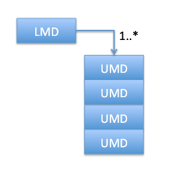

##Nested query and aggregation support for Kibana##

The use of Elasticsearch and Kibana together provide a powerful platform for data analytics. One of the primary use cases for this platform is analyzing log data from services within an enterprise. A sample of a dashboard as provided by Elastic:

##Background##
Here at HomeAway we primarily leverage Elasticsearch for ad-hoc search and retrieval of complex entities.  These entities are pulled from a variety of data sources and drive all of the internal services that run our business. The complexity of a particular entity type is determined by the business need.
 

The above model illustrates a simple parent child relationship that might exist in one of our entities. The list of UMD objects is contained within the LMD entity and the entire entity is stored in an index in Elasticsearch. Within Elasticsearch this entity can be stored as multiple documents in a parent child relationship, or as a single document where the child objects are 'nested'. Here at HomeAway we chose the nested approach due to the memory overhead associated with the parent-child documents within Elasticsearch.

For standard Elasticsearch queries against the Elasticsearch API, querying against such an index requires some special handling and knowledge around what fields are actually nested in the index schema and what the nested path is to the child object. For additional details on nested queries please see [nested query documentation](https://www.elastic.co/guide/en/elasticsearch/reference/current/query-dsl-nested-query.html nested query documentation). When HomeAway began the roll out of Elasticsearch for ad-hoc search of entities, the decision was made to hide the complex JSON query DSL from Elasticsearch, and instead roll our own simplified query language. 

##The Issue##
When HomeAway turned to the analytics side of Elasticsearch and began exploring how to leverage Kibana, we discovered that Kibana does not support nested queries, fields or objects. This is due to two things: 

1. Kibana doesn't parse the query entered, and instead relies on Elasticsearch to [parse the query for it](https://www.elastic.co/guide/en/elasticsearch/reference/current/query-dsl-query-string-query.html parse the query for it). This leads to several issues:
  * No feedback when a query contains a field that doesn't exist in the index and returns no results.
  * No feedback if an invalid type for a field is used (date for a boolean field) and returns no results.
  * Feedback provided for invalid query syntax returns as an exception stack trace that can be difficult to decipher.
2. Kibana doesn't know what fields are nested due to the way it loads the index mapping when an index is configured.

##HomeAway's Solution##
I realized that HomeAway has already solved the query side of the issue in Java, and porting this into Kibana would solve our needs. I began working on a fork of Kibana 4.3.1 a bit over a month ago as I had time, and finally have something to share. I will not go into details about how/what code changes were made to support this effort, instead I wish to focus on documentation and usage examples for the new query DSL. You can find the fork here: TBD

Here is the basic BNF:

  * expressions : e \| ANY

  * booleanValue : TRUE \| FALSE

  * fieldPath : FIELD \| fieldPath DOT FIELD

  * decimal : NUMBER DOT NUMBER

  * dateTime : date TIME

  * rangeLiteral : [( simpleValue COMMA simpleValue )]

  * setValue : simpleValue \| setValue COMMA simpleValue

  * setLiteral : { setValue }

  * inClause : fieldPath IN rangeLiteral \| fieldPath IN setLiteral

  * isClause : fieldPath IS NULL

  * simpleValue : decimal \| NUMBER \| STRING \| NULL \| booleanValue \| IPV4 \| date \| dateTime

  * operator : EQ \| LIKE \| GT EQ \| LT EQ \| GT \| LT

  * comparison : fieldPath operator simpleValue

  * boolExpression : e AND e \| e OR e

  * unaryExpression : NOT e \| EXISTS e

  * e : booleExpression \| unaryExpression \| comparison \| fieldPath \| inClause \| isClause \| ( e )

In a nutshell the above allows one to type a query that looks something like:

(a.b=true AND c.d IN {"a","b","c"} AND date>=2015-01-01) OR (d.e=FALSE AND NOT f.g IS NULL)

So how does the new query language solve our problem?

1. By parsing the queries in Kibana we have the ability to syntax check the query BEFORE it is converted to an Elasticsearch query.
2. I Modified the Kibana code to load the nested information about an index, and pass the index information to the query parser. This allows:
  * Field validation and feedback for invalid fields
  * Type validation against the values contained in the query
  * Nested query generation support
  
More importantly, by implementing #2 above, this same nested information about a field is now stored in the Kibana index, and can be leveraged by the aggregation query generation code. 

One of the first questions that may come to mind for many of you familiar with Kibana, is 'What about existing saved queries that use the Elasticsearch query string, or custom JSON queries?' The good news is that you can still use both of those. The code that was developed detects which kind of query was placed in the query field and acts accordingly. Queries saved and reloaded also are properly detected and acted on. 

##Error Handling Examples##

When typing the query, the query is constantly parsed. In this example a single letter 'l' was typed which did not match any known field in the index. Please note that the existing type ahead still works.

In this example, the query is not correctly formed as it doesn't contain a value:

Finally, if the user attempts to put a value that doesn't match the type of the field, the parser will send an error.

##Nested Queries##

In general you will never notice that nested queries are being generated, as this is done for you in the query parser. There are cases where a complex query requires that the nested fields be scoped correctly in order to return the correct results. This is where the unary EXISTS comes into play. The EXISTS provides a mechanism to scope a set of nested conditions together into a single condition. The thought here is that the use of EXISTS is checking for the existence of one or more nested objects within the parent.

Consider this query based on the simple LMD/UMD model defined above, where an LMD contains two UMD objects. UMD object #1 has a status of PENDING, and UMD object #2 has a status of CANCELED.:

uuid="15f82a5d-91b1-400f-97c4-6e3b9584972f" AND ( UMD_size=0 OR NOT UMD.status IN {"OK","PENDING"}) 

This query returns the wrong results because it was able to match one of the two nested UMD objects. What this query did was test each individual UMD against the "IN {"OK","PENDING"}" rather than against the entire set of UMD objects. If the search was changed to use exists the correct result should be returned (no results in this case).

uuid="15f82a5d-91b1-400f-97c4-6e3b9584972f" AND ( UMD_size=0 OR NOT EXISTS UMD.status IN {"OK","PENDING"}) 

When using EXISTS, whatever follows EXISTS as an expression, including surrounding the expression in parentheses, will be scoped to that one nested expression. You can use EXISTS multiple times within the same query as well.

uuid="15f82a5d-91b1-400f-97c4-6e3b9584972f" AND ( UMD_size=0 OR NOT EXISTS UMD.status = "OK" OR NOT EXISTS UMB.status = "PENDING") 

Please note that when saving a new style query, the next time it is loaded EXISTS unaries will be automatically injected for each scoped nested query. This happens because the query stored in the Kibana index is actually the Elasticsearch JSON query generated by the parser, and it must be reverse parsed back into the new style query language.

##Current Status##

The referenced fork/branch is still a work in progress and likely still contains bugs. My desire to share the work with the community is driven by the need to gather feedback and find issues in the code prior to submitting a pull request to the Kibana team. Here is a list of the known issues and items still pedning:

  * Fix BNF to only allow NULL for IS
  * Add more unit testing around parser.
  * Examine how to enhance the type ahead engine to allow it to provide a list of possible fields and/or query syntax. (AND/OR etc)
  * ...? 
