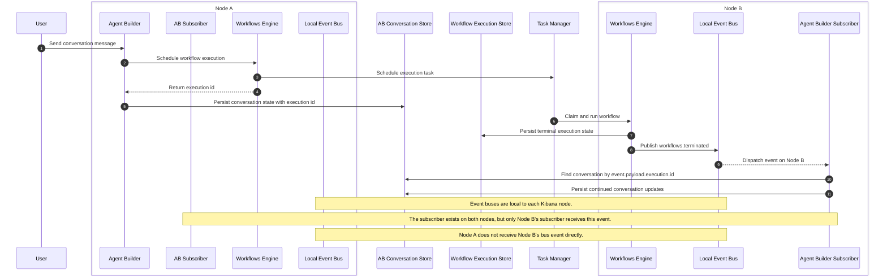

# Agent Builder Workflow Scenario

## Cross-Node Conversation Continuation

Agent Builder starts a workflow from a conversation handled on **Node A**. When the workflow execution is scheduled, Agent Builder stores the returned workflow execution id in its durable conversation state.

Task Manager later claims and runs that workflow on **Node B**. When the workflow reaches a terminal state, the workflows engine persists the execution update and publishes `workflows.terminated` on **Node B's local domain event bus**.

Agent Builder has registered the same `workflows.terminated` subscriber on every Kibana node, so the Agent Builder subscriber on **Node B** receives the event. It uses `event.payload.execution.id` to find the related conversation state, then continues the conversation from Node B and writes any resulting conversation updates back to Agent Builder's durable storage.

## Diagram

## Flow

| Step | Node | Description |
| --- | --- | --- |
| 1 | **Node A** | Agent Builder receives a user message and schedules a workflow execution. |
| 2 | **Node A** | Agent Builder stores the workflow execution id in its durable conversation state. |
| 3 | **Node B** | Task Manager claims and executes the workflow. |
| 4 | **Node B** | The workflows engine persists the terminal execution state and publishes `workflows.terminated` on Node B's local event bus. |
| 5 | **Node B** | Agent Builder's local subscriber receives the event and correlates it with the conversation via `event.payload.execution.id`. |
| 6 | **Node B** | Agent Builder continues the conversation and persists the resulting conversation updates to Agent Builder's durable storage. |
| 7 | **Node A** | Node A does not receive the event directly; it observes the result only through durable state or Agent Builder's UI refresh path. |

## Key Point

The domain event bus is local pub-sub, not cross-node messaging. The cross-node handoff works because `workflows.terminated` carries a durable correlation id, and Agent Builder stores conversation state durably before the workflow completes.
