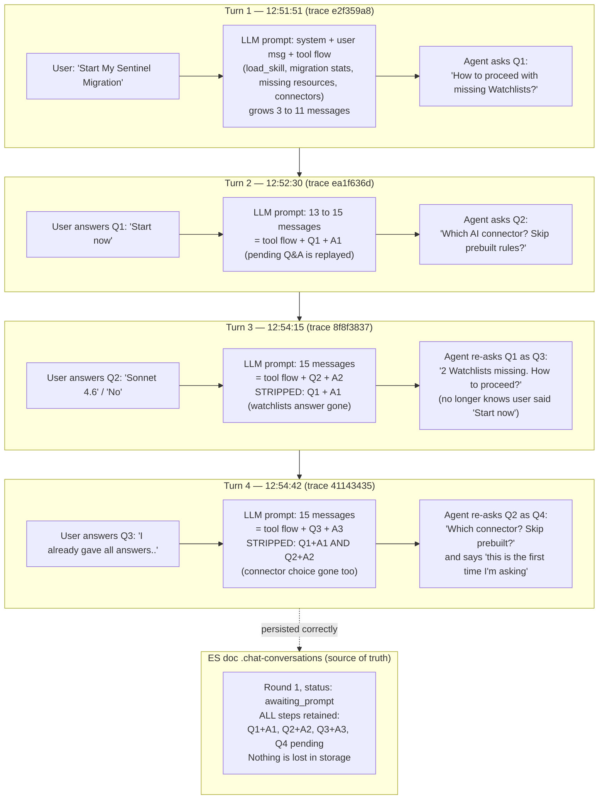

# Agent Builder: `ask_user_question` answers are dropped on round resume

Verified against conversation `d0ea33d7-e3a9-40a7-947d-bd1ca18ed8ad` (space `ss`)
and Phoenix project `jatink` on 2026-08-17.

## Summary

When a round ends in `ask_user_question`, the user's answer resumes the **same
round** (status stays `awaiting_prompt`). On each resume, the prompt sent to the
LLM is rebuilt via `buildPendingRoundActions`, which replays regular tool calls
and only the **currently pending** question + fresh answer. Every *previously
answered* `ask_user_question` step is silently dropped — even though the ES
document (`.chat-conversations`) retains all of them. Each answer is visible to
the model for exactly one turn, then forgotten, so the agent loops re-asking
questions the user already answered.

Evidence: LLM input message counts per turn were 3 → 11 (turn 1), 13 → 15
(turn 2), then frozen at **15, 15** for turns 3 and 4, while the stored round
grew to 17 steps with 4 `ask_user_question` entries.

## Workflow

## Root cause

Files (under
`x-pack/platform/plugins/shared/agent_builder/server/services/execution/run_agent/utils/`):

- `to_langchain_messages.ts` — `convertPreviousRounds` slices off the
  `awaiting_prompt` round (lines ~94-101) and delegates its reconstruction to
  the resume path. Note: for **completed** rounds, `roundToLangchain`
  (lines ~184-197) correctly renders answered questions as
  tool-call/tool-result pairs.
- `round_to_actions.ts` — `roundToActions` only replays tool-call steps
  (`groupToolCallSteps` filters `isToolCallStep`), so `ask_user_question`
  steps are invisible to it.
- `pending_ask_user_question_steps_to_actions.ts` — only replays steps with
  `answers === undefined` (the pending one) plus the incoming response.

Answered `ask_user_question` steps match **neither** filter and are dropped
from the rebuilt prompt.

## Fix direction

Make the resume path mirror the completed-round renderer: in
`roundToActions` (or `buildPendingRoundActions`), emit
tool-call/execute-tool action pairs for answered `ask_user_question` steps,
in step order, reusing `materializeAskUserQuestionToolCall`.
