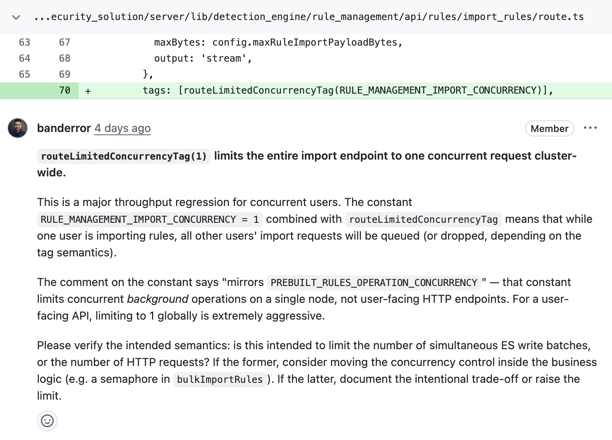
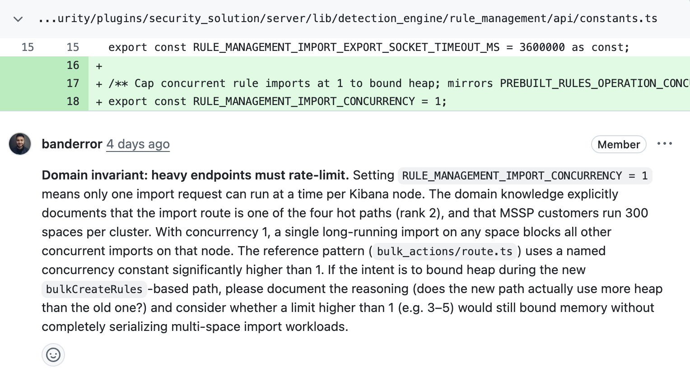
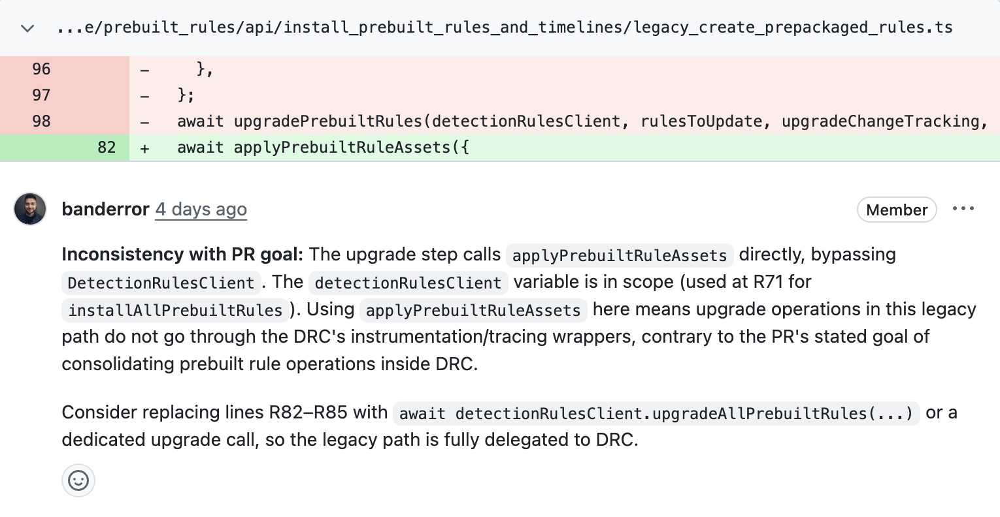
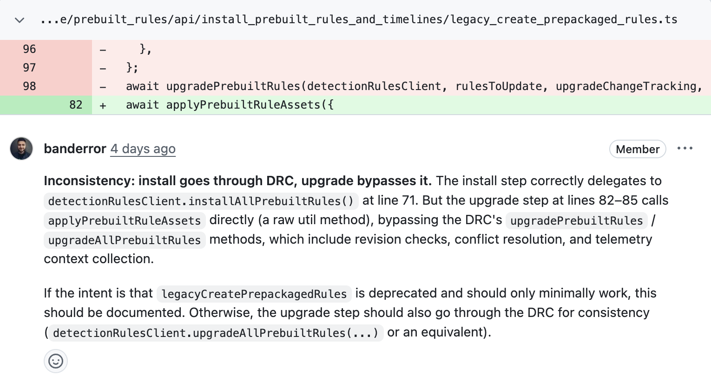
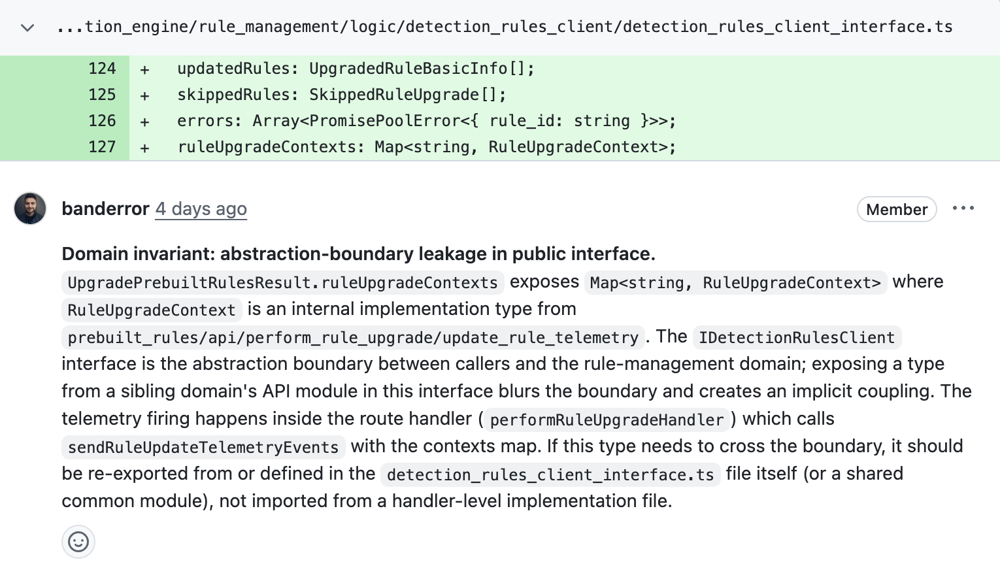

# Demo slides - AI-Assisted PR Review with Domain Knowledge

> Companion to `demo-script.md`. Per-slide outlines for the 21-min slot. Slide text is what the audience sees; speaker notes are what you say. Screenshot capture and deck assembly are out of scope here — this is the spec, not the build.

## Slide deck overview

| # | Slide | When | Block |
|---|---|---|---|
| 0 | Real-PR proof — two from our backlog | ~0:09:00 | Section 2.2 opener |
| 1a | #271722 — `rulesClient.bulkCreate()` | ~0:09:20 | Section 2.2 (PR #271722) |
| 1b | #272038 — Move install/upgrade/revert into `DetectionRulesClient` | ~0:10:30 | Section 2.2 (PR #272038) |
| 3 | Anatomy of a domain knowledge file | ~0:13:00 | Section 3.1 (anatomy) |
| 2 | How domain discovery works | ~0:14:30 | Section 3.1 (discovery) |
| 4 | Smart is not the same as informed | ~0:18:00 | Section 4.2 (synthesis) |

The planted-PR walkthrough at Section 2.1 (~0:04–0:09) does not use slides — it is a live browser walkthrough of GitHub comments on PR #272773. Specific comments to walk are listed at the end of this doc under "Comment IDs for the planted-PR walkthrough".

---

## Slide 0 — Real-PR proof — two from our backlog

- **Purpose**: 20–30 sec framing card before per-PR slides. Sets up the "same skill, same code, two clones" framing.
- **Layout**: title at top, 3 bullets, small 4-card grid at the bottom (two highlighted, two greyed).
- **Slide text**:
  - **Title**: "Real-PR proof — two from our backlog"
  - **Bullets**:
    - Same skill: `/dex-review-code`
    - Same code, two clones — the only difference is the `.agents/domains/` folder
    - Four PRs reviewed; we'll walk two
  - **Bottom grid (small PR cards, no engineer names)**:
    - ⭐ #271722 — `rulesClient.bulkCreate()` *(today)*
    - ⭐ #272038 — Move install/upgrade/revert into `DetectionRulesClient` *(today)*
    - (greyed) #268165 — Refine rules `_search`, `_review` API contracts
    - (greyed) #269617 — MVP UI for rule changes history
- **Speaker note**: "*Before we look at the live run, here's what the same skill produces on real, merged PRs from this team's last few weeks. Two clones, only difference is the domain folder. I'll walk two of these and we can come back to the others in the hands-on.*"

---

## Slide 1a — PR #271722 (`rulesClient.bulkCreate()`)

- **Purpose**: Show that on the *same architectural decision*, generic gives a one-liner ("aggressive, raise it") while domain gives the reasoning, the scale constraint, and the bounded fix.
- **Layout**: PR title + number at top; two columns *WITHOUT (left) | WITH (right)*; single quote pair with breathing room; small footer.
- **Slide text**:
  - **Title**: "#271722 — `rulesClient.bulkCreate()`"
  - **Subtitle**: Bulk rule creation in the alerting layer

  | GENERIC | DOMAIN-AWARE |
  |---|---|
  | *(`route.ts`)* *"`routeLimitedConcurrencyTag(1)` limits the entire import endpoint to one concurrent request cluster-wide. … limiting to 1 globally is extremely aggressive — consider raising it."* | *(`constants.ts`)* *"**Domain invariant: heavy endpoints must rate-limit.** The domain knowledge documents the import route as one of four hot paths, and MSSP customers run 300 spaces per cluster. With concurrency 1, a single long-running import on any space blocks all other concurrent imports on that node. Consider whether a limit higher than 1 (e.g. 3–5) would still bound memory without completely serializing multi-space import workloads."* |

  - **Footer (small)**: "*Same architectural decision. Generic: 'aggressive, consider raising.' Domain-aware: 'this disables bulk imports for MSSP — here's why, here's the lower bound, here's the upper bound.'*"
- **Speaker punchline** (notes, not on slide): "*Generic gives you the one-liner. Domain-aware gives you the bounds.*"
- **Reference screenshots** (the actual GitHub comments — source content for the slide):

  

  

---

## Slide 1b — PR #272038 (Refactor into `DetectionRulesClient`)

- **Purpose**: Show *parity at the surface* (both reviewers catch the obvious DRC-bypass) AND a *domain-only catch beneath it* (an abstraction-boundary leak in the public interface that generic has no vocabulary for).
- **Layout**: same two-column structure as Slide 1a; two rows — top = parity (both caught it); bottom = unpaired domain catch (left cell empty).
- **Slide text**:
  - **Title**: "#272038 — Move prebuilt rule install/upgrade/revert into `DetectionRulesClient`"
  - **Subtitle**: Refactor pulling code into the central abstraction

  | GENERIC | DOMAIN-AWARE |
  |---|---|
  | *(`legacy_create_prepackaged_rules.ts`)* *"Inconsistency with PR goal: the upgrade step calls `applyPrebuiltRuleAssets` directly, bypassing `DetectionRulesClient`."* | *(`legacy_create_prepackaged_rules.ts`)* *"Inconsistency: install goes through DRC, upgrade bypasses it."* |
  | *(no analog)* | *(`detection_rules_client_interface.ts`)* *"**Domain invariant: abstraction-boundary leakage in public interface.** `UpgradePrebuiltRulesResult.ruleUpgradeContexts` exposes `Map<string, RuleUpgradeContext>` — an internal implementation type from a sibling domain's handler-level module — through the `IDetectionRulesClient` interface."* |

  - **Footer (small)**: "*Both caught the obvious DRC-bypass. Only the domain-aware reviewer noticed the new public interface is leaking a sibling-domain handler-level type.*"
- **Speaker punchline** (notes): "*Parity at the surface, delta beneath. The domain-aware reviewer sees what an owner of the abstraction would see.*"
- **Reference screenshots** (the actual GitHub comments — source content for the slide):

  Top row — parity on `legacy_create_prepackaged_rules.ts`:

  

  

  Bottom row — unpaired domain catch on `detection_rules_client_interface.ts`:

  

---

## Slide 2 — How domain discovery works

- **Purpose**: 60–90 sec demystification. Audience should leave able to draw this flow themselves.
- **Layout**: horizontal 4-box flow diagram with single-line caption under each box.
- **Slide text**:
  - **Title**: "How domain discovery works"
  - **Flow** (left → right):

```
┌───────────────┐     ┌────────────────┐     ┌────────────────┐     ┌─────────────────┐
│  git diff     │ ──▶ │  matched paths │ ──▶ │  loaded domain │ ──▶ │ reviewer agent  │
│  origin/main  │     │  ∩ registered  │     │  domain.json   │     │ tagged comments │
│               │     │  domains       │     │  + .md files   │     │ w/ invariants   │
└───────────────┘     └────────────────┘     └────────────────┘     └─────────────────┘
```

  - **Captions under boxes** (one line each):
    - "Diff your branch"
    - "Intersect with registered domains"
    - "Load the matching domain's knowledge"
    - "Reviewer subagent emits comments tagged with invariants"
- **Speaker note**: "*That's the whole mechanism. There's no special model, no fine-tuning. The skill diffs your branch, finds which domain folder your changes intersect, loads the markdown, and hands it to a reviewer subagent. Same model, much better answer.*"

---

## Slide 3 — Anatomy of a domain knowledge file

- **Purpose**: 20–30 sec recap so audience knows what they'd write in the hands-on.
- **Layout**: side-by-side panels.
- **Slide text**:
  - **Title**: "Anatomy of a domain knowledge file"

```
┌─ domain.json ─────────────────┐    ┌─ detection-rule-management.md ─┐
│ {                             │    │  # Overview                     │
│   "slug": "detection-...",    │    │  # Architectural invariants     │
│   "name": "...",              │    │  # Common review patterns       │
│   "owners": [...],            │    │  # Security considerations      │
│   "paths": [...],             │    │  # Performance constraints      │
│   "knowledge_files": [        │    │  # Historical catches           │
│     "detection-rule-mgmt.md"  │    │                                 │
│   ]                           │    │                                 │
│ }                             │    │                                 │
└───────────────────────────────┘    └─────────────────────────────────┘
```

  - **Bottom bullet**: "*Captured with `/dex-domain-capture` — 30–60 min one-time, then it pays off on every review.*"
- **Speaker note**: "*Two files, that's the whole format. The `.json` is the entry-point — where in the repo it applies. The `.md` is what the reviewer agent reads. Anyone on your team can write these.*"

---

## Slide 4 — Smart is not the same as informed

- **Purpose**: The take-home line. The synthesizing close of the demo — what the audience leaves repeating.
- **Layout**: big centered headline + three indented bullets + small supporting line.
- **Slide text**:
  - **Headline**: **"Smart is not the same as informed."**
  - **Three bullets**:
    - **The abstraction** — The model doesn't know that `IDetectionRulesClient` is **the** boundary in our domain.
    - **The history** — It doesn't know we got burned by an `as`-cast on `lastRunStatus` in PR #262307.
    - **The scale** — It doesn't know MSSP customers run 300 spaces × 10,000 rules per space.
  - **Supporting line (smaller, bottom)**: "*AI dev automation is as good as the quality and accuracy of the information you put in the context window.*"
- **Speaker note**: "*This is the part I think is underrated. LLMs are smart. They are. But smart is not the same as informed. The three things on this slide — the abstraction, the history, the scale — none of them are derivable from the code. We had to tell the AI. And once we did, it caught things it never could have caught before. The supporting line at the bottom is the broader principle: this isn't just about code review. Any agentic AI workflow your team builds — review, refactoring, generation, planning — its quality is bounded by what you put in the context window. `dex-dev-skills` is the library where these skills live; you'll extend it in the hands-on.*"

---

## Comment IDs for the planted-PR walkthrough (Section 2.1, ~0:04–0:09)

Reference card for the GitHub walkthrough. Open PR #272773; expand each review; find each comment by file path + line. Read the **bold** sentence aloud, paraphrase the rest.

### GENERIC review — 3 comments to walk

**Comment A — `Math.random()` in production data path** (~30 sec)
- **File / line**: `x-pack/.../server/lib/detection_engine/rule_management/api/rules/birthdays_today/utils/birthday_helper.ts:100`
- **Read aloud**: *"`computeAgeYears` adds a random number of extra years (`Math.floor(Math.random() * 5) + 1`) to make the age 'more festive'. This means the same rule returns a different age on every request, every API call will be non-deterministic, and there is no way to write a deterministic test for this function."*
- **Note**: a real bug. Worth fixing. But this is the kind of thing a careful engineer would also notice in 30 sec — no domain expertise required.

**Comment B — Missing date validation** (~30 sec)
- **File / line**: `x-pack/.../server/lib/detection_engine/rule_management/api/rules/birthdays_today/route.ts:53`
- **Read aloud**: *"`birthdayDate` from the query string is accepted as any string and then split on `-` with no format validation. If a caller sends `birthdayDate=not-a-date` the `parts` array will contain `NaN` values that silently propagate into `month` and `day`, causing the query to match nothing. Add a regex constraint like `z.string().regex(/^\\d{4}-\\d{2}-\\d{2}$/)`."*
- **Note**: a real bug. Worth fixing. Generic AI tooling catches this just fine.

**Comment C — Silent truncation at 1000 rules** (~30 sec)
- **File / line**: `x-pack/.../server/lib/detection_engine/rule_management/api/rules/birthdays_today/utils/birthday_helper.ts:50`
- **Read aloud**: *"`findCelebratingRules` issues an uncapped `size: 1000` query against `.kibana_alerting_cases` and then filters birthday matches in memory. As the number of SIEM rules grows this will return at most 1000 rules regardless of actual count (silent truncation), and impose a fixed 1000-doc memory/network overhead on every page load."*
- **Note**: a real bug. Notice what's *not* in this comment: no mention of `RulesClient`, no mention of why `.kibana_alerting_cases` is the wrong index to talk to directly, no MSSP-scale framing. It's a perf/correctness comment, not a domain comment.

### DOMAIN-AWARE review — 3 comments to walk

**Comment D — API contract leakage** (~40 sec)
- **File / line**: `x-pack/.../common/api/detection_engine/rule_management/birthdays_today/birthdays_today_route.gen.ts:43`
  - Alt: `birthdays_today_route.schema.yaml:56` (same comment, different file)
- **Read aloud**: *"**Domain invariant: API contract must never expose SO/AF storage shape.** The response fields `alertTypeId`, `createdBy`, `createdAt`, and `lastRun` are AF/SavedObject internal attribute names in camelCase. The canonical `RuleResponse` contract uses snake_case and domain names: `rule_type_id`, `created_by`, `created_at`. Shipping these camelCase AF internals as a public API contract leaks the storage layer and freezes it — once shipped, callers depend on these names."*
- **Punchline**: "*This is the canonical contract. The AI knows it because we told it.*"

**Comment E — `RulesClient` bypass** (~40 sec)
- **File / line**: `x-pack/.../server/lib/detection_engine/rule_management/api/rules/birthdays_today/utils/birthday_helper.ts:60`
- **Read aloud**: *"**Domain invariant: never bypass the abstraction.** `findCelebratingRules` calls `esClient.search()` directly against `.kibana_alerting_cases`, bypassing AF's `RulesClient` entirely. The invariant is explicit: 'Detection rules are read/written **only** through AF's `RulesClient`'. Direct ES access is the most severe form of abstraction bypass in this domain — it skips RBAC enforcement, space isolation, SO model versioning, and any hook that `RulesClient.find` applies."*
- **Punchline**: "*'The single hardest rule in the domain.' That's a phrase a senior engineer on my team would actually use.*"

**Comment F — Bulk anti-pattern** (~40 sec)
- **File / line**: `x-pack/.../server/lib/detection_engine/rule_management/api/rules/bulk_actions/route.ts:493`
- **Read aloud**: *"**Domain invariant: bulk endpoints must do true bulk under the hood.** The `birthday_celebrate` action wraps `rulesClient.bulkEdit` inside `initPromisePool`, calling it once per rule with `ids: [rule.id]` — that is N individual `bulkEdit` calls, not one true-bulk call. The domain knowledge is explicit: 'New bulk endpoints must call true-bulk primitives (`RulesClient.bulkEdit`, etc.), not loop with `p-map` / promise-pool / async-batching.'"*
- **Punchline**: "*This is what doesn't work for MSSP customers. The AI knows the scale constraint because we told it.*"

### Closing line (after all 6)

*"Generic catches real bugs — `Math.random()` in production, missing validation, silent truncation. Those are all worth fixing. But none of them named an architectural invariant, called out an abstraction being bypassed, or connected to a domain-specific scale concern. That's the gap domain knowledge closes."*

---

## Optional / bench

Use only if time allows.

### Optional Slide — #268165 mini-comparison (15 sec)

If you want a 3rd PR data point in the elastic block, mention #268165 verbally (no slide): *"On #268165, the same comparison — generic flagged the dropped per-item length cap; domain additionally flagged the `Record<string, unknown>` + `as` cast on the aggregation result. That cast is the exact pattern from PR #262307's `lastRunStatus` thread. Three out of four PRs, same shape of result."*

### Optional 4th GitHub comment (after Comment F)

If you've banked ~30 sec extra, walk one more DOMAIN-AWARE comment to drive the abstraction point harder:

- **File / line**: `x-pack/.../server/lib/detection_engine/rule_management/api/rules/birthdays_today/utils/birthday_helper.ts:94`
- **Read aloud**: *"**Domain invariant: business logic lives in clients, never in route handlers or `utils/`.** `findCelebratingRules`, `computeAgeYears`, and `buildBirthdayMessage` implement the feature's core logic but are placed in a `utils/birthday_helper.ts` file beneath the route. This is the *utils anti-pattern* that the domain knowledge explicitly names as something to refuse on review. Business logic belongs behind `IDetectionRulesClient`, not in a `utils/` helper that only the route handler calls."*
- **Punchline**: "*The AI named the anti-pattern. That's only possible because we wrote it down.*"
