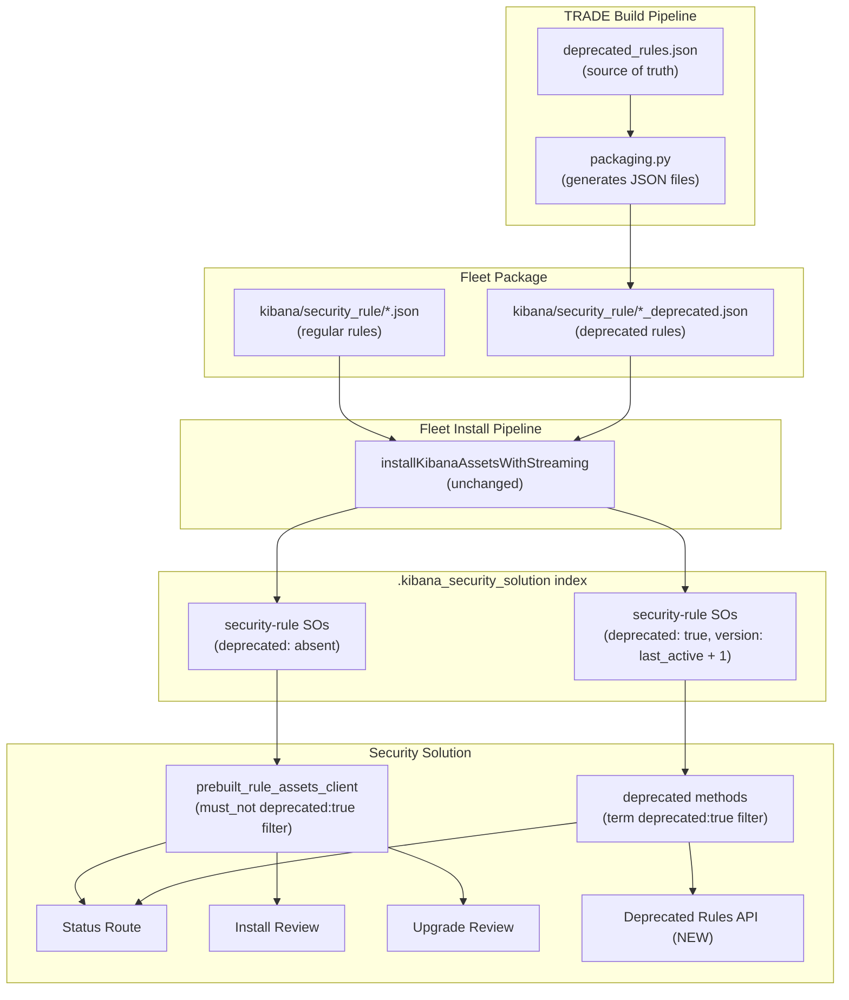

# Deprecated Prebuilt Rules -- Implementation Plan

**Epic:** elastic/security-team#6344
**Target release:** 9.4.0

## Task Checklist

- [x] Update TRADE team's packaging scripts (`packaging.py`) to generate individual `security_rule` JSON files from `deprecated_rules.json` + `version_lock.json` (using `last_active_version + 1`) and include them in the Fleet package under `kibana/security_rule/`
- [ ] Add model version 3 to `security-rule` SO type with `deprecated` boolean mapping
- [ ] Define `DeprecatedPrebuiltRuleAsset` Zod schema and validation
- [ ] Add `must_not deprecated:true` default filter to `prepareQueryDslFilter` in the assets client
- [ ] Add `fetchDeprecatedRules` method to the prebuilt rule assets client
- [ ] Update status route to include `num_prebuilt_rules_deprecated`
- [ ] Create `GET /internal/detection_engine/prebuilt_rules/deprecated` endpoint with optional `rule_ids` filter, returning installed deprecated rule stubs (`id`, `rule_id`, `version`, `name`)
- [ ] Write unit tests for query filters, validation, and deprecated client methods
- [ ] Write API integration tests for deprecated rules excluded from install/upgrade and included in status
- [ ] Build Deprecated tab on Rule Management page with table, flyout, and delete action (subsequent work)

---

## Architecture Overview

The TRADE team's build pipeline generates individual `security-rule` JSON files for each deprecated rule (from their existing `deprecated_rules.json` manifest) and places them under `kibana/security_rule/` in the Fleet package -- the same path as regular rules. Fleet's existing streaming install pipeline processes them automatically with **zero Fleet code changes**. A `deprecated: true` boolean field on the SO attributes discriminates deprecated rules from regular ones. All existing Security Solution queries are updated to exclude deprecated rules by default.



---

## Part 1: TRADE Build Pipeline -- Generate Deprecated Rule Files

### 1a. What the TRADE team needs to produce

For each entry in `deprecated_rules.json`, generate a JSON file under `kibana/security_rule/` in the package archive. Each file follows the standard Fleet `ArchiveAsset` format that Fleet already processes:

```json
{
  "id": "{rule_id}_{last_active_version + 1}",
  "type": "security-rule",
  "attributes": {
    "rule_id": "{rule_id}",
    "version": 6,
    "deprecated": true,
    "name": "{rule_name from manifest}"
  }
}
```

- **id**: `{rule_id}_{version}` -- matches existing `getPrebuiltRuleAssetSoId` format (`x-pack/solutions/security/plugins/security_solution/server/lib/detection_engine/prebuilt_rules/logic/rule_assets/prebuilt_rule_assets_client/utils.ts`)
- **type**: `security-rule` -- must match the path's asset type
- **attributes**: minimal schema -- only `rule_id`, `version`, `deprecated`, and `name` are required
- **version**: `last_active_version + 1` -- derived from the rule's entry in `version_lock.json` (see Part 5)

### 1b. Changes to the TRADE packaging scripts

**Status:** Implemented, tested, and committed.

**File:** `detection_rules/packaging.py` -- `_generate_registry_package` method

The existing method already generates individual JSON files for active rules and copies the raw `deprecated_rules.json` to the package root. A loop was added after the active rules that generates deprecated rule JSON files, gated to `stack_version >= 9.4.0`:

```python
        if stack_version >= Version.parse("9.4.0"):
            deprecated_lock = loaded_version_lock.deprecated_lock
            version_lock = loaded_version_lock.version_lock

            for rule_id, dep_entry in deprecated_lock.data.items():
                lock_entry = version_lock.data.get(rule_id)
                if lock_entry is None:
                    continue

                deprecated_version = lock_entry.version + 1
                asset_id = f"{rule_id}_{deprecated_version}"

                asset = {
                    "id": asset_id,
                    "type": definitions.SAVED_OBJECT_TYPE,
                    "attributes": {
                        "rule_id": rule_id,
                        "version": deprecated_version,
                        "name": dep_entry.rule_name,
                        "deprecated": True,
                    },
                }

                asset_path = rules_dir / f"{asset_id}.json"
                asset_path.write_text(json.dumps(asset, indent=4, sort_keys=True), encoding="utf-8")
```

The `stack_version >= 9.4.0` gate ensures deprecated rule files are only generated for packages targeting Kibana 9.4+, where the SO mapping and application logic exist. Packages shipped to older Kibana versions (9.3, 9.2, etc.) are unaffected.

### 1c. Testing the packaging change locally

From the `detection-rules` repo root:

```bash
pip install -e .
python -m detection_rules dev build-release

# Verify deprecated rule files were generated
find releases/*/fleet/*/kibana/security_rule/ -name "*.json" \
  -exec grep -l '"deprecated": true' {} \; | head -10

# Count regular vs deprecated rule files
total=$(ls releases/*/fleet/*/kibana/security_rule/*.json | wc -l)
deprecated=$(grep -rl '"deprecated": true' releases/*/fleet/*/kibana/security_rule/ | wc -l)
echo "Total: $total, Deprecated: $deprecated, Regular: $((total - deprecated))"
```

### 1d. Why this approach requires zero Fleet changes

Fleet's `installKibanaAssetsWithStreaming` (`x-pack/platform/plugins/shared/fleet/server/services/epm/kibana/assets/install_with_streaming.ts`) iterates over all archive entries, checks `isKibanaAssetType(path)` (matches `kibana/security_rule/*`), confirms the JSON's `type` field equals `security-rule`, and calls `bulkCreate`. It does not inspect the attributes at all.

The SO-level validation schema (`securityRuleV1`) only requires `rule_id` and `version` with `unknowns: 'allow'`, so the `deprecated` field passes through.

### 1e. Known limitation: `overwrite: false` and attribute updates

Fleet's streaming install uses `bulkCreate` with `overwrite: false`. If the deprecated SO already exists with the same ID, re-installing produces a 409 conflict that is silently ignored -- the SO attributes are **not** updated. If the TRADE team later adds a field like `deprecation_reason` to an existing deprecated entry without bumping the version, it won't take effect until the user does a clean install.

**Mitigation:** the TRADE team can bump the deprecated version (e.g., from v6 to v7) when updating deprecation metadata, which creates a new SO ID and triggers cleanup of the old one. This is the same pattern as regular rule version bumps.

### 1f. Performance impact: negligible

The current package ships ~1,400+ rule files (each 2-5 KB). Adding ~95 deprecated rules with minimal attributes (~200-300 bytes each) adds **~20-30 KB** total -- less than a single regular rule file. The streaming install processes in batches of 100, so 95 extra rules is less than one additional batch.

---

## Part 2: Security Solution -- SO Type Changes

### 2a. New model version for `security-rule` SO

**File:** `x-pack/solutions/security/plugins/security_solution/server/lib/detection_engine/prebuilt_rules/logic/rule_assets/prebuilt_rule_assets_type.ts`

Add **model version 3** with a `mappings_addition` for the `deprecated` field:

- Add `deprecated: { type: 'boolean' }` to `prebuiltRuleAssetMappings.properties`
- Add a new `securityRuleV3` `create` schema using `@kbn/config-schema` that makes `severity` and `risk_score` optional (via `schema.maybe()`) to allow both full active rules and minimal deprecated rules:

```typescript
const securityRuleV3 = schema.object(
  {
    rule_id: schema.string(),
    version: schema.number(),
    name: schema.string(),
    tags: schema.maybe(schema.arrayOf(schema.string())),
    severity: schema.maybe(schema.string()),
    risk_score: schema.maybe(schema.number()),
    deprecated: schema.maybe(schema.boolean()),
  },
  { unknowns: 'allow' }
);
```

- Add a function-based `forwardCompatibility` schema that strips unknown fields for deprecated rules while passing through active rules unchanged:

```typescript
const securityRuleV3ForwardCompat = (attributes: Record<string, unknown>) => {
  if (attributes.deprecated === true) {
    return {
      rule_id: attributes.rule_id,
      version: attributes.version,
      name: attributes.name,
      deprecated: attributes.deprecated,
    };
  }
  return attributes;
};
```

- Register model version 3:

```typescript
'3': {
  changes: [{
    type: 'mappings_addition',
    addedMappings: { deprecated: { type: 'boolean' } },
  }],
  schemas: {
    forwardCompatibility: securityRuleV3ForwardCompat,
    create: securityRuleV3,
  },
},
```

This won't break v2 functionality because the SO `create` schema is write-time validation. The read path uses ES mappings (unchanged for existing fields) and application-level Zod schemas.

### 2b. Zod schema for deprecated rule assets

**New file:** alongside `x-pack/solutions/security/plugins/security_solution/server/lib/detection_engine/prebuilt_rules/model/rule_assets/prebuilt_rule_asset.ts`

Define a minimal `DeprecatedPrebuiltRuleAsset` schema:

```typescript
export const DeprecatedPrebuiltRuleAsset = z.object({
  rule_id: RuleSignatureId,
  version: RuleVersion,
  deprecated: z.literal(true),
  name: z.string(),
  // Future fields:
  // deprecation_reason: z.string().optional(),
  // replacement_rule_ids: z.array(z.string()).optional(),
});
```

Keep `PrebuiltRuleAsset` unchanged -- it continues to represent non-deprecated rules. The two schemas are used by different code paths (existing methods use `PrebuiltRuleAsset`, new deprecated-specific methods use `DeprecatedPrebuiltRuleAsset`).

### 2c. Update validation

**File:** `x-pack/solutions/security/plugins/security_solution/server/lib/detection_engine/prebuilt_rules/logic/rule_assets/prebuilt_rule_assets_validation.ts`

The existing `validatePrebuiltRuleAssets` is only called when fetching non-deprecated assets (since queries will exclude deprecated rules). Add a separate `validateDeprecatedRuleAssets` function that validates against `DeprecatedPrebuiltRuleAsset`.

---

## Part 3: Security Solution -- Client Query Updates

### 3a. Default exclusion filter

**File:** `x-pack/solutions/security/plugins/security_solution/server/lib/detection_engine/prebuilt_rules/logic/rule_assets/prebuilt_rule_assets_client/utils.ts`

Add a `must_not` clause to `prepareQueryDslFilter` to exclude deprecated rules by default:

```typescript
queryFilter.push({
  bool: {
    must_not: {
      term: { [`${PREBUILT_RULE_ASSETS_SO_TYPE}.deprecated`]: true },
    },
  },
});
```

This ensures all existing methods (`fetchLatestVersions`, `fetchLatestAssets`, `fetchAssetsByVersion`, `fetchTagsByVersion`) automatically exclude deprecated rules without any caller changes.

**Why this works without migration**: Existing `security-rule` SOs don't have a `deprecated` field. ES `term` queries on a missing boolean field return no matches, so `must_not: { term: { deprecated: true } }` correctly includes all existing SOs.

### 3b. Audit of affected callers (all are safe with default exclusion)

All 20+ callers of the assets client methods will automatically exclude deprecated rules with no code changes:

- `get_prebuilt_rules_status_route` -> `fetchLatestVersions` -- deprecated excluded from installable/upgradeable counts
- `review_rule_installation_handler` -> `fetchLatestVersions`, `fetchAssetsByVersion`, `fetchTagsByVersion` -- deprecated not shown as installable
- `review_rule_upgrade_handler` -> `fetchLatestVersions`, `fetchAssetsByVersion` -- deprecated not shown as upgradeable
- `perform_rule_installation_handler` -> via `rule_source_importer` -- cannot install deprecated
- `perform_rule_upgrade_handler` -> via `rule_source_importer` -- cannot upgrade to deprecated
- `bootstrap_prebuilt_rules_handler` -> `fetchLatestAssets` -- deprecated excluded from bootstrap
- `rule_source_importer` -> `fetchLatestVersions`, `fetchAssetsByVersion` -- deprecated excluded
- `bulk_edit_rules`, `patch_rule`, `update_rule` -> `fetchAssetsByVersion` -- uses specific SO IDs, won't reference deprecated
- `get_metrics` (usage telemetry) -> `fetchLatestVersions` -- deprecated excluded from counts
- `rule_migrations` -> `fetchLatestVersions`, `fetchAssetsByVersion` -- deprecated excluded

### 3c. New methods for deprecated rules

Add to the assets client interface:

- **`fetchDeprecatedRules()`**: Queries `security-rule` SOs with `filter: { term: { deprecated: true } }`. Returns `DeprecatedPrebuiltRuleAsset[]` (all deprecated rule assets in the package). No pagination needed -- the set is small (~95 rules, growing slowly).

This method uses the existing `savedObjectsClient.search` pattern but with an inverted filter (include only deprecated).

---

## Part 4: Security Solution -- API/Handler Updates

### 4a. Status route

**File:** `x-pack/solutions/security/plugins/security_solution/server/lib/detection_engine/prebuilt_rules/api/get_prebuilt_rules_status/get_prebuilt_rules_status_route.ts`

Add `num_prebuilt_rules_deprecated` to the `stats` object in `GetPrebuiltRulesStatusResponseBody` (`x-pack/solutions/security/plugins/security_solution/common/api/detection_engine/prebuilt_rules/get_prebuilt_rules_status/get_prebuilt_rules_status_route.ts`). There is already a comment on line 39 anticipating this field.

Logic:

1. Fetch deprecated rule assets from the assets client (`fetchDeprecatedRules()`)
2. Cross-reference with installed prebuilt rule versions (`currentRuleVersions`, already loaded at line 45)
3. Count the intersection: `deprecatedAssets.filter(a => currentRuleVersionsMap.has(a.rule_id)).length`

Deprecated rules are **not** counted in `num_prebuilt_rules_to_install` or `num_prebuilt_rules_to_upgrade` (handled by the default exclusion filter in Part 3a).

**Updated response example:**

```json
{
  "stats": {
    "num_prebuilt_rules_installed": 450,
    "num_prebuilt_rules_to_install": 120,
    "num_prebuilt_rules_to_upgrade": 8,
    "num_prebuilt_rules_total_in_package": 1400,
    "num_prebuilt_rules_deprecated": 5
  }
}
```

### 4b. New endpoint: Get Deprecated Rules

**`GET /internal/detection_engine/prebuilt_rules/deprecated`**

Returns deprecated rule stubs for prebuilt rules that are both deprecated in the package **and** currently installed by the user.

Add URL constant to `x-pack/solutions/security/plugins/security_solution/common/api/detection_engine/prebuilt_rules/urls.ts`:

```typescript
export const GET_DEPRECATED_RULES_URL = `${BASE_URL}/deprecated` as const;
```

**Request schema** (new file `common/api/detection_engine/prebuilt_rules/get_deprecated_rules/get_deprecated_rules_route.ts`):

```typescript
export const GetDeprecatedRulesRequest = z.object({
  rule_ids: ArrayFromString(z.string()).optional(),
});
```

- `rule_ids` is an optional comma-separated query param (parsed via `ArrayFromString`, same as `FindRulesRequestQuery`)
- When omitted, returns all installed deprecated rules (for the modal)
- When provided, filters to the specified IDs (for rule details page or batch lookups)
- Acts as a filter, not a strict lookup: unrecognized IDs are silently excluded, partial matches return only the matched rules, no matches returns `{ rules: [] }` with 200 OK

**Response schema:**

```typescript
export interface GetDeprecatedRulesResponseBody {
  rules: DeprecatedInstalledRule[];
}

export interface DeprecatedInstalledRule {
  id: string;        // installed alerting rule SO ID (for rule details page URL)
  rule_id: string;   // rule signature ID (stable across environments)
  version: number;   // deprecated version (last_active_version + 1)
  name: string;      // human-readable rule name from deprecated asset
}
```

The `deprecated` field is not included in the API response -- it is implicit from the endpoint being called. Future fields (`deprecation_reason`, `replacement_rule_ids`) can be added non-breakingly.

**Handler logic** (new file `server/lib/detection_engine/prebuilt_rules/api/get_deprecated_rules/`):

```typescript
// 1. Fetch in parallel
const [deprecatedAssets, installedVersions] = await Promise.all([
  ruleAssetsClient.fetchDeprecatedRules(),        // DeprecatedPrebuiltRuleAsset[]
  ruleObjectsClient.fetchInstalledRuleVersions(), // RuleSummary[] (id, rule_id, version, tags)
]);

// 2. Build lookup: rule_id -> installed rule SO id
const installedMap = new Map(installedVersions.map((r) => [r.rule_id, r.id]));

// 3. Intersect: only deprecated assets with a matching installed rule
let result = deprecatedAssets
  .filter((asset) => installedMap.has(asset.rule_id))
  .map((asset) => ({
    id: installedMap.get(asset.rule_id)!,
    rule_id: asset.rule_id,
    version: asset.version,
    name: asset.name,
  }));

// 4. Apply optional rule_ids filter
if (ruleIds) {
  const requestedIds = new Set(ruleIds);
  result = result.filter((r) => requestedIds.has(r.rule_id));
}

return { rules: result };
```

No pagination or sorting for MVP. The deprecated rules set is small (~95 rules total, only a subset installed). Pagination/sorting can be added in a future iteration when the Deprecated tab table is built (Part 7).

**Example: fetch all installed deprecated rules (for modal)**

```
GET /internal/detection_engine/prebuilt_rules/deprecated
```

```json
{
  "rules": [
    {
      "id": "a1b2c3d4-e5f6-7890-abcd-ef1234567890",
      "rule_id": "015cca13-8832-49ac-a01b-a396114809f6",
      "version": 211,
      "name": "Suspicious Automator Workflows Execution"
    },
    {
      "id": "b2c3d4e5-f6a7-8901-bcde-f12345678901",
      "rule_id": "08d5d7e2-740f-4484-9e82-bfc8dba4e8e4",
      "version": 101,
      "name": "Potential DNS Tunneling via NsLookup"
    }
  ]
}
```

**Example: check if a specific rule is deprecated (for rule details page)**

```
GET /internal/detection_engine/prebuilt_rules/deprecated?rule_ids=015cca13-8832-49ac-a01b-a396114809f6
```

```json
{
  "rules": [
    {
      "id": "a1b2c3d4-e5f6-7890-abcd-ef1234567890",
      "rule_id": "015cca13-8832-49ac-a01b-a396114809f6",
      "version": 211,
      "name": "Suspicious Automator Workflows Execution"
    }
  ]
}
```

**Example: rule not deprecated or not installed**

```
GET /internal/detection_engine/prebuilt_rules/deprecated?rule_ids=some-non-deprecated-rule-id
```

```json
{
  "rules": []
}
```

### 4c. Install/upgrade flows

With the default exclusion filter (Part 3a), no changes needed. Deprecated rules are automatically excluded from installable and upgradeable sets.

---

## Part 5: Version Strategy -- `last_active_version + 1`

When a rule is deprecated, the deprecated SO uses `last_active_version + 1` as its version. This is derived from the rule's entry in the TRADE team's `version_lock.json`, which already tracks every rule's latest version.

**Example lifecycle:**

```
v5 (active)  ->  v6 (deprecated)  ->  v7 (undeprecated, active again)
     SO: {rule_id}_5       SO: {rule_id}_6        SO: {rule_id}_7
     deprecated: absent    deprecated: true        deprecated: absent
```

On each package upgrade, Fleet's `cleanUpUnusedKibanaAssetsStep` deletes SOs from the previous package that aren't in the new package. So when v6 (deprecated) is replaced by v7 (active), the v6 SO is automatically cleaned up.

### Why real versions over `MAX_SAFE_INTEGER`

- **Self-healing on undeprecation**: If a rule is undeprecated and new versions are released, they naturally supersede the deprecated version in the `fetchLatestVersions` aggregation (`top_hits` sorted by `version desc`). With `MAX_SAFE_INTEGER`, no real version could ever supersede a stale deprecated SO.
- **Version continuity**: The version history forms a natural, monotonically increasing sequence. Deprecated is just another version of the rule, not a special sentinel.
- **Attribute updates**: If the TRADE team needs to update deprecation metadata, they bump the version (e.g., v6 to v7 deprecated), which creates a new SO ID and triggers cleanup of the old one -- same pattern as regular rule updates.
- **No magic numbers**: Avoids a sentinel value that could cause confusion or unexpected interactions.

### Why `last_active_version + 1` (not the same version)

Using the same version as the last active version would create an SO ID collision:

- Old package: `{rule_id}_5` (regular rule with full attributes)
- New package: `{rule_id}_5` (deprecated with minimal attributes)
- `bulkCreate` with `overwrite: false` silently skips the new one (409 conflict)
- The SO retains the old regular rule data instead of the deprecated data

Using `version + 1` avoids this: different IDs, old SO is cleaned up, new SO is created fresh.

### Aggregation behavior

In `fetchLatestVersions`' `top_hits` sorted by `version desc`:

- **With `must_not deprecated:true` filter** (default): the deprecated version is excluded, so the highest non-deprecated version is returned. For fully deprecated rules (no active version), nothing is returned -- correct, since they shouldn't be installable.
- **Without filter** (future upgrade table): the deprecated version is returned as "latest." `getPossibleUpgrades` would detect `installed_version < deprecated_version` and include it, enabling the early-detection branching in Part 6.

---

## Part 6: Future -- Deprecated Rules in the Upgrade Table

If a future design includes deprecated rules in the `upgrade/_review` table (e.g. to notify users inline that a rule they have installed has been deprecated), this works with the minimal schema via early detection and branched response.

### Why sorting/filtering/pagination are unaffected

The upgrade review handler's data flow separates cleanly:

1. **Sorting and filtering** operate on **installed alerting rule SOs** via `fetchInstalledRuleVersions({ filter, sortField, sortOrder })`. These are the user's real installed rules with full data (`name`, `severity`, `risk_score`, `tags`, etc.) -- unaffected by the deprecated asset's schema.
2. **Pagination** operates on the in-memory join result (`upgradeableRules.slice(...)`) -- only needs `rule_id` and `version`.
3. **ML license check** passes: `isMlRule(undefined)` returns `false` since deprecated rules have no `type`, so `validateRuleType` returns `{ valid: true }`.

### Implementation approach

Branch after fetching full installed rule data for the page, before fetching assets for diff:

```typescript
const deprecatedRuleIds = await ruleAssetsClient.fetchDeprecatedRuleIds();
const normalRules = currentRules.filter(r => !deprecatedRuleIds.has(r.rule_id));
const deprecatedRules = currentRules.filter(r => deprecatedRuleIds.has(r.rule_id));

// Normal rules: full diff pipeline -- unchanged
// Deprecated rules: skip diff, return simplified response with deprecation metadata
```

This requires removing the `must_not deprecated:true` filter for the `fetchLatestVersions` call in the upgrade handler (so deprecated entries appear in the version map), while keeping the filter for all other callers.

---

## Part 7: UI (Subsequent work)

- **Deprecated tab** on Rule Management page with table showing installed deprecated rules
- **Deprecation flyout** with callout message and rule details
- **Delete action** from both table rows and flyout
- **Telemetry** for flyout opens, deletions, and daily deprecated rule counts

(UI implementation details to be planned separately after backend is complete)

---

## Key Files Summary

### TRADE repo: `elastic/detection-rules` (to modify)

- `detection_rules/packaging.py` -- add step in `_generate_registry_package()` to generate deprecated rule JSON files from `deprecated_rules.json` + `version_lock.json`

### Security Solution (to modify)

- `x-pack/solutions/security/plugins/security_solution/server/lib/detection_engine/prebuilt_rules/logic/rule_assets/prebuilt_rule_assets_type.ts` -- model version 3 with `deprecated` mapping
- `x-pack/solutions/security/plugins/security_solution/server/lib/detection_engine/prebuilt_rules/model/rule_assets/prebuilt_rule_asset.ts` (or new sibling) -- `DeprecatedPrebuiltRuleAsset` schema
- `x-pack/solutions/security/plugins/security_solution/server/lib/detection_engine/prebuilt_rules/logic/rule_assets/prebuilt_rule_assets_validation.ts` -- add deprecated validation
- `x-pack/solutions/security/plugins/security_solution/server/lib/detection_engine/prebuilt_rules/logic/rule_assets/prebuilt_rule_assets_client/utils.ts` -- add `must_not deprecated:true` default filter
- Assets client methods -- add `fetchDeprecatedRules`
- `x-pack/solutions/security/plugins/security_solution/server/lib/detection_engine/prebuilt_rules/api/get_prebuilt_rules_status/get_prebuilt_rules_status_route.ts` -- add deprecated count
- `x-pack/solutions/security/plugins/security_solution/common/api/detection_engine/prebuilt_rules/urls.ts` -- add `GET_DEPRECATED_RULES_URL`
- New: `common/api/detection_engine/prebuilt_rules/get_deprecated_rules/get_deprecated_rules_route.ts` -- request/response schemas
- New: `server/lib/detection_engine/prebuilt_rules/api/get_deprecated_rules/` -- route + handler

### Fleet (no changes needed)

Fleet's existing `installKibanaAssetsWithStreaming` handles the deprecated rule files automatically since they are standard `kibana/security_rule/*.json` files.

### Tests (to create/update)

- `x-pack/solutions/security/test/security_solution_api_integration/test_suites/detections_response/utils/rules/prebuilt_rules/create_prebuilt_rule_saved_objects.ts` -- add helper for deprecated SOs
- `x-pack/solutions/security/plugins/security_solution/server/lib/detection_engine/prebuilt_rules/model/rule_assets/prebuilt_rule_asset.mock.ts` -- add deprecated mock
- Kibana test package generator (`x-pack/solutions/security/packages/test-api-clients/prebuilt_rules_package_generation/generate_prebuilt_rules_package.ts`) -- add deprecated rule generation for integration tests
- Unit tests for new query filters, validation, and deprecated client methods
- API integration tests for deprecated rules excluded from install/upgrade and included in status
