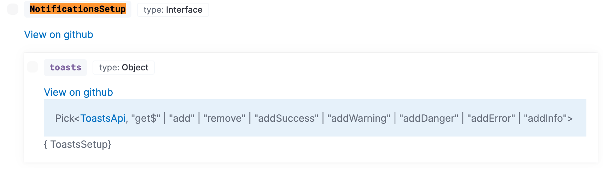
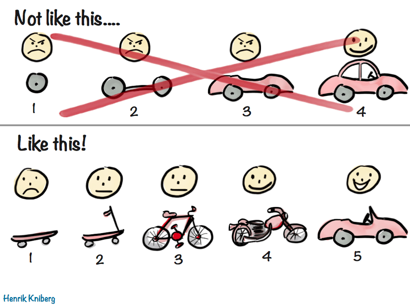

## General

First things first, be sure to review our <DocLink id="kibDevPrinciples" text="development principles"/> and check out all the available
platform <DocLink id="kibBuildingBlocks" text="building blocks"/> that can simplify plugin development.

## Developer documentation

### High-level documentation

#### Structure

Refer to [divio documentation](https://documentation.divio.com/) for guidance on where and how to structure our high-level documentation.

<DocLink id="kibDevDocsWelcome" text="Getting started" /> and
<DocLink id="kibPlatformIntro" text="Key concepts" /> sections are both _explanation_ oriented,
<DocLink id="kibDevTutorialBuildAPlugin" text="Tutorials" /> covers both _tutorials_ and _How to_, and
the <DocLink id="kibDevDocsApiWelcome" text="API documentation" /> section covers _reference_ material.

#### Location

If the information spans multiple plugins, consider adding it to the [dev_docs](https://github.com/elastic/kibana/tree/master/dev_docs) folder. If it is plugin specific, consider adding it inside the plugin folder. Write it in an mdx file if you would like it to show up in our new (beta) documentation system.

<DocCallOut title="internal only">

To add docs into the new docs system, create an `.mdx` file that
contains <DocLink id="docsSyntax" section="frontmatter" text="frontmatter"/>. Read about the syntax <DocLink id="docsSyntax" text="here"/>. An extra step is needed to add a menu item. <DocLink id="docsSetup" text="These instructions" /> will walk you through how to set the docs system
up locally and edit the nav menu.

</DocCallOut>

#### Keep content fresh

A fresh pair of eyes are invaluable. Recruit new hires to read, review and update documentation. Leads should also periodically review documentation to ensure it stays up to date. File issues any time you notice documentation is outdated.

#### Consider your target audience

Documentation in the Kibana Developer Guide is targeted towards developers building Kibana plugins. Keep implementation details about internal plugin code out of these docs.

#### High to low level

When a developer first lands in our docs, think about their journey. Introduce basic concepts before diving into details. The left navigation should be set up so documents on top are higher level than documents near the bottom.

#### Think outside-in

It's easy to forget what it felt like to first write code in Kibana, but do your best to frame these docs "outside-in". Don't use esoteric, internal language unless a definition is documented and linked. The fresh eyes of a new hire can be a great asset.

### API documentation

We automatically generate <DocLink id="kibDevDocsApiWelcome" text="API documentation"/>. The following guidelines will help ensure your <DocLink id="kibPlatformIntro" section="public-plugin-api" text="public APIs" /> are useful.

#### Code comments

Every publicly exposed function, class, interface, type, parameter and property should have a comment using JSDoc style comments.

- Use `@param` tags for every function parameter.
- Use `@returns` tags for return types.
- Use `@throws` when appropriate.
- Use `@beta` or `@deprecated` when appropriate.
- Use `@removeBy {version}` on `@deprecated` APIs. The version should be the last version the API will work in. For example, `@removeBy 7.15` means the API will be removed in 7.16. This lets us avoid mid-release cycle coordination. The API can be removed as soon as the 7.15 branch is cut.
- Use `@internal` to indicate this API item is intended for internal use only, which will also remove it from the docs.

#### Interfaces vs inlined types

Prefer types and interfaces over complex inline objects. For example, prefer:

```ts
/**
* The SearchSpec interface contains settings for creating a new SearchService, like
* username and password.
*/
export interface SearchSpec {
 /**
  * Stores the username. Duh,
  */
 username: string;
 /**
  * Stores the password. I hope it's encrypted!
  */
 password: string;
}

 /**
  * Retrieve search services
  * @param searchSpec Configuration information for initializing the search service.
  * @returns the id of the search service
  */
export getSearchService: (searchSpec: SearchSpec) => string;
```

over:

```ts
/**
  * Retrieve search services
  * @param searchSpec Configuration information for initializing the search service.
  * @returns the id of the search service
  */
export getSearchService: (searchSpec: { username: string; password: string }) => string;
```

In the former, there will be a link to the `SearchSpec` interface with documentation for the `username` and `password` properties. In the latter the object will render inline, without comments:


#### Export every type used in a public API

When a publicly exported API items references a private type, this results in a broken link in our docs system. The private type is, by proxy, part of your public API, and as such, should be exported.

Do:

```ts
export interface AnInterface { bar: string };
export type foo: string | AnInterface;
```

Don't:

```ts
interface AnInterface { bar: string };
export type foo: string | AnInterface;
```

#### Avoid “Pick”

`Pick` not only ends up being unhelpful in our documentation system, but it's also of limited help in your IDE. For that reason, avoid `Pick` and other similarly complex types on your public API items. Using these semantics internally is fine.



### Example plugins

Running Kibana with `yarn start --run-examples` will include all [example plugins](https://github.com/elastic/kibana/tree/master/examples). These are tested examples of platform services in use. We strongly encourage anyone providing a platform level service or <DocLink id="kibBuildingBlocks" text="building block"/> to include a tutorial that links to a tested example plugin. This is better than relying on copied code snippets, which can quickly get out of date.

## Performance

Build with scalability in mind.

- Consider data with many fields
- Consider data with high cardinality fields
- Consider large data sets, that span a long time range
- Consider slow internet and low bandwidth environments

## Accessibility

Did you know Kibana makes a public statement about our commitment to creating an accessible product for people
with disabilities? [We do](https://www.elastic.co/guide/en/kibana/master/accessibility.html)! It's very important
all of our apps are accessible.

- Learn how [EUI tackles accessibility](https://elastic.github.io/eui/#/guidelines/accessibility)
- If you don't use EUI, follow the same EUI accessibility standards

<DocCallOut title="Internal only">
  Elasticians, check out the #accessibility channel to ask questions and receive guidance.
</DocCallOut>

## Localization

Kibana is translated into other languages. Use our i18n utilities to ensure your public facing strings will be translated to ensure all Kibana apps are localized. Read and adhere to our [i18n guidelines](https://github.com/elastic/kibana/blob/master/packages/kbn-i18n/GUIDELINE.md)

<DocCallOut title="Internal only">
  Elasticians, check out the #kibana-localization channel to ask questions and receive guidance.
</DocCallOut>

## Styleguide

We use es-lint rules when possible, but please review our [styleguide](https://github.com/elastic/kibana/blob/master/STYLEGUIDE.md), which includes recommendations that can't be linted on.

Es-lint overrides on a per-plugin level are discouraged.

## Plugin best practices

Don't export <DocLink id="kibPlatformIntro" section="public-plugin-api" text="public APIs"/> without reason. Make your public APIs as small as possible. You will have to maintain them, and consider backward compatibility when making changes.

Add `README.md` to all your plugins and services and include contact information.

## Re-inventing the wheel

Over-refactoring can be a problem in it's own right, but it's still important to be aware of the existing services that are out there and use them when it makes sense. Check out our <DocLink id="kibBuildingBlocks" text="building blocks"/> to see what high-level services are at your disposal. In addition, our <DocLink id="kibDevDocsApiWelcome" text="API documentation" /> lists additional services.

## Feature development

### Timing

<DocCallOut title="Internal only">

Try not to put your PR in review mode, or merge large changes, right before Feature Freeze. It's inevitably one of the most volatile times for the
Kibana code base, try not to contribute to this volatility. Doing this can:

- increase the likelyhood of conflicts from other features being merged at the last minute
- means your feature has less QA time
- means your feature gets less careful review as reviewers are often swamped at this time

All of the above contributes to more bugs being found in the QA cycle and can cause a delay in the release. Prefer instead to merge
your large change right _after_ feature freeze. If you are worried about missing your initial release version goals, review our
[release train philophy](https://github.com/elastic/dev/blob/master/shared/time-based-releases.md). It's okay!

</DocCallOut>

### Size

When possible, build features with incrementals sets of small and focused PRs, but don't check in unused code, and don't expose any feature on master that you would not be comfortable releasing.



If your feature cannot be broken down into smaller components, or multiple engineers will be contributing, you have a few other options to consider.

**1. Hide your feature behind a feature flag**

Features can be merged behind a flag if you are not ready to make them the default experience, but all code should still be tested, complete and bug free.

A good question to ask yourself is, how will you feel if a customer turns this feature on? Is it usable, even if not up to the
level of something we would market? It should have some level of minimal utility.

Another question to ask yourself is, if this feature gets cancelled, how difficult will it be to remove?

**2. Develop on a feature branch**

This option is useful if you have more than one contributor working on a large feature. The downside is handling code conflicts when rebasing with the main branch.

Consider how you want to handle the PR review. Reviewing each PR going into the feature branch can lighten the review process when merging into the main branch.

**3. Use an example plugin**

If you are building a service for developers, create an [example plugin](https://github.com/elastic/kibana/tree/master/examples) to showcase and test intended usage. This is a great way for reviewers and PMs to play around with a feature through the UI, before the production UI is ready. This can also help developers consuming your services get hands on.

## Embrace the monorepo

Kibana uses a monorepo and our processes and tooling are built around this decision. Utilizing a monorepo allows us to have a consistent peer review process and enforce the same code quality standards across all of Kibana's code. It also eliminates the necessity to have separate versioning strategies and constantly coordinate changes across repos.

When experimenting with code, it's completely fine to create a separate GitHub repo to use for initial development. Once the code has matured to a point where it's ready to be used within Kibana, it should be integrated into the Kibana GitHub repo.

There are some exceptions where a separate repo makes sense. However, they are exceptions to the rule. A separate repo has proven beneficial when there's a dedicated team collaborating on a package which has multiple consumers, for example [EUI](https://github.com/elastic/eui).

It may be tempting to get caught up in the dream of writing the next package which is published to npm and downloaded millions of times a week. Knowing the quality of developers that are working on Kibana, this is a real possibility. However, knowing which packages will see mass adoption is impossible to predict. Instead of jumping directly to writing code in a separate repo and accepting all of the complications that come along with it, prefer keeping code inside the Kibana repo. A [Kibana package](https://github.com/elastic/kibana/tree/master/packages) can be used to publish a package to npm, while still keeping the code inside the Kibana repo. Move code to an external repo only when there is a good reason, for example to enable external contributions.

## Hardening

Review the following items related to vulnerability and security risks.

- XSS
  - Check for usages of `dangerouslySetInnerHtml`, `Element.innerHTML`, `Element.outerHTML`
  - Ensure all user input is properly escaped.
  - Ensure any input in `$.html`, `$.append`, `$.appendTo`, $.prepend`, `$.prependTo`is escaped. Instead use`$.text`, or don't use jQuery at all.
- CSRF
  - Ensure all APIs are running inside the Kibana HTTP service.
- RCE
  - Ensure no usages of `eval`
  - Ensure no usages of dynamic requires
  - Check for template injection
  - Check for usages of templating libraries, including `_.template`, and ensure that user provided input isn't influencing the template and is only used as data for rendering the template.
  - Check for possible prototype pollution.
- Prototype Pollution - more info [here](https://docs.google.com/document/d/19V-d9sb6IF-fbzF4iyiPpAropQNydCnoJApzSX5FdcI/edit?usp=sharing)
  - Check for instances of `anObject[a][b] = c` where a, b, and c are user defined. This includes code paths where the following logical code steps could be performed in separate files by completely different operations, or recursively using dynamic operations.
  - Validate any user input, including API url-parameters/query-parameters/payloads, preferable against a schema which only allows specific keys/values. At a very minimum, black-list `__proto__` and `prototype.constructor` for use within keys
  - When calling APIs which spawn new processes or potentially perform code generation from strings, defensively protect against Prototype Pollution by checking `Object.hasOwnProperty` if the arguments to the APIs originate from an Object. An example is the Code app's [spawnProcess](https://github.com/elastic/kibana/blob/b49192626a8528af5d888545fb14cd1ce66a72e7/x-pack/legacy/plugins/code/server/lsp/workspace_command.ts#L40-L44).
    - Common Node.js offenders: `child_process.spawn`, `child_process.exec`, `eval`, `Function('some string')`, `vm.runIn*Context(x)`
    - Common Client-side offenders: `eval`, `Function('some string')`, `setTimeout('some string', num)`, `setInterval('some string', num)`
- Check for accidental reveal of sensitive information
  - The biggest culprit is errors which contain stack traces or other sensitive information which end up in the HTTP Response
- Checked for Mishandled API requests
  - Ensure no sensitive cookies are forwarded to external resources.
  - Ensure that all user controllable variables that are used in constructing a URL are escaped properly. This is relevant when using `transport.request` with the Elasticsearch client as no automatic escaping is performed.
- Reverse tabnabbing - https://github.com/OWASP/CheatSheetSeries/blob/master/cheatsheets/HTML5_Security_Cheat_Sheet.md#tabnabbing
  - When there are user controllable links or hard-coded links to third-party domains that specify target="\_blank" or target="\_window", the `a` tag should have the rel="noreferrer noopener" attribute specified.
  - Allowing users to input markdown is a common culprit, a custom link renderer should be used
- SSRF - https://www.owasp.org/index.php/Server_Side_Request_Forgery
  - All network requests made from the Kibana server should use an explicit configuration or white-list specified in the `kibana.yml`
