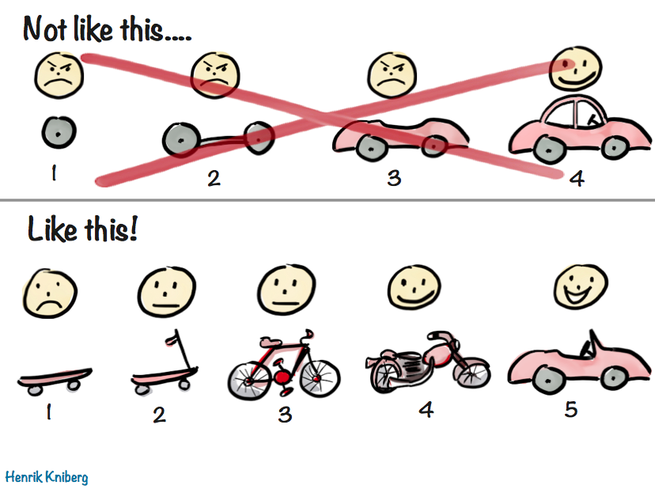

## General

Be sure to follow our <DocLink id="kibDevPrinciples" text="development principles"/>
and <DocLink id="kibStandards" text="standards and guidelines"/>.
 
## Documentation

Documentation best practices can be found <DocLink id="kibDocumentation" text="here"/>.

## Performance

Build with scalability in mind.

- Consider data with many fields
- Consider data with high cardinality fields
- Consider large data sets, that span a long time range
- Consider slow internet and low bandwidth environments

<DocLink id="kibDevPerformance" text="Read more about performance."/>

## Accessibility

Did you know Kibana makes a public statement about our commitment to creating an accessible product for people
with disabilities? [We do](https://www.elastic.co/guide/en/kibana/master/accessibility.html)! It's very important
all of our apps are accessible.

- Learn how [EUI tackles accessibility](https://elastic.github.io/eui/#/guidelines/accessibility)
- If you don't use EUI, follow the same EUI accessibility standards

<DocCallOut title="Internal only">
  Elasticians, check out the #accessibility channel to ask questions and receive guidance.
</DocCallOut>

## Localization

Kibana is translated into other languages. Use our i18n utilities to ensure your public facing strings will be translated to ensure all Kibana apps are localized. Read and adhere to our [i18n guidelines](https://github.com/elastic/kibana/blob/main/src/platform/packages/shared/kbn-i18n/GUIDELINE.md)

<DocCallOut title="Internal only">
  Elasticians, check out the #kibana-localization channel to ask questions and receive guidance.
</DocCallOut>

## Styleguide

We use es-lint rules when possible, but please review our [styleguide](https://github.com/elastic/kibana/blob/main/STYLEGUIDE.mdx), which includes recommendations that can't be linted on.

Es-lint overrides on a per-plugin level are discouraged.

## Using the SavedObjectClient

The SavedObjectClient should always be used for reading and writing saved objects that you manage. For saved objects managed by other plugins, their plugin APIs should be used instead.

Good:
```
const dataView = dataViewStartContract.get(dataViewId);
```

Bad:
```
const dataView = savedObjectsClient.get(dataViewId) as DataView;
```

## Resusable react components

Use [EUI](https://elastic.github.io/eui) for all your basic UI components to create a consistent UI experience. We also have generic UI components offered from the <DocLink id="kibKibanaReactPluginApi" text="kibana_react" /> plugin.

## Don't export code that doesn't need to be public

Don't export <DocLink id="kibPlatformIntro" section="public-plugin-api" text="public APIs"/> without reason. Make your public APIs as small as possible. You will have to maintain them, and consider backward compatibility when making changes.

## Re-inventing the wheel

Over-refactoring can be a problem in it's own right, but it's still important to be aware of the existing services that are out there and use them when it makes sense. Check out our <DocLink id="kibBuildingBlocks" text="building blocks"/> to see what high-level services are at your disposal. In addition, our <DocLink id="kibDevDocsApiWelcome" text="API documentation" /> lists additional services.

## Feature development

### Timing

<DocCallOut title="Internal only">

Try not to put your PR in review mode, or merge large changes, right before Feature Freeze. It's inevitably one of the most volatile times for the
Kibana code base, try not to contribute to this volatility. Doing this can:

- increase the likelihood of conflicts from other features being merged at the last minute
- means your feature has less QA time
- means your feature gets less careful review as reviewers are often swamped at this time

All of the above contributes to more bugs being found in the QA cycle and can cause a delay in the release. Prefer instead to merge
your large change right _after_ feature freeze. If you are worried about missing your initial release version goals, review our
<DocLink id="devTimeBasedReleases" text="release train philosophy"/>. It's okay!

</DocCallOut>

### Size

When possible, build features with incremental sets of small and focused PRs, but don't check in unused code, and don't expose any feature on main that you would not be comfortable releasing.



If your feature cannot be broken down into smaller components, or multiple engineers will be contributing, you have a few other options to consider.

**1. Hide your feature behind a feature flag**

Features can be merged behind a flag if you are not ready to make them the default experience, but all code should still be tested, complete and bug free.

A good question to ask yourself is, how will you feel if a customer turns this feature on? Is it usable, even if not up to the
level of something we would market? It should have some level of minimal utility.

Another question to ask yourself is, if this feature gets cancelled, how difficult will it be to remove?

**2. Develop on a feature branch**

This option is useful if you have more than one contributor working on a large feature. The downside is handling code conflicts when rebasing with the main branch.

Consider how you want to handle the PR review. Reviewing each PR going into the feature branch can lighten the review process when merging into the main branch.

**3. Use an example plugin**

If you are building a service for developers, create an [example plugin](https://github.com/elastic/kibana/tree/main/examples) to showcase and test intended usage. This is a great way for reviewers and PMs to play around with a feature through the UI, before the production UI is ready. This can also help developers consuming your services get hands on.

## Embrace the monorepo

Kibana uses a monorepo and our processes and tooling are built around this decision. Utilizing a monorepo allows us to have a consistent peer review process and enforce the same code quality standards across all of Kibana's code. It also eliminates the necessity to have separate versioning strategies and constantly coordinate changes across repos.

When experimenting with code, it's completely fine to create a separate GitHub repo to use for initial development. Once the code has matured to a point where it's ready to be used within Kibana, it should be integrated into the Kibana GitHub repo.

There are some exceptions where a separate repo makes sense. However, they are exceptions to the rule. A separate repo has proven beneficial when there's a dedicated team collaborating on a package which has multiple consumers, for example [EUI](https://github.com/elastic/eui).

It may be tempting to get caught up in the dream of writing the next package which is published to npm and downloaded millions of times a week. Knowing the quality of developers that are working on Kibana, this is a real possibility. However, knowing which packages will see mass adoption is impossible to predict. Instead of jumping directly to writing code in a separate repo and accepting all the complications that come along with it, prefer keeping code inside the Kibana repo. A Kibana package follows the npm idioms and can be later converted into a npm package, moved into an external repo and be published into the npm if a good reason for it was found (for example to enable external contributions).

## Breaking up packages

We are currently working to fully leverage change-based tasks across the repository and this functionality works best when the dependency tree is made of small packages focused around a single responsibility. Having said that, we do not think that contributors should break up their packages into single functions from day one; having 10k packages that contain a single function would also be a problem. Instead, breaking up packages over time will be a common practice used to address bottlenecks in the dependency tree and will be a valuable tool if build performance is being compromised.

### When should a package be broken-up into smaller packages?
The goal when designing your package should be to mainly ensure that it has a single responsibility, and that anyone depending on your package would reasonably need everything exposed by it. This is 
important for bundle sizes (the entire package will be loaded every time it is imported) and for change-based tasks (any time this package changes all dependent tasks will need to be run). 
Packages should be broken into smaller packages if they have multiple responsibilities or serve as a collection of related things which usually won't be necessary at the same time.

### What is a package's "responsibility"? How do I know that my package has a single responsibility?
The "responsibilities" of a package are defined by the features, utilities, and components exposed by your package. If a developer tries to use your package, is it likely that they will use every 
part of it or just some of it? If most people would only need part of your package, then we would argue that your package has multiple responsibilities. At this point it is probably time to break up 
your package.

### How do we manage the transition from one package to many smaller packages?
When making a change like this, import statements that previously pointed to the now broken-up package need to be updated to point to the smaller packages, so we have written an ESLint rule 
called `@kbn/imports/exports_moved_packages` which allows contributors to define the exports previously available from one package as now being available from another package and leverage 
auto-fixing to migration all existing and new uses of this export to the proper package.

## Logging

- Do not log sensitive information (personally identifiable information, passwords, api keys, etc.), regardless of the log level. Err on the side of caution. Personally identifiable information is common in user input; for example, dashboard titles, index names and Elasticsearch `_search` queries.
- Logs should include just enough information to be actionable.
- Use the right log level, see <DocLink id="kibCoreLogging" section="log-level" text="Log Levels"/>.
- Use ECS format for any additional LogMeta you add to your logging statements.
- Logs are read by customers, a large number of Elastic employees, and Kibana contributors. As such, log messages should use language that is understandable to a wide audience and should avoid disclosing implementation details (unless they're at the `debug`/`trace` level).

## Licensing

<DocCallOut title="Internal only">

Has there been a discussion about which license this feature should be available under? Open up a license issue in [https://github.com/elastic/dev](https://github.com/elastic/dev) if you are unsure.

</DocCallOut>

## Testing scenarios

Every PR submitted should be accompanied by tests. Read through the <DocLink id="kibDevTutorialTestingPlugins" text="testing plugins tutorial" /> for how to test.

### Browser coverage

Refer to the list of browsers and OS Kibana supports https://www.elastic.co/support/matrix

Does the feature work efficiently on the below listed browsers
  - chrome
  - Firefox
  - Safari
  - IE11

### Upgrade Scenarios
  - Migration scenarios- Does the feature affect old indices, saved objects ?
  - Has the feature been tested with Kibana aliases
  - Read/Write privileges of the indices before and after the upgrade?

### Test coverage
  - Does the feature have sufficient unit test coverage? (does it handle storeinSessions?)
  - Does the feature have sufficient Functional UI  test coverage?
  - Does the feature have sufficient Rest API coverage test coverage?
  - Does the feature have sufficient Integration test coverage?

### Environment configurations

- Kibana should be fully [cross cluster search](https://www.elastic.co/guide/en/elasticsearch/reference/master/modules-cross-cluster-search.html) compatible (aside from admin UIs which only work on the local cluster).
- How does your plugin behave when optional dependencies are disabled?
- How does your app behave under anonymous access, or with security disabled?
- Make sure to test your PR in a cloud environment. Read about the <DocLink id="kibDevTutorialCI" section="labels" text="ci:deploy cloud" /> label which makes this very easy.


## Backward compatibility

Any time you change state that is part of a Saved Object you will have to write a <DocLink id="kibDevDocsSavedObjectsIntro" section="migrations-and-backward-compatibility" text="migration" />.

Never store state from another plugin in your Saved Objects or URLs unless it implements the <DocLink id="kibDevDocsPersistableStateIntro" text="persistable state interface"/>. Remember to check for migrations when deserializing that state.

If you expose state and you wish to allow other plugins to persist you must ensure it implements the <DocLink id="kibDevDocsPersistableStateIntro" text="persistable state interface"/>. This is very common for `by value` entities, like visualizations that exist on a dashboard but are not part of the visualization library. If you make a breaking change to this state you must remember to register a migration for it.

Saved objects exported from past Kibana versions should always continue to work. Bookmarked URLs should also always work. Check out <DocLink id="kibDevKeyConceptsNavigation" section="specifying-state" text="URL Locators" /> to learn about migrating state in URLs.

## Avoid these common mistakes

### Treating Kibana's filesystem as durable storage

Plugins should rarely, if ever, access Kibana's filesystem directly. Kibana instances are commonly ephemeral and anything written to the filesystem will potentially
not be there on restart.

### Storing state in server memory

There are generally multiple instances of Kibana all hosted behind a round-robin load-balancer. As a result, storing state in server memory is risky as there is no
guarantee that a single end-user's HTTP requests will be served by the same Kibana instance.

### Using WebSockets

Kibana has a number of platform services that don't work with WebSockets, for example authentication and authorization. If your use-case would benefit substantially
from websockets, talk to the Kibana Core team about adding support. Do not hack around this limitation, everytime that someone has, it's created so many problems
it's been eventually removed.


## Security best practices

When writing code for Kibana, be sure to follow these best practices to avoid common vulnerabilities. Refer to the included Open Web
Application Security Project (OWASP) references to learn more about these types of attacks.

### Cross-site Scripting (XSS)

[_OWASP reference for XSS_](https://owasp.org/www-community/attacks/xss)

XSS is a class of attacks where malicious scripts are injected into vulnerable websites. Kibana defends against this by using the React
framework to safely encode data that is rendered in pages, the EUI framework to [automatically sanitize
links](https://elastic.github.io/eui/#/navigation/link#link-validation), and a restrictive `Content-Security-Policy` header.

**Best practices**

- Check for dangerous functions or assignments that can result in unescaped user input in the browser DOM. Avoid using:
  - **React:** [`dangerouslySetInnerHtml`](https://reactjs.org/docs/dom-elements.html#dangerouslysetinnerhtml).
  - **Browser DOM:** `Element.innerHTML` and `Element.outerHTML`.
- If using the aforementioned unsafe functions or assignments is absolutely necessary, follow [these XSS prevention
  rules](https://cheatsheetseries.owasp.org/cheatsheets/Cross_Site_Scripting_Prevention_Cheat_Sheet.html#xss-prevention-rules) to ensure that
  user input is not inserted into unsafe locations and that it is escaped properly.
- Use EUI components to build your UI, particularly when rendering `href` links. Otherwise, sanitize user input before rendering links to
  ensure that they do not use the `javascript:` protocol.
- Don't use the `eval`, `Function`, and `_.template` functions -- these are restricted by ESLint rules.
- Be careful when using `setTimeout` and `setInterval` in client-side code. If an attacker can manipulate the arguments and pass a string to
  one of these, it is evaluated dynamically, which is equivalent to the dangerous `eval` function.

### Cross-Site Request Forgery (CSRF/XSRF)

[_OWASP reference for CSRF_](https://owasp.org/www-community/attacks/csrf)

CSRF is a class of attacks where a user is forced to execute an action on a vulnerable website that they're logged into, usually without
their knowledge. Kibana defends against this by requiring [custom request
headers](https://cheatsheetseries.owasp.org/cheatsheets/Cross-Site_Request_Forgery_Prevention_Cheat_Sheet.html#use-of-custom-request-headers)
for API endpoints. For more information, see [API Request
Headers](https://www.elastic.co/guide/en/kibana/master/api.html#api-request-headers).

**Best practices**

- Ensure all HTTP routes are registered with the [Kibana HTTP service](https://www.elastic.co/guide/en/kibana/master/http-service.html) to
  take advantage of the custom request header security control.
  - Note that HTTP GET requests do **not** require the custom request header; any routes that change data should [adhere to the HTTP
    specification and use a different method (PUT, POST, etc.)](https://developer.mozilla.org/en-US/docs/Web/HTTP/Methods)

### Remote Code Execution (RCE)

[_OWASP reference for Command Injection_](https://owasp.org/www-community/attacks/Command_Injection),
[_OWASP reference for Code Injection_](https://owasp.org/www-community/attacks/Code_Injection)

RCE is a class of attacks where an attacker executes malicious code or commands on a vulnerable server. Kibana defends against this by using
ESLint rules to restrict vulnerable functions, and by hooking into or hardening usage of these in third-party dependencies.

**Best practices**

- Don't use the `eval`, `Function`, and `_.template` functions -- these are restricted by ESLint rules.
- Don't use dynamic `require`.
- Check for usages of templating libraries. Ensure that user-provided input doesn't influence the template and is used only as data for
  rendering the template.
- Take extra caution when spawning child processes with any user input or parameters that are user-controlled.

### Prototype Pollution

Prototype Pollution is an attack that is unique to JavaScript environments. Attackers can abuse JavaScript's prototype inheritance to
"pollute" objects in the application, which is often used as a vector for XSS or RCE vulnerabilities. Kibana defends against this by
hardening sensitive functions (such as those exposed by `child_process`), and by requiring validation on all HTTP routes by default.

**Best practices**

- Check for instances of `anObject[a][b] = c` where `a`, `b`, and `c` are controlled by user input. This includes code paths where the
  following logical code steps could be performed in separate files by completely different operations, or by recursively using dynamic
  operations.
- Validate all user input, including API URL parameters, query parameters, and payloads. Preferably, use a schema that only allows specific
  keys and values. At a minimum, implement a deny-list that prevents `__proto__` and `prototype.constructor` from being used within object
  keys.
- When calling APIs that spawn new processes or perform code generation from strings, protect against Prototype Pollution by checking if
  `Object.hasOwnProperty` has arguments to the APIs that originate from an Object. An example is the defunct Code app's
  [`spawnProcess`](https://github.com/elastic/kibana/blob/b49192626a8528af5d888545fb14cd1ce66a72e7/x-pack/legacy/plugins/code/server/lsp/workspace_command.ts#L40-L44)
  function.
  - Common Node.js offenders: `child_process.spawn`, `child_process.exec`, `eval`, `Function('some string')`, `vm.runInContext(x)`,
    `vm.runInNewContext(x)`, `vm.runInThisContext()`
  - Common client-side offenders: `eval`, `Function('some string')`, `setTimeout('some string', num)`, `setInterval('some string', num)`

See also:

- [Prototype pollution: The dangerous and underrated vulnerability impacting JavaScript applications |
  portswigger.net](https://portswigger.net/daily-swig/prototype-pollution-the-dangerous-and-underrated-vulnerability-impacting-javascript-applications)
- [Prototype pollution attack in NodeJS application | Olivier
  Arteau](https://github.com/HoLyVieR/prototype-pollution-nsec18/blob/master/paper/JavaScript_prototype_pollution_attack_in_NodeJS.pdf)

### Server-Side Request Forgery (SSRF)

[_OWASP reference for SSRF_](https://owasp.org/www-community/attacks/Server_Side_Request_Forgery)

SSRF is a class of attacks where a vulnerable server is forced to make an unintended request, usually to an HTTP API. This is often used as
a vector for information disclosure or injection attacks.

**Best practices**

- Ensure that all outbound requests from the Kibana server use hard-coded URLs.
- If user input is used to construct a URL for an outbound request, ensure that an allow-list is used to validate the endpoints and that
  user input is escaped properly. Ideally, the allow-list should be set in `kibana.yml`, so only server administrators can change it.
  - This is particularly relevant when using `transport.request` with the Elasticsearch client, as no automatic escaping is performed.
  - Note that URLs are very hard to validate properly; exact match validation for user input is most preferable, while URL parsing or RegEx
    validation should only be used if absolutely necessary.

### Reverse tabnabbing

[_OWASP reference for Reverse Tabnabbing_](https://owasp.org/www-community/attacks/Reverse_Tabnabbing)

Reverse tabnabbing is an attack where a link to a malicious page is used to rewrite a vulnerable parent page. This is often used as a vector
for phishing attacks. Kibana defends against this by using the EUI framework, which automatically adds the `rel` attribute to anchor tags,
buttons, and other vulnerable DOM elements.

**Best practices**

- Use EUI components to build your UI whenever possible. Otherwise, ensure that any DOM elements that have an `href` attribute also have the
  `rel="noreferrer noopener"` attribute specified. For more information, refer to the [OWASP HTML5 Security Cheat
  Sheet](https://github.com/OWASP/CheatSheetSeries/blob/master/cheatsheets/HTML5_Security_Cheat_Sheet.md#tabnabbing).
- If using a non-EUI markdown renderer, use a custom link renderer for rendered links.

### Information disclosure

Information disclosure is not an attack, but it describes whenever sensitive information is accidentally revealed. This can be configuration
info, stack traces, or other data that the user is not authorized to access. This concern cannot be addressed with a single security
control, but at a high level, Kibana relies on the hapi framework to automatically redact stack traces and detailed error messages in HTTP
5xx response payloads.

**Best practices**

- Look for instances where sensitive information might accidentally be revealed, particularly in error messages, in the UI, and URL
  parameters that are exposed to users.
- Make sure that sensitive request data is not forwarded to external resources. For example, copying client request headers and using them
  to make an another request could accidentally expose the user's credentials.
