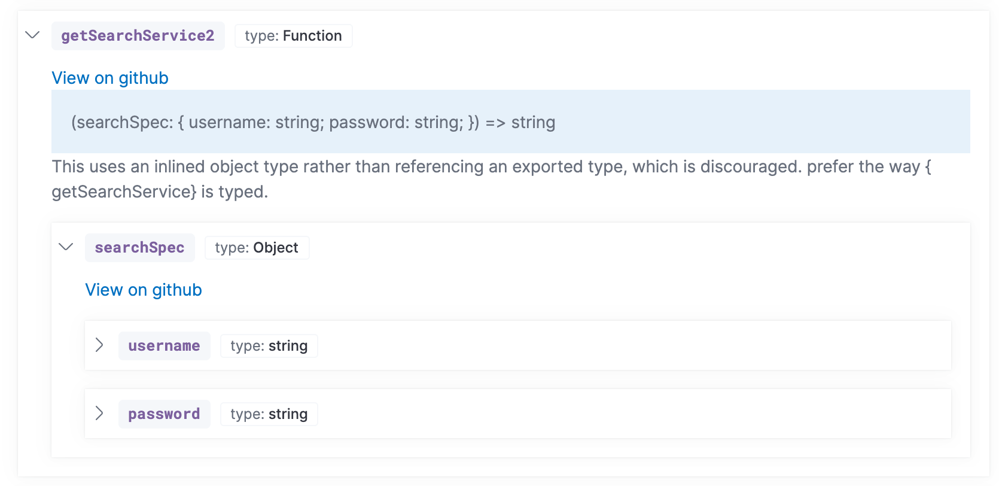

Docs should be written during development and accompany PRs when relevant. There are multiple types of documentation, and different places to add each.

## End-user documentation

User-facing features should be documented in [asciidoc](http://asciidoc.org/) at [https://github.com/elastic/kibana/tree/main/docs](https://github.com/elastic/kibana/tree/main/docs)

To build the docs, you must clone the [elastic/docs](https://github.com/elastic/docs) repo as a sibling of your Kibana repo. Follow the instructions in that project’s [README](https://github.com/elastic/docs#readme) for getting the docs tooling set up.

To build the docs:

```bash
node scripts/docs.js --open
```

## REST APIs
REST APIs should be documented using the following formats:

- [API doc template](https://raw.githubusercontent.com/elastic/docs/main/shared/api-ref-ex.asciidoc)
- [API object definition template](https://raw.githubusercontent.com/elastic/docs/main/shared/api-definitions-ex.asciidoc)

## Developer documentation

Developer documentation can be segmented into two types: internal plugin details, and information on extending Kibana. Our [Kibana Developer Guide](https://docs.elastic.dev/kibana-dev-docs/getting-started/welcome) is meant to serve the latter. The guide can only be accessed internally at the moment, though the raw content is public in our [public repository]((https://github.com/elastic/kibana/tree/main/dev_docs)).

Internal plugin details can be kept alongside the code it describes. Information about extending Kibana may go in the root of your plugin folder, or inside the top-level [dev_docs](https://github.com/elastic/kibana/tree/main/dev_docs) folder. 

<DocCallOut title="Internal only">

Only `mdx` files with the appropriate <DocLink id="docsSyntax" section="frontmatter" text="frontmatter"/> are rendered inside the Developer Guide. Read about the syntax <DocLink id="docsSyntax" text="here"/>. Edit [kibana/nav-kibana-dev.docnav.json](https://github.com/elastic/kibana/blob/main/nav-kibana-dev.docnav.json) to have a link to your document appear in the navigation menu. Read <DocLink id="kibDevDocsBestPractices" text="these instructions" /> for more details on how to add new content and test locally.

</DocCallOut>

### Structure

The high-level developer documentation located in the [dev_docs](https://github.com/elastic/kibana/tree/main/dev_docs) folder attempts to follow [divio documentation](https://documentation.divio.com/) guidance. <DocLink id="kibDevDocsWelcome" text="Getting started" /> and <DocLink id="kibPlatformIntro" text="Key concepts" /> sections are _explanation_ oriented, while
<DocLink id="kibDevTutorialDebugging" text="Tutorials" /> falls under both _tutorials_ and _how to_. The <DocLink
  id="kibDevDocsApiWelcome"
  text="API documentation"
/> section is _reference_ material.

Developers may choose to keep information that is specific to a particular plugin along side the code.

### Best practices

#### Keep content fresh

A fresh pair of eyes are invaluable. Recruit new hires to read, review and update documentation. Leads should also periodically review documentation to ensure it stays up to date. File issues any time you notice documentation is outdated.

#### Consider your target audience

Documentation in the Kibana Developer Guide is targeted towards developers building Kibana plugins. Keep implementation details about internal plugin code out of these docs.

#### High to low level

When a developer first lands in our docs, think about their journey. Introduce basic concepts before diving into details. The left navigation should be set up so documents on top are higher level than documents near the bottom.

#### Think outside-in

It's easy to forget what it felt like to first write code in Kibana, but do your best to frame these docs "outside-in". Don't use esoteric, internal language unless a definition is documented and linked. The fresh eyes of a new hire can be a great asset.


## API documentation

We automatically generate <DocLink id="kibDevDocsApiWelcome" text="API documentation"/>. The following guidelines will help ensure your <DocLink id="kibPlatformIntro" section="public-plugin-api" text="public APIs" /> are useful.

If you encounter an error of the form:

<DocCallOut color="danger" title="JavaScript heap out of memory" />

You can increase [max memory](https://nodejs.org/api/cli.html#--max-old-space-sizesize-in-megabytes) for node as follows:

```bash
# As a runtime argument
node --max-old-space-size=8192 foo/bar

# As an env variable, in order to apply it systematically
export NODE_OPTIONS=--max-old-space-size=8192
```

### Code comments

Every function, class, interface, type, parameter and property that is exposed to other plugins should have a [TSDoc](https://tsdoc.org/)-style comment.

- Use `@param` tags for every function parameter.
- Use `@returns` tags for return types.
- Use `@throws` when appropriate.
- Use `@beta` or `@deprecated` when appropriate.
- Use `@removeBy {version}` on `@deprecated` APIs. The version should be the last version the API will work in. For example, `@removeBy 7.15` means the API will be removed in 7.16. This lets us avoid mid-release cycle coordination. The API can be removed as soon as the 7.15 branch is cut.
- Use `@internal` to indicate this API item is intended for internal use only, which will also remove it from the docs.

### Interfaces vs inlined types

Prefer types and interfaces over complex inline objects. For example, prefer:

```ts
/**
* The SearchSpec interface contains settings for creating a new SearchService, like
* username and password.
*/
export interface SearchSpec {
 /**
  * Stores the username. Duh,
  */
 username: string;
 /**
  * Stores the password. I hope it's encrypted!
  */
 password: string;
}

 /**
  * Retrieve search services
  * @param searchSpec Configuration information for initializing the search service.
  * @returns the id of the search service
  */
export getSearchService: (searchSpec: SearchSpec) => string;
```

over:

```ts
/**
  * Retrieve search services
  * @param searchSpec Configuration information for initializing the search service.
  * @returns the id of the search service
  */
export getSearchService: (searchSpec: { username: string; password: string }) => string;
```

In the former, there will be a link to the `SearchSpec` interface with documentation for the `username` and `password` properties. In the latter the object will render inline, without comments:



### Export every type used in a public API

When a publicly exported API item references a private type, this results in a broken link in our docs system. The private type is, by proxy, part of your public API, and as such, should be exported.

Do:

```ts
export interface AnInterface { bar: string };
export type foo: string | AnInterface;
```

Don't:

```ts
interface AnInterface { bar: string };
export type foo: string | AnInterface;
```

### Avoid “Pick”

`Pick` not only ends up being unhelpful in our documentation system, but it's also of limited help in your IDE. For that reason, avoid `Pick` and other similarly complex types on your public API items. Using these semantics internally is fine.


### Debugging tips

There are three great ways to debug issues with the API infrastructure.

1. Write a test

[api_doc_suite.test.ts](https://github.com/elastic/kibana/blob/main/packages/kbn-docs-utils/src/api_docs/tests/api_doc_suite.test.ts) is a pretty comprehensive test suite that builds the test docs inside the [**fixtures** folder](https://github.com/elastic/kibana/tree/main/packages/kbn-docs-utils/src/api_docs/tests/__fixtures__/src).

Edit the code inside `__fixtures__` to replicate the bug, write a test to track what should happen, then run `yarn jest api_doc_suite`.

Once you've verified the bug is reproducible, use debug messages to narrow down the problem. This is much faster than running the entire suite to debug.

2. Use [ts-ast-viewer.com](https://ts-ast-viewer.com/#code/KYDwDg9gTgLgBASwHY2FAZgQwMbDgMQgjgG8AoOSudJAfgC44AKdIxgZximQHMBKOAF4AfHE7ckPANxkAvkA)

This nifty website will let you add some types and see how the system parses it. For example, the link above shows there is a `QuestionToken` as a sibling to the `FunctionType` which is why [this bug](https://github.com/elastic/kibana/issues/107145) reported children being lost. The API infra system didn't categorize the node as a function type node.

3. Play around with `ts-morph` in a Code Sandbox.

You can fork [this Code Sandbox example](https://codesandbox.io/s/typescript-compiler-issue-0lkwx?file=/src/use_ts_compiler.ts) that was used to explore how to generate the node signature in different ways (e.g. `node.getType.getText()` shows different results than `node.getType.getText(node)`).  Here is [another messy example](https://codesandbox.io/s/admiring-field-5btxs).

The code sandbox approach can be a lot faster to iterate compared to running it in Kibana.

## Example plugins

Running Kibana with `yarn start --run-examples` will include all [example plugins](https://github.com/elastic/kibana/tree/main/examples). These are tested examples of platform services in use. We strongly encourage anyone providing a platform level service or <DocLink id="kibBuildingBlocks" text="building block"/> to include a tutorial that links to a tested example plugin. This is better than relying on copied code snippets, which can quickly get out of date.

You can also visit these [examples plugins hosted online](https://demo.kibana.dev/8.2/app/home). Note that because anonymous access is enabled, some
of the demos are currently not working. 
