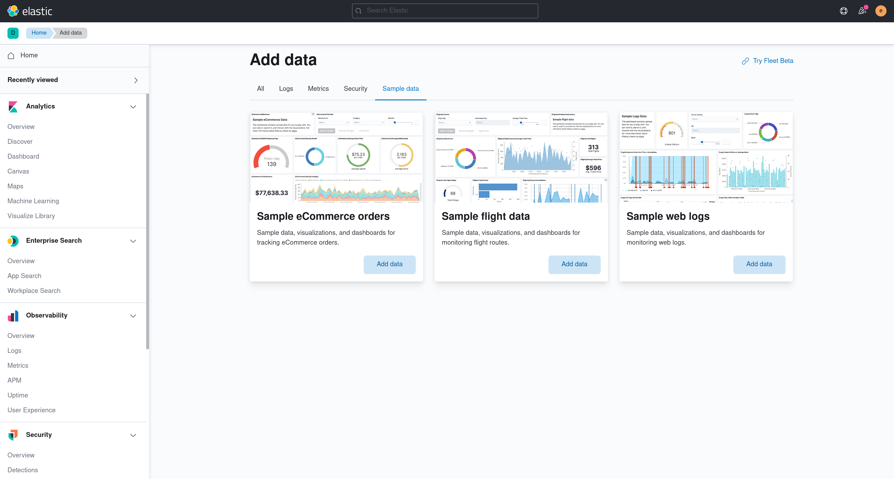
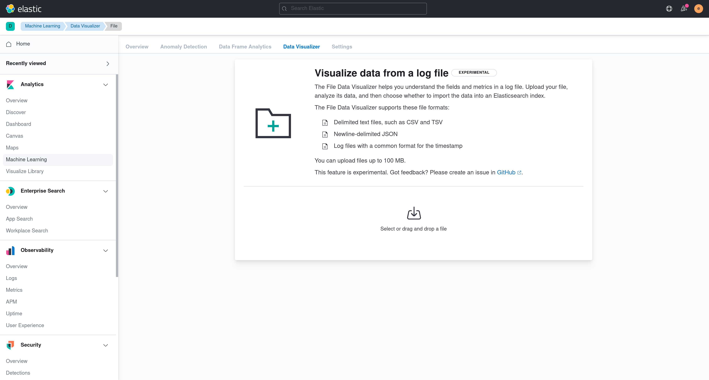

Building a feature and need an easy way to test it out with some data? Below are three options.

## Sample data

Kibana ships with sample data that you can install at the click of the button. If you are building a feature and need some data to test it out with, sample data is a great option. The only limitation is that this data will not work for Security or Observability solutions (see [#62962](https://github.com/elastic/kibana/issues/62962)).

1. Navigate to the home page.
2. Click **Add data**.
3. Click on the **Sample data** tab.
4. Select a dataset by clicking on the **Add data** button.



## CSV upload

1. If you don't have any data, navigate to Stack Management > Index Patterns and click the link to the uploader. If you do have data, navigate to the **Machine Learning** application.
2. Click on the **Data Visualizer** tab.
3. Click on **Select file** in the **Import data** container.



## makelogs

The makelogs script generates sample web server logs. Make sure Elasticsearch is running before running the script.

```sh
node scripts/makelogs --auth <username>:<password>
```

## Realistic solution data

<DocCallOut color="warning" title="Internal only">

Security and Observability solution applications only work if data exists in particularly named indices, abiding by our [ECS format](https://www.elastic.co/guide/en/ecs/current/index.html). If you would like to use these applications with realistic data, check out the [oblt_cli tool](https://github.com/elastic/observability-test-environments/blob/master/tools/oblt_cli/README.md). This tool sets you up to connect to a remote Elasticsearch cluster that contains the appropriate data via CCS.

</DocCallOut>
