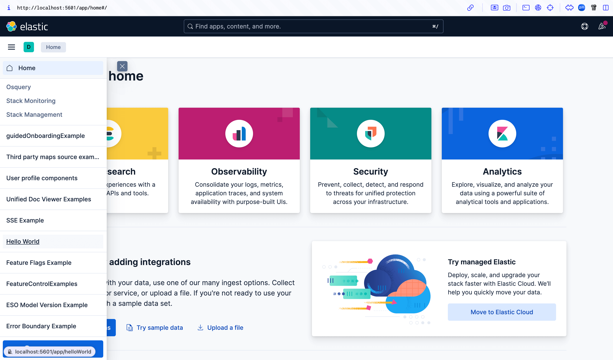
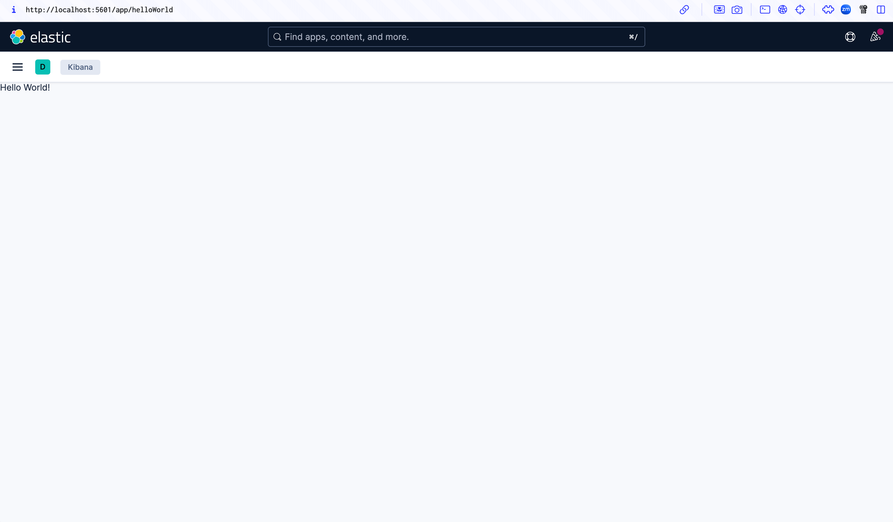
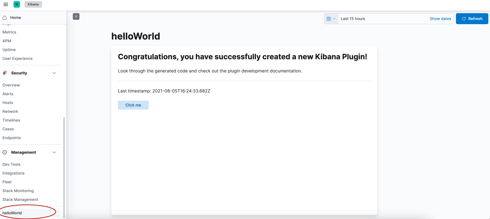

This tutorial walks you through two ways to create a plugin that registers an application that says "Hello World!".

You can view the tested example plugin at [examples/hello_world](https://github.com/elastic/kibana/tree/main/examples/hello_world).

## 1. Set up your development environment

Read through [these instructions](setting_up_a_development_env.mdx) to get your development environment set up.

## 2. Option 1 - Write it manually

This is a good option if you want to understand the bare minimum needed to register a "Hello world" application. The example plugin is based off of this option.

1. Create your plugin folder. Start off in the `kibana` folder.

```sh
cd examples
mkdir hello_world
cd hello_world
```

2. Create the [kibana.jsonc manifest file](../migrated_docs/anatomy_of_a_plugin.md#kibanajson).

```sh
touch kibana.jsonc
```

and add the following:

```json
{
  "type": "plugin",
  "id": "@kbn/hello-world-plugin",
  "owner": "@elastic/kibana-core",
  "description": "A plugin which registers a very simple hello world application.",
  "plugin": {
    "id": "helloWorld",
    "server": false,
    "browser": true,
    "requiredPlugins": ["developerExamples"]
  }
}
```

3. Create a [tsconfig.json file](../migrated_docs/anatomy_of_a_plugin.md#tsconfigjson).

```sh
touch tsconfig.json
```

And add the following to it:

```json
{
  "extends": "../../tsconfig.base.json",
  "compilerOptions": {
    "outDir": "target/types"
  },
  "include": [
    "index.ts",
    "common/**/*.ts",
    "public/**/*.ts",
    "public/**/*.tsx",
    "server/**/*.ts",
    "../../typings/**/*"
  ],
  "exclude": ["target/**/*"],
  "kbn_references": ["@kbn/core", "@kbn/developer-examples-plugin"]
}
```

4. Create a [`public/plugin.tsx` file](../migrated_docs/anatomy_of_a_plugin.md#publicindexts).

```sh
mkdir public
cd public
touch plugin.tsx
```

And add the following to it:

```ts
import React from 'react';
import ReactDOM from 'react-dom';
import { AppMountParameters, CoreSetup, CoreStart, Plugin } from '@kbn/core/public';
import { DeveloperExamplesSetup } from '@kbn/developer-examples-plugin/public';

interface SetupDeps {
  developerExamples: DeveloperExamplesSetup;
}

export class HelloWorldPlugin implements Plugin<void, void, SetupDeps> {
  public setup(core: CoreSetup, deps: SetupDeps) {
    // Register an application into the side navigation menu
    core.application.register({
      id: 'helloWorld',
      title: 'Hello World',
      async mount({ element }: AppMountParameters) {
        ReactDOM.render(<div data-test-subj="helloWorldDiv">Hello World!</div>, element);
        return () => ReactDOM.unmountComponentAtNode(element);
      },
    });

    // This section is only needed to get this example plugin to show up in our Developer Examples.
    deps.developerExamples.register({
      appId: 'helloWorld',
      title: 'Hello World Application',
      description: `Build a plugin that registers an application that simply says "Hello World"`,
    });
  }
  public start(core: CoreStart) {
    return {};
  }
  public stop() {}
}
```

5. Create a [`public/index.ts` file](../migrated_docs/anatomy_of_a_plugin.md#publicplugints).

```
touch index.ts
```

```ts
import { HelloWorldPlugin } from './plugin';

export function plugin() {
  return new HelloWorldPlugin();
}
```

## 2. Option 2 - Use the automatic plugin generator

---

**Note:** Plugin generator is not yet updated and generated code won't work out-of-the-box. Please refer to [existing examples](https://github.com/elastic/kibana/tree/main/examples).

---

This is an easy option to get up and running ASAP and includes additional code.

Use the Automatic plugin generator to get a basic structure for a new plugin. Plugins that are not part of the Kibana repo should be developed inside the plugins folder. If you are building a new plugin to check in to the Kibana repo, you will choose between a few locations:

- `x-pack/plugins` for plugins related to subscription features
- `src/plugins` for plugins related to free features
- `examples` for developer example plugins (these will not be included in the distributables)

```
% node scripts/generate_plugin hello_world
? Plugin name (use camelCase) helloWorld
? Will this plugin be part of the Kibana repository? Yes
? What type of internal plugin would you like to create Kibana Example
? Should an UI plugin be generated? Yes
? Should a server plugin be generated? No
 succ 🎉

      Your plugin has been created in examples/hello_world
```

## 3. Build your new application

Run `yarn kbn bootstrap`

## 3. Start Kibana with examples and navigate to your new application

In one terminal window, run `yarn es snapshot --license trial` to boot up Elasticsearch.

In another terminal window, run `yarn start --run-examples` to boot up Kibana and include the example plugins. Your example plugin should show up in the navigation at the very bottom.

If you build it manually it will look something like this:





If you built it with the generator, it will look something like this:

