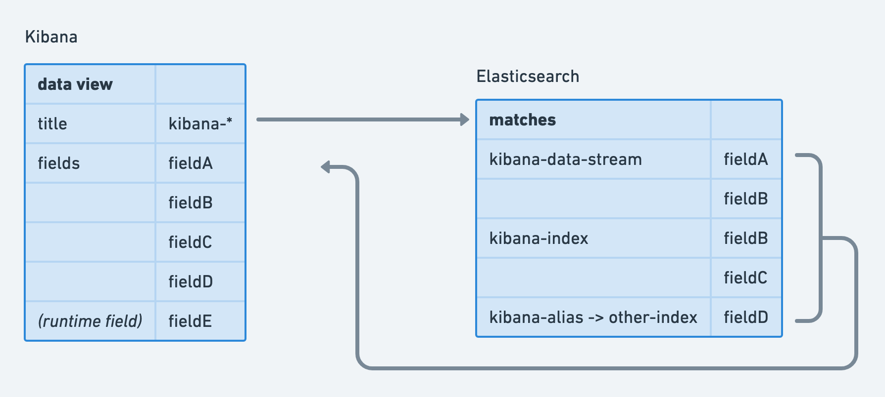

_Note: Kibana index patterns are currently being renamed to data views. There will be some naming inconsistencies until the transition is complete._

Data views (formerly Kibana index patterns or KIPs) are the central method of describing sets of indices for queries. Usage is strongly recommended
as a number of high level [building blocks](/kibana-dev-docs/key-concepts/building-blocks) rely on them. Further, they provide a consistent view of data across
a variety Kibana apps.

Data views are defined by a wildcard string (an index pattern) which matches indices, data streams, and index aliases, optionally specify a
timestamp field for time series data, and are stored as a [saved object](/kibana-dev-docs/key-concepts/saved-objects-intro). They have a field list which comprises all the fields in matching indices plus fields defined specifically
on the data view via runtime fields. Schema-on-read functionality is provided by data view defined runtime fields.

The data view API is made available via the data plugin (`data.indexPatterns`, soon to be renamed) and most commonly used with [SearchSource](/kibana-dev-docs/tutorials/data/search-and-sessions#high-level-search)
(`data.search.search.SearchSource`) to perform queries. SearchSource will apply existing filters and queries from the search bar UI.

Users can create data views via [Data view management](https://www.elastic.co/guide/en/kibana/current/index-patterns.html).
Additionally, they can be created through the data view API.

Data views also allow formatters and custom labels to be defined for fields.

### Services

**hasData:** A standardized way to check the empty state for indices and data views.
- `hasESData: () => Promise<boolean>; // Check to see if ES data exists`
- `hasDataView: () => Promise<boolean>; // Check to see if any data view exists (managed or user created)`
- `hasUserDataView: () => Promise<boolean>; // Check to see if user created data views exists`