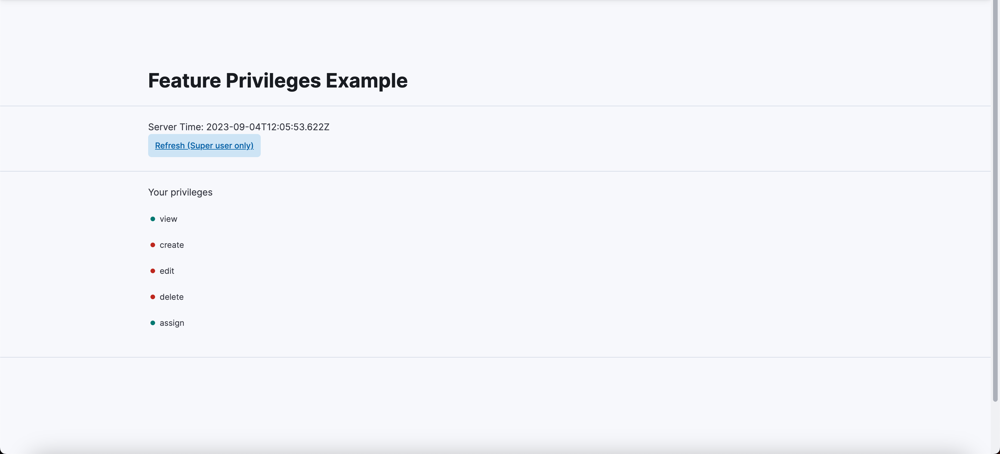

If you've added a new feature to Kibana and would like administrators to have granular control over who can access and perform actions within this feature, then creating Feature privileges is what you're after.

Feature Privileges allow you to define precisely who can access your feature and what actions they can perform, all while seamlessly integrating with Kibana's role-based access control (RBAC) system.
This documentation will guide you through the process of creating and configuring Feature Privileges for your Kibana plugin or features. Whether you're building a new visualization, enhancing an existing application, or extending Kibana's capabilities, understanding how to set up Feature Privileges is vital to maintaining security, control, and user satisfaction.

By the end of this guide, you'll know how to:

- Define privileges for your feature, specifying who can access it.
- Control access to your feature's user interface (UI) elements.
- Secure server-side APIs, ensuring that only authorized users can interact with your plugin's functionality.

### Registering features

Kibana has an inbuilt Features plugin that enables you to control access to your plugin and its features. To start, ensure that your kibana.jsonc config file has the `features` plugin inside the requiredPlugins list

```
  "requiredPlugins": [
      ...,
      "features", // required
  ]
```

This will give you access to the contract exposed by the features plugin inside the setup dependencies of your own plugin.

Now, inside your plugin, you can use the contract to control access by first registering the features that your plugin has

```ts
const FEATURE_PRIVILEGES_PLUGIN_ID = 'MY_PLUGIN_IDENTIFIER';
features.registerKibanaFeature({
  id: FEATURE_PRIVILEGES_PLUGIN_ID,
  name: 'Feature Plugin Examples',
  category: DEFAULT_APP_CATEGORIES.management,
  app: ['FeaturePluginExample'],
  privileges: {
    all: {
      app: ['FeaturePluginExample'],
    },
    read: {
      app: ['FeaturePluginExample'],
    },
  },
});
```

### Control access to UI elements



With regards to feature privileges, we control access to UI elements by declaring UI capabilities.

UI capabilities determine what actions users are allowed to perform within the UI of your plugin. These are often associated with specific features inside your app and can be finely tuned to control access at a granular level.

Let's take a basic example of UI capabilities for our example plugin. Lets say that our plugin allows the following user actions in general:

`view, create, edit, delete, assign`.

Now we'd like to ensure that only users with the `all` privilege are granted access to all actions whereas users with the `read` privilege can only view the resources in your app.

To do so, we modify the feature registration config above and include the following entries in the `privileges.all` and `privileges.read` sections respectively

```ts
{
    ...,
    privileges: {
        all: {
            ...,
            ui: ['view', 'create', 'edit', 'delete', 'assign'],
        },
        read: {
            ...,
            ui: ['view'],
        }
    }
}
```

Once done, you can now access this within the public part kibana plugin code using the Kibana Context Provider as follows:

```tsx
export const MyPluginComponent: React.FC = () => {
  const kibana = useKibana<CoreStart>();

  return (
    <EuiPageTemplate>
      <EuiPageTemplate.Section grow={false} color="subdued" bottomBorder="extended">
        <EuiTitle size="l">
          <h1>Feature Privileges Example</h1>
        </EuiTitle>
      </EuiPageTemplate.Section>
      <EuiPageTemplate.Section grow={false} color="subdued" bottomBorder="extended">
        <EuiText>
          <p>Your privileges</p>
        </EuiText>
        <EuiSpacer />
        {Object.entries(
          kibana.services.application!.capabilities[FEATURE_PRIVILEGES_PLUGIN_ID]
        ).map(([capability, value]) => {
          return value === true ? (
            <div key={capability}>
              <EuiHealth color="success">{capability}</EuiHealth>
              <EuiSpacer />
            </div>
          ) : null;
        })}
      </EuiPageTemplate.Section>
    </EuiPageTemplate>
  );
};
```

### Control access to API endpoints and other server side features

Similarly for API access, lets modify the server side of our plugin by adding a couple of API routes as follows:

```ts
public setup(core: CoreSetup, deps: FeatureControlExampleDeps) {
  // ...
  const router = core.http.createRouter();
    router.get(
      {
        path: '/internal/my_plugin/read',
        validate: false,
      },
      async (context, request, response) => {
        return response.ok({
          body: {
            time: new Date().toISOString(),
          },
        });
      }
    );
    router.get(
      {
        path: '/internal/my_plugin/sensitive_action',
        validate: false,
      },
      async (context, request, response) => {
        return response.ok({
          body: {
            time: new SecretClass().secretResponse(),
          },
        });
      }
    );
}
```

Here we've added two routes, one which returns the current date-time in ISO 8601 format and another which returns a sensitive response that we'd like to protect.

To do so, we need to modify the configuration object for our route to look like this:

```ts
public setup(core: CoreSetup, deps: FeatureControlExampleDeps) {
  // ...
  const router = core.http.createRouter();
    router.get(
      {
        path: '/internal/my_plugin/read',
        validate: false,
      },
      async (context, request, response) => {
        return response.ok({
          body: {
            time: new Date().toISOString(),
          },
        });
      }
    );
    router.get(
      {
        path: '/internal/my_plugin/sensitive_action',
        validate: false,
        security: {
          authz: {
            requiredPrivileges: ['my_closed_example_api']
          }
        },
      },
      async (context, request, response) => {
        return response.ok({
          body: {
            time: new SecretClass().secretResponse(),
          },
        });
      }
    );
}
```
<DocCallOut>
  For more information on the `security.authz` object and API authorization, please refer to our guide on <DocLink id="kibDevDocsSecurityAPIAuthorization" text="Configuring authorization on routes"/>
</DocCallOut>

Notice, we've added a `security.authz.requiredPrivileges` property for the API route that returns sensitive information. This added configuration is then used in the privileges object as follow

```ts
{
    …,
    privileges: {
        all: {
            ...,
            api: ['my_closed_example_api'], // Notice that we've dropped the `access` string here
        },
        read: {
            ...,
            api: [],
        }
    }
}
```

This tells the Kibana RBAC system that users with the role that has `all` access to your plugin can also access the api that is tagged with `my_closed_example_api`. This now secures your API endpoint and will throw a `403 Unauthorized` error to any users who don't have the right permissions.

We've successfully added access control to your plugin using the Kibana feature privileges.

## Options and Configuration

A deep dive into every option for the Kibana Feature configuration and what they mean.

### KibanaFeatureConfig Interface

#### id

- **Description**: Unique identifier for this feature. This identifier is also used when generating UI Capabilities.
- **Type**: string
- **Example**: `"myFeature"`

#### name

- **Description**: Display name for this feature. This will be displayed to end-users, so a translatable string is advised for i18n.
- **Type**: string
- **Example**: `"My Feature"`

#### description (optional)

- **Description**: An optional description that will appear as subtext underneath the feature name.
- **Type**: string
- **Example**: `"This is a feature that allows users to perform advanced actions."`

#### category

- **Description**: The category for this feature. This will be used to organize the list of features for display within the Spaces and Roles management screens.
- **Type**: AppCategory (enum)
- **Example**: `AppCategory.Security`

#### order (optional)

- **Description**: An ordinal used to sort features relative to one another for display.
- **Type**: number
- **Example**: `10`

#### excludeFromBasePrivileges (optional)

- **Description**: Whether or not this feature should be excluded from the base privileges. This is primarily helpful when migrating applications with a "legacy" privileges model to use Kibana privileges.
- **Type**: boolean
- **Example**: `false`

#### minimumLicense (optional)

- **Description**: Optional minimum supported license. If omitted, all licenses are allowed. This does not restrict access to your feature based on license. Its only purpose is to inform the space and roles UIs on which features to display.
- **Type**: LicenseType (enum)
- **Example**: `LicenseType.Gold`

#### app

- **Description**: An array of app IDs that are enabled when this feature is enabled. Apps specified here will automatically cascade to the privileges defined below, unless specified differently there.
- **Type**: string[]
- **Example**: `["app1", "app2"]`

#### management (optional)

- **Description**: If this feature includes management sections, you can specify them here to control visibility of those pages based on the current space.
- **Type**: Object
- **Example**:
  ```js
  management: {
    kibana: ["settings", "indices"],
    myApp: ["config"]
  }
  ```

#### catalogue (optional)

- **Description**: If this feature includes a catalogue entry, you can specify them here to control visibility based on the current space.
- **Type**: string[]
- **Example**: `["cat1", "cat2"]`

#### alerting (optional)

- **Description**: If your feature grants access to specific Alert Types, you can specify them here to control visibility based on the current space.
- **Type**: string[]
- **Example**: `["alertType1", "alertType2"]`

#### cases (optional)

- **Description**: If your feature grants access to specific case types, you can specify them here to control visibility based on the current space.
- **Type**: string[]
- **Example**: `["caseType1", "caseType2"]`

#### privileges

- **Description**: Feature privilege definition. These are used to control what access the read/all roles will have when enabled for your application.
- **Type**: [FeatureKibanaPrivileges](#featurekibanaprivileges-interface)
- **Example**:
  ```js
  privileges: {
    all: {...}, // expanded below
    read: {...}
  }
  ```

#### subFeatures (optional)

- **Description**: Optional sub-feature privilege definitions. This can only be specified if `privileges` are also defined.
- **Type**: SubFeatureConfig[]
- **Example**:
  ```js
  subFeatures: [
    {
      id: 'subFeature1',
      name: 'Sub Feature 1',
      // ... other sub-feature properties
    },
  ];
  ```

#### privilegesTooltip (optional)

- **Description**: Optional message to display on the Role Management screen when configuring permissions for this feature.
- **Type**: string
- **Example**: `"Configure privileges for this feature."`

#### reserved (private)

- **Description**: Private information about reserved privileges for this feature.
- **Type**: Object
- **Example**:
  ```js
  reserved: {
    description: "Reserved privileges for advanced users.",
    privileges: [
      // ... reserved privilege definitions
    ]
  }
  ```

### FeatureKibanaPrivileges Interface

#### excludeFromBasePrivileges (optional)

- **Description**: Whether or not this specific privilege should be excluded from the base privileges.
- **Type**: boolean
- **Example**: `true`

#### requireAllSpaces (optional)

- **Description**: Whether or not this privilege should only be granted to `All Spaces *`. Should be used for features that do not support Spaces. Defaults to `false`.
- **Type**: boolean
- **Example**: `false`

#### disabled (optional)

- **Description**: Whether or not this privilege should be hidden in the roles UI and disallowed on the API. Defaults to `false`.
- **Type**: boolean
- **Example**: `true`

#### management (optional)

- **Description**: If this feature includes management sections, you can specify them here to control visibility of those pages based on user privileges.
- **Type**: Object
- **Example**:
  ```js
  management: {
    kibana: ["settings"],
    myApp: ["config"]
  }
  ```

#### catalogue (optional)

- **Description**: If this feature includes a catalogue entry, you can specify them here to control visibility based on user permissions.
- **Type**: string[]
- **Example**: `["cat1", "cat2"]`

#### api (optional)

- **Description**: If your feature includes server-side APIs, you can tag those routes to secure access based on user permissions.
- **Type**: string[]
- **Example**: `["my_feature-admin", "my_feature-user"]`

#### app (optional)

- **Description**: If your feature exposes a client-side application, you can control access to them here.
- **Type**: string[]
- **Example**: `["my-app", "kibana"]`

#### alerting (optional)

- **Description**: If your feature requires access to specific Alert Types, then specify your access needs here.
- **Type**: Object
- **Example**:
  ```js
  alerting: {
    rule: {
      all: ["my-alert-type-within-my-feature"],
      read: ["my-alert-type"]
    },
    alert: {
      all: ["my-alert-type-within-my-feature"],
      read: ["my-alert-type"]
    }
  }
  ```

#### cases (optional)

- **Description**: If your feature requires access to specific owners of cases, specify your access needs here.
- **Type**: Object
- **Example**:
  ```js
  cases: {
    all: ["securitySolution"],
    push: ["securitySolution"],
    create: ["securitySolution"],
    read: ["securitySolution"],
    update: ["securitySolution"],
    delete: ["securitySolution"]
  }
  ```

#### savedObject

- **Description**: If your feature requires access to specific saved objects, then specify your access needs here.
- **Type**: Object
- **Example**:
  ```js
  savedObject: {
    all: ["my-saved-object-type"],
    read: ["config"]
  }
  ```

#### ui

- **Description**: A list of UI Capabilities that should be granted to users with this privilege. These capabilities will automatically be namespaces within your feature id.
- **Type**: string[]
- **Example**: `["show", "save"]`
