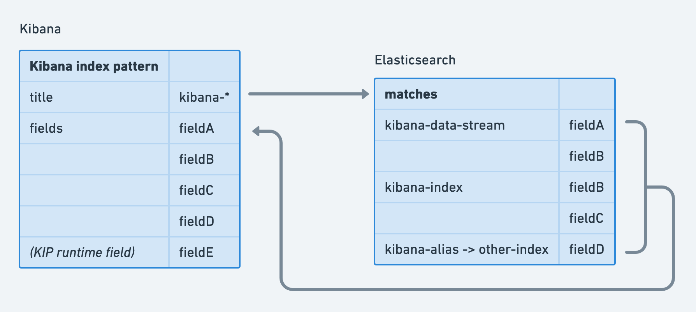

Kibana index patterns (KIPs for short) are the central method of describing sets of indices for queries. Usage is strongly recommended
as a number of high level <DocLink id="kibBuildingBlocks" text="building blocks"/> rely on them. Further, KIPs provide a consistent view of data across 
a variety of KIP supporting Kibana apps.

KIPs are defined by a wildcard string (an index pattern) which matches indices, data streams, and index aliases, optionally specify a
timestamp field for time series data, and are stored as a <DocLink id="kibDevDocsSavedObjectsIntro"
text="saved object"/>. They have a field list which comprises all the fields in matching indices plus fields defined specifically
on the KIP via runtime fields. Schema-on-read functionality is provided by KIP defined runtime fields.

The KIP API is made available via the data plugin (`data.indexPatterns`) and most commonly used with <DocLink id="kibDevTutorialDataSearchAndSessions" section="high-level-search" text="SearchSource" />
(`data.search.search`) to perform queries. SearchSource will apply existing filters and queries from the search bar UI.

Users can create KIPs via [Index pattern management](https://www.elastic.co/guide/en/kibana/current/index-patterns.html).
Additionally, they can be created through the index patterns API.

KIPs also allow formatters and custom labels to be defined for fields.

