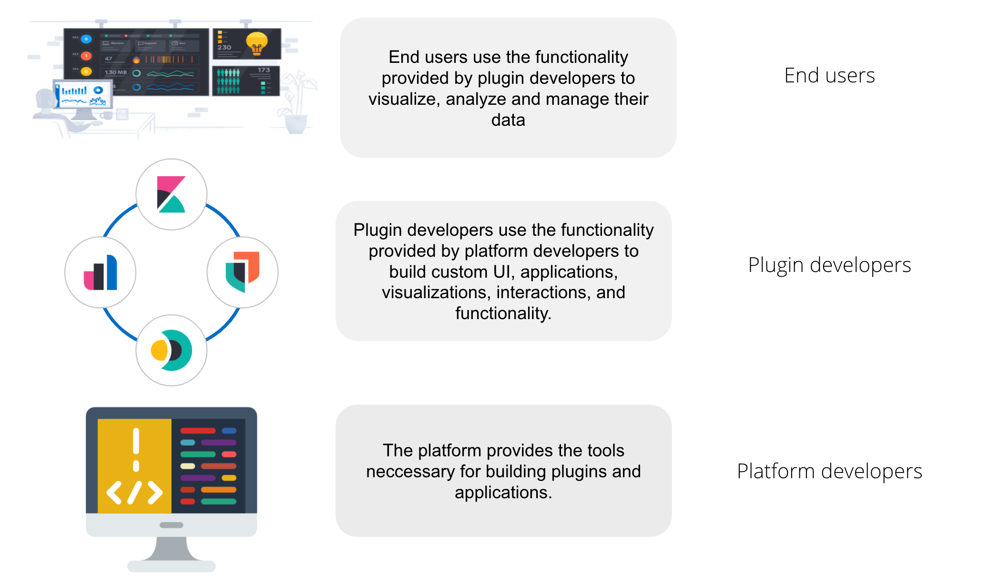
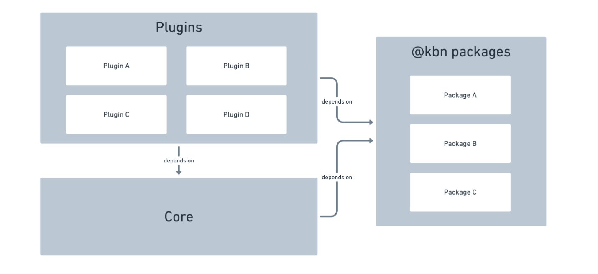
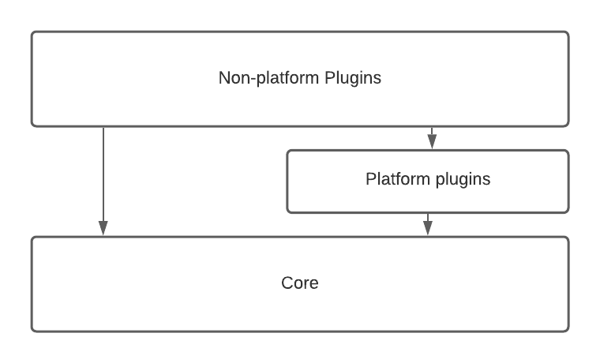
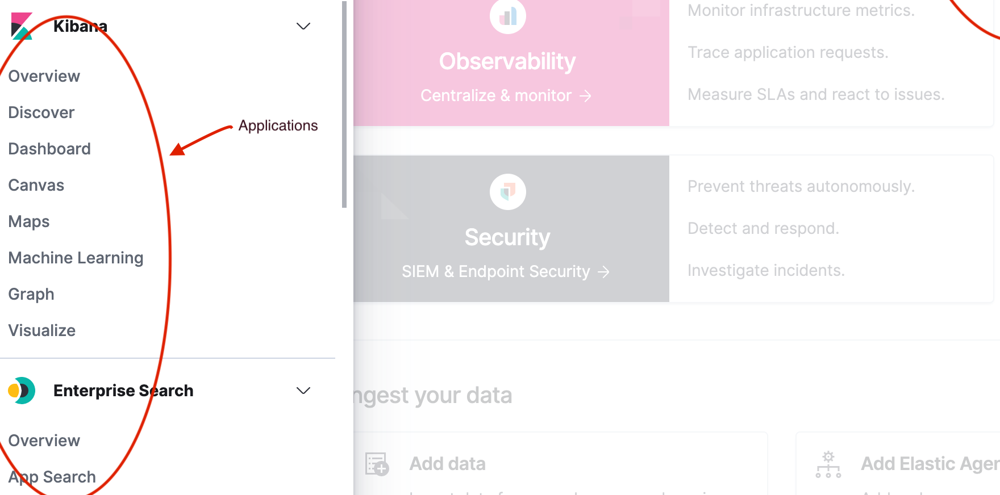

From an end user perspective, Kibana is a tool for interacting with Elasticsearch, providing an easy way
to visualize and analyze data.

From a developer perspective, Kibana is a platform that provides a set of tools to build not only the UI you see in Kibana today, but
a wide variety of applications that can be used to explore, visualize, and act upon data in Elasticsearch. The platform provides developers the ability
to build applications, or inject extra functionality into
already existing applications. Did you know that almost everything you see in the
Kibana UI is built inside a plugin? If you removed all plugins from Kibana, you'd be left with an empty navigation menu, and a set of
developer tools. The Kibana platform is a blank canvas, just waiting for a developer to come along and create something!

## 1,000 foot view

At a super high-level, Kibana is composed of **plugins**, **core**, and **Kibana packages**.

**Plugins** provide the majority of all functionality in Kibana. All applications and UIs are defined here.

**Core** provides the runtime and the most fundamental services.

**@kbn packages** provide static utilities that can be imported anywhere in Kibana.

<DocAccordion buttonContent="(Internal only) FAQ: Should I put my code in a plugin or a package?" color="warning">
<DocCallOut color="warning">
When the [Bazel migration](https://github.com/elastic/kibana/blob/main/legacy_rfcs/text/0015_bazel.md) is complete, all code, including plugins, will be a package. With that, packages won't be required to be in the `packages/` directory and can be located somewhere that makes more sense structurally.

In the meantime, the following can be used to determine whether it makes sense to add code to a package inside the `packages` folder, or a plugin inside `src/plugins` or `x-pack/plugins`. 

**If the code is stateful, it has to be exposed from a plugin's <DocLink id="kibPlatformIntro" section="lifecycle-methods" text="lifecycle methods"/>. Do not statically export stateful code.**

Benefits to packages:

1. <b>_Potentially_ reduced page load time</b>. All code that is statically exported from plugins will be downloaded on _every single page load_, even if that code isn't needed. With packages, only code that is imported is downloaded, which can be minimized by using async imports.
2. <b>Puts the consumer is in charge of how and when to async import</b>. If a consumer async imports code exported from a plugin, it makes no difference, because of the above point. It's already been downloaded. However, simply moving code into a package is _not_ a guaranteed performance improvement. It does give the consumer the power to make smart performance choices, however. If they require code from multiple packages, the consumer can async import from multiple packages at the same time. Read more in our <DocLink id="kibDevPerformance" text="performance docs"/>.

Downsides to packages:

1. <b>It's not <DocLink id="kibDevPrinciples" text="organized by domain"/></b>. The packages folder is far away from the plugins folder. Having your stateless code in a plugin and the rest in a package may make it hard to find, leading to duplication. The Operations team hopes to fix this by supporting packages and plugins existing in the same folder. You can track this work by following [this issue](https://github.com/elastic/kibana/issues/112886).

2. <b>Development overhead</b>. Developers have to run `yarn kbn watch` to have changes rebuilt automatically. [Phase II](https://github.com/elastic/kibana/blob/main/legacy_rfcs/text/0015_bazel.md#phase-ii---docs-developer-experience) of the Bazel migration work will bring the development experience on par with plugin development. This work can be tracked [here](https://github.com/elastic/kibana/issues/104519). 

3. <b>Development performance</b>. Rebuild time is typically longer than it would be for the same code in a plugin. The reasons are captured in [this issue](https://github.com/elastic/kibana/issues/107648). The ops team is actively working to reduce this performance increase.

As you can see, the answer to "Should I put my code in a plugin or a package" is 'It Depends'. If you are still having a hard time determining what the best path location is, reach out to the Kibana Operations Team (#kibana-operations) for help.

</DocCallOut>
</DocAccordion>

<DocAccordion buttonContent="FAQ: What is the difference between services provided by plugins and those by Core?" color="warning">
<DocCallOut >

We try to put only the most stable and fundamental code into `Core`, while optional add-ons, applications, and solution-oriented functionality goes in a plugin. Unfortunately, we haven't done a great job of sticking to that. For example, notifications and toasts are core services, but data and search are plugin services.

Today it looks something like this.

"Platform plugins" provide core-like functionality, just outside of core, and their public APIs tend to be more volatile. Other plugins may still expose shared services, but they are intended only for usage by a small subset of specific plugins, and may not be generic or "platform-like".

**A bit of history**

When the Kibana platform and plugin infrastructure was built, we thought of two types of code: core services, and other plugin services. We planned to keep the most stable and fundamental code needed to build plugins inside core.

In reality, we ended up with many platform-like services living outside of core, with no (short term) intention of moving them. We highly encourage plugin developers to use
them, so we consider them part of platform services.

When we built our platform system, we also thought we'd end up with only a handful of large plugins outside core. Users could turn certain plugins off, to minimize the code
footprint and speed up Kibana.

In reality, our plugin model ended up being used like micro-services. Plugins are the only form of encapsulation we provide developers, and they liked it! However, we ended
up with a ton of small plugins, that developers never intended to be uninstallable, nor tested in this manner. We are considering ways to provide developers the ability to build services with the encapsulation they desire, without the need to build a plugin.

Another side effect of having many small plugins is that common code often ends up extracted into another plugin. Use case specific utilities are exported,
that are not meant to be used in a general manner. This makes our definition of "platform code" a bit trickier to define. We'd like to say "The platform is made up of
every publicly exposed service", but in today's world, that wouldn't be a very accurate picture.

We recognize the need to better clarify the relationship between core functionality, platform-like plugin functionality, and functionality exposed by other plugins.
It's something we will be working on!

We will continue to focus on adding clarity around these types of services and what developers can expect from each.

</DocCallOut></DocAccordion>

## Plugins

Plugins are code that is written to extend and customize Kibana. Plugin's don't have to be part of the Kibana repo, though the Kibana
repo does contain many plugins! Plugins add customizations by
using <DocLink id="kibPlatformIntro" section="extension-points" text="extension points"/> provided by <DocLink id="kibPlatformIntro" section="platform-services" text="platform services"/>.
Sometimes people confuse the term "plugin" and "application". While often there is a 1:1 relationship between a plugin and an application, it is not always the case.
A plugin may register many applications, or none.

### Applications

Applications are top level pages in the Kibana UI. Dashboard, Canvas, Maps, App Search, etc, are all examples of applications:

A plugin can register an application by
adding it to core's application <DocLink id="kibPlatformIntro" section="registry" text="registry"/>.

### Public plugin API

A plugin's public API consists of everything exported from a plugin's <DocLink id="kibPlatformIntro" section="plugin-lifecycle" text="start or setup lifecycle methods"/>,
as well as from the top level `index.ts` files that exist in the three "scope" folders:

- common/index.ts
- public/index.ts
- server/index.ts

Any plugin that exports something from those files, or from the lifecycle methods, is exposing a public service. We sometimes call these things "plugin services" or
"shared services".

## Lifecycle methods

Core, and plugins, expose different features at different parts of their lifecycle. We describe the lifecycle of core services and plugins with
specifically-named functions on the service definition.

Kibana has three lifecycles: setup, start, and stop. Each plugin’s setup function is called sequentially while Kibana is setting up
on the server or when it is being loaded in the browser. The start functions are called sequentially after setup has been completed for all plugins.
The stop functions are called sequentially while Kibana is gracefully shutting down the server or when the browser tab or window is being closed.

The table below explains how each lifecycle relates to the state of Kibana.

| lifecycle | purpose                                                      | server                                                             | browser                                                                                    |
| --------- | ------------------------------------------------------------ | ------------------------------------------------------------------ | ------------------------------------------------------------------------------------------ |
| setup     | perform "registration" work to setup environment for runtime | configure REST API endpoint, register saved object types, etc.     | configure application routes in SPA, register custom UI elements in extension points, etc. |
| start     | bootstrap runtime logic                                      | respond to an incoming request, request Elasticsearch server, etc. | start polling Kibana server, update DOM tree in response to user interactions, etc.        |
| stop      | cleanup runtime                                              | dispose of active handles before the server shutdown.              | store session data in the LocalStorage when the user navigates away from Kibana, etc.      |

Different service interfaces can and will be passed to setup, start, and stop because certain functionality makes sense in the context of a running plugin while other types
of functionality may have restrictions or may only make sense in the context of a plugin that is stopping.

## Extension points

An extension point is a function provided by core, or a plugin's plugin API, that can be used by other
plugins to customize the Kibana experience. Examples of extension points are:

- core.application.register (The extension point talked about above)
- core.notifications.toasts.addSuccess
- core.overlays.showModal
- embeddables.registerEmbeddableFactory
- uiActions.registerAction
- core.saedObjects.registerType

## Follow up material

Learn how to build your own plugin by following <DocLink id="kibHelloWorldApp" />.
