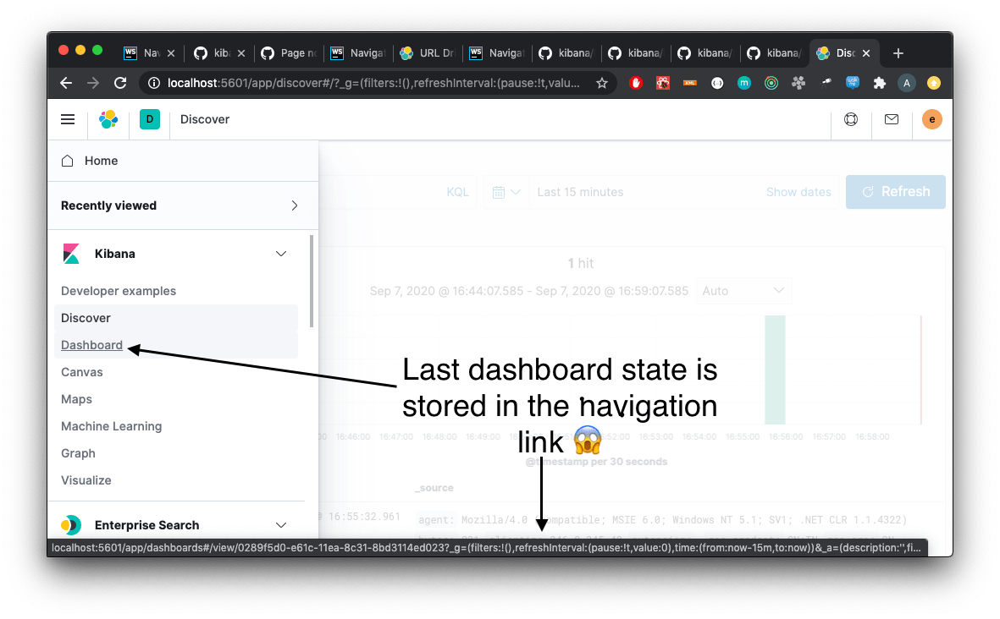

The Kibana platform provides a set of tools to help developers build consistent experience around routing and browser navigation.
Some of that tooling is inside `core`, some is available as part of various plugins.

The purpose of this guide is to give a high-level overview of available tools and to explain common approaches for handling routing and browser navigation.

This guide covers following topics:

* [Deep-linking into apps](#deep-linking)
* [Navigating between apps](#navigating-between-kibana-apps)
* [Setting up internal app routing](#routing)
* [Using history and browser location](#history-and-location)
* [Syncing state with URL](#state-sync)
* [Preserving state between navigations](#preserve-state)

## Deep-linking into apps

Assuming you want to link from your app to *Discover*. When building such URL there are two things to consider:

1. Prepending a proper `basePath`.
2. Specifying *Discover* state.

### Prepending a proper `basePath`

To prepend Kibana's `basePath` use the [core.http.basePath.prepend](https://github.com/elastic/kibana/blob/main/docs/development/core/public/kibana-plugin-core-public.ibasepath.prepend.md) helper:

```tsx
const discoverUrl = core.http.basePath.prepend(`/discover`);

console.log(discoverUrl); // http://localhost:5601/bpr/s/space/app/discover
```

### Specifying state

**Consider a Kibana app URL a part of app's plugin contract:**

- Avoid hardcoding other app's URL in your app's code.
- Avoid generating other app's state and serializing it into URL query params.

```tsx
// Avoid relying on other app's state structure in your app's code:
const discoverUrlWithSomeState = core.http.basePath.prepend(`/discover#/?_g=(filters:!(),refreshInterval:(pause:!t,value:0),time:(from:'2020-09-10T11:39:50.203Z',to:'2020-09-10T11:40:20.249Z'))&_a=(columns:!(_source),filters:!(),index:'90943e30-9a47-11e8-b64d-95841ca0b247',interval:auto,query:(language:kuery,query:''),sort:!())`);
```

Instead, each app should expose [a locator](https://github.com/elastic/kibana/blob/main/src/plugins/share/common/url_service/locators/README.md).
Other apps should use those locators for navigation or URL creation.

```tsx
// Properly generated URL to *Discover* app. Locator code is owned by *Discover* app and available on *Discover*'s plugin contract.
const discoverUrl = await plugins.discover.locator.getUrl({filters, timeRange});
// or directly execute navigation
await plugins.discover.locator.navigate({filters, timeRange});
```

To get a better idea, take a look at *Discover* locator [implementation](https://github.com/elastic/kibana/blob/main/src/plugins/discover/public/locator.ts).
It allows specifying various **Discover** app state pieces like: index pattern, filters, query, time range and more.

There are two ways to access locators of other apps:

1. From a plugin contract of a destination app *(preferred)*.
2. Using locator client in `share` plugin (case an explicit plugin dependency is not possible).

In case you want other apps to link to your app, then you should create a locator and expose it on your plugin's contract.

## Navigating between apps

Kibana is a single page application and there is a set of simple rules developers should follow
to make sure there is no page reload when navigating from one place in Kibana to another.

For example, navigation using native browser APIs would cause a full page reload.

```ts
const urlToADashboard = core.http.basePath.prepend(`/dashboard/my-dashboard`);

// this would cause a full page reload:
window.location.href = urlToADashboard;
```

To navigate between different Kibana apps without a page reload there are APIs in `core`:

* [core.application.navigateToApp](https://github.com/elastic/kibana/blob/main/docs/development/core/public/kibana-plugin-core-public.applicationstart.navigatetoapp.md)
* [core.application.navigateToUrl](https://github.com/elastic/kibana/blob/main/docs/development/core/public/kibana-plugin-core-public.applicationstart.navigatetourl.md)

*Rendering a link to a different app on its own would also cause a full page reload:*

```jsx
const myLink = () =>
<a href={urlToADashboard}>Go to Dashboard</a>;
```

A workaround could be to handle a click, prevent browser navigation and use `core.application.navigateToApp` API:

```jsx
const MySPALink = () =>
<a
  href={urlToADashboard}
  onClick={(e) => {
    e.preventDefault();
    core.application.navigateToApp('dashboard', { path: '/my-dashboard' });
  }}
>
  Go to Dashboard
</a>;
```

As it would be too much boilerplate to do this for each link in your app, there is a handy wrapper that helps with it:
[RedirectAppLinks](https://github.com/elastic/kibana/blob/main/src/plugins/kibana_react/public/app_links/redirect_app_link.tsx#L49).

```jsx
const MyApp = () =>
<RedirectAppLinks application={core.application}>
  {/*...*/}
  {/* navigations using this link will happen in SPA friendly way */}
  <a href={urlToADashboard}>Go to Dashboard</a>
  {/*...*/}
</RedirectAppLinks>
```

## Setting up internal app routing

It is very common for Kibana apps to use React and React Router.

Common rules to follow in this scenario:
- Set up `BrowserRouter` and not `HashRouter`.
- Initialize your router with `history` instance provided by the `core`.

This is required to make sure `core` is aware of navigations triggered inside your app, so it could act accordingly when needed.

* `Core`'s [ScopedHistory](https://github.com/elastic/kibana/blob/main/docs/development/core/public/kibana-plugin-core-public.scopedhistory.md) instance.
* [Example usage](https://github.com/elastic/kibana/blob/main/docs/development/core/public/kibana-plugin-core-public.appmountparameters.history.md)
* [Example plugin](https://github.com/elastic/kibana/blob/main/test/plugin_functional/plugins/core_plugin_a/public/application.tsx#L120)

Relative links will be resolved relative to your app's route (e.g.: `http://localhost5601/app/{your-app-id}`)
and setting up internal links in your app in SPA friendly way would look something like:

```tsx
import { Link } from 'react-router-dom';

const MyInternalLink = () => <Link to="/my-other-page"></Link>
```

## Using history and browser location

Try to avoid using `window.location` and `window.history` directly.

<DocCallOut>
  Instead, use [ScopedHistory](https://github.com/elastic/kibana/blob/main/docs/development/core/public/kibana-plugin-core-public.scopedhistory.md) instance provided by `core`.
</DocCallOut>

- This way `core` will know about location changes triggered within your app, and it would act accordingly.
- Some plugins are listening to location changes. Triggering location change manually could lead to unpredictable and hard-to-catch bugs.

Common use-case for using `core`'s `ScopedHistory`  directly:
- Reading/writing query params or hash.
- Imperatively triggering internal navigations within your app.
- Listening to browser location changes.

## Syncing state with URL

Historically Kibana apps store _a lot_ of application state in the URL.
The most common pattern that Kibana apps follow today is storing state in `_a` and `_g` query params in [rison](https://github.com/w33ble/rison-node#readme) format.

Those query params follow the convention:

- `_g` (*global*) - global UI state that should be shared and synced across multiple apps. common example from Analyze group apps: time range, refresh interval, *pinned* filters.
- `_a` (*application*) - UI state scoped to current app.

NOTE: After migrating to KP platform we got navigations without page reloads. Since then there is no real need to follow `_g` and `_a` separation anymore. It's up you to decide if you want to follow this pattern or if you prefer a single query param or something else. The need for this separation earlier is explained in the next section.

There are utils to help you to implement such kind of state syncing.

**When you should consider using state syncing utils:**

- You want to sync your application state with URL in similar manner Analyze group applications do.
- You want to follow platform's history and location best practices out of the box.
- You want to support `state:storeInSessionStore` escape hatch for URL overflowing out of the box.
- You should also consider using them if you'd like to serialize state to different (not `rison`) format. Utils are composable, and you can implement your own `storage`.
- In case you want to sync part of your state with URL, but other part of it with browser storage.

**When you shouldn't use state syncing utils:**

- Adding a query param flag or simple key/value to the URL.

<DocCallOut>
  Follow [these docs](https://github.com/elastic/kibana/blob/main/src/plugins/kibana_utils/docs/state_sync#state-syncing-utilities) to learn more.
</DocCallOut>

## Preserving state between navigations

Consider the scenario:

1. You are in *Dashboard* app looking at a dashboard with some filters applied;
2. Navigate to *Discover* using in-app navigation;
3. Change the time filter'
4. Navigate to *Dashboard* using in-app navigation.

You'd notice that you were navigated to *Dashboard* app with the *same state* that you left it with,
except that the time filter has changed to the one you applied on *Discover* app.

Historically Kibana Analyze groups apps achieve that behavior relying on state in the URL.
If you'd have a closer look on a link in the navigation,
you'd notice that state is stored inside that link, and it also gets updated whenever relevant state changes happen:



This is where separation into `_a` and `_g` query params comes into play. What is considered a *global* state gets constantly updated in those navigation links. In the example above it was a time filter.
This is backed by [KbnUrlTracker](https://github.com/elastic/kibana/blob/main/src/plugins/kibana_utils/public/state_management/url/kbn_url_tracker.ts#L57) util. You can use it to achieve similar behavior.

NOTE: After migrating to KP navigation works without page reloads and all plugins are loaded simultaneously.
Hence, likely there are simpler ways to preserve state of your application, unless you want to do it through URL.
