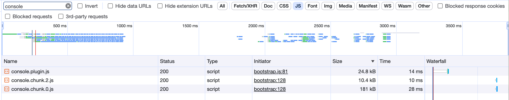
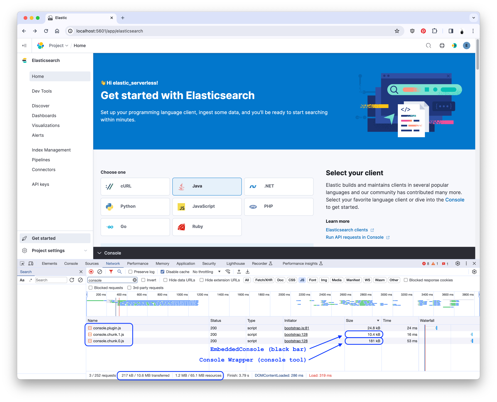
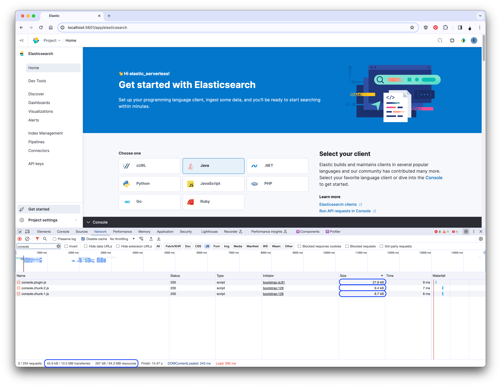
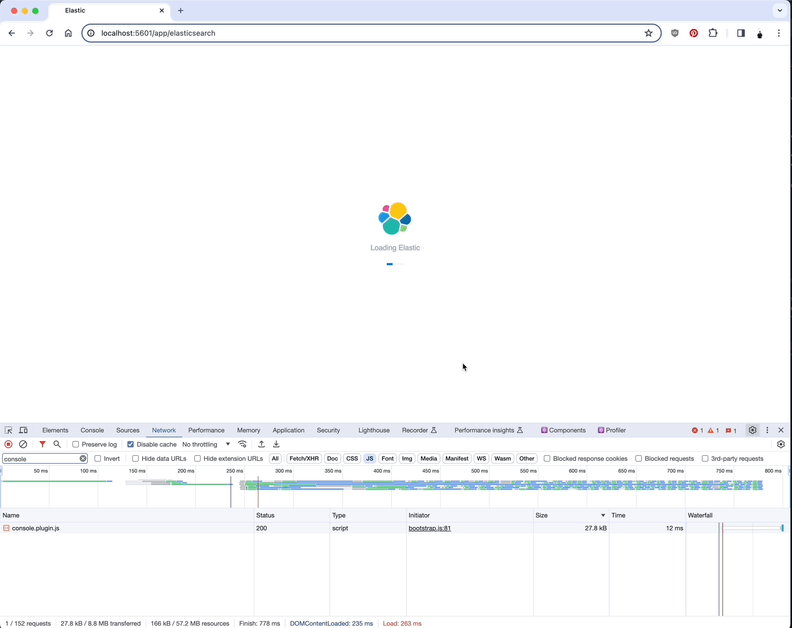

--- 
id: kibDevPerformanceCaseStudyAsyncTooEarly
slug: /kibana-dev-docs/key-concepts/performance/case-studies/async-too-early
title: Case Study - Async too early
description: Learn how we were able to improve page load by identifying and fixing an erroneous (but well intentioned) async import.
date: 2024-05-29
tags: ['kibana', 'dev', 'tutorials', 'plugin', 'performance', 'client', 'optimization']
---

<DocCallOut>The following case study is derived from [kibana#179175](https://github.com/elastic/kibana/pull/179175).</DocCallOut>

## Summary

<DocCallOut color="success">
  <u>Before</u>: **`1.2MB`** total assets and **`217k`** code.<br/>
  <u>After</u>: **`267k`** total assets and **`45.9k`** code.<br/>
  <u>Savings</u>: **78%** and **79%**.
</DocCallOut>

- The `console` plugin provides an embedded console for interacting with Elasticsearch.
- The `search` plugin was utilizing the embedded console at the bottom of the page.
- Large async chunks were being fetched on each page load.  One of the largest was the embedded console.
- Parts of the embedded console were anyncronously imported, but not all of it.
- By moving the async load higher in the component tree, I was able to significantly improve page load.

## Investigation

I noticed that the Serverless Search project home page was loading a significant amount of code on page load.  While the plugin bundle itself was small, the asyncronous chunks-- which should only be loaded when the code is required, either by conditional need or if the user interacts with the page-- were large and being loaded all the time.  The largest of these async chunks were coming from the `console` plugin.

By filtering the network tab in Chrome for `console`, I was able to see the chunks the Search home page was loading:

[](./assets/async_too_early_console_chunks.png)

### What was being loaded?

The embedded console consisted of two parts, each being loaded asynchronously in React: the black bottom bar that expands upward to reveal the console, and the console itself:

[](./assets/async_too_early_before.png)

The console portion was quite large-- `181k`-- and, given the conditional nature of showing that console, this was a sure sign that _a great deal of code_ was being loaded too early.

### Identifying the problem

The [`ConsoleWrapper` component](https://github.com/clintandrewhall/kibana/blob/386c29094df6f189da57b1a7c5ddc839e610e559/src/plugins/console/public/application/containers/embeddable/console_wrapper.tsx) contained the various context providers.  It was imported by the [`EmbeddableConsole` component](https://github.com/clintandrewhall/kibana/blob/386c29094df6f189da57b1a7c5ddc839e610e559/src/plugins/console/public/application/containers/embeddable/embeddable_console.tsx#L31).

While the `index.tsx` file was set up to load the `EmbeddableConsole` asyncronously, [_setting up_](https://github.com/clintandrewhall/kibana/blob/386c29094df6f189da57b1a7c5ddc839e610e559/src/plugins/console/public/plugin.ts#L126-L135) the `EmbeddableConsole` in the `console` plugin required [a pure import](https://github.com/clintandrewhall/kibana/blob/386c29094df6f189da57b1a7c5ddc839e610e559/src/plugins/console/public/plugin.ts#L12) and [conditional, immediate render](https://github.com/clintandrewhall/kibana/blob/386c29094df6f189da57b1a7c5ddc839e610e559/src/plugins/console/public/plugin.ts#L125-L140).  The `enterpriseSearch` plugin also [rendered it](https://github.com/clintandrewhall/kibana/blob/386c29094df6f189da57b1a7c5ddc839e610e559/x-pack/plugins/enterprise_search/public/applications/shared/layout/page_template.tsx#L124) conditionally, and immediately.  This brought the `ConsoleWrapper` code-- and all of its dependencies-- into the plugin bundle.

## Fixing the issue

The primary fix for this problem was to add a dynamic import for the `ConsoleWrapper` component in the `EmbeddableConsole` component:

```diff
diff --git a/embeddable_console.tsx b/embeddable_console.tsx
index 6a2ab55..386c29 111111
--- a/src/plugins/console/public/application/containers/embeddable/embeddable_console.tsx
+++ b/src/plugins/console/public/application/containers/embeddable/embeddable_console.tsx
- import { ConsoleWrapper } from './console_wrapper';
@@  @@
+ const ConsoleWrapper = dynamic(async () => ({
+   default: (await import('./console_wrapper')).ConsoleWrapper,
+ }));
@@  @@
- {isConsoleOpen ? (
-   <div className="embeddableConsole__content" data-test-subj="consoleEmbeddedBody">
-     <EuiWindowEvent event="keydown" handler={onKeyDown} />
-     <ConsoleWrapper core={core} usageCollection={usageCollection} />
-   </div>
- ) : null}
+ {isConsoleOpen ? <ConsoleWrapper {...{ core, usageCollection, onKeyDown }} /> : null}
```

This allowed the `ConsoleWrapper` (and its dependencies) to be loaded only when the console was opened:

[](./assets/async_too_early_after.png)

You can see effects of this change in the network tab as someone navigates:

[](./assets/async_too_early_effect.gif)

### Other changes

This PR also introduces the `dynamic` method from the `@kbn/shared-us-utility` package.  This method wrapper around `React.lazy` and `React.Suspense` that allows for more control over the loading of components.

## Conclusions

- Asyncronous imports are a powerful tool for reducing the size of the plugin bundle, but if an async import is initiated immediately, the benefit is lost.
- By moving the async import higher in the component tree, I was able to significantly reduce the size of the plugin bundle _and_ improve page load.
- The `EmbeddedConsole` component is a great example, as the large components should only be rendered if the panel is opened.