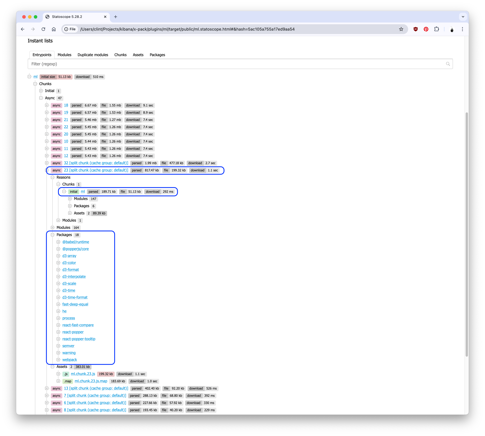

<DocCallOut>The following case study is derived from [kibana#179311](https://github.com/elastic/kibana/pull/179311).</DocCallOut>

## Summary

<DocCallOut color="success">
Moving a _single numerical constant_ to its own file reduced the async page load by **`74%`**.  Eliminating downstream effects, other top-level exports, and converting pages to async further reduced the async chunks.
</DocCallOut>

- The `AnomalyExplorerChartService` was [importing a constant](https://github.com/clintandrewhall/kibana/blob/1c1e20afdb883fc279c5a06d4b71f8e577f8dad6/x-pack/plugins/ml/public/application/services/anomaly_explorer_charts_service.ts#L26) from a React component file, [`SwimlaneContainer`](https://github.com/clintandrewhall/kibana/blob/1c1e20afdb883fc279c5a06d4b71f8e577f8dad6/x-pack/plugins/ml/public/application/explorer/swimlane_container.tsx#L85).  
  - This meant that the React component, as well as __all of its related code__, was being bundled into the async chunk.
  - [Moving that constant](https://github.com/elastic/kibana/pull/179311/commits/c2c81d32c6c689514b78efdf2484b1513fdc0b9e) to its own file reduced affected async chunks by significant amounts.

Unfortunately, the fix had a number of downstream effects that needed to be investigated and resolved, as well:

- Another top-level import [was found](https://github.com/elastic/kibana/blob/bfc91b0cb035b39916a5efc64ace31e88a230ec5/x-pack/plugins/ml/public/application/app.tsx#L57-L87) originating in the application React component for __all of ML__.
  - [Other](https://github.com/elastic/kibana/blob/bfc91b0cb035b39916a5efc64ace31e88a230ec5/x-pack/plugins/ml/public/application/management/jobs_list/components/jobs_list_page/jobs_list_page.tsx#L39) [components](https://github.com/elastic/kibana/blob/bfc91b0cb035b39916a5efc64ace31e88a230ec5/x-pack/plugins/ml/public/embeddables/common/resolve_job_selection.tsx#L16) [that](https://github.com/elastic/kibana/blob/bfc91b0cb035b39916a5efc64ace31e88a230ec5/x-pack/plugins/ml/public/embeddables/job_creation/common/create_flyout.tsx#L19) imported this utility function, in turn, imported __the entire ML application__.
  - This caused a `2.0MB` bloat in each async chunk that used the utility function.
- The `MlPage` component-- the component used to render the entire application-- [imported](https://github.com/elastic/kibana/blob/bfc91b0cb035b39916a5efc64ace31e88a230ec5/x-pack/plugins/ml/public/application/components/ml_page/ml_page.tsx#L22) a [collection of routes](https://github.com/elastic/kibana/blob/bfc91b0cb035b39916a5efc64ace31e88a230ec5/x-pack/plugins/ml/public/application/routing/routes/index.ts) to determine which page to load.
  - This meant that even though only one page would be loaded at a time (dependending which route was loaded), __all pages__ were being bundled into async chunks.
  - By eliminating the top-level exports and altering each page to be async, we were able to reduce the async chunk size significantly.

## Investigation

From the network tab of Chrome dev tools, I could see that the `ml` plugin was loading a significant amount of code on page load.  The async chunks were large, and the `ml` plugin was one of the largest contributors to the async load:
  
[](./assets/top_level_imports_before.png)

Of the most interest was `ml.chunk.23.js`, which was clocking in at `205k`.  This was the largest async chunk, and it was being loaded on every page load.

### Profiling the build

By running the build script with the `--profile` flag, I was able to generate both a Webpack stats file and three popular visualization tools to visualize the contents of the bundle:

```bash
node scripts/build_kibana_platform_plugins.js --profile --focus=ml
```

First, I looked at `ml.visualizer.html` in the `target/public` directory of the `ml` plugin.  This file contained an instance of the [Webpack Bundle Analyzer](https://chrisbateman.github.io/webpack-visualizer/):

[](./assets/top_level_imports_mpv.png)

From there, we can see there's a great deal of `node_modules` being loaded, (the portions in green).  While this visualization is useful in determining the size of a chunk relative to others, another visualization tool, [Statoscope](https://statoscope.tech/), is better at showing what as well as _why_ things are included in a chunk:
  
[](./assets/top_level_imports_stato_modules.png)

Knowing what and why the module is large, now we need to find why it's being loaded.  

From there, commenting out 

### Identifying the problem

Unfortunately there isn't a tool to find specifically _why_ a chunk is being loaded, much less which line of code is responsible.  So in these cases, where we don't know why and it's not immediately obvious, we have to brute force it: commenting out code.  Removing large amounts of code from the plugin and seeing if the async chunk size changes is a good way to determine which import is causing the bloat.

Through that process, I found commenting out [the `register_helper` call](https://github.com/elastic/kibana/blob/bfc91b0cb035b39916a5efc64ace31e88a230ec5/x-pack/plugins/ml/public/plugin.ts#L232-L239) reduced the size considerably.  Going further, commenting out [the `registerEmbeddables` export](https://github.com/elastic/kibana/blob/bfc91b0cb035b39916a5efc64ace31e88a230ec5/x-pack/plugins/ml/public/register_helper/index.ts#L8) led to the same savings.

As I moved further and further down, __that__ led me to discover that a number of embeddable containers were importing [several constants](https://github.com/elastic/kibana/blob/bfc91b0cb035b39916a5efc64ace31e88a230ec5/x-pack/plugins/ml/public/application/explorer/swimlane_annotation_container.tsx#L18-L19) contained in the `swimlane_annotation_container`.  This file, in turn, imported a large amount of JS... JS that was not relevant to starting the ML plugin.

## Fixing the issue

Moving these constants to their own file resulted in the reduction of the async chunk.  This was a simple fix, but the downstream effects were not so simple.

### Duplicated code across chunks

At first, [the reason was difficult to identify](https://github.com/elastic/kibana/pull/179311#issuecomment-2019333617), but several chunks were bloated by several megabytes... and by the same amount.  This led me to believe that another top-level export was responsible for the bloat.

The [Webpack Bundle Analyzer](https://github.com/webpack-contrib/webpack-bundle-analyzer) is great for visualizing these kinds of duplications:

[](./assets/top_level_imports_wba.png)

We can see from the analysis that each chunk contains `public/application/jobs`, `components`, `data_frame_analytics`, and others.  They also pull in `cytoscape` and `d3`.  Cross referencing with the `statoscope` visualization, we can explore the reasons:

[](./assets/top_level_imports_stato_duplicates.png)

Back to commenting out code!  After [a bit](https://github.com/elastic/kibana/pull/179311#issuecomment-2019394457) of trial and error, I discovered the export responsible: the [`getMlGlobalServices`](https://github.com/elastic/kibana/blob/bfc91b0cb035b39916a5efc64ace31e88a230ec5/x-pack/plugins/ml/public/application/app.tsx#L57-L87) function in [`ml/public/application/app.tsx`](https://github.com/elastic/kibana/blob/bfc91b0cb035b39916a5efc64ace31e88a230ec5/x-pack/plugins/ml/public/application/app.tsx).

#### Resolution

The `getMlGlobalServices` function was being imported by several components, which in turn imported the entire `ml` plugin.  By moving the `getMlGlobalServices` function to its own file, we were able to remove that excess, unused code from the chunks and reduce reduce them by a significant amount.

### All routes imported at `start`

The application interface was being rendered by a single page component, [`MlPage`](https://github.com/elastic/kibana/blob/bfc91b0cb035b39916a5efc64ace31e88a230ec5/x-pack/plugins/ml/public/application/components/ml_page/ml_page.tsx).  This component, in turn was [importing all routes](https://github.com/elastic/kibana/blob/bfc91b0cb035b39916a5efc64ace31e88a230ec5/x-pack/plugins/ml/public/application/components/ml_page/ml_page.tsx#L22) from [`ml/public/application/routing/routes`](https://github.com/elastic/kibana/blob/bfc91b0cb035b39916a5efc64ace31e88a230ec5/x-pack/plugins/ml/public/application/routing/routes)... which exported _all route factories_ from the top-level export... and each was loading its page implementation syncronously.

As a result, each page was being loaded into the async chunks, even though only one page would be loaded at a time.  

#### Resolution

By converting each page to an async import, we were able to load each page async at the time its route is accessed.  In addition, some of the pages were co-located with their route factory, so I moved them to their own files for a dynamic import.  Finally, some state managers were being statically imported regardless of route, so those were relocated, as well.

### Other optimizations

- Registration of some `start` services were conditional, and contain their own async calls. I removed those from the register helper, (which itself was a brute-force offload of code from the plugin, but still loaded every time), and loaded them async if the conditions apply.
- I moved flyouts, modals, expanding rows, and other conditionally-rendered components to `React.lazy` async modules, (using `dynamic` from `@kbn/shared-ux-utility`).
- A lot of `export * from ...` exports were obscuring what code was actually being consumed.  For example, [`public/shared.ts`](https://github.com/elastic/kibana/blob/bfc91b0cb035b39916a5efc64ace31e88a230ec5/x-pack/plugins/ml/public/shared.ts) was exporting everything from a lot of `common` files.
  - By [refactoring these exports](https://github.com/clintandrewhall/kibana/blob/c4790b6315662b940d0794faca0ddafd8b6faedc/x-pack/plugins/ml/public/shared.ts) to accurately reflect what is being consumed outside the `ml` plugin, we are able to track their consumption, (and also reduce the size of _that_ bundle).

## Conclusions

- Exporting `*` from an `index` file means that _all_ exports are loaded when the file is imported.  We should avoid this as much as possible, opting instead to directly import components from their source files.
- We should avoid importing global variables from a large file, opting for a small `constants` file instead.
- Care should be taken to ensure async `dynamic` calls are placed properly, (e.g. at the very top of the conditional import).
- Conditional calls to services in `start` should be loaded async, (e.g. if a dependency plugin is enabled, a configuration is set, etc.).