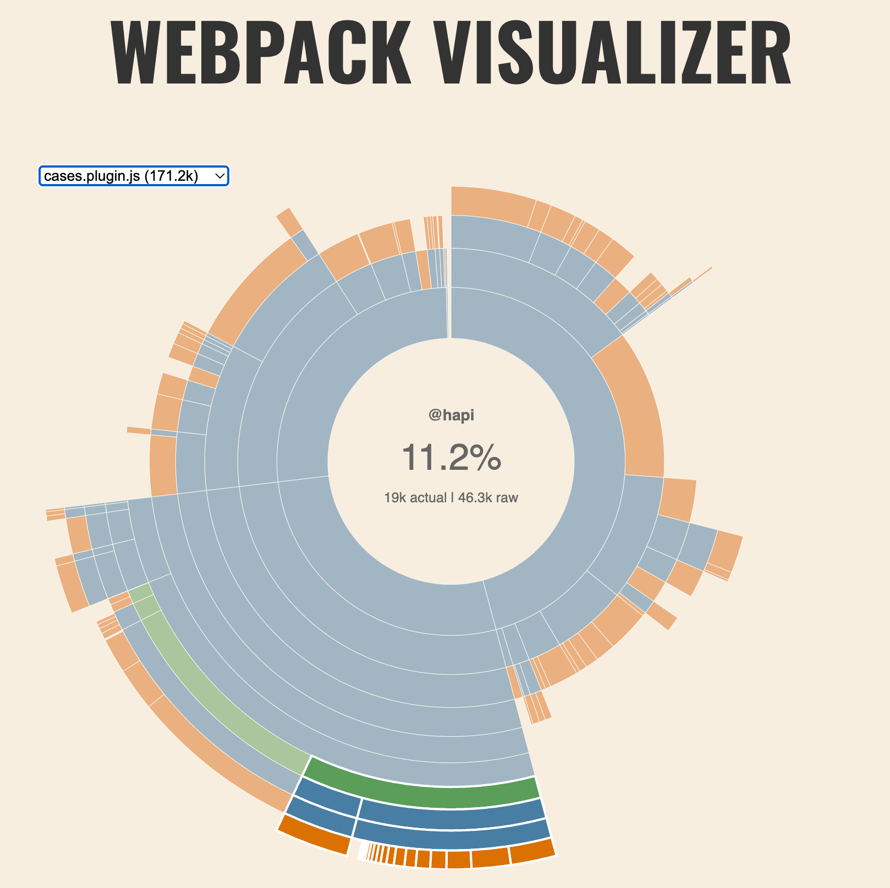

<DocCallOut>The following case study is derived from [kibana#178668](https://github.com/elastic/kibana/pull/178668).</DocCallOut>

## Summary

<DocCallOut color="success">
Moving server-specific utlities and libraries out of `common` and into the `server` directory reduced the size of the `cases` client plugin bundle **by 12.5%**.
</DocCallOut>

- The `cases` plugin bundle was one of the largest in the initial page load of Kibana.
- The `common` directory contained libraries that were only relevant to server code.
- The contents of `common` are copied to both the `server` and `client` bundles.
- Therefore, the `cases` client bundle included server-only libraries that were not used there.

## Investigation

This case study outlines one way to identify the source of a large plugin bundle: using the `--profile` flag to generate a Webpack stats file and visualize the contents of the bundle.

### Examining the bundle

When loading Kibana, I saw the `cases` plugin bundle in the client was one of the largest.  I ran the build script with the `--profile` flag to <DocLink id="kibDevPerformanceClient" text="generate a webpack stats file" section="" />:

```bash
node scripts/build_kibana_platform_plugins.js --dist --profile --focus=console
```

Then, I loaded the `stats.json` file in the [Webpack Bundle Analyzer](https://chrisbateman.github.io/webpack-visualizer/):

[](./assets/uncommon_bundle_analyzer_before.png)

Looking at the dependencies, I noticed that the `cases` plugin bundle included [`@hapi/boom`](https://www.npmjs.com/package/@hapi/boom) and [`@hapi/hoek`](https://www.npmjs.com/package/@hapi/hoek).

[](./assets/uncommon_bundle_analyzer_hapi.png)

The [`@hapi/boom`](https://www.npmjs.com/package/@hapi/boom) package provides utilities for creating "HTTP-friendly error objects"-- e.g. "Error 500: Internal Server Error"-- and [`@hapi/hoek`](https://www.npmjs.com/package/@hapi/hoek) is a dependency of `@hapi/boom`.  So the quesion became:

<DocCallOut color="danger">Why is a utility for delivering HTTP error messages included in the client bundle?</DocCallOut>

### Identifying the problem

The `common` directory contained a set of [`validators`](https://github.com/elastic/kibana/blob/b53148acb8e45f48e8d3f0176021a43d8a963282/x-pack/plugins/cases/common/utils/validators.ts) that utilized `@hapi/boom`.  The `validators` export obscured the fact that the code was only relevant to the server.

A Kibana plugin copies any code in the `common` directory to both the `server` and `client` bundles.  Since the `common` directory contained code which was only relevant to the `server` bundle, using libraries that were only relevant to _server_ code, the `cases` client bundle included server-only libraries that were not used, (nor useful).

## Fixing the issue

Moving the validators to the `server` portion of the plugin reduced the size of the `cases` client bundle by `21.3KB`, or 12.5%.

[](./assets/uncommon_bundle_ci_build.png)

### "I missed one"

This was a PR that had [a clear sign](https://github.com/elastic/kibana/pull/178668#issuecomment-1997581921) I had missed an export.  I had removed the `validators` from the `common` directory, but I had missed one export.  The CI build caught this by flagging the increase in async chunks.  Had I only examined the page bundle size, I would have left the server code to be loaded not in the bundle, but on demand, (which brings with it its own set of issues).

[](./assets/uncommon_bundle_missed_export.png)

## Conclusions

- It's important to examine the contents of the `common` directory to ensure that the code is _truly_ common.
- The `--profile` flag can be used to generate a Webpack stats file and audit the contents of a bundle.
- Visualizations, including the Webpack Visualizer, [are now generated](https://github.com/elastic/kibana/pull/180099) when using the `--profile` flag.