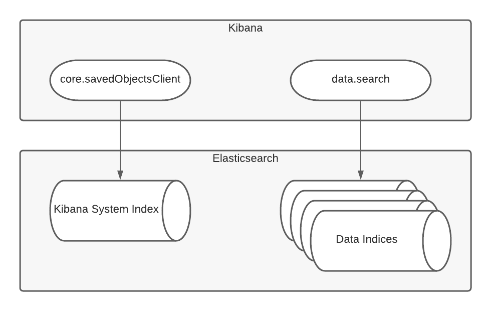

"Saved Objects" are developer defined, persisted entities, stored in the Kibana system index (which is also sometimes referred to as the `.kibana` index).
The Saved Objects service allows Kibana plugins to use Elasticsearch like a primary database. Think of it as an Object Document Mapper for Elasticsearch.
Some examples of Saved Object types are dashboards, lens, canvas workpads, index patterns, cases, ml jobs, and advanced settings. Some Saved Object types are
exposed to the user in the [Saved Object management UI](https://www.elastic.co/guide/en/kibana/current/managing-saved-objects.html), but not all.

Developers create and manage their Saved Objects using the SavedObjectClient, while other data in Elasticsearch should be accessed via the data plugin's search
services.

<DocLink id="kibDevTutorialSavedObject" text="Tutorial: Register a new Saved Object type" />

## References

In order to support import and export, and space-sharing capabilities, Saved Objects need to explicitly list any references they contain to other Saved Objects.
The parent should have a reference to it's children, not the other way around. That way when a "parent" is exported (or shared to a space),
all the "children" will be automatically included. However, when a "child" is exported, it will not include all "parents".

<DocLink
  id="kibDevTutorialSavedObject"
  section="references"
  text="Learn how to define Saved Object references"
/>

## Migrations and Backward compatibility

As your plugin evolves, you may need to change your Saved Object
type in a breaking way (for example, changing the type of an attribute, or removing
an attribute). If that happens, you should write a new model version to upgrade the Saved Objects that existed prior to the change.

<DocLink id="kibDevTutorialSavedObject" section="migrations" text="Defining model versions" />.

If you create or persist raw saved objects outside of Kibana (for example, via the deprecated Saved Objects HTTP CRUD APIs or NDJSON files), preserve `coreMigrationVersion` and `typeMigrationVersion` to retain forwards compatibility across Kibana versions. For more details, refer to the [Saved Objects](https://www.elastic.co/docs/extend/kibana/saved-objects) documentation.

## Security

Saved Objects can be secured using Kibana's Privileges model, unlike data that comes from data indices, which is secured using Elasticsearch's Privileges model.

### Aggregation security

When using the `find` or `search` methods with aggregations, be aware that certain Elasticsearch aggregation types can bypass query restrictions and return data from documents the user should not have access to. See <DocLink id="kibDevTutorialSavedObjectsSearch" section="security-considerations-for-aggregations" text="Security considerations for aggregations" /> for details on which aggregations to avoid.

### Space awareness

Saved Objects are "space aware". They exist in the space they were created in, and any spaces they have been shared with.

### Feature controls and RBAC

Feature controls provide another level of isolation and shareability for Saved Objects. Admins can give users and roles read, write or none permissions for each Saved Object type.

### Object level security (OLS)

OLS is an oft-requested feature that is not implemented yet. When it is, it will provide users with even more sharing and privacy flexibility. Individual
objects can be private to the user, shared with a selection of others, or made public. Much like how sharing Google Docs works.

## Scalability

By default all saved object types go into a single index. If you expect your saved object type to have a lot of unique fields, or if you expect there
to be many of them, you can have your objects go in a separate index by using the `indexPattern` field. Reporting and task manager are two
examples of features that use this capability.

## Searchability

Because saved objects are stored in system indices, they cannot be searched like other data can. If you see the phrase “[X] as data” it is
referring to this searching limitation. Users will not be able to create custom dashboards using saved object data, like they would for data stored
in Elasticsearch data indices.

## Saved Objects by value

Sometimes Saved Objects end up persisted inside another Saved Object. We call these Saved Objects “by value”, as opposed to "by
reference". If an end user creates a visualization and adds it to a dashboard without saving it to the visualization
library, the data ends up nested inside the dashboard Saved Object. This helps keep the visualization library smaller. It also avoids
issues with edits propagating - since an entity can only exist in a single place.
Note that from the end user stand point, we don’t use these terms “by reference” and “by value”.

## Sharing Saved Objects

Starting in Kibana 7.12, saved objects can be shared to multiple spaces. The "space behavior" is determined for each object type depending
on how it is registered.

If you are adding a **new** object type, when you register it:

1. Use `namespaceType: 'multiple-isolated'` to make these objects exist in exactly one space
2. Use `namespaceType: 'multiple'` to make these objects exist in one _or more_ spaces
3. Use `namespaceType: 'agnostic'` if you want these objects to always exist in all spaces

If you have an **existing** "legacy" object type that is not shareable (using `namespaceType: 'single'`), see the [legacy developer guide
for Sharing Saved Objects](https://www.elastic.co/docs/extend/kibana/saved-objects/share) for details on steps you need to take
to make sure this is converted to `namespaceType: 'multiple-isolated'` or `namespaceType: 'multiple'` in the 8.0 release.
