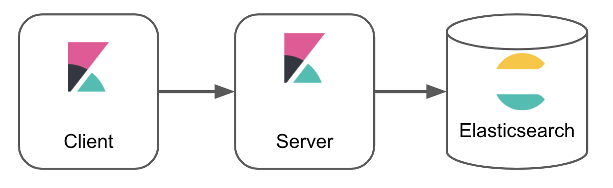

From an end user perspective, Kibana is a tool for interacting with Elasticsearch, providing an easy way 
to visualize and analyze data.

From a developer perspective, Kibana is a platform that provides a set of tools to build not only the UI you see in Kibana today, but
almost any UI that can be dreamt up. The platform provides developers the ability to build applications, or inject extra functionality into 
already existing applications. Did you know that everything you see in the
Kibana UI is built inside a plugin? If you removed all plugins from Kibana, you'd be left without any UI, just a set of developer tools!


## "A Plugin" vs "The Platform"

Kibana provides the most basic and fundmental tools neccessary for building a plugin with the "Core" platform. The Core platform is not a plugin itself.
There is however, a lot of platform functionality provided by plugins that are not a part of Core.
For example, the data plugin provides basic utilities to search, query and filter data in Elasticsearch. This code is not part of Core, but is still very fundamental
for many plugins, and we strongly encourage using this service over querying Elasticsearch directly.

<DocCallOut title="What goes in Core and what ends up in a plugin?">
Our heuristic is that code _required_ to build a plugin goes in Core, and code that is _optional_ goes in a plugin.
In reality, however, it's a grey area.
</DocCallOut>

The functionality that is exposed by plugins, for other plugins to use, is considered to be part of the Kibana platform!


The difference between core platform functionality and platform functionality supplied by plugins, is how it is accessed. Core is
passed to plugins as the first parameter to their `start` and `setup` lifecycle functions, while plugin supplied functionality is passed as the
second parameter. 

```ts
export class MyPlugin {
  public setup(core: CoreSetup, plugins: { pluginA: PluginASetup, pluginB: PluginBSetup }) {
    // called when plugin is setting up during Kibana's startup sequence
  }

  public start(core: CoreStart, plugins: { pluginA: PluginAStart, pluginB: PluginBStart }) {
    // called after all plugins are set up
  }
}
```

Plugin dependencies must be declared explicitly inside the `kibana.json` file. Core functionality is always provided.

## Client server communication

Kibana has platform code on the client and the server. It's possible for client side code to communicate
directly with Elasticsearch but we prefer it goes through Kibana server functionality, using platform utilities.



A different set of platform functionality is provided to every plugin's client side code and server side code. Every plugin
can build a plugin class on the client side (`my_plugin/public/plugin.ts`), or the server side (`my_plugin/server/plugin.ts`), or both. 

Together with the two different lifecycles, that mean's each plugin can use, and/or supply up to four sets of functionality. Anything exported
from these four functions is what makes up a plugin's public API, and determines whether the plugin is contributing to the Kibana platform, or just
using platform functionality to build an application.


