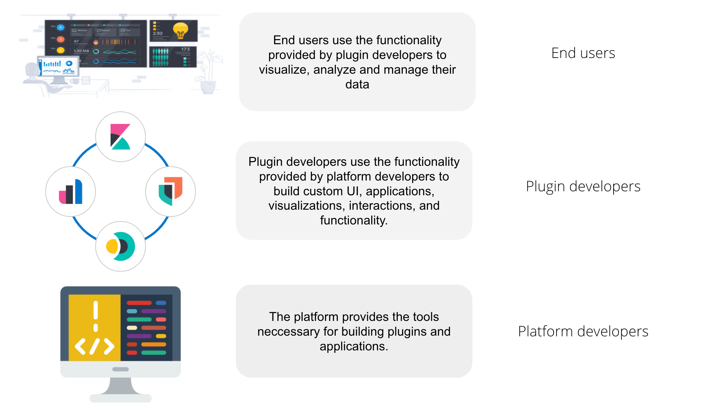

From an end user perspective, Kibana is a tool for interacting with Elasticsearch, providing an easy way 
to visualize and analyze data.

From a developer perspective, Kibana is a platform that provides a set of tools to build not only the UI you see in Kibana today, but
a wide variety of applications that can be used to explore, visualize, and act upon data in Elasticsearch. The platform provides developers the ability to build applications, or inject extra functionality into 
already existing applications. Did you know that almost everything you see in the
Kibana UI is built inside a plugin? If you removed all plugins from Kibana, you'd be left with an empty navigation menu, and a set of
developer tools. The Kibana platform is a blank canvas, just waiting for a developer to come along and create something!



## Plugins vs The Platform

The core platform provides the most basic and fundamental tools neccessary for building a plugin, like creating saved objects,
routing, application registration, and notifications. The Core platform is not a plugin itself, although
there are some plugins that provide platform functionality. For example, the 
<DocLink id="kibDataPlugin" text="data plugin"/> provides basic utilities to search, query, and filter data in Elasticsearch. 
This code is not part of Core, but is still fundamental for building a plugin,
 and we strongly encourage using this service over querying Elasticsearch directly. 

<DocCallOut title="Three kinds of public services">
We currently have three kinds of public services:

 - platform services provided by `core`
 - platform services provided by plugins, that can, and should, be used by every plugin (e.g. <DocLink id="kibDataPlugin" text="data"/>) .
 - shared services provided by plugins, that are only relevant for only a few, specific plugins (e.g. "presentation utils"). 

Two common questions we encounter are:

1. Which services are platform services? 
2. What is the difference between platform code supplied by core, and platform code supplied by plugins?

We don't have great answers to those questions today. Currently, the best answers we have are:

1. Platform plugins are _usually_ plugins that are managed by the Platform Group, but we are starting to see some exceptions.
2. `core` code contains the most fundamental and stable services needed for plugin development. Everything else goes in a plugin.

We will continue to focus on adding clarity around these types of services and what developers can expect from each.

</DocCallOut>

<DocAccordion buttonContent="A bit of history">
<DocCallOut title="A bit of history">
When the Kibana platform and plugin infrastructure was built, we thought of two types of code: core services, and other plugin services. We planned to keep the most stable and fundamental 
code needed to build plugins inside core.

In reality, we ended up with many platform-like services living outside of core, with no (short term) intention of moving them. We highly encourage plugin developers to use
them, so we consider them part of platform services.

When we built our platform system, we also thought we'd end up with only a handful of large plugins outside core. Users could turn certain plugins off, to minimize the code
 footprint and speed up Kibana.

In reality, our plugin model ended up being used like micro-services. Plugins are the only form of encapsulation we provide developers, and they liked it! However, we ended
 up with a ton of small plugins, that developers never intended to be uninstallable, nor tested in this manner. We are considering ways to provide developers the ability to build services
 with the encapsulation
 they desire, without the need to build a plugin.

Another side effect of having many small plugins is that common code often ends up extracted into another plugin. Use case specific utilities are exported,
 that are not meant to be used in a general manner. This makes our definition of "platform code" a bit trickier to define. We'd like to say "The platform is made up of 
 every publically exposed service", but in today's world, that wouldn't be a very accurate picture.

We recognize the need to better clarify the relationship between core functionality, platform-like plugin functionality, and functionality exposed by other plugins.
 It's something we will be working on!
</DocCallOut>
</DocAccordion>

The main difference between core functionality and functionality supplied by plugins, is in how it is accessed. Core is
passed to plugins as the first parameter to their `start` and `setup` lifecycle functions, while plugin supplied functionality is passed as the
second parameter.  Plugin dependencies must be declared explicitly inside the `kibana.json` file. Core functionality is always provided. Read the 
section on <DocLink id="kibPlatformIntro" section="how-plugins-interact-with-each-other-and-core" text="how plugins interact with eachother and core"/> for more information.

## The anatomy of a plugin

Plugins are defined as classes and present themselves to Kibana through a simple wrapper function. A plugin can have browser-side code, server-side code,
or both. There is no architectural difference between a plugin in the browser and a plugin on the server. In both places, you describe your plugin similarly, 
and you interact with Core and other plugins in the same way.

The basic file structure of a Kibana plugin named demo that has both client-side and server-side code would be:

```
plugins/
  demo
    kibana.json [1]
    public
      index.ts  [2]
      plugin.ts [3]
    server
      index.ts  [4]
      plugin.ts [5]
```

### [1] kibana.json 

`kibana.json` is a static manifest file that is used to identify the plugin and to specify if this plugin has server-side code, browser-side code, or both:

```
{
  "id": "demo",
  "version": "kibana",
  "server": true,
  "ui": true
}
```

### [2] public/index.ts

`public/index.ts` is the entry point into the client-side code of this plugin. It must export a function named plugin, which will receive a standard set of
 core capabilities as an argument. It should return an instance of its plugin class for Kibana to load.

```
import type { PluginInitializerContext } from 'kibana/server';
import { DemoPlugin } from './plugin';

export function plugin(initializerContext: PluginInitializerContext) {
  return new DemoPlugin(initializerContext);
}
```

### [3] public/plugin.ts

`public/plugin.ts` is the client-side plugin definition itself. Technically speaking, it does not need to be a class or even a separate file from the entry
 point, but all plugins at Elastic should be consistent in this way.


 ```ts
import type { Plugin, PluginInitializerContext, CoreSetup, CoreStart } from 'kibana/server';

export class DemoPlugin implements Plugin {
  constructor(initializerContext: PluginInitializerContext) {}

  public setup(core: CoreSetup) {
    // called when plugin is setting up during Kibana's startup sequence
  }

  public start(core: CoreStart) {
    // called after all plugins are set up
  }

  public stop() {
    // called when plugin is torn down during Kibana's shutdown sequence
  }
}
 ```


### [4] server/index.ts 

`server/index.ts` is the entry-point into the server-side code of this plugin. It is identical in almost every way to the client-side entry-point:

### [5] server/plugin.ts

`server/plugin.ts` is the server-side plugin definition. The shape of this plugin is the same as it’s client-side counter-part:

```ts
import type { Plugin, PluginInitializerContext, CoreSetup, CoreStart } from 'kibana/server';

export class DemoPlugin implements Plugin {
  constructor(initializerContext: PluginInitializerContext) {}

  public setup(core: CoreSetup) {
    // called when plugin is setting up during Kibana's startup sequence
  }

  public start(core: CoreStart) {
    // called after all plugins are set up
  }

  public stop() {
    // called when plugin is torn down during Kibana's shutdown sequence
  }
}
```

Kibana does not impose any technical restrictions on how the the internals of a plugin are architected, though there are certain 
considerations related to how plugins integrate with core APIs and APIs exposed by other plugins that may greatly impact how they are built.

## Plugin lifecycles & Core services

The various independent domains that make up core are represented by a series of services. Those services expose public interfaces that are provided to all plugins. 
Services expose different features at different parts of their lifecycle. We describe the lifecycle of core services and plugins with specifically-named functions on the service definition.

Kibana has three lifecycles: setup, start, and stop. Each plugin’s setup function is called sequentially while Kibana is setting up on the server or when it is being loaded in the browser. The start functions are called sequentially after setup has been completed for all plugins. The stop functions are called sequentially while Kibana is gracefully shutting down the server or when the browser tab or window is being closed.

The table below explains how each lifecycle relates to the state of Kibana.

| lifecycle	| purpose |	server |	browser |
| ---------- | ------ | ------- | ----- |
| setup | perform "registration" work to setup environment for runtime |configure REST API endpoint, register saved object types, etc. | configure application routes in SPA, register custom UI elements in extension points, etc. |
| start | bootstrap runtime logic | respond to an incoming request, request Elasticsearch server, etc. | start polling Kibana server, update DOM tree in response to user interactions, etc.| 
| stop | cleanup runtime | dispose of active handles before the server shutdown. | store session data in the LocalStorage when the user navigates away from Kibana, etc. |

Different service interfaces can and will be passed to setup, start, and stop because certain functionality makes sense in the context of a running plugin while other types 
of functionality may have restrictions or may only make sense in the context of a plugin that is stopping.

## How plugin's interact with each other, and Core

The lifecycle-specific contracts exposed by core services are always passed as the first argument to the equivalent lifecycle function in a plugin. 
For example, the core http service exposes a function createRouter to all plugin setup functions. To use this function to register an HTTP route handler, 
a plugin just accesses it off of the first argument:

```ts
import type { CoreSetup } from 'kibana/server';

export class DemoPlugin {
  public setup(core: CoreSetup) {
    const router = core.http.createRouter();
    // handler is called when '/path' resource is requested with `GET` method
    router.get({ path: '/path', validate: false }, (context, req, res) => res.ok({ content: 'ok' }));
  }
}
```

Unlike core, capabilities exposed by plugins are not automatically injected into all plugins.
Instead, if a plugin wishes to use the public interface provided by another plugin, it must first declare that plugin as a
 dependency in it’s kibana.json manifest file.

** foobar plugin.ts: **

```
import type { Plugin } from 'kibana/server';
export interface FoobarPluginSetup { [1]
  getFoo(): string;
}

export interface FoobarPluginStart { [1]
  getBar(): string;
}

export class MyPlugin implements Plugin<FoobarPluginSetup, FoobarPluginStart> {
  public setup(): FoobarPluginSetup {
    return {
      getFoo() {
        return 'foo';
      },
    };
  }

  public start(): FoobarPluginStart {
    return {
      getBar() {
        return 'bar';
      },
    };
  }
}
```
[1]  We highly encourage plugin authors to explicitly declare public interfaces for their plugins.


** demo kibana.json**

```
{
  "id": "demo",
  "requiredPlugins": ["foobar"],
  "server": true,
  "ui": true
}
```

With that specified in the plugin manifest, the appropriate interfaces are then available via the second argument of setup and/or start:

```ts
import type { CoreSetup, CoreStart } from 'kibana/server';
import type { FoobarPluginSetup, FoobarPluginStart } from '../../foobar/server';

interface DemoSetupPlugins {  [1]
  foobar: FoobarPluginSetup;
}

interface DemoStartPlugins {
  foobar: FoobarPluginStart;
}

export class DemoPlugin {
  public setup(core: CoreSetup, plugins: DemoSetupPlugins) { [2]
    const { foobar } = plugins;
    foobar.getFoo(); // 'foo'
    foobar.getBar(); // throws because getBar does not exist
  }

  public start(core: CoreStart, plugins: DemoStartPlugins) { [3]
    const { foobar } = plugins;
    foobar.getFoo(); // throws because getFoo does not exist
    foobar.getBar(); // 'bar'
  }

  public stop() {}
}
```
	
[1] The interface for plugin’s dependencies must be manually composed. You can do this by importing the appropriate type from the plugin and constructing an interface where the property name is the plugin’s ID.

[2] These manually constructed types should then be used to specify the type of the second argument to the plugin.

[3] Notice that the type for the setup and start lifecycles are different. Plugin lifecycle functions can only access the APIs that are exposed during that lifecycle.
