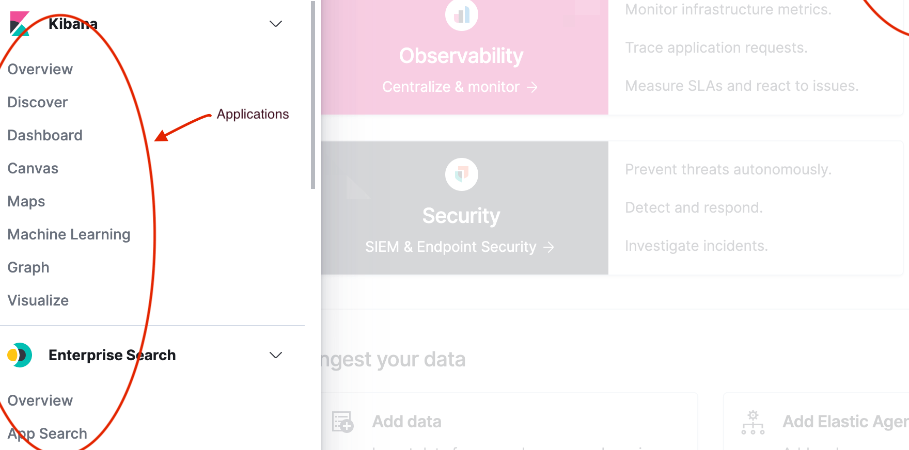
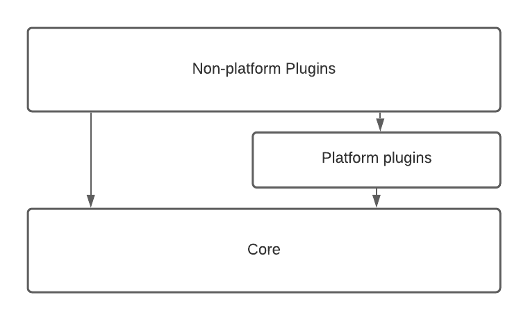

Kibana is a platform for building applications that explore, visualize, and act upon data in Elasticsearch. Almost everything you see in the Kibana UI is built inside plugins.

## Architecture overview

Kibana consists of three main components:

**Plugins** - Provide the majority of functionality. All applications and UIs are defined here.

**Core** - Provides runtime and fundamental services.

**@kbn packages** - Static utilities importable anywhere in Kibana.


## Plugins

Plugins extend and customize Kibana by using [extension points](#extension-points) provided by platform services. Plugins can register applications, services, or both.

### Applications

Applications are top-level pages in Kibana (Dashboard, Canvas, Maps, etc.):



**Register an application:**
```ts
// In plugin setup
core.application.register({
  id: 'myApp',
  title: 'My Application',
  mount: async ({ element }) => {
    // Mount your React app
    return () => { /* cleanup */ };
  }
});
```

### Public plugin API

A plugin's public API includes:
- Exports from **setup/start lifecycle methods**
- Exports from scope-specific `index.ts` files:
  - `common/index.ts`
  - `public/index.ts` 
  - `server/index.ts`

## Lifecycle methods

Kibana has three lifecycles executed sequentially:

| Lifecycle | Purpose | Server | Browser |
|-----------|---------|--------|---------|
| **setup** | Registration work | Configure APIs, register saved objects | Register apps, UI extensions |
| **start** | Runtime logic | Handle requests, query Elasticsearch | User interactions, DOM updates |
| **stop** | Cleanup | Dispose handles | Save session data |

**Example plugin structure:**
```ts
class MyPlugin implements Plugin {
  setup(core: CoreSetup, deps: SetupDeps) {
    // Register everything during setup
    core.application.register(/* app config */);
    return { myService: this.myService };
  }
  
  start(core: CoreStart, deps: StartDeps) {
    // Runtime initialization
    this.myService.initialize();
    return {};
  }
  
  stop() {
    // Cleanup resources
  }
}
```

## Extension points

Extension points are functions that plugins use to customize Kibana:

**Core extension points:**
- `core.application.register` - Add applications
- `core.notifications.toasts.addSuccess` - Show notifications  
- `core.overlays.showModal` - Display modals
- `core.savedObjects.registerType` - Register data types

**Plugin extension points:**
- `embeddables.registerEmbeddableFactory` - Add dashboard panels
- `uiActions.registerAction` - Add context menu actions

## Plugin vs Package decision

> [!NOTE]
> **Internal guidance:** Deciding between plugins and packages depends on your needs.

**Use plugins for:**
- Stateful code requiring lifecycle methods
- Applications and UI components
- Services needing dependency injection

**Use packages for:**
- Pure utility functions
- Shared constants/types
- Performance-critical code (async imports)

**Plugin benefits:**
- ✅ Proper lifecycle management
- ✅ Dependency injection
- ✅ Domain organization

**Package benefits:**  
- ✅ Reduced bundle size (when async imported)
- ✅ Consumer controls import timing
- ❌ Development overhead (`yarn kbn watch`)
- ❌ Slower rebuild times

**Questions? Contact `#kibana-operations` for guidance.**

## Platform services

**Core services** (stable, fundamental):
- HTTP client/server
- Saved Objects
- UI settings
- Notifications

**Platform plugins** (core-like, more volatile APIs):
- Data plugin (search, index patterns)
- Embeddables
- UI Actions

**Feature plugins** (specific use cases):
- Dashboard
- Discover  
- Maps



## Next steps

Ready to build a plugin? Start with the Hello World tutorial in the getting started section.