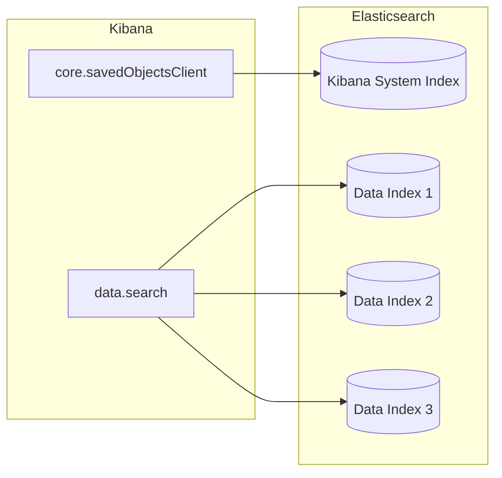

# Saved Objects

"Saved Objects" are developer-defined entities stored in the Kibana system index (`.kibana`), allowing plugins to use Elasticsearch as a primary database. You can think of the Saved Objects system as an Object Document Mapper for Elasticsearch. Examples include dashboards, visualizations, data views, advanced settings, cases, and ML jobs. A subset of Saved Object types are exposed to the user in the [Saved Object management UI](https://www.elastic.co/guide/en/kibana/current/managing-saved-objects.html).

Developers create and manage their Saved Objects using the `SavedObjectClient`, while other data in Elasticsearch should be accessed via the data plugin's search services.


## Creating Saved Objects
Saved Object type definitions should be defined in their own `my_plugin/server/saved_objects` directory. The folder should contain a file per type, named after the snake_case name of the type, and an `index.ts` file exporting all the types.

**path/to/my_plugin/server/saved_objects/index.ts**
```ts
export { dashboardVisualization } from './dashboard_visualization';
export { dashboard } from './dashboard';
```

**path/to/my_plugin/server/plugin.ts**
```ts
import { dashboard, dashboardVisualization } from './saved_objects';

export class MyPlugin implements Plugin {
  setup({ savedObjects }) {
    savedObjects.registerType(dashboard);
    savedObjects.registerType(dashboardVisualization);
  }
}
```

**path/to/my_plugin/server/saved_objects/dashboard_visualization.ts**
```ts
import { SavedObjectsType } from 'src/core/server';

export const dashboardVisualization: SavedObjectsType = {
  name: 'dashboard_visualization', [1]
  hidden: false, [2]
  hiddenFromHttpApis: true, [3]
  namespaceType: 'multiple-isolated', [4]
  mappings: { [5]
    dynamic: false,
    properties: {
      description: {
        type: 'text',
      },
      hits: {
        type: 'integer',
      },
    },
  },
  modelVersions: {
    1: dashboardVisualizationModelVersionV1,
    2: dashboardVisualizationModelVersionV2,
  },
};
```

[1] Since the name of a Saved Object type forms part of the URL path for the public Saved Objects HTTP API, these should follow our API URL path convention and always be written in snake case.

[2] This field determines whether repositories have access to the type by default. Hidden types will not be automatically exposed via the Saved Objects Client APIs. Hidden types must be listed in `SavedObjectsClientProviderOptions[includedHiddenTypes]` to be accessible by the client.

[3] Enabling `hiddenFromHttpApis` will ensure the object type is still searchable via the `SavedObjectsClient` plugin contract, however it will be hidden from the global Saved Object HTTP APIs. This is recommended for new object types; moving forward each type is expected to provide its own HTTP APIs.

[4] This field determines "space behavior" -- whether these objects can exist in one space, multiple spaces, or all spaces.

[5] Saved Object `mappings` define the Elasticsearch field mappings for searching against relevant fields.

## Concepts

### Mappings
Because multiple Saved Object types can share the same index, mappings defined by a type will be nested under a top-level field that matches the type name.

For example, the mappings defined by the `dashboard_visualization` Saved Object type:

```ts
export const dashboardVisualization: SavedObjectsType = {
  name: 'dashboard_visualization',
  mappings: {
    properties: {
      dynamic: false,
      description: {
        type: 'text',
      },
      hits: {
        type: 'integer',
      },
    },
  },
  ...
};
```

Will result in the following mappings being applied to the `.kibana` index:

```ts
{
  "mappings": {
    "dynamic": "strict",
    "properties": {
      ...
      "dashboard_vizualization": {
        "dynamic": false,
        "properties": {
          "description": {
            "type": "text",
          },
          "hits": {
            "type": "integer",
          },
        },
      }
    }
  }
}
```

#### Tips for working with mappings
- Do not use field mappings like you would use data types for the columns of a SQL database. Instead, field mappings are analogous to a SQL index. Only specify field mappings for the fields you wish to search on or query.
- By specifying `dynamic: false` in any level of your mappings, Elasticsearch will accept and store any other fields even if they are not specified in your mappings.
- Elasticsearch has a default limit of 1000 fields per index, so carefully consider which fields you add to the mappings. Saved Object types should never use `dynamic: true` as this can cause an arbitrary amount of fields to be added.
- Never use `enabled: false` or `index: false` in your mappings. Elasticsearch does not support toggling these mapping options, so if your plugin ever needs to query the data, you will not be able to do so. Instead, use `dynamic: false` which provides the same flexibility while maintaining the future ability to query fields if necessary:

```ts
export const dashboardVisualization: SavedObjectsType = {
  name: 'dashboard_visualization',
  mappings: {
    properties: {
      metadata: {
        enabled: false,  // ❌ Don't do this
        properties: {
          created_by: { type: 'keyword' }
        }
      },
      description: {
        index: false,    // ❌ Don't do this
        type: 'text'
      }
    }
  },
  ...
};
```

```ts
export const dashboardVisualization: SavedObjectsType = {
  name: 'dashboard_visualization',
  mappings: {
    properties: {
      dynamic: false,  // ✅ Do this instead
      metadata: {
        // dynamic: false gets inherited from above
        properties: {
          // `created_by` can now be stored but won't be queryable
        }
      },
      // `description` can now be stored but won't be queryable
    }
  },
  ...
};
```

### References
Parent objects can explicitly list references to child objects to be included during import/export and space-sharing. Declare a reference by adding an id, type, and name to the `references` array:

```ts
router.get(
  { path: '/some-path', validate: false },
  async (context, req, res) => {
    const object = await context.core.savedObjects.client.create(
      'dashboard',
      {
        title: 'my dashboard',
        panels: [
          { visualization: 'vis1' }, [1]
        ],
        indexPattern: 'indexPattern1'
      },
      { references: [
          { id: '...', type: 'visualization', name: 'vis1' },
          { id: '...', type: 'index_pattern', name: 'indexPattern1' },
        ]
      }
    )
    ...
  }
);
```
[1] Note how `dashboard.panels[0].visualization` stores the `name` property of the reference (not the `id` directly) to be able to uniquely identify this reference. This guarantees that the `id` the reference points to always remains up to date, because the system knows where to locate it.

Sometimes Saved Objects end up persisted inside other Saved Objects. Internally, we call these Saved Objects “by value”, as opposed to "by reference". If an end user creates a visualization and adds it to a dashboard without saving it to the visualization library, the data ends up nested inside the dashboard Saved Object by value.

### Security
Unlike regular data indices which use the Elasticsearch security model, Saved Objects are secured using Kibana's privileges model.

This means they _cannot be searched directly by users_, such as in Discover or Dashboards. If you hear someone mention "Saved Objects as Data," they are referring to this limitation. To ensure Kibana's RBAC is enforced, all search operations must be run through the core Saved Objects service. Do **not** query one of the `.kibana` indices directly or you risk bypassing our security model.

There is also the concept of Feature Controls, which provide another level of isolation and shareability for Saved Objects. Admins can give users and roles read, write, or none permissions for each Saved Object type.

We do not yet support granting users access to specific Saved Objects via Object-Level Security (OLS), so Saved Objects cannot be used out of the box for creating private objects which are scoped to an individual user.

### Space awareness
Saved Objects are "space aware". They exist in the space they were created in, and any spaces they have been shared with.

In Kibana 7.12+, Saved Objects can be shared to multiple spaces. How objects are able to be shared is determined by their `namespaceType`:
- `multiple-isolated`: Objects exist in exactly one space
- `multiple`: Objects exist in one _or more_ spaces
- `agnostic`: Objects exist in all spaces

A `namespaceType` is specified when registering a new object type. If you have an **existing** "legacy" object type that uses `namespaceType: 'single'`, it is not shareable and must be updated based on the instructions in our [legacy developer guide for Sharing Saved Objects](https://www.elastic.co/guide/en/kibana/master/sharing-saved-objects.html).

### Migrations
Write model versions to make additive-only changes to the shape of an object to ensure it is automatically migrated. Migrations apply when:
- Upgrading Kibana
- Importing exports via the Saved Objects Management UI
- Creating objects via the HTTP API

By maintaining model versions as a separate concept, we can ensure that Saved Object type versions are decoupled from stack versioning, and remain independent between types.

#### Defining model versions

Model versions are integer-based version definitions, beginning with 1 and incrementing by one for each new version. 

Model versions are bound to a given [savedObject type](https://github.com/elastic/kibana/blob/9b330e493216e8dde3166451e4714966f63f5ab7/packages/core/saved-objects/core-saved-objects-server/src/saved_objects_type.ts#L22-L27). When registering a type, a [modelVersions](https://github.com/elastic/kibana/blob/9a6a2ccdff619f827b31c40dd9ed30cb27203da7/packages/core/saved-objects/core-saved-objects-server/src/saved_objects_type.ts#L138-L177) property is available. This attribute is a map of version numbers to [SavedObjectsModelVersion](https://github.com/elastic/kibana/blob/9a6a2ccdff619f827b31c40dd9ed30cb27203da7/packages/core/saved-objects/core-saved-objects-server/src/model_version/model_version.ts#L12-L20) which is the top-level container to define model versions.

```ts
import { schema } from '@kbn/config-schema';
import { SavedObjectsType } from 'src/core/server';

const schemaV1 = schema.object({ title: schema.string({ maxLength: 50, minLength: 1 }) });
const schemaV2 = schemaV1.extends({
  description: schema.maybe(schema.string({ maxLength: 200, minLength: 1 })),
});

export const dashboardVisualization: SavedObjectsType = {
  name: 'dashboard_visualization',
  ...
  mappings: {
    dynamic: false,
    properties: {
      title: { type: 'text' }, // This mapping was added before model versions
      description: { type: 'text' }, // mappings introduced in v2
    },
  },
  modelVersions: {
    1: {
      // Sometimes no changes are needed in the initial version, but you may have
      // pre-existing mappings or data that must be transformed in some way
      // In this case, title already has mappings defined.
      changes: [],
      schemas: {
        // The forward compatible schema should allow any future versions of
        // this SO to be converted to this version, since we are using
        // @kbn/config-schema we opt-in to unknowns to allow the schema to
        // successfully "downgrade" future SOs to this version.
        forwardCompatibility: schemaV1.extends({}, { unknowns: 'ignore' }),
        create: schemaV1,
      },
    },
    2: {
      changes: [
          // In this second version we added new mappings for the description field.
          {
            type: 'mappings_addition',
            addedMappings: {
              description: { type: 'keyword' },
            },
          },
          {
            type: 'data_backfill',
            backfillFn: (doc) => {
              return {
                attributes: {
                  description: 'my default description',
                },
              };
            },
          },
      ],
      schemas: {
        forwardCompatibility: schemaV2.extends({}, { unknowns: 'ignore' }),
        create: schemaV2,
      },
    },
  },
};
```

#### Serverless considerations

On Serverless, Kibana cannot have any downtime &mdash; even during data migrations. In order to achieve downtimeless rolling upgrades, it is important that:
- Required fields are never introduced without proper migration
- New model versions are always backwards compatible with the most recent previous (n-1) version
- Breaking changes are rolled out over the course of multiple model versions
    - For example, to create a new required field, you should: add optional field -> provide backfill -> release -> mark as required -> release again

Note that data migrations are only run **after a new version has finished rolling out**.

#### Testing model versions
Bugs in model version transitions cause downtime for our users and therefore have a very high impact. Follow the [testing model versions](https://docs.elastic.dev/kibana-dev-docs/tutorials/testing-plugins#saved-objects-model-versions) section in the plugin testing guide to ensure you have adequate coverage.
