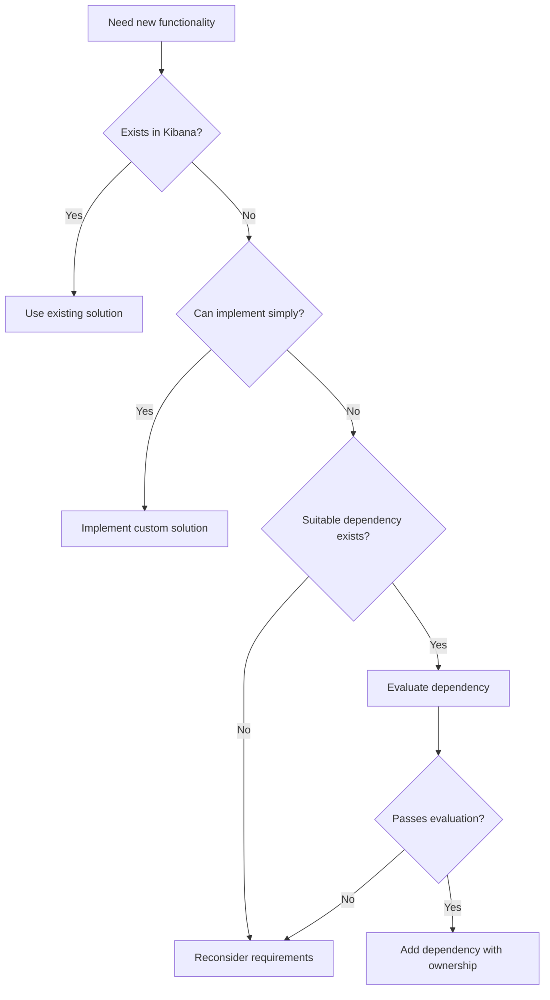

Comprehensive guide to managing third-party dependencies in Kibana, including evaluation criteria, security requirements, and ownership responsibilities.

## Philosophy and Responsibility

### Shared Responsibility Model

> [!IMPORTANT]
> **Treat third-party code as if it was your own.** We share responsibility for the efficacy, performance, and security of both integrated and developed code.

Third-party dependencies enable leveraging the broader development community without reinventing functionality. However, **using external code does not absolve us of responsibility.**

**Key Principles:**
- Kibana = our code + all external dependencies
- User experience deficiencies matter regardless of root cause
- Dependencies carry cognitive burden, maintenance overhead, and risk
- Long-term harm often outweighs short-term benefits for non-specialized functionality

**Strategic Approach:**
- **Default bias:** Against adding new dependencies
- **Critical evaluation:** Question necessity and alternatives
- **Regular re-evaluation:** Assess continued value of existing dependencies
- **Ownership commitment:** Maintain dependencies throughout their lifecycle

## Dependency Evaluation Framework

### Pre-requisites

**Required Reading:**
- [Development principles](dev_principles.mdx) - "Be wary of dependencies" and "Prefer one way to do things"
- Understand Kibana's complexity minimization goals

### Evaluation Criteria

#### 1. Necessity and Alternatives

**Questions to Ask:**
```typescript
// ❌ Bad - adding dependency without evaluation
import heavyLibrary from 'heavy-library';

// ✅ Good - evaluate alternatives first
// Option 1: Existing Kibana utilities?
import { existingUtil } from '@kbn/utility-package';

// Option 2: Simple custom implementation?
const simpleImplementation = (input: string) => {
  // 10 lines vs 1MB dependency
};

// Option 3: Platform-native solutions?
const nativeAPI = fetch(url); // vs axios dependency
```

**Decision Matrix:**
| Criteria | Weight | Questions |
|----------|--------|-----------|
| **Duplication** | High | Does similar functionality already exist in Kibana? |
| **Complexity** | High | Can we implement this in <100 lines of code? |
| **Maintenance** | High | Is the library actively maintained with recent updates? |
| **Bundle Size** | Medium | What's the impact on client-side performance? |
| **License** | High | Is the license compatible (BSD, MIT, Apache 2.0)? |
| **Native Support** | Medium | Will this require pre-built native modules? |

#### 2. Maintenance and Health Assessment

**Maintenance Indicators:**
```bash
# Check repository health
gh repo view library-name --json updatedAt,stargazerCount,forkCount

# Recent activity (last 6 months)
gh pr list --repo owner/library-name --state merged --limit 20

# Issue response time
gh issue list --repo owner/library-name --state closed --limit 10
```

**Red Flags:**
- No updates in >1 year
- Open security vulnerabilities without response
- Maintainer abandonment warnings
- No CI/CD pipeline or test coverage

#### 3. Bundle Size Impact Analysis

**Client-Side Impact Assessment:**
```bash
# Analyze bundle impact
npx webpack-bundle-analyzer

# Check if async loadable
import(/* webpackChunkName: "optional-feature" */ 'heavy-library');

# Size thresholds (uncompressed)
# Small: < 10KB
# Medium: 10KB - 100KB  
# Large: 100KB - 1MB
# Excessive: > 1MB (requires strong justification)
```

**Optimization Strategies:**
```typescript
// ✅ Tree-shakeable imports
import { specificFunction } from 'library/specific-module';

// ✅ Async loading for non-critical features
const loadHeavyFeature = async () => {
  const { HeavyComponent } = await import('./heavy-feature');
  return HeavyComponent;
};

// ❌ Importing entire library
import * as library from 'massive-library';
```

## Security Assessment Process

### 1. Snyk Health Score Validation

**Minimum Requirements:**
- **Health Score:** ≥70/100 (mandatory)
- **Score Components:** Maintenance, security, quality, popularity
- **Below 70:** Requires exceptional business justification

**Assessment Tools:**
```bash
# Check Snyk Advisor
# https://snyk.io/advisor/npm-package/<package-name>

# Example acceptable scores:
# react: 95/100 ✅
# lodash: 88/100 ✅
# unmaintained-lib: 45/100 ❌ (requires justification)
```

### 2. Vulnerability Assessment Protocol

**CVSS Score Response Matrix:**

| Severity | CVSS Range | Action Required |
|----------|------------|-----------------|
| **Critical** | 9.0 - 10.0 | Reject dependency or document false positive |
| **High** | 7.0 - 8.9 | Reject dependency or document false positive |
| **Medium** | 4.0 - 6.9 | Exception possible if exploit impossible |
| **Low** | 0.1 - 3.9 | Exception possible if exploit impossible |

**False Positive Documentation:**
```markdown
## Vulnerability Assessment: CVE-2023-XXXX

### CVSS Score: 7.5 (High)
### Vulnerability Description:
XSS vulnerability in library version 1.2.3

### False Positive Justification:
1. **Usage Context:** We only use server-side functionality
2. **Input Sanitization:** All inputs are pre-sanitized by our validation layer
3. **Exploit Vector:** Requires user-controlled HTML rendering (not applicable)
4. **Mitigation:** CSP headers prevent XSS execution

### Exception Request:** 
Filed VULN-2024-001 with 30-day review period
```

### 3. Exception Request Process

**Required Documentation:**
```markdown
## Vulnerability Exception Request

| Field | Value |
|-------|-------|
| **Dependency** | `library-name@1.2.3` |
| **CVE ID** | `CVE-2023-XXXX` |
| **CVSS Score** | `7.5 (High)` |
| **Exception Duration** | `30 days` |
| **Business Justification** | Critical feature delivery with no alternatives |
| **Mitigation Strategy** | Input validation + CSP + sandboxing |
| **Upgrade Path** | Version 1.3.0 expected in 3 weeks |

### Security Team Approval: [ ] PENDING
```

## Implementation Guidelines

### Adding Dependencies

**Step-by-Step Process:**

1. **Search Existing Dependencies:**
   ```bash
   # Check if functionality exists
   grep -r "similar-function" src/
   yarn list | grep related-package
   ```

2. **Create Evaluation Document:**
   ```markdown
   ## Dependency Evaluation: `new-library@1.0.0`

   ### Justification
   - **Purpose:** Implements complex datetime parsing for user input
   - **Alternatives Considered:**
     - Native Date API: Insufficient timezone support
     - Existing @kbn/datetime: Missing required formatting
     - Custom implementation: 500+ lines vs 10KB dependency
   
   ### Assessment Results
   - **Snyk Health Score:** 92/100 ✅
   - **Bundle Size:** 12KB gzipped ✅
   - **Vulnerabilities:** None ✅
   - **License:** MIT ✅
   - **Maintenance:** Active (last update 2 weeks ago) ✅
   ```

3. **Add Package:**
   ```bash
   yarn add new-library
   # or
   yarn add --dev new-library  # development only
   ```

4. **Update Renovate Configuration:**
   ```json
   {
     "groupName": "datetime-parsing",
     "matchDepNames": ["new-library", "@types/new-library"],
     "reviewers": ["team:app-arch"],
     "labels": [
       "Team:AppArch", 
       "release_note:skip",
       "effort:low",
       "risk:medium"
     ],
     "minimumReleaseAge": "7 days",
     "enabled": true
   }
   ```

### Using Existing Dependencies

**Consultation Process:**
```typescript
// ✅ Before using existing dependency
// 1. Contact owning team via GitHub
// 2. Review usage guidelines
// 3. Understand update/breaking change policies

// Example: Using @kbn/utility
import { DataFormatter } from '@kbn/utility';

// Check with @elastic/kibana-core before:
// - Extending public APIs
// - Adding new use cases
// - Performance-critical usage
```

## Ownership and Maintenance

### Renovate Configuration

**Complete Configuration Example:**
```json
{
  "groupName": "data-processing-libs",
  "description": "Libraries for data transformation and validation",
  "matchDepNames": [
    "joi",
    "@types/joi",
    "json-schema",
    "@types/json-schema"
  ],
  "reviewers": [
    "team:app-arch",
    "team:kibana-core"
  ],
  "matchBaseBranches": ["main"],
  "labels": [
    "Team:AppArch",
    "release_note:skip",
    "backport:all-open",
    "effort:medium",
    "risk:medium",
    "area:server"
  ],
  "minimumReleaseAge": "14 days",
  "prBodyTemplate": "Updates data processing dependencies. Please verify compatibility with existing validation schemas.",
  "enabled": true,
  "schedule": ["after 10pm every weekday", "before 5am every weekday"],
  "timezone": "America/New_York"
}
```

**Configuration Fields Explained:**

| Field | Purpose | Options |
|-------|---------|---------|
| `groupName` | Logical grouping for related dependencies | Descriptive string |
| `matchDepNames` | Array of package names to include | Package names + @types |
| `reviewers` | GitHub teams for review assignment | `team:team-name` format |
| `labels` | PR labels for categorization | Team, effort, risk levels |
| `minimumReleaseAge` | Safety buffer for new releases | Days (7-30 recommended) |
| `schedule` | Update timing control | Cron-like expressions |

### Ownership Responsibilities

**Team Obligations:**
```typescript
// Regular maintenance checklist
interface DependencyMaintenance {
  // Monthly reviews
  securityVulnerabilities: 'scan and assess';
  performanceImpact: 'monitor bundle size';
  usagePatterns: 'review implementation patterns';
  
  // Quarterly assessments  
  alternativeEvaluation: 'research newer solutions';
  costBenefitAnalysis: 'assess continued value';
  migrationPlanning: 'plan updates or replacements';
  
  // As needed
  breakingChangeHandling: 'update consuming code';
  securityPatchApplication: 'priority updates';
  documentationUpdates: 'usage guidelines';
}
```

**Ownership Tools and Scripts:**

```bash
# Validate ownership configuration
node scripts/dependency_ownership.js --failIfUnowned

# Check specific dependency ownership
node scripts/dependency_ownership.js --dependency lodash

# List all dependencies for a team
node scripts/dependency_ownership.js --owner team:app-arch

# Generate ownership report
node scripts/dependency_ownership.js --outputPath ownership-report.json

# Find unowned dependencies
node scripts/dependency_ownership.js --missingOwner
```

## Advanced Dependency Management

### License Compliance

**Approved Licenses:**
- ✅ **MIT:** Maximum flexibility
- ✅ **BSD (2-clause, 3-clause):** Patent protection
- ✅ **Apache 2.0:** Patent grants, trademark protection
- ✅ **ISC:** Simplified MIT alternative
- ⚠️ **LGPL:** Requires legal review
- ❌ **GPL:** Incompatible with proprietary distribution
- ❌ **AGPL:** Network copyleft restrictions

**License Checking:**
```bash
# Install license checker
yarn add --dev license-checker

# Generate license report
npx license-checker --summary --out licenses.txt

# Check for problematic licenses
npx license-checker --excludePrivatePackages --onlyAllow 'MIT;BSD;Apache-2.0;ISC'
```

### Native Module Considerations

**Restrictions:**
- **Production:** Native modules not supported in `dependencies`
- **Development:** Native modules allowed in `devDependencies`
- **Alternatives:** Prefer pure JavaScript implementations

**Example Scenarios:**
```typescript
// ❌ Native module in production
// "dependencies": { "node-sass": "^4.0.0" }

// ✅ Pure JS alternative  
// "dependencies": { "sass": "^1.0.0" }

// ✅ Native module for development
// "devDependencies": { "node-gyp": "^8.0.0" }
```

### Performance Monitoring

**Bundle Analysis:**
```bash
# Analyze production bundle
NODE_ENV=production yarn webpack-bundle-analyzer

# Track dependency size over time
echo "$(date): $(du -sh node_modules)" >> dependency-size.log

# Identify largest dependencies
npx npkill --sort size
```

**Runtime Performance:**
```typescript
// Monitor dependency initialization cost
console.time('dependency-load');
const heavyLibrary = require('heavy-library');
console.timeEnd('dependency-load');

// Async loading for better performance
const loadOptionalFeature = async () => {
  const start = performance.now();
  const lib = await import('optional-library');
  console.log(`Loaded in ${performance.now() - start}ms`);
  return lib;
};
```

## Migration and Deprecation

### Dependency Replacement Strategy

**Replacement Process:**
```typescript
// Phase 1: Add new dependency alongside old
import oldLibrary from 'old-library';
import newLibrary from 'new-library';

// Phase 2: Feature flag controlled migration
const useNewLibrary = getFeatureFlag('use-new-library');
const processor = useNewLibrary ? newLibrary : oldLibrary;

// Phase 3: Complete migration
import newLibrary from 'new-library';
// Remove old-library from package.json
```

**Deprecation Timeline:**
1. **Week 1-2:** Add new dependency, implement feature flag
2. **Week 3-4:** Internal testing with new dependency
3. **Week 5-6:** Enable for subset of users/environments
4. **Week 7-8:** Full rollout, monitor for issues
5. **Week 9+:** Remove old dependency after confidence period

### Risk Assessment Framework

**Risk Categories:**

| Risk Level | Criteria | Example |
|------------|----------|---------|
| **Low** | Well-established, minimal API surface | `lodash.get`, `uuid` |
| **Medium** | Active maintenance, moderate complexity | `react-router`, `axios` |
| **High** | Complex functionality, fewer alternatives | `monaco-editor`, `d3` |
| **Critical** | Core infrastructure, difficult to replace | `webpack`, `typescript` |

**Mitigation Strategies:**
```typescript
// Low risk: Direct usage
import { debounce } from 'lodash';

// Medium risk: Abstraction layer
class HttpClient {
  private client = axios.create();
  
  async get(url: string) {
    // Abstraction enables easy replacement
    return this.client.get(url);
  }
}

// High risk: Vendor abstraction
interface CodeEditor {
  setValue(content: string): void;
  getValue(): string;
}

class MonacoWrapper implements CodeEditor {
  // Vendor-specific implementation hidden
}
```

## Teams and Contact Information

### Consultation Teams

**For dependency approval and guidance:**

| Team | Focus Area | Contact |
|------|------------|---------|
| **@elastic/kibana-tech-leads** | Architecture decisions | GitHub mention |
| **@elastic/kibana-core** | Platform integration | GitHub mention |
| **@elastic/kibana-operations** | Build and deployment | GitHub mention |
| **@elastic/kibana-security** | Security assessment | GitHub mention |

### Internal Resources

> [!NOTE]
> **For Elastic employees:**
> - [Permitted Open Source Licenses](https://github.com/elastic/open-source/blob/main/elastic-product-policy.md#permitted-licenses-list)
> - Vulnerability Exception Policy: Internal security documentation
> - Slack channels: `#kibana-dependencies`, `#security-questions`

## Summary and Best Practices

### Decision Flowchart



### Key Takeaways

1. **Default to no dependencies** - Strong justification required
2. **Ownership is commitment** - Plan for long-term maintenance
3. **Security is non-negotiable** - Follow assessment protocols
4. **Performance matters** - Consider bundle size and runtime impact
5. **Abstractions enable migration** - Plan for future replacement
6. **Documentation prevents confusion** - Clear usage guidelines
7. **Regular evaluation** - Dependencies should earn their place

By following these guidelines, we maintain a secure, performant, and maintainable dependency ecosystem that serves Kibana's long-term success.