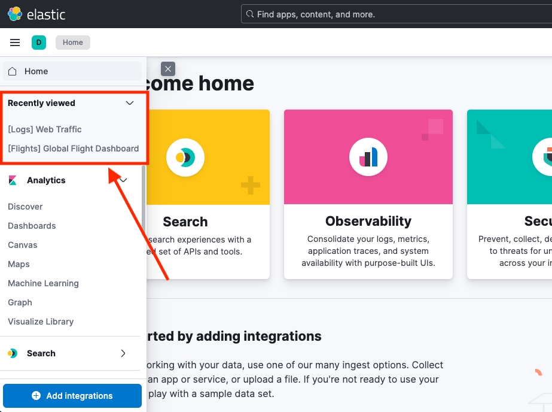

## Introduction

The <DocLink id="kibKbnCoreChromeBrowserPluginApi" section="def-public.ChromeRecentlyAccessed" text="ChromeRecentlyAccessed" /> service allows applications to register recently visited objects. These items are displayed in the "Recently Viewed" section of a side navigation menu, providing users with quick access to their previously visited resources. This service includes methods for adding, retrieving, and subscribing to the recently accessed history.



## Guidelines

The <DocLink id="kibKbnCoreChromeBrowserPluginApi" section="def-public.ChromeRecentlyAccessed" text="ChromeRecentlyAccessed" /> service should be used thoughtfully to provide users with easy access to key resources they've interacted with. Unlike browser history, this feature is for important items that users may want to revisit.

### DOs

- Register important resources that users may want to revisit. Like a dashboard, a saved search, or another specific object.
- Update the link when the state of the current resource changes. For example, if a user changes the time range while on a dashboard, update the recently viewed link to reflect the latest viewed state where possible. See below for instructions on how to update the link when state changes.

### DON'Ts

- Don't register every page view.
- Don't register temporary or transient states as individual items.
- Prevent overloading. Keep the list focused on high-value resources.
- Don't add a recently viewed object without first speaking to relevant Product Managers.

## Usage

To register an item with the `ChromeRecentlyAccessed` service, provide a unique `id`, a `label`, and a `link`. The `id` is used to identify and deduplicate the item, the `label` is displayed in the "Recently Viewed" list and the `link` is used to navigate to the item when selected.

```ts
const link = '/app/map/1234';
const label = 'Map 1234';
const id = 'map-1234';

coreStart.chrome.recentlyAccessed.add(link, label, id);
```

To update the link when state changes, add another item with the same `id`. This will replace the existing item in the "Recently Viewed" list.

```ts
const link = '/app/map/1234';
const label = 'Map 1234';

coreStart.chrome.recentlyAccessed.add(`/app/map/1234`, label, id);

// User changes the time range and we want to update the link in the "Recently Viewed" list
coreStart.chrome.recentlyAccessed.add(
  `/app/map/1234?timeRangeFrom=now-30m&timeRangeTo=now`,
  label,
  id
);
```

## Implementation details

The <DocLink id="kibKbnCoreChromeBrowserPluginApi" section="def-public.ChromeRecentlyAccessed" text="ChromeRecentlyAccessed" /> services is based on <DocLink id="kibKbnRecentlyAccessedPluginApi" text="@kbn/recently-accessed"/> package. This package provides a `RecentlyAccessedService` that uses browser local storage to manage records of recently accessed objects. Internally it implements the queue with a maximum length of 20 items. When the queue is full, the oldest item is removed.
Applications can create their own instance of `RecentlyAccessedService` to manage their own list of recently accessed items scoped to their application.

- <DocLink id="kibKbnCoreChromeBrowserPluginApi" section="def-public.ChromeRecentlyAccessed" text="ChromeRecentlyAccessed" /> is a service available via `coreStart.chrome.recentlyAccessed` and should be used to add items to chrome's sidenav.
- <DocLink id="kibKbnRecentlyAccessedPluginApi" text="@kbn/recently-accessed"/> is package that `ChromeRecentlyAccessed` is using internally and the package can be used to create your own instance and manage your own list of recently accessed items that is independent for chrome's sidenav.