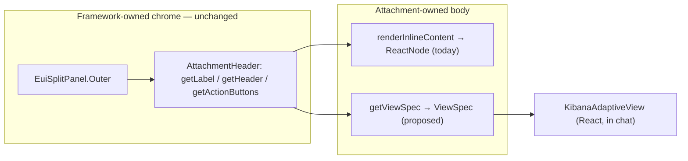

# Proposal: an Adaptive UI body seam for existing Agent Builder attachments

**Status:** proposal · **Owner:** `@elastic/appex-ai-infra` (Adaptive UI) · **Reviewers:** `@elastic/security-generative-ai` / Agent Builder core

## Summary

Add one optional resolver — `getViewSpec(attachment)` — to the browser attachment contract (`AttachmentUIDefinition`). When a type supplies it, Agent Builder renders the attachment **body** by mounting the returned `ViewSpec` through Adaptive UI, while the type keeps its existing header, badges, and action buttons. This is the "alternative render" path for the ~33 already-registered attachment types: it needs no new attachment registration, no allow-list entry, and no change to any type's server contract — only an opt-in on the browser UI definition.

It is the counterpart to the two paths this branch already ships:

- `platform.adaptiveUi.view` attachment — a **new** type whose whole body is a `ViewSpec`. Production-shaped, but only for content authored as Adaptive UI from the start.
- `view` renderer (`<render type="view">`) — agent-authored views inside a markdown response, no chrome.

Neither lets an *existing* type — `cases`, `security.rule`, `observability.alert` — swap its bespoke React body for a portable `ViewSpec` without being rewritten as a new attachment. The seam does exactly that, which is what decides whether this approach scales past the three hand-built specs in this branch.

## Where the seam goes

Agent Builder already splits chrome from body the same way upstream Adaptive UI splits `PackChrome` (host-supplied frame) from `renderBody` (pack-supplied body).

In [`inline_attachment_with_actions.tsx`](../../x-pack/platform/plugins/shared/agent_builder/public/application/components/conversations/conversation_rounds/round_response/attachments/inline_attachment_with_actions.tsx) the framework owns an `EuiSplitPanel.Outer` plus an `AttachmentHeader` (icon, title, badges, right-aligned action buttons); the attachment owns only what `renderInlineContent` returns into the `EuiSplitPanel.Inner`. The relevant members of [`AttachmentUIDefinition`](../../x-pack/platform/packages/shared/agent-builder/agent-builder-browser/attachments/contract.ts) are:

- chrome: `getLabel`, `getHeader` (`icon` / `subtitle` / `badges`), `getActionButtons`, `getMaxWidth`
- body: `renderInlineContent` (inline) and `renderCanvasContent` (flyout)

The seam adds a body producer that sits *beside* `renderInlineContent`, so chrome is untouched:



## Contract change

One optional method, additive and backward compatible:

```ts
// agent-builder-browser/attachments/contract.ts
export interface AttachmentUIDefinition<TAttachment extends UnknownAttachment = UnknownAttachment> {
  // ...existing members unchanged...

  /**
   * Optional Adaptive UI body. When provided, the framework renders the
   * attachment body by mounting this `ViewSpec` through Adaptive UI instead of
   * calling `renderInlineContent` / `renderCanvasContent`; the type keeps its
   * `getHeader`, `getActionButtons`, and `getLabel` chrome. Return `undefined`
   * to fall back to the React renderers for a given attachment.
   */
  getViewSpec?: (attachment: TAttachment) => ViewSpec | undefined;
}
```

Precedence at the render site is deterministic and opt-in — `renderInlineContent` stays the default, so nothing changes for a type that does not implement `getViewSpec`:

```tsx
// inline_attachment_with_actions.tsx (sketch)
const viewSpec = uiDefinition.getViewSpec?.(attachment);
const isHeaderOnly = !viewSpec && !uiDefinition.renderInlineContent;
// ...inside EuiSplitPanel.Inner, within the existing error boundary...
{viewSpec
  ? <AttachmentAdaptiveBody spec={viewSpec} />
  : uiDefinition.renderInlineContent?.(props, { registerActionButtons })}
```

`renderCanvasContent` gets the mirror treatment so the flyout is portable too.

## What renders the body

`AttachmentAdaptiveBody` is the one new shared piece: it wraps [`KibanaAdaptiveView`](../../src/platform/packages/shared/adaptive-ui/react.ts) from `@kbn/adaptive-ui/react`. That component already owns base-path rewriting of internal `href`s and mapping `EuiThemeColorMode` to the Adaptive UI render theme; [`AdaptiveViewContainer`](../../x-pack/platform/plugins/shared/adaptive_ui/public/renderers/view_renderer.tsx) is the Kibana layout box around it.

Dependency direction is the one design decision worth flagging, with two viable options:

- **A — shared component (recommended).** Lift `AttachmentAdaptiveBody` (today's `AdaptiveViewContainer`) into a small shared package, e.g. `@kbn/agent-builder-adaptive-ui`, that both `agent_builder` and the `adaptive_ui` plugin import. Keeps `agent_builder` core free of a plugin dependency; adds one `kbn_reference` on a shared package it may already reach transitively via `@kbn/adaptive-ui`.
- **B — start-contract injection.** The `adaptive_ui` plugin registers its body component on `agentBuilder` at start; core calls the registered renderer. Avoids a static import but inverts the lifecycle (chrome must degrade gracefully before the plugin registers) and adds runtime indirection for a purely presentational component.

A is simpler and matches how `KibanaAdaptiveView` is already a shared-package export; B is only worth it if core must stay ignorant of Adaptive UI entirely.

## The header quirk

`AttachmentHeader` returns `null` when a type has no action buttons, which is why [`cases`](../../x-pack/platform/plugins/shared/cases/public/agent_builder/attachments/cases_attachment_definition.tsx) draws its own nested header panel today. A `getViewSpec` body inherits the same rule: if a type opts into an Adaptive UI body but supplies neither `getActionButtons` nor `getHeader`, it renders a headerless card. The seam does not change this — types adopting it either keep their existing `getActionButtons`/`getHeader` (the common case, since the point is to keep chrome) or let the `ViewSpec` carry its own heading node. No new failure mode is introduced.

## Adoption path

1. Land the contract field + render-site wiring behind the recommended shared component. No type changes yet; behavior is identical for all 33 types.
2. Convert one high-value, currently-bespoke type as the reference migration — `security.rule` is the natural pick, since this branch already builds its `ViewSpec` as an archetype. Its `getViewSpec` maps the attachment's saved data onto that spec; `getActionButtons` ("Go to rule") is untouched.
3. Measure: the same `ViewSpec` now also renders to Slack/markdown/PNG off-Kibana via the archetype golden test, so a migrated type gets cross-surface output for free.

## Benefits

- Gives a body to the 13 types that render nothing in chat today, and a shared visual grammar to the 18 that are independent React implementations.
- One validated `ViewSpec` per type renders to React in chat, Block Kit in Slack, markdown in GitHub, and PNG for export — with no Kibana runtime on the non-React paths.
- Additive and reversible per attachment (`getViewSpec` returning `undefined` falls back), so migration is incremental and low-risk.

## Risks / open questions

- **Interactivity.** Adaptive UI bodies route interactivity through host chrome (action buttons) rather than in-body state; types needing rich in-body interaction (maps, editable tables) stay on `renderInlineContent`. The seam is for presentational bodies, and should be documented as such.
- **Ownership of the shared component.** Option A introduces `@kbn/agent-builder-adaptive-ui`; its owner (Adaptive UI vs Agent Builder) should be settled before it lands.
- **Canvas parity.** `renderCanvasContent` and `canvasWidth` must be wired in the same change, or a migrated type loses its flyout. The sketch covers inline; the flyout is mechanically identical but must not be skipped.
