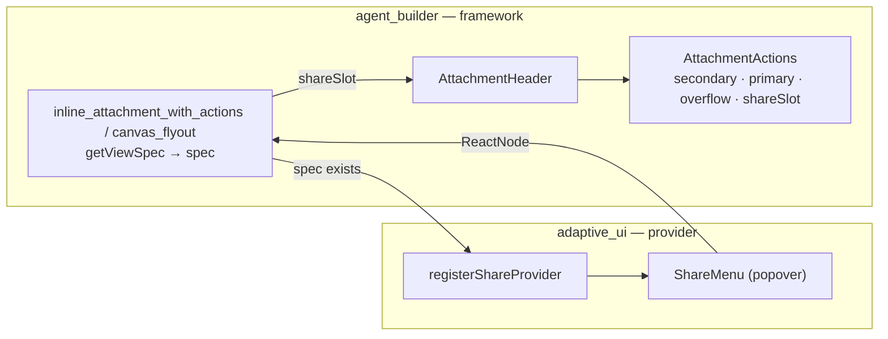

# Share menu for Adaptive UI attachment bodies

**Status:** planned on `adaptive-ui/portable-chat-share` (branched from `adaptive-ui/portable-chat-product`) · **Owner:** `@elastic/appex-ai-infra` (Adaptive UI) · **Reviewers:** Agent Builder core (extension point), `@elastic/response-ops` (Slack connector use) · **Body seam:** [`adaptive_ui_attachment_body_seam.md`](./adaptive_ui_attachment_body_seam.md)

## Summary

An attachment whose body is Adaptive UI gets a share control in its header, to the right of the existing action buttons. It opens a menu with four destinations, all derived from the same `ViewSpec` the body already renders:

- **PNG** — download, rendered by Adaptive UI's own PNG surface.
- **Text** — download `.txt` from `renderText`.
- **Markdown** — download `.md` from `renderMarkdown`.
- **Send to Slack** — pick a channel on a configured Slack connector and post the view as Block Kit.

HTML download is listed as a fifth item in the original ask and is included below; it wraps the same markup the shadow root receives in a standalone document.

The control is not implemented in `agent_builder`. Instead `agent_builder` grows one optional registration point on the browser attachment contract, and the `adaptiveUi` plugin fills it. Agent Builder never learns what "share" means, and every Adaptive-UI-specific line — the menu, the four renderers, the Slack modal, the routes — stays in `adaptive_ui`.

## Why a registration point rather than direct implementation

The dependency runs one way: `adaptive_ui` lists `agentBuilder` in `requiredPlugins`, not the reverse. Anything Adaptive-UI-aware placed in `agent_builder` therefore either duplicates logic that already lives in `adaptive_ui` (the Slack Block Kit pipeline in particular) or forces that logic out into a new shared package.

The seam already established by `getViewSpec` gives a cleaner option. `agent_builder` owns the chrome and already knows, per attachment, whether a `ViewSpec` exists — that is exactly the "is this Adaptive UI?" predicate the share button needs. So the framework contributes a slot and the predicate; the provider contributes the content.

This also keeps the `agent_builder` diff small enough to be uncontroversial: one optional type, two service methods, one prop threaded through two render sites.

## Contract

One optional provider on the browser side, additive and backward compatible. It goes in [`contract.ts`](../../x-pack/platform/packages/shared/agent-builder/agent-builder-browser/attachments/contract.ts), which already imports `ViewSpec` for `getViewSpec`, so it introduces no new coupling:

```ts
export interface AttachmentShareProviderParams<TAttachment = UnknownAttachment> {
  attachment: TAttachment;
  /** The attachment's `getViewSpec` result, when it has one. */
  spec?: ViewSpec;
  isCanvas: boolean;
}

/** Renders a share control for an attachment, or `null` when it has nothing to share. */
export type AttachmentShareProvider = (params: AttachmentShareProviderParams) => ReactNode;
```

`spec` is optional and the framework invokes the provider for every attachment, letting the provider decline. The alternative — framework gates on `getViewSpec` and passes a non-optional spec — reads cleaner but is wrong: `platform.adaptiveUi.view`, the one attachment type that is unambiguously Adaptive UI, has no `getViewSpec`. It renders through `renderInlineContent` / `renderCanvasContent` so it can honor the plugin's `styleIsolation` config, and adding `getViewSpec` to it would flip its inline body from `AdaptiveViewContainer` to the framework's `AttachmentAdaptiveBody`, which hardcodes `surface="html"` and so breaks `styleIsolation: 'document'`. The provider resolving its own spec — from `params.spec` for native types, from `attachment.data` for its own type — keeps that knowledge in `adaptive_ui` and leaves both body paths untouched.

`AttachmentsService` ([`attachements_service.tsx`](../../x-pack/platform/plugins/shared/agent_builder/public/services/attachments/attachements_service.tsx)) gains `registerShareProvider` / `getShareProvider`, with the register half exposed on the public contract in [`create_public_attachment_contract.ts`](../../x-pack/platform/plugins/shared/agent_builder/public/services/attachments/create_public_attachment_contract.ts). A single provider, not a list — this is a framework slot with one filler, and stacking share menus is not a scenario.

Returning a `ReactNode` rather than a button descriptor is deliberate: the control is a stateful popover that owns modals and async work, which `ActionButton` cannot express.

## Where the slot goes

The share control renders in the header's trailing `EuiFlexGroup` as a sibling of `AttachmentActions` — right of the overflow menu, left of the close button.



Both render sites already compute the spec — `inline_attachment_with_actions.tsx` as `viewSpec`, `canvas_flyout.tsx` as `canvasViewSpec` — so the wiring is: resolve the provider, invoke it when a spec exists, pass the node down as a `shareSlot` prop through `AttachmentHeader` into `AttachmentActions`.

**Two header guards, not one.** [`AttachmentHeader`](../../x-pack/platform/plugins/shared/agent_builder/public/application/components/conversations/conversation_rounds/round_response/attachments/attachment_header.tsx) returns `null` when a type has neither a close handler nor action buttons — the same rule the body seam documents — and *separately* renders `AttachmentActions` only when `previewBadgeState !== 'previewing' && hasActionButtons`. So the early return must consider `shareSlot`, and the slot must sit beside `AttachmentActions` rather than inside it; nesting it there would drop the control for any Adaptive attachment with no `getActionButtons`. In the `previewing` state, where actions are hidden wholesale, the share slot hides with them.

Canvas resolves the slot's spec independently of its body. `canvas_flyout.tsx` computes `canvasViewSpec` only when `renderCanvasContent` is unset, so reusing it would leave every canvas-rendering Adaptive type without a share control; call `getViewSpec` unconditionally for the slot.

## The five formats

Four of the five are pure browser work. `renderText`, `renderMarkdown`, and `renderHTML` are isomorphic exports of `@kbn/adaptive-ui`, so text, markdown, and HTML need no server contact and no new dependency. A shared helper turns each result into a `Blob` and downloads it, with filenames slugified from `spec.title`.

HTML uses `renderHTML(spec, { css: 'separate' })` — `HTMLRenderResult` carries `html`, `css`, and `body` — and assembles a standalone document — doctype, charset, `<title>` from `spec.title`, stylesheet in a head `<style>`. The shadow root and its `:host { all: initial }` reset are a host-page isolation concern and have no counterpart in a downloaded file.

PNG is the exception. `renderPNG` lives in [`@kbn/adaptive-ui/node`](../../src/platform/packages/shared/adaptive-ui/node.ts) because it pulls in the native `@takumi-rs/core` binding, so it needs a route.

### Why PNG is a route, and what it takes

**This is the plugin's first route.** `adaptive_ui/server/plugin.ts` never calls `coreSetup.http.createRouter` — it only threads `coreSetup.http` into the tools for `getKibanaPublicUrl`. So Phase 3 pays for the router, a `common/http_api` module for the request/response types, and an authorization decision: the plugin registers no features, so either the routes reuse an existing privilege or they declare `authz: { enabled: false, reason }` and lean on the actions client's own checks. Prefer the latter for the Slack routes, whose real authorization is `actionsClient.execute`, and state the reason explicitly.

The route accepts the spec, not an attachment id. The server's `AttachmentTypeDefinition` has `validate` / `format` / `resolve` / `isStale` and no `ViewSpec` hook, so only `platform.adaptiveUi.view` stores a spec directly; every other Adaptive attachment builds its spec in the browser from a `to*ViewSpec` adapter.

By-id is *reachable* — `conversations.getScopedClient({ request })` reads attachment data server-side, `@kbn/adaptive-ui-adapters` is `shared-common` and pure (no React, no EUI), and every `getViewSpec` in the tree is a pure function of `attachment.data`. What blocks it is where the mapping lives. Each owning plugin spells its `data → ViewSpec` step inline in its *browser* definition, several with per-type field remaps (`cases` routes through `toCaseAdapterData`; `security.entity_analytics_dashboard` renames its severity buckets). Resolving by id therefore needs a server-side `attachmentType → adapter` registry that either duplicates those remaps in `adaptive_ui` — inverting ownership and drifting silently when a data owner edits their definition, with no compile-time link — or adds a second `getViewSpec` extension point to the *server* attachment contract and edits six plugins across three solutions to fill it. Both cost far more than the one browser slot this spike is selling.

Posting the spec also gets fidelity for free: the browser holds the exact spec on screen, including the attachment version the user is looking at, so the export cannot disagree with the render. A by-id route would have to re-resolve that version and could quietly rasterize something else.

Guard the handler the way [`post_view_to_slack.ts`](../../x-pack/platform/plugins/shared/adaptive_ui/server/tools/post_view_to_slack.ts) does — `parseViewSpec`, then `validateView` — and bound the request body, so an oversized spec cannot turn the rasterizer into a compute sink.

**Payload headroom.** Every adapter in `adapterGallery` serializes to between 309 B (`esql`) and 2.8 KB (`platform.sig_event`); `nightshift.investigation`, the chart-heavy one, is 2.1 KB. Against `server.maxPayload`'s 1 MB default that is ~370× headroom, so the platform limit is not the binding constraint — a route-level `body: { maxBytes }` around 256 KB is, and it should be set deliberately with an error that names the limit. Specs are agent-authored, so a pathological table could in principle grow; the guard turns that into a legible 413 rather than a renderer stall. POST is also the only option: a spec of this size does not survive a URL. Import the renderer lazily, following [`render_png.ts`](../../x-pack/platform/plugins/shared/adaptive_ui/server/slack/render_png.ts): a Kibana that never exports a PNG should never load the native binding.

**Fidelity.** The PNG is the SVG surface's render of the spec, not a capture of the HTML surface in the shadow root, so the two can diverge. That gap is Adaptive UI's, and it is the same gap that already applies to every chart uploaded to Slack; the place to close it is the SVG surface upstream in `adaptive-ui-poc`, not a rasterizing workaround in Kibana.

Two alternatives were considered and rejected. Client-side rasterization (`foreignObject` into a canvas, or `dom-to-image-more`) would capture the HTML surface exactly, but it introduces a second rendering path outside Adaptive UI along with canvas-tainting and font-embedding failure modes. `@kbn/screenshotting` has no raw-HTML API, waits on Kibana app and reporting DOM selectors, and is disabled in Serverless (`xpack.screenshotting.enabled: false` in `config/serverless.yml`).

## Send to Slack

Everything needed already exists in `adaptive_ui`; the work is exposing it over HTTP and putting a channel picker in front of it.

**Connector discovery** is browser-side: `core.http.get('/api/actions/connectors')` filtered to `actionTypeId === '.slack2'` with secrets present. `loadAllActions` is not on `@kbn/triggers-actions-ui-plugin/public`'s entry point and `fetchConnectors` is not on `@kbn/alerts-ui-shared`'s, so reaching either means a subpath import; the public actions route needs no new plugin dependency at all. With no matching connector the Slack item is disabled with a reason rather than hidden, so the capability stays discoverable; with more than one, the modal grows a connector selector.

**Channel listing** needs no route of its own. The browser executes the connector's `listChannels` sub-action against the public actions API (`POST /api/actions/connector/{id}/_execute`) — the same seam the alerting rule form's channel picker already uses in [`use_fetch_slack_channels.ts`](../../x-pack/platform/packages/shared/response-ops/alerting-v2-rule-form/actions_form/hooks/use_fetch_slack_channels.ts). Slack paginates by cursor, so the client walks a bounded number of pages and reports when it stopped early; the modal's filter box then filters in memory.

**Posting** does need a route: it reaches the rasterizer and the href absolutizer, neither of which belongs in the browser. It reuses `postViewToSlackTool`'s pipeline unchanged — `absolutizeViewSpecHrefs`, `renderSlack(spec, { collectAssets: true })`, rasterize each chart, `uploadFile`, then `sendMessage` — including its degrade-to-text fallback when asset upload fails. Both routes sit beside the tool, so there is no shared-package extraction and one implementation serves both the agent and the UI.

**Membership is the wrong gate.** `listChannels` returns `is_member`, and gating the picker on it seemed obviously right — until a channel the connector had joined came back `false`, and a post to a channel it had *not* joined succeeded. Two reasons, both structural: the connector's authorization-code flow sets `scopeParamName: 'user_scope'`, so `is_member` can describe the authed user rather than the identity that posts; and `chat:write.public` lets an app post to any public channel without joining. The field is unused. What the UI owes the user instead is scope-accurate copy — public channels need `chat:write.public` when unjoined, private channels need an invite — and a `not_in_channel` error that names both fixes.

Error copy still has to name the other inherited gotcha: `uploadFile` needs the `files:write` scope, which is deliberately absent from the connector's OAuth defaults.

## Phases

1. **Extension point.** Contract type, service methods, prop threading, and a stub provider proving the slot renders. The only `agent_builder` change on the branch.
2. **Menu and text formats.** Popover plus text, markdown, and HTML downloads. No routes, no dependencies.
3. **PNG.** The `renderPNG` route and its client call.
4. **Slack.** Connector discovery, the post route, and the channel modal.

Tests: unit coverage for the serializers and filename derivation, RTL for the menu (spec present or absent, connector present or absent, disabled states), and route tests modeled on [`post_view_to_slack.test.ts`](../../x-pack/platform/plugins/shared/adaptive_ui/server/tools/post_view_to_slack.test.ts). Plus i18n on every string and `getEbtProps` telemetry matching the header's existing `ATTACHMENT_CLOSE` pattern.

## Implementation notes

Landed on this branch, with three departures from the plan above worth recording:

- **No channel-listing route.** See above — the connector's execute API is public and already used this way, so the only new routes are `POST /internal/adaptive_ui/share/png` and `POST /internal/adaptive_ui/share/slack`.
- **One new EBT action.** `AGENT_BUILDER_UI_EBT.action.conversation.ATTACHMENT_SHARE`, alongside the header's existing `ATTACHMENT_CLOSE`.
- **Menu sections.** The popover groups destinations under `Download` (PNG, Text, Markdown, HTML) and `Send` (Slack), plus a `Developer` entry that opens a nested panel — `ViewSpec` and `Block Kit` JSON, both pure browser renders — gated on `initializerContext.env.mode.dev`, so it is absent from a distribution build.
- **Space resolution.** The Slack route derives its space from `request.url.pathname` (`getSpaceIdFromPath`) rather than `request.path`, which core's request mock leaves unset.

## Benefits

- Every Adaptive UI attachment gains export and Slack sharing at once, with no per-type work — the same property that made `getViewSpec` worth building.
- Four of five formats are free, because the surfaces already exist and are isomorphic.
- Slack posting reaches the UI without duplicating the Block Kit pipeline or extracting it into a new package.
- Reversible and inert: unregister the provider and the header returns to exactly its current behavior.

## Risks / follow-ups

- **PNG fidelity.** The SVG and HTML surfaces can diverge. Worth capturing a side-by-side against a chart-heavy spec early and filing upstream if the gap is material.
- **Serverless.** `renderPNG` depends on the native `@takumi-rs/core` binding, whose platform builds ship as optional dependencies (all eight are in `yarn.lock`). Slack chart upload already relies on it, so this adds no new constraint, but PNG export inherits whatever that dependency's Serverless story is.
- **Canvas parity.** The provider receives `isCanvas`, but whether the flyout should expose the same menu — or a wider one, given more room — is unresolved.
- **Inert HTML.** The pack's progressive enhancements arrive as injected script text, which a standalone download does not carry, so interactive primitives land static. Acceptable for an export; worth saying so in the menu copy if it surprises anyone.
- **Provider cardinality.** A single provider is right today. If a second consumer ever wants to contribute share destinations, this becomes a list and needs an ordering rule.
