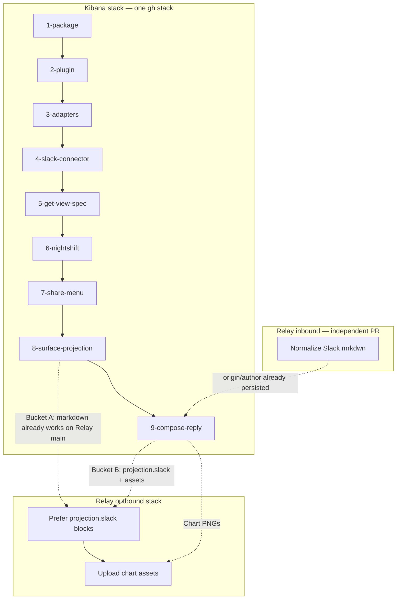
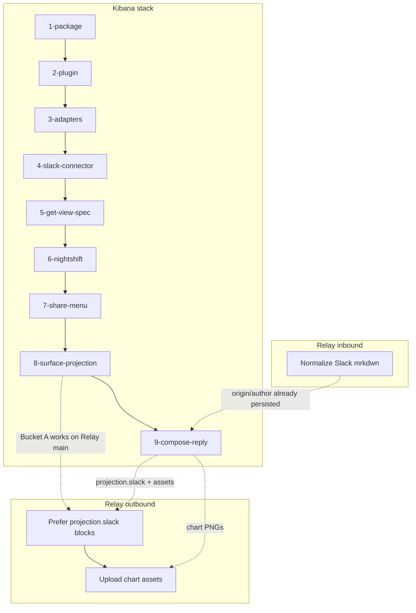

# Stacked PRs for Adaptive UI → Agent Builder → Relay → Slack

**Remotes:** Kibana stack → `upstream` (`elastic/kibana`). Relay PRs → fork `origin`, base `elastic/relay-service` `main`.

The work is already a linear story in git. The 16 Kibana commits and 5 Relay commits are the right granularity — **do not rewrite them**. What is missing is PR boundaries and `gh stack` metadata so a reviewer can walk that story one layer at a time.

Today Kibana is one 228-file branch (`adaptive-ui/relay-slack-projection`, 16 commits, no PR) with four nested local ancestors that were never submitted. Relay is two independent branches off `main` plus a local merge (`demo/slack-full`) that should stay local.



Kibana must be one stack: each layer imports the one below. Relay inbound and outbound share **no files** and can land in either order, so stacking mrkdwn under Block Kit would invent a merge dependency. Two Relay surfaces, cross-linked from PR bodies, tell the same round-trip story without that lie.

`elastic/kibana` is squash-merge only. `gh stack sync` already handles squash-merge recovery; merge bottom-up and sync after each merge. If `gh stack submit` exits 9 (stacked PRs not enabled on the repo), fall back to ordinary PRs with `base` chained the same way.

---

## Chapter map (reading order)

A reviewer who only reads titles should come away with: Adaptive UI is a Kibana library, Agent Builder mounts it as card bodies, a person can send a view to Slack, then a Slack-origin turn does that automatically via Relay.

| # | Chapter | Kibana PR | Relay PR | Primary reviewers |
| --- | --- | --- | --- | --- |
| 1 | Adaptive UI exists in Kibana | 1–2 | — | `@elastic/appex-sharedux` |
| 2 | Agent Builder attachments become ViewSpecs | 3, 5, 6 | — | `@elastic/workchat-eng` + product attachment owners |
| 3a | User-initiated Slack | 4, 7 | — | appex-sharedux + `@elastic/response-ops` (connector) |
| 3b | Headless Slack via Relay | 8–9 | inbound + outbound 1–2 | workchat-eng + `@elastic/nightshift-context-and-research-team` |

Keep commit order. The Slack connector PR sitting *before* `getViewSpec` is historically honest: the first Slack path posted an authored `ViewSpec` via `post_view_to_slack`; native types grew Adaptive UI bodies next; the share menu reused the connector pipeline; Relay projection made the button unnecessary. Do not rebase to "fix" that.

---

## Kibana stack (9 PRs)

Prefix `adaptive-ui-poc`. New branches at existing SHAs, named `adaptive-ui-poc/[number]-name`; old `portable-chat*` locals stay as aliases and are not submitted.

**Do not squash the 16 commits into 9.** Multi-commit PRs (6, 8, 9) keep their internal history so the PR itself is a mini-stack.

| Branch | Tip SHA | Commits | Files | PR title |
| --- | --- | --- | --- | --- |
| `adaptive-ui-poc/1-package` | `d3cb6bc4a8f4` | 1 | 17 | Vendor Adaptive UI as `@kbn/adaptive-ui` |
| `adaptive-ui-poc/2-plugin` | `a9b3b09f45a5` | 1 | 37 | Port the `adaptive_ui` plugin: chat, Slack, and markdown |
| `adaptive-ui-poc/3-adapters` | `d65284b2ddf2` | 1 | 57 | Add data→ViewSpec adapters for Agent Builder types |
| `adaptive-ui-poc/4-slack-connector` | `7bb9208041d5` | 1 | 21 | Post views to Slack as Block Kit through the connector |
| `adaptive-ui-poc/5-get-view-spec` | `b28e35bb2b38` | 1 | 34 | Give native attachment types an Adaptive UI body via `getViewSpec` |
| `adaptive-ui-poc/6-nightshift` | `9d4ade00e439` | 2 | ~43 | Nightshift investigation cards, live resolve, Relay trigger |
| `adaptive-ui-poc/7-share-menu` | `1dcb499ad268` | 1 | 39 | Share menu for Adaptive UI attachment bodies |
| `adaptive-ui-poc/8-surface-projection` | `edb15e4063bf` | 4 | ~42 | Project Slack-origin replies on the callback path |
| `adaptive-ui-poc/9-compose-reply` | `3c6b991207bf` + uncommitted spike doc | 4 + docs | ~26 | Compose the reply into one ViewSpec and ship chart images |

### What each PR is for

**1. Package.** The vendoring story (`sync_dist.mjs`, gitignored `vendor/`). Reviewers need this before the plugin compiles. Owner: appex-sharedux.

**2. Plugin.** `adaptiveUi` lifecycle, `platform.adaptiveUi.view`, `render_view` / `request_registered_view` / `get_authoring_context`, AB allow-lists. This is Adaptive UI entering Agent Builder as a *new* attachment type, not yet as native card bodies.

**3. Adapters.** `@kbn/adaptive-ui-adapters` plus the cross-surface golden harness. Pure `to*ViewSpec` — no AB core change. Spike: [`adaptive_ui_attachment_body_seam.md`](dev_docs/spikes/adaptive_ui_attachment_body_seam.md).

**4. Slack connector.** First Slack path: `post_view_to_slack`, `.slack2` `blocks` + `uploadFile`, rasterize charts. User/tool action, not Relay. Touches [`actions/server/lib/relay`](x-pack/platform/plugins/shared/actions/server/lib/relay/relay_client.ts) and [`kbn-connector-specs` Slack](src/platform/packages/shared/kbn-connector-specs/src/specs/slack/slack.ts) → response-ops.

**5. `getViewSpec`.** Optional resolver on `AttachmentUIDefinition`; presentational types adopt it. This is the AB contract workchat-eng has to accept. Touches cases, alerting, workflows, sig-events, security_solution, nightshift.

**6. Nightshift.** Product proof: investigation + event cards, live `request_registered_view`, `RelayClient.trigger` forwards `blocks` (proactive Elastic Slack app path — still not the reactive callback).

**7. Share menu.** AB `share-provider` slot; download + Send to Slack reuse the connector pipeline.

**8. Surface projection (Bucket A).** The headless seam: AB `surfaceProjection.register` keyed by `ConversationOriginType`; `adaptive_ui` registers the Slack projector; tags become markdown *inside* `response.message` so **Relay `main` already posts it**. Follow-ups in the same PR: absolutize hrefs, shared `resolveAttachmentVersion`, adapter-map parity test, Relay-assumptions doc. Workchat must buy the registry direction (`adaptive_ui` → `agentBuilder`, never the reverse).

**9. Compose + charts (Bucket B Kibana, plus C2).** `message + attachments → ViewSpec` → `renderSlack` → `projection.slack.{text,blocks,assets}`. Attribution UI (who asked, from where) is a 4-file commit in this PR because it sits between compose and charts in history — call it out in the PR body so workchat can review that commit in isolation. Uncommitted spike-doc edits land here.

Leave B3 (per-message `message_key → ts`) out. It is still gated on Relay sign-off.

---

## Relay (1 independent PR + 1 two-layer stack)

Keep `feat/slack-mrkdwn-normalization` off `main`. Stack outbound on a new middle branch so charts can rebase independently.

| Branch | Tip | PR title | Files |
| --- | --- | --- | --- |
| `feat/slack-mrkdwn-normalization` | `315c6d2` | Normalize Slack mrkdwn before the Agent Builder prompt | 4 |
| `feat/kibana-surface-projection` @ `6eabbbc` | Post Kibana's Block Kit projection instead of wrapping the reply | 14 |
| `feat/kibana-surface-projection` @ `cab2106` (push the unpushed commit) | Upload Kibana chart images and post them as image blocks | +6 |

`demo/slack-full` is the local merge for running both halves together. Not a PR.

Cross-links (put in every PR body):

- Relay mrkdwn ↔ Kibana PR 9 attribution commit (`b06514ce`)
- Relay blocks ↔ Kibana PR 9 compose commit (`0ace0c07`); safe to land in either order — Kibana's `projection` field is ignored on current Relay, and Relay's new field is optional
- Relay charts ↔ Kibana PR 9 chart commit (`3c6b9912`); Kibana ships inert `assets` until Relay uploads, Relay rejects `image` blocks until this PR

Helm charts do not set `SLACK_OAUTH_SCOPES`. The files scopes live in [`src/config.ts`](src/config.ts) / `.env.example`. Call out re-authorization of existing Slack installs on the charts PR.

---

## Epic (create first)

One issue in `elastic/kibana`, GitHub type **Epic**. Chapters live in the body as headings plus a PR checklist — no chapter sub-issues. Relay PRs cannot be GitHub sub-issues of a Kibana parent; they are full `elastic/relay-service#N` links in the same checklist.

Do **not** parent this under [#284077](https://github.com/elastic/kibana/issues/284077) (Phase 2 delivery epic). Link it as related so the production tracker does not absorb a 12-PR PoC. Same for [#284081](https://github.com/elastic/kibana/issues/284081) (Rich messages + Slack transformation) — this PoC is a concrete answer to that story, not a close of it.

| Field | Value |
| --- | --- |
| Title | `[Adaptive UI] PoC: portable views from Kibana chat through Relay to Slack` |
| Type | `Epic` (`gh issue create --type Epic`) |
| Labels | `Team:agent-builder`, `Team:SharedUX`, `feature:agent-builder` |
| PRs | `Addresses #<epic>` — never `Closes`. This is a walking-tour PoC; B3 / HITL / inbound files remain open. |

Create the Epic **before** `gh stack submit` so every PR body can cite it. After submit, `gh issue edit` the checklist to replace `TBD` with numbers. GitHub task-list items of the form `- [ ] #123` auto-track PR state.

### Epic body (file as-is; fill PR numbers after submit)

````markdown
## What

A walking-tour PoC of Adaptive UI as a portable view: it lands in Kibana, Agent Builder mounts it as card bodies, a person can send a view to Slack, then a Slack-origin Agent Builder turn does that automatically via Relay — no button, no tool call, gated on `origin`.

Stacked PRs (prefix `adaptive-ui-poc/`) are the review surface. They are not a merge plan for `main`. Out of scope: per-message Slack posts (B3), HITL / Kibana-UI replies returning to Slack, inbound Slack files.

## Why

Agent Builder replies on the Relay path still contain `<render_attachment>` tags. Slack renders the tags as literal text; the view never arrives. Rendering has to be a native part of the conversation model, triggered by origin, not a user action per turn. This PoC is that projector, plus inbound prompt and transcript fidelity.

Related: #284077 (Phase 2 epic), #284081 (rich messages + Slack transformation). Spike: `dev_docs/spikes/adaptive_ui_relay_slack_projection.md` on `adaptive-ui-poc/9-compose-reply`.

## Shape



Read the Kibana stack bottom-up. Relay inbound and outbound share no files and can land in either order; the diagram is the round-trip story, not a merge dependency.

## Chapters

### 1. Adaptive UI in Kibana

The library exists inside Kibana and a plugin can render one `ViewSpec` to React, Block Kit, and markdown.

- [ ] TBD `adaptive-ui-poc/1-package` — vendor `@kbn/adaptive-ui`
- [ ] TBD `adaptive-ui-poc/2-plugin` — `adaptiveUi` plugin, `platform.adaptiveUi.view`, authoring tools

Reviewers: `@elastic/appex-sharedux`

### 2. Adaptive UI in Agent Builder

Attachment payloads become `ViewSpec`s. Native types opt into an Adaptive UI body. Nightshift is the product proof.

- [ ] TBD `adaptive-ui-poc/3-adapters` — `@kbn/adaptive-ui-adapters`
- [ ] TBD `adaptive-ui-poc/5-get-view-spec` — `getViewSpec` on `AttachmentUIDefinition`
- [ ] TBD `adaptive-ui-poc/6-nightshift` — investigation cards, live `request_registered_view`

Reviewers: `@elastic/workchat-eng` plus the product teams that own the adopter attachments.

### 3a. User-initiated Slack

A person or the `post_view_to_slack` tool sends one view through a `.slack2` connector. The share menu reuses that pipeline.

- [ ] TBD `adaptive-ui-poc/4-slack-connector` — Block Kit + chart PNG upload via the connector
- [ ] TBD `adaptive-ui-poc/7-share-menu` — download and Send to Slack on Adaptive UI bodies

Reviewers: `@elastic/appex-sharedux`, `@elastic/response-ops` (connector / `RelayClient.trigger`)

### 3b. Headless Slack via Relay

A Slack-origin turn projects automatically on callback delivery. Kibana composes the reply; Relay posts blocks and uploads chart bytes. Mentions in the inbound prompt become names; the Kibana transcript names who asked and from where.

- [ ] TBD `adaptive-ui-poc/8-surface-projection` — origin-gated projector; tags become markdown Relay `main` already posts
- [ ] TBD `adaptive-ui-poc/9-compose-reply` — one `ViewSpec`, `projection.slack`, chart assets, round-input attribution
- [ ] TBD `elastic/relay-service` `feat/slack-mrkdwn-normalization` — inbound mrkdwn → markdown
- [ ] TBD `elastic/relay-service` Block Kit projection
- [ ] TBD `elastic/relay-service` chart asset upload (`files:read` / `files:write`; existing Slack installs need re-auth)

Reviewers: `@elastic/workchat-eng`, `@elastic/nightshift-context-and-research-team`

## Run this prototype locally

Two tracks. Track A is enough to walk chapters 1–3a. Track B is the Slack mention → Agent Builder → Slack Block Kit loop. Use Node from Kibana `.nvmrc`.

The numbered chat demos (authoring, adapters, Nightshift seed, ES|QL) live in [`adaptive_ui_portable_chat_review.md`](https://github.com/elastic/kibana/blob/adaptive-ui-poc/9-compose-reply/dev_docs/spikes/adaptive_ui_portable_chat_review.md) on the tip branch — do not duplicate them here. Relay's own runbook is [`docs/development/local-development.md`](https://github.com/elastic/relay-service/blob/main/docs/development/local-development.md).

### Track A — Kibana only (chat, share, connector Slack)

1. Check out the tip, or any layer you are reviewing:

```bash
git fetch origin
git checkout adaptive-ui-poc/9-compose-reply   # or 1-package … 8-surface-projection
```

2. Vendor Adaptive UI once. `vendor/` is gitignored; typecheck, tests, and the plugin fail until this runs. In the upstream [`elastic/adaptive-ui-poc`](https://github.com/elastic/adaptive-ui-poc) repo: `yarn build:packages`. Then in Kibana:

```bash
node src/platform/packages/shared/adaptive-ui/scripts/sync_dist.mjs --from /path/to/adaptive-ui-poc
```

3. Boot:

```bash
yarn es snapshot
yarn start
```

This tree's `config/kibana.dev.yml` already enables Agent Builder experimental features, Nightshift / significant events, and allows `slack.com` / `files.slack.com`. Open **Chat**. Confirm `render_view`, `get_authoring_context`, `request_registered_view`, and `post_view_to_slack` are allow-listed for the agent.

4. Optional — Send to Slack from chat (chapter 3a). Create a Slack (v2) connector (`chat:write`; `files:write` for chart images), invite the bot, attach it to the agent. Relative hrefs rewrite to `server.publicBaseUrl` (localhost unless you set one).

5. Optional — Nightshift demos. Seed with `./x-pack/solutions/observability/plugins/nightshift/scripts/seed_nightshift.sh`, then wait for an investigation to complete.

### Track B — Slack round-trip through Relay (chapter 3b)

Needs Track A running plus a local Relay that includes **both** inbound mrkdwn and outbound Block Kit + charts. Until those Relay PRs merge, that union is the local branch `demo/slack-full` in `elastic/relay-service` (not a PR).

1. Kibana as in Track A. This tree already sets `xpack.actions.relay.url: 'http://localhost:3000'` and allows `localhost` and `127.0.0.1` (Relay calls back from `127.0.0.1`). Restart Kibana after any yml change. HTTP Relay URLs are allowed only in `dev`.

2. Relay — Slack sandbox + tunnel (from [`local-development.md`](https://github.com/elastic/relay-service/blob/main/docs/development/local-development.md)):

```bash
git checkout demo/slack-full
cp .env.example .env   # fill SLACK_APP_CONFIG_TOKEN + REFRESH_TOKEN from api.slack.com/apps
npm run dev:slack -- --dev-app
```

3. In Kibana: Significant Events settings → connect the workspace → bind a channel (`/app/significant_events/settings`). `/invite @elastic` in that channel.

4. Mention the bot and ask for a registered view (or anything that produces a `<render_attachment>`). Expect Block Kit plus prose in the thread, no raw tags, chart images when the reply has charts. Open the same conversation in Kibana Chat: the round-input bubble names the asker and Slack; the card still mounts in chat.

Relay `main` without the outbound PRs still shows Bucket A: tags substituted as markdown, no Block Kit. Charts need the charts PR (`files:write`); a projection carrying unresolved `image` refs falls back to markdown.

## Success

A Slack-originated turn posts one Slack message whose Block Kit is `renderSlack` of the composed reply. Projection is triggered by `origin`. The same conversation in Kibana shows who asked, from where, and the same views as cards.

## Not this PoC

- B3 — one Slack message per `message_complete` (`message_key → ts`); needs Relay sign-off
- HITL / replies typed in the Kibana AB UI returning to Slack
- Inbound Slack files as Agent Builder attachments
````

At execution, write this body to a temp file and `gh issue create --type Epic -F` it so the mermaid fence survives.

---

## How to build it (after approval)

1. Snapshot the Kibana working tree (dirty state is the spike doc only).
2. Commit the spike-doc edits onto current HEAD (`adaptive-ui-poc/9-compose-reply` after the branch exists).
3. **Create the Epic** (`gh issue create --type Epic -R elastic/kibana --title '…' --label Team:agent-builder --label Team:SharedUX --label feature:agent-builder -F /tmp/adaptive-ui-poc-epic.md`). Record the number.
4. Create the nine Kibana branches, `gh stack init`, `gh stack submit --auto`. Every PR `Addresses #<epic>`.
5. Submit the Relay outbound stack and the inbound mrkdwn PR. Same `Addresses` line (full `elastic/kibana#N` on Relay PRs).
6. `gh issue edit` the Epic checklist with the real PR numbers; `gh pr edit` each PR with chapter sentence + Epic link.

Snapshot:

```bash
SHA=$(git stash create "pre-split")
git update-ref "refs/backup/pre-split-$(date +%s)" "$SHA"
```

Kibana, from [`adaptive-ui`](/Users/clint/Projects/kibana.worktrees/adaptive-ui): commit the spike-doc dirty state onto current HEAD, then point new branches at the grouping tips and adopt them:

```bash
git config rerere.enabled true
git config remote.pushDefault origin

git branch adaptive-ui-poc/1-package            d3cb6bc4a8f4
git branch adaptive-ui-poc/2-plugin             a9b3b09f45a5
git branch adaptive-ui-poc/3-adapters           d65284b2ddf2
git branch adaptive-ui-poc/4-slack-connector    7bb9208041d5
git branch adaptive-ui-poc/5-get-view-spec      b28e35bb2b38
git branch adaptive-ui-poc/6-nightshift         9d4ade00e439
git branch adaptive-ui-poc/7-share-menu         1dcb499ad268
git branch adaptive-ui-poc/8-surface-projection edb15e4063bf
# 9-compose-reply is current HEAD after the docs commit

gh stack init --base main -p adaptive-ui-poc \
  1-package \
  2-plugin \
  3-adapters \
  4-slack-connector \
  5-get-view-spec \
  6-nightshift \
  7-share-menu \
  8-surface-projection \
  9-compose-reply

gh stack submit --auto --remote origin
```

Then `gh pr edit` each PR: draft (Kibana rule), `Addresses #<epic>`, stack-position footer, chapter sentence, owner ping, link to the paired Relay PR. `--auto` titles from single-commit branches are already the commit subjects; multi-commit PRs need a hand-written title.

Relay outbound: branch `feat/kibana-surface-projection-blocks` at `6eabbbc`, keep `feat/kibana-surface-projection` at `cab2106`, `gh stack init --base main` those two, submit. Open mrkdwn as a normal PR against `main`.

Do not force-push `origin/adaptive-ui/relay-slack-projection`; leave it as a backup of the unsplit branch. New stack branches are the review surface.

---

## What this is not

- Not a rebase that reorders Slack-connector after `getViewSpec`.
- Not folding Relay inbound under outbound.
- Not opening `demo/slack-full` or the old `adaptive-ui/packages` / `adaptive-ui/agent-builder` / `adaptive-ui/relay-demo` lines — those are different lineages.
- Not implementing B3, HITL bridging, or inbound Slack files.
