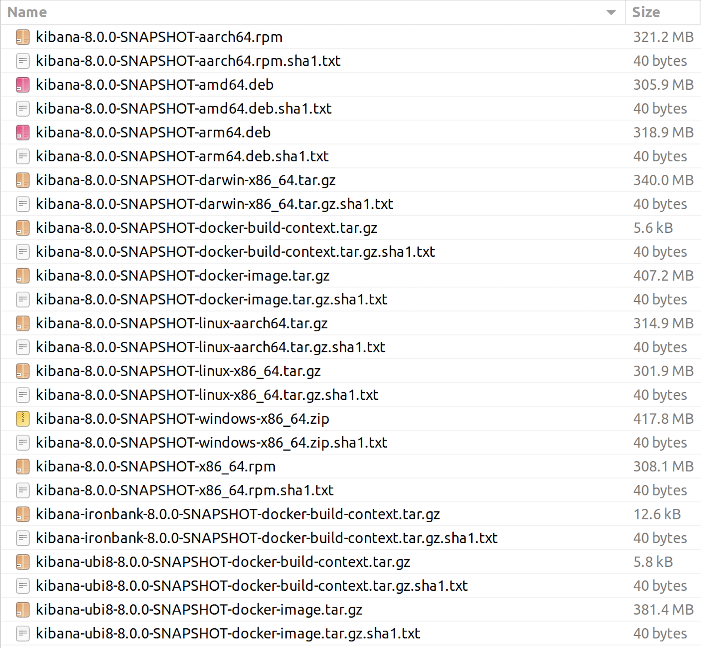

On the course of that tutorial it will be possible to learn more about how we can create a Kibana distributable 
as well as handle its different main configurations.

At any given point, you can get CLI help running the following command:

```bash
yarn build --help
```

## Prerequisites

For the basic steps of the build we only require you to use one of the following operating systems:

- Linux
- macOS

However if as part of the build you also want to generate Linux installation packages (deb, rpm) or Docker images there 
are other dependencies to have in mind as those installation packages and Docker images generation are run using fpm, dpkg, rpm, and Docker.

### For Linux Installation Packages Build

Please make sure you have the following dependencies installed:

#### Install FPM dependencies

**On OSX/macOS:**

```bash
brew install gnu-tar rpm
```

**On Red Hat systems (Fedora 22 or older, CentOS, etc):**

```bash
yum install ruby-devel gcc make rpm-build rubygems
```

**On Fedora 23 or newer:**

```bash
dnf install ruby-devel gcc make rpm-build libffi-devel
```

**On Oracle Linux 7.x systems:**

```bash
yum-config-manager --enable ol7_optional_latest
yum install ruby-devel gcc make rpm-build rubygems
```

**On Debian-derived systems (Debian, Ubuntu, etc):**

```bash
apt-get install ruby ruby-dev rubygems build-essential
```

#### Install FPM

Finally install fpm with the gem tool with:

```bash
gem install fpm -v 1.5.0
```

### For Docker Images Build

For Docker, the installation instructions can be found at [Install Docker Engine](https://docs.docker.com/engine/install/).


## Create a Kibana distributable

In a great majority of the use cases where we need to build a Kibana distributable, we just need the archives containing the 
node executable and the bundled code of the application.

By doing that Linux installation packages and Docker images will be excluded and as a result, the build will be quicker.

We can do it by simply running:

```bash
yarn build --skip-os-packages
```

Note that we used `--skip-os-packages` which will skip the OS packages build.

> In case you are testing something and running that same command a couple of times, `--skip-node-download` can be used 
to speed up the process by a little.

At the end of the process a Kibana distributable was created in a `target` folder created relative to your repository checkout. 
The folder will look like the following:


## Controlling the log levels

By default, when building the distributable, the `debug` log level will be used across all the steps. 
That default setting should give us a good amount of information about the tasks being done.

To turn it off you can run the build along `--no-debug` flag. At that point that information will no longer be printed out.

For a longer and verbose logging than `debug` there is other option that can be passed along the build command which is `--verbose`.

## Create a Kibana distributable with Linux installation packages and Docker images

If you comply with every prerequisite and dependency listed above, then there is also the option to create a Kibana distributable along with 
Linux installation packages like rpm and deb or Docker images.

To achieve it, you can run:

```bash
yarn build
```

At the end you will get the Kibana distributable archives plus the Docker images and both an rpm and a deb package.

To specify just a single installation package or Docker images to build instead of all of them you can add rpm, deb or docker-images as an argument:

```bash
yarn build --deb
yarn build --rpm
yarn build --docker-images
```

Again the distributable contents resulting from running the build command can be found in a `target` folder created relative to the repository after the build completes.
It will look something like: 


