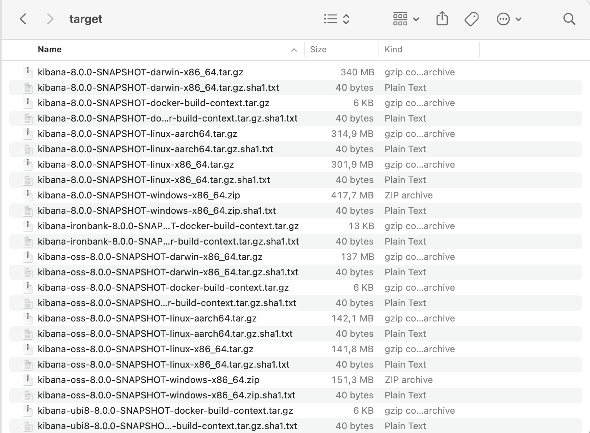

On the course of that tutorial it will be possible to learn more about how we can create a Kibana distributable 
as well as handle its different main configurations.

At any given point, you can get CLI help running the following command:

```bash
yarn build --help
```

## Prerequisites

For the general aspects of the build we only require you to use one of the following operating systems:

- Linux
- macOS

In case you want to build OS Packages there are other things to have in mind. Packages are built using fpm, dpkg, rpm, and Docker.
Please make sure you have those dependencies installed using:

```bash
apt-get install ruby ruby-dev rpm dpkg build-essential
gem install fpm -v 1.5.0
```

For Docker, the installation instructions can be found at [Install Docker Engine](https://docs.docker.com/engine/install/).

> NOTE: OS Packages building has only been tested on Linux and may not be fully supported on any other platform. 


## Create a simple Kibana distributable

In a great majority of the use cases where we need to build a Kibana distributable, we can live with a simple version of it.
That version is quicker, easier to achieve easy and building OS Packages will be excluded. 

We can do it by simply running:

```bash
yarn build --skip-os-packages
```

Note that we used `--skip-os-packages` which will skip the OS packages build.

> In case you are testing something and running that same command a couple of times, `--skip-node-download` can be used 
to speed up the process by a little.

At the end of the process a Kibana distributable was created in a `target` folder created relative to your repository checkout. 
The folder will look like the following:



## Controlling the log levels

By default, when building the distributable, the `debug` log level will be used across all the steps. 
That default setting should give us a good amount of information about the tasks being done.

To turn it off you can run the build along `--no-debug` flag. At that point that information will no longer be printed out.

For a longer and verbose logging than `debug` there is other option that can be passed along the build command which is `--verbose`.

## Create a Kibana distributable and build OS Packages

If you are running a Linux OS there is also the option to create a Kibana distributable including the build of specific OS packages 
like rpm, deb or docker.

As far as all the above mentioned prerequisites have been followed, you can just run:

```bash
yarn build
```

At the end you will get a Kibana distributable including a docker image and both an rpm and a deb package.

To specify a package to build you can add rpm, deb or docker-images as an argument:

```bash
yarn build --deb
yarn build --rpm
yarn build --docker-images
```

Again the distributable packages can be found in a `target` folder created relative to the repository after the build completes.
It will look something like: 


