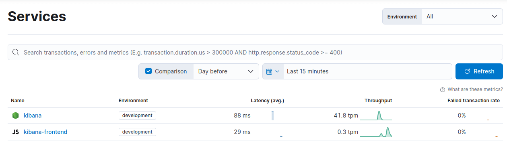

There are multiple ways to go about debugging Kibana when running from source.

## Debugging using Chrome DevTools

You will need to run Node using `--inspect` or `--inspect-brk` in order to enable the inspector. Additional information can be found in the [Node.js docs](https://nodejs.org/en/docs/guides/debugging-getting-started/).

Once Node is running with the inspector enabled, you can open `chrome://inspect` in your Chrome browser. You should see a remote target for the inspector running. Click "inspect". You can now begin using the debugger.

Next we will go over how to exactly enable the inspector for different aspects of the codebase.

### Jest Unit Tests

You will need to run Jest directly from the Node script:

`node --inspect-brk node_modules/.bin/jest --runInBand --config [JestConfig] [TestPathPattern]`

Additional information can be found in the [Jest troubleshooting documentation](https://jestjs.io/docs/troubleshooting).

### Functional Test Runner

`node --inspect-brk scripts/functional_test_runner`

### Development Server

`node --inspect-brk scripts/kibana`

## Debugging using logging

When running Kibana, it's sometimes helpful to enable verbose logging.

`yarn start --verbose`

Using verbose logging usually results in much more information than you're interested in. The [logging documentation](https://www.elastic.co/guide/en/kibana/current/logging-settings.html) covers ways to change the log level of certain types.

In the following example of a configuration stored in `config/kibana.dev.yml` we are logging all Elasticsearch queries and any logs created by the Management plugin.

```
logging:
  appenders:
    console:
      type: console
      layout:
        type: pattern
        highlight: true
  root:
    appenders: [default, console]
    level: info

  loggers:
    - name: plugins.management
      level: debug
    - name: elasticsearch.query
      level: debug
```

## Debugging Kibana with APM

Kibana is integrated with APM's node and RUM agents. 
To learn more about how APM works and what it reports, refer to the [documentation](https://www.elastic.co/observability/solution-overview).

We currently track the following transactions from Kibana: 

Backend (APM Node): 
 * `request` - APM automatically tracks all incoming API requests
 * `kibana-platform` - tracks server initiation phases take (preboot, setup and start)
 * `task-manager` - tracks the operation of the task manager, including claiming pending tasks and marking them as running
 * `task-run` - tracks the execution of individual tasks

Frontend (APM RUM): 
 * `http-request`- APM automatically tracks all outgoing API requests
 * `page-load` 
 * `app-change`

### Enabling APM on a local environment

In some cases, it is beneficial to enable APM on a local development environment to get an initial undertanding of a feature's performance during manual or automatic tests.

 1. Create a secondary monitoring deployment to collect APM data. The easiest option is to use [Elastic cloud](https://cloud.elastic.co/deployments) to create a new deployment.
 2. Open Kibana, go to `Integrations` and enable the Elastic APM integration.
 3. Scroll down and copy the server URL and secret token. You may also find them in your cloud console under APM & Fleet.
 4. Create or open `config\kibana.dev.yml` on your local development environment.
 5. Add the following settings: 
    ```
    elastic.apm.active: true
    elastic.apm.serverUrl: <serverUrl>
    elastic.apm.secretToken: <secretToken>
    ```
 6. Once you run kibana and start using it, two new services (kibana, kibana-frontend) should appear under the APM UI on the APM deployment.
  
### Enabling APM via environment variables

It is possible to enable APM via environment variables as well.
They take precedence over any values defined in `kibana.yml` or `kibana.dev.yml`

Set the following environment variables to enable APM: 

 * ELASTIC_APM_ACTIVE
 * ELASTIC_APM_SERVER_URL
 * ELASTIC_APM_SECRET_TOKEN
