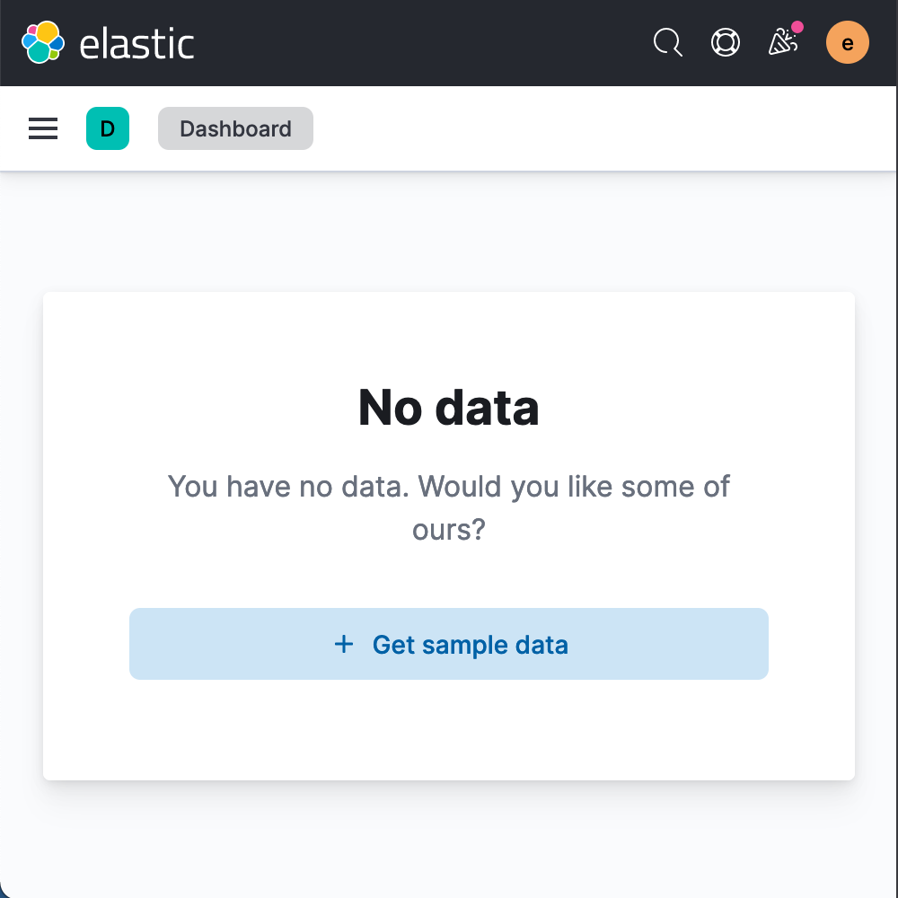

`KibanaPageLayout` is a thin wrapper around [EuiPageLayout](https://elastic.github.io/eui/#/layout/page) that makes setting up common types of Kibana pages quicker and easier while also adhering to any Kibana-specific requirements and patterns.

## Empty states

Use the `isEmptyState` prop for all sorts of empty states. Feel free to use this page type for things like where there are no search results found, before data is populated, or when permissions aren't met.

The default empty state uses any heading info provided of the page but rejiggers the layout a little.

```
<KibanaPageLayout
  isEmptyState={true}
  pageHeader={{
    iconType: "dashboardApp"
    pageTitle: "Dashboards"
    description: "Dashboards are a great feature of Kibana"
    rightSideItems: [<CreateNewDashboardButton />]
  }}
  {...rest}
/>
```


<DocCallOut color="warning" title="Missing page header content can lead to an anemic empty state">
  Because all properties of `pageHeader` are optional, the empty state has potential to effectively
  render blank. Make sure your empty state makes sense doesn't leave the user confused!
</DocCallOut>

### Custom empty state

If the default empty state isn't doing it for you, use `emptyPrompt` to pass in any custom [`EuiEmptyPrompt`](https://elastic.github.io/eui/#/display/empty-prompt).

```
<KibanaPageLayout
  isEmptyState={true}
  emptyState={<EuiEmptyPrompt
    title="<h1>No data</h1>"
    body="You have no data. Would you like some of ours?"
    actions={[<UseExampleDataButton />]}
  />}
  {...rest}
/>
```



## All other page types

Refer to EUI's documentation on [EuiPageLayout](https://elastic.github.io/eui/#/layout/page) for constructing any other page layouts.
