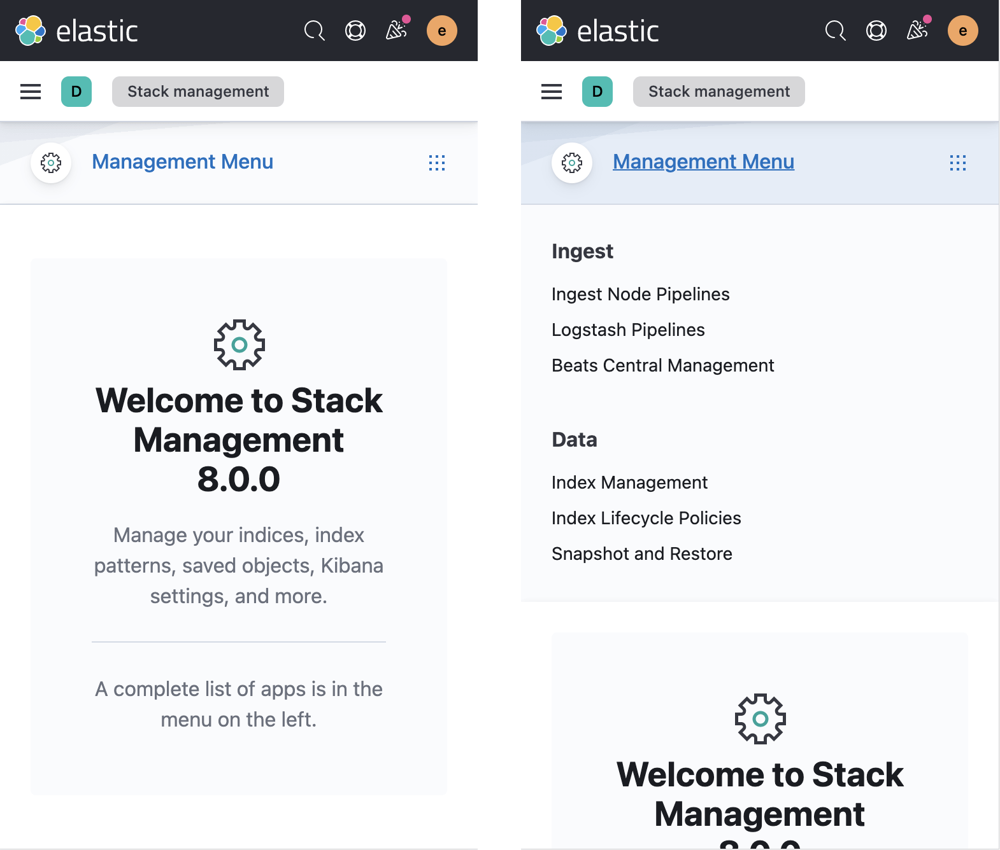

<DocCallOut color="warning" title="Multiple Packages">
  Be sure to import the `KibanaPageTemplate` from `@kbn/shared-ux-page-kibana-template`.
</DocCallOut>

`KibanaPageTemplate` is a Kibana-specific wrapper around [EuiPageTemplate](https://elastic.github.io/eui/#/templates/page-template) and it's namespaced components such as `KibanaPageTemplate.Header`. This component makes setting up common types of Kibana pages quicker and easier while also adhering to certain Kibana-specific requirements and patterns.

**Refer to EUI's own documentation on [**EuiPageTemplate**](https://elastic.github.io/eui/#/templates/page-template) for constructing page layouts and inherited props.**

The following props are Kibana-specific extensions.

## `solutionNav`

To add left side navigation for your solution, we recommend using the provided `solutionNav` prop which is an object that extends [**EuiSideNavProps**](https://elastic.github.io/eui/#/navigation/side-nav).

Simply pass your array of `solutionNav.items` and the required `solution.name` and the template component will then handle the mobile views and collapsibility. For solutions and larger applications, we recommend also passing an `solutionNav.icon`.

```tsx
<KibanaPageTemplate
  solutionNav={{
    name: 'Management',
    icon: 'managementApp',
    items: [
      {
        name: 'Root item',
        items: [
          { name: 'Navigation item', href: '#' },
          { name: 'Navigation item', href: '#' },
        ]
      }
    ]
  }}
>
  {...}
</KibanaPageTemplate>
```

> When using `EuiSideNav`, root level items should not be linked but provide section labelling only.




If you need custom solution navigation **content**, you can pass your own `solutionNav.children` instead of the items or supply your own componen with `<KibanaPageTemplate.Sidebar>` We still recommend using [**EuiSideNav**](https://elastic.github.io/eui/#/navigation/side-nav).

## `noDataConfig`

Increases the consistency in messaging across all the solutions during the getting started process when no data exists. Each solution/template instance decides when is the most appropriate time to show this configuration, but is messaged specifically towards having **no indices and/or data views at all or that match the particular solution**.

This is a built-in configuration that displays a very specific UI and requires very specific object keys. It will also ignore all other configurations of the template including `pageHeader` and `children`, with the exception of continuing to show `solutionNav`.

The `noDataConfig` is of type [`NoDataPageProps`](https://github.com/elastic/kibana/blob/main/packages/kbn-shared-ux-components/src/page_template/no_data_page/types.ts):

1. `solution: string`: Single name for the current solution, used to auto-generate the title, logo, and description _(required)_
2. `docsLink: string`: Required to set the docs link for the whole solution _(required)_
3. `logo?: string`: Optionally replace the auto-generated logo
4. `pageTitle?: string`: Optionally replace the auto-generated page title (h1)
5. `action: NoDataPageActions`: An object of `NoDataPageActions` configurations with a single primary key _(required)_

### `NoDataPageActions`

There is currently only one promotoed path to ingesting data and that is through the Fleet / Ingest UI. This gets presented to the user by rendering a card that provides consistent messaging. It is mostly pre-configured but require specific `href`s and/or `onClick` handlers for directing the user to the right location for that solution.

Optionally you can also replace the `button` label by passing a string, or the whole button component by passing a `ReactNode`.

```tsx
// Perform your own check
const hasData = checkForData();

// No data configuration
const noDataConfig: KibanaPageTemplateProps['noDataConfig'] = {
  solution: 'Analytics',
  logo: 'logoKibana',
  docsLink: '#',
  action: {
    elasticAgent: {
      href: '#',
    },
  },
};

// Conditionally apply the configuration if there is no data
<KibanaPageTemplate
  solutionNav={/* Solution navigation still show if it exists and use the right template type */}
  pageHeader={/* Page header will be ignored */}
  noDataConfig={hasData ? undefined : noDataConfig}
>
  {/* Children will be ignored */}
</KibanaPageTemplate>;
```


## `isEmptyState`

Use the `isEmptyState` prop for when there is no page **content** to show. This is for when the user **has data** but has not created the thing that the page displays. For example, before the user has created something, when no search results are found, before data is populated, or when permissions aren't met.

This prop is a simple boolean uses any `pageHeader` info provided to populate an centered [**EuiPageTemplate.EmptyPrompt**](https://elastic.github.io/eui/#/templates/page-template#empty-pages-or-content).

```tsx
<KibanaPageTemplate
  isEmptyState={true}
  pageHeader={{
    iconType: 'dashboardApp',
    pageTitle: 'Dashboards',
    description: "You don't have any dashboards yet.",
    rightSideItems: [
      <EuiButton fill iconType="plusInCircleFilled">
        Create new dashboard
      </EuiButton>,
    ],
  }}
/>
```


<DocCallOut color="warning" title="Missing page header content can lead to an anemic empty state">
  Because all properties of the page header are optional, the empty state has the potential to
  render blank. Make sure your empty state doesn't leave the user confused.
</DocCallOut>

### Custom empty states

You can also provide a custom empty prompt to replace the pre-built one using [`KibanaPageTemplate.EmptyPrompt`](https://elastic.github.io/eui/#/display/empty-prompt) as a child of KibanaPageTemplate.

```tsx
<KibanaPageTemplate>
  <KibanaPageTemplate.EmptyPrompt
    title={<h1>No data</h1>}
    body="You have no data. Would you like some of ours?"
    actions={[
      <EuiButton fill iconType="plusInCircleFilled">
        Get sample data
      </EuiButton>,
    ]}
  />
</KibanaPageTemplate>
```


### Empty states with a page header

When passing both a `pageHeader` configuration and rendering a `KibanaPageTemplate.EmptyPrompt`, be sure to reduce the heading level within your child empty prompt to `<h2>`.

```tsx
<KibanaPageTemplate
  pageHeader={{
    pageTitle: 'Dashboards',
  }}
>
  <KibanaPageTemplate.EmptyPrompt
    title={<h2>No data</h2>}
    body="You have no data. Would you like some of ours?"
    actions={[
      <EuiButton fill iconType="plusInCircleFilled">
        Get sample data
      </EuiButton>,
    ]}
  />
</KibanaPageTemplate>
```


