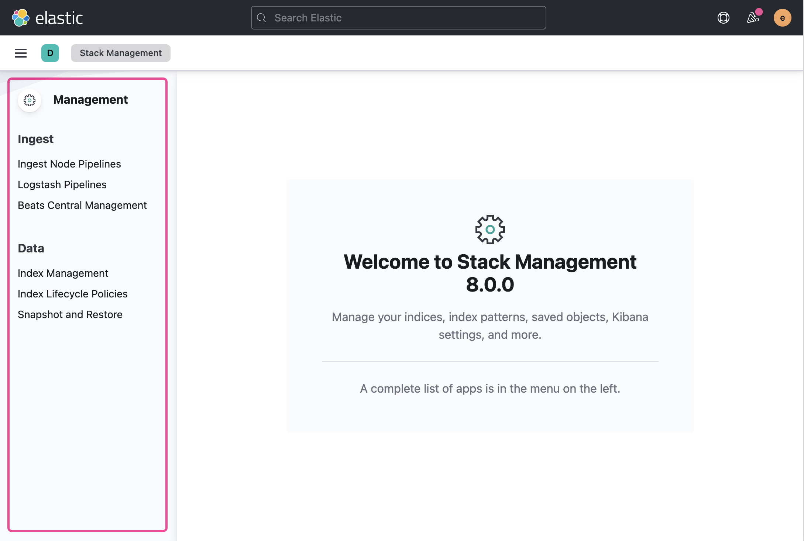

`KibanaPageLayout` is a thin wrapper around [**EuiPageTemplate**](https://elastic.github.io/eui/#/layout/page) that makes setting up common types of Kibana pages quicker and easier while also adhering to any Kibana-specific requirements and patterns.

Refer to EUI's documentation on [**EuiPageTemplate**](https://elastic.github.io/eui/#/layout/page) for constructing page layouts.

## `isEmptyState`

Use the `isEmptyState` prop for when there is no page content to show. For example, before the user has created something, when no search results are found, before data is populated, or when permissions aren't met.

The default empty state uses any `pageHeader` info provided to populate an [**EuiEmptyPrompt**](https://elastic.github.io/eui/#/display/empty-prompt) and uses the `centeredBody` template type.

```tsx
<KibanaPageLayout
  isEmptyState={true}
  pageHeader={{
    iconType: 'dashboardApp',
    pageTitle: 'Dashboards',
    description: "You don't have any dashboards yet.",
    rightSideItems: [
      <EuiButton fill iconType="plusInCircleFilled">
        Create new dashboard
      </EuiButton>,
    ],
  }}
/>
```


<DocCallOut color="warning" title="Missing page header content can lead to an anemic empty state">
  Because all properties of the page header are optional, the empty state has the potential to
  render blank. Make sure your empty state doesn't leave the user confused.
</DocCallOut>

### Custom empty state

You can also provide a custom empty prompt to replace the pre-built one. You'll want to remove any `pageHeader` props and pass an [**EuiEmptyPrompt**](https://elastic.github.io/eui/#/display/empty-prompt) directly as the child of KibanaPageLayout.

```tsx
<KibanaPageLayout isEmptyState={true}>
  <EuiEmptyPrompt
    title={<h1>No data</h1>}
    body="You have no data. Would you like some of ours?"
    actions={[
      <EuiButton fill iconType="plusInCircleFilled">
        Get sample data
      </EuiButton>,
    ]}
  />
</KibanaPageLayout>
```


### Empty states with a page header

When passing both a `pageHeader` configuration and `isEmptyState`, the component will render the proper template (`centeredContent`). Be sure to reduce the heading level within your child empty prompt to `<h2>`.

```tsx
<KibanaPageLayout
  isEmptyState={true}
  pageHeader={{
    pageTitle: 'Dashboards',
  }}
>
  <EuiEmptyPrompt
    title={<h2>No data</h2>}
    body="You have no data. Would you like some of ours?"
    actions={[
      <EuiButton fill iconType="plusInCircleFilled">
        Get sample data
      </EuiButton>,
    ]}
  />
</KibanaPageLayout>
```


## Solution navigation

To add left side navigation for your solution, simply pass in your navigation component to `pageSideBar`. We recommend using [**EuiSideNav**](https://elastic.github.io/eui/#/navigation/side-nav).

When using `EuiSideNav`, root level items should not be linked but provide section labelling only.

```tsx
<KibanaPageLayout
  pageSideBar={
    <EuiSideNav
      mobileTitle="Management menu"
      toggleOpenOnMobile={toggleOpenOnMobile}
      isOpenOnMobile={isSideNavOpenOnMobile}
      items={[
        {
          name: 'Root item',
          items: [
            { name: 'Navigation item' },
            { name: 'Navigation item' },
          ]
        }
      ]}
    />
  }
>
  {...}
</KibanaPageLayout>
```





Kibana has particular patterns for displaying solution navigation through the `pageSideBar` prop. When passing in content via `pageSideBar`, we also encourage passing more information about your `solution`. This `solution` object requires the `name` of your solution and optionally allows passing an `icon` to showcase the logo. It also extends [**EuiTitle**](https://elastic.github.io/eui/#/display/title) for passing any other common props.

```tsx
<KibanaPageLayout
  solution={{
    name: 'Management',
    icon: 'managementApp',
    id: 'stack-management-nav-header',
  }}
  pageSideBar={
    <EuiSideNav
      mobileTitle="Management menu"
      toggleOpenOnMobile={toggleOpenOnMobile}
      isOpenOnMobile={isSideNavOpenOnMobile}
      items={[
        {
          name: 'Root item',
          items: [
            { name: 'Navigation item' },
            { name: 'Navigation item' },
          ]
        }
      ]}
    />
  }
>
  {...}
</KibanaPageLayout>
```

