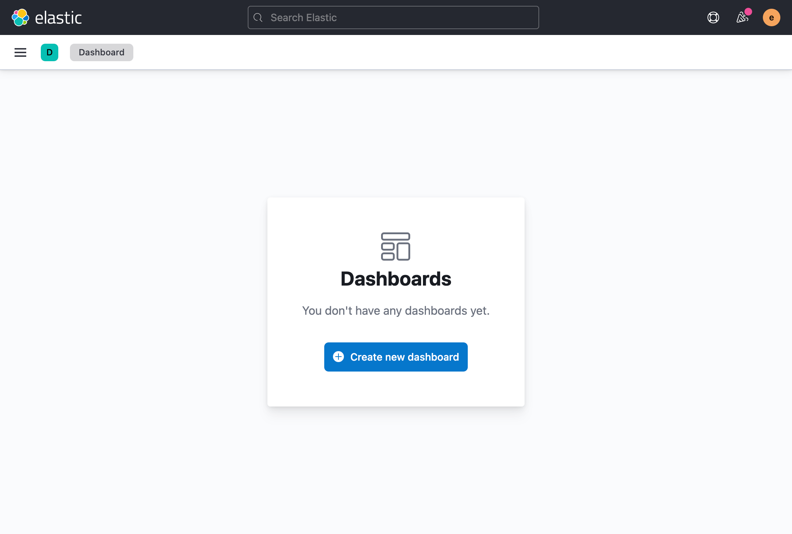

`KibanaPageTemplate` is a thin wrapper around [EuiPageTemplate](https://elastic.github.io/eui/#/layout/page) that makes setting up common types of Kibana pages quicker and easier while also adhering to any Kibana-specific requirements and patterns.

Refer to EUI's documentation on [**EuiPageTemplate**](https://elastic.github.io/eui/#/layout/page) for constructing page layouts.

## `isEmptyState`

Use the `isEmptyState` prop for when there is no page content to show. For example, before the user has created something, when no search results are found, before data is populated, or when permissions aren't met.

The default empty state uses any `pageHeader` info provided to populate an [**EuiEmptyPrompt**](https://elastic.github.io/eui/#/display/empty-prompt) and uses the `centeredBody` template type.

```tsx
<KibanaPageTemplate
  isEmptyState={true}
  pageHeader={{
    iconType: 'dashboardApp',
    pageTitle: 'Dashboards',
    description: "You don't have any dashboards yet.",
    rightSideItems: [
      <EuiButton fill iconType="plusInCircleFilled">
        Create new dashboard
      </EuiButton>,
    ],
  }}
/>
```



<DocCallOut color="warning" title="Missing page header content can lead to an anemic empty state">
  Because all properties of the page header are optional, the empty state has the potential to
  render blank. Make sure your empty state doesn't leave the user confused.
</DocCallOut>

### Custom empty state

You can also provide a custom empty prompt to replace the pre-built one. You'll want to remove any `pageHeader` props and pass an [`EuiEmptyPrompt`](https://elastic.github.io/eui/#/display/empty-prompt) directly as the child of KibanaPageTemplate.

```tsx
<KibanaPageTemplate isEmptyState={true}>
  <EuiEmptyPrompt
    title={<h1>No data</h1>}
    body="You have no data. Would you like some of ours?"
    actions={[
      <EuiButton fill iconType="plusInCircleFilled">
        Get sample data
      </EuiButton>,
    ]}
  />
</KibanaPageTemplate>
```


### Empty states with a page header

When passing both a `pageHeader` configuration and `isEmptyState`, the component will render the proper template (`centeredContent`). Be sure to reduce the heading level within your child empty prompt to `<h2>`.

```tsx
<KibanaPageTemplate
  isEmptyState={true}
  pageHeader={{
    pageTitle: 'Dashboards',
  }}
>
  <EuiEmptyPrompt
    title={<h2>No data</h2>}
    body="You have no data. Would you like some of ours?"
    actions={[
      <EuiButton fill iconType="plusInCircleFilled">
        Get sample data
      </EuiButton>,
    ]}
  />
</KibanaPageTemplate>
```


## `solutionNav`

To add left side navigation for your solution, we recommend passing [**EuiSideNav**](https://elastic.github.io/eui/#/navigation/side-nav) props to the `solutionNav` prop. The template component will then handle the mobile views and add the solution nav embellishments. On top of the EUI props, you'll need to pass your solution `name` and an optional `icon`.

If you need to custom side bar content, you will need to pass you own navigation component to `pageSideBar`. We still recommend using [**EuiSideNav**](https://elastic.github.io/eui/#/navigation/side-nav).

When using `EuiSideNav`, root level items should not be linked but provide section labelling only.

```tsx
<KibanaPageTemplate
  solutionNav={{
    name: 'Management',
    icon: 'managementApp',
    items: [
      {
        name: 'Root item',
        items: [
          { name: 'Navigation item', href: '#' },
          { name: 'Navigation item', href: '#' },
        ]
      }
    ]
  }}
>
  {...}
</KibanaPageTemplate>
```


## `noDataConfig`

Increases the consistency in messaging across all the solutions during the getting started process when no data exists. Each solution/template instance decides when is the most appropriate time to show this configuration, but is messaged specifically towards having no indices or index patterns at all or that match the particular solution.

This is a built-in configuration that displays a very specific UI and requires very specific keys. It will also ignore all other configurations of the template including `pageHeader` and `children`, with the exception of continuing to show `solutionNav`.

The `noDataConfig` is of type [`NoDataPagProps`](https://github.com/elastic/kibana/blob/main/src/plugins/kibana_react/public/page_template/no_data_page/no_data_page.tsx):

1. `solution: string`: Single name for the current solution, used to auto-generate the title, logo, and description *(required)*
2. `docsLink: string`: Required to set the docs link for the whole solution *(required)*
3. `logo?: string`: Optionally replace the auto-generated logo
4. `pageTitle?: string`: Optionally replace the auto-generated page title (h1)
5. `actions: NoDataPageActionsProps`: An object of `NoDataPageActions` configurations with unique primary keys *(required)*

### `NoDataPageActions`

There are two main actions for adding data that we promote throughout Kibana, Elastic Agent and Beats. They are added to the cards that are displayed by using the keys `elasticAgent` and `beats` respectively. For consistent messaging, these two cards are pre-configured but require specific `href`s and/or `onClick` handlers for directing the user to the right location for that solution.

It also accepts a `recommended` prop as a boolean to promote one or more of the cards through visuals added to the UI. It will also place the `recommended` ones first in the list. Optionally you can also replace the `button` label by passing a string, or the whole component by passing a `ReactNode`.


```tsx
// Perform your own check
const hasData = checkForData();

// No data configuration
const noDataConfig: KibanaPageTemplateProps['noDataConfig'] = {
  solution: 'Analytics',
  logo: 'logoKibana',
  docsLink: '#',
  actions: {
    beats: {
      href: '#',
    },
    elasticAgent: {
      href: '#',
    },
  },
};

// Conditionally apply the configuration if there is no data
<KibanaPageTemplate
  solutionNav={/* Solution navigation still show if it exists and use the right template type */}
  pageHeader={/* Page header will be ignored */}
  noDataConfig={hasData ? undefined : noDataConfig}
>
  {/* Children will be ignored */}
</KibanaPageTemplate>
```


