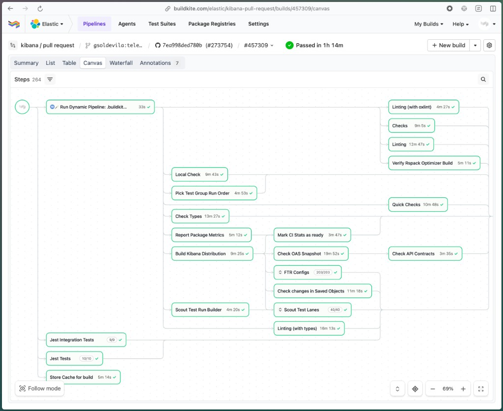
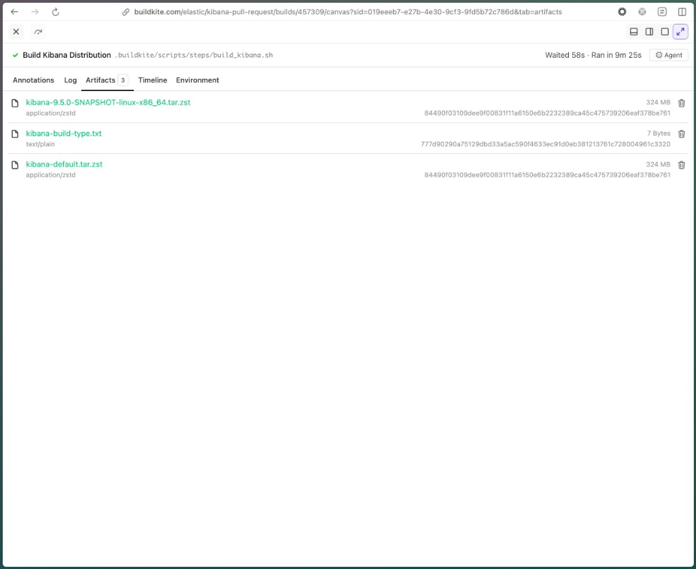

Use this guide when a Kibana change can allocate a large amount of memory during startup or during a specific user or background-task flow.
The goal is to compare a baseline build and a candidate build under the same scenario and record peak memory, not only idle memory.

This is intended for high-risk changes such as:

- loading, parsing, validating, or transforming large packages of data
- installing or upgrading a large number of saved objects
- migrations or model-version changes that touch many objects
- new startup work or plugin setup work
- changes that previously caused, or could plausibly cause, a Serverless out-of-memory event

## RSS vs heap

Measure both RSS and heap. They answer different questions.

- `rss` is the resident set size: the total physical memory mapped by the Kibana server process. This is the number most closely related to container and cgroup out-of-memory risk.
- `heapUsed` is the amount of V8 JavaScript heap currently used by live JavaScript objects. This is usually the best signal for JavaScript allocation changes introduced by your code.
- `heapTotal` is the amount of JavaScript heap V8 has reserved from the OS.
- `external` and `arrayBuffers` are native allocations associated with JavaScript objects, such as `Buffer` and typed-array memory. These contribute to RSS but are not part of `heapUsed`.
- `maxRss` is a monotonic process high-water mark from `process.resourceUsage().maxRSS`. It is useful for peak RSS, but it does not show when the peak happened.

For a high-risk feature, record at least:

- peak `rss`
- peak `maxRss`
- peak `heapUsed`
- average `heapUsed` over the measured scenario
- the scenario used to produce the numbers
- the baseline and candidate commits or artifact build IDs

## Choose the baseline

Pick the baseline before collecting data.

For PR review, prefer the merge-base with the target branch:

```bash
git fetch origin main
BASELINE_REF="$(git merge-base HEAD origin/main)"
TARGET_REF="$(git rev-parse HEAD)"
```

For incident follow-up or release-risk validation, use the code level that best represents production risk, for example the current Serverless release branch or the commit that is already deployed.
Record the exact commit, branch, or artifact build ID in the report.

## Build or obtain distributable artifacts

Use distributable artifacts when possible. They avoid measuring development-mode behavior such as optimizer work, watch mode, and source transpilation.

The artifact platform must match the machine where you run the profiling scenario. A `linux-x86_64` artifact includes a Linux Node.js binary and will not run directly on macOS. For Serverless OOM risk, prefer profiling the Linux artifact on a Linux host or VM. For local workflow validation on macOS, use a macOS artifact or build the distributable locally on macOS.

### Option 1: Build the artifacts locally

Create isolated worktrees for the baseline and candidate. Reusing one checkout and switching branches can leave stale build output behind.

```bash
mkdir -p ../memory-profile-worktrees

git worktree add ../memory-profile-worktrees/kibana-baseline "$BASELINE_REF"
git worktree add ../memory-profile-worktrees/kibana-candidate "$TARGET_REF"
```

Build a distributable in each worktree:

```bash
cd ../memory-profile-worktrees/kibana-baseline
yarn kbn bootstrap
yarn build --skip-os-packages

cd ../kibana-candidate
yarn kbn bootstrap
yarn build --skip-os-packages
```

The archive is created under each worktree's `target/` directory. Its platform and extension depend on the machine where you run the build.

### Option 2: Use Buildkite artifacts from PR CI

PR CI uploads the Linux Kibana archive as `kibana-default.tar.zst` during the post-build step. The `ci:build-cloud-image` label triggers an additional cloud-image build that consumes that same archive, but the label is not the thing that creates the raw Kibana distributable.

By default, this path is only feasible from a Linux host, Linux workstation, or Linux VM because the default PR CI artifacts include Linux binaries and cannot run directly on macOS. If you are working on macOS and want a CI-built macOS artifact, add the `ci:build-all-platforms` label to the PR, trigger a new PR CI run, and download the matching Darwin archive from that new build.

Use this option when you need the exact distributable artifact produced by CI. You need access to the Buildkite build artifacts.

1. Open the `kibana-ci` Buildkite build linked from the PR checks.
2. In the Buildkite build, select the **Canvas** tab.
3. Open the **Build Kibana Distribution** step.



4. Select the **Artifacts** tab for that step.
5. Download `kibana-default.tar.zst`. This is the generic Linux Kibana distributable used by downstream CI steps.



The step also uploads a versioned archive such as `kibana-9.5.0-SNAPSHOT-linux-x86_64.tar.zst`. Either archive can be used for profiling; `kibana-default.tar.zst` is stable to document and script against. These default PR artifacts are Linux artifacts, so run them on Linux.

For macOS users:

1. Add the `ci:build-all-platforms` label to the PR.
2. Trigger a new PR CI run. Adding the label after CI has already completed does not change the already-generated Buildkite pipeline.
3. Open the new `kibana-ci` Buildkite build.
4. Go to **Canvas** > **Build Kibana Distribution** > **Artifacts**.
5. Download the artifact that matches your machine:
   - Apple Silicon: `kibana-<version>-SNAPSHOT-darwin-aarch64.tar.*`
   - Intel Mac: `kibana-<version>-SNAPSHOT-darwin-x86_64.tar.*`

Use `ci:build-all-platforms` sparingly. It adds extra platform packaging and larger artifacts to the PR build.

If your scenario specifically requires deploying the cloud image, use the `ci:build-cloud-image` label and record the cloud image annotation from the `Build Cloud Image` step. For process-level memory profiling, use the raw distributable artifact.

## Unpack the artifacts

Create separate run directories:

```bash
mkdir -p /tmp/kibana-memory-profile/{baseline,candidate}
```

Set the archive paths, then unpack them:

```bash
BASELINE_ARCHIVE="../memory-profile-worktrees/kibana-baseline/target/<baseline-kibana-archive>"
CANDIDATE_ARCHIVE="../memory-profile-worktrees/kibana-candidate/target/<candidate-kibana-archive>"

unpack_kibana_archive() {
  local archive="$1"
  local destination="$2"

  case "$archive" in
    *.tar.zst) zstd -dc "$archive" | tar -xf - -C "$destination" --strip=1 ;;
    *.tar.gz) tar -xzf "$archive" -C "$destination" --strip=1 ;;
    *) echo "Unsupported archive format: $archive" >&2; return 1 ;;
  esac
}

unpack_kibana_archive "$BASELINE_ARCHIVE" /tmp/kibana-memory-profile/baseline
unpack_kibana_archive "$CANDIDATE_ARCHIVE" /tmp/kibana-memory-profile/candidate
```

Replace `<baseline-kibana-archive>` and `<candidate-kibana-archive>` with the archive filenames from each `target/` directory. If you downloaded `kibana-default.tar.zst` from CI, use the downloaded file path instead.

## Create a local peak-memory probe

Until Kibana has a merged on-demand peak-memory profiler, use a small local Node probe.
The probe is injected with `NODE_OPTIONS=--require=...`, so it records Node processes started by the Kibana distributable, including the Kibana server process, without modifying the artifact.

Create `/tmp/kibana_peak_memory_probe.cjs`:

```js
const fs = require('fs');
const path = require('path');

const outputDir = process.env.KBN_MEM_PROFILE_DIR || process.cwd();
const runName = process.env.KBN_MEM_PROFILE_RUN || 'kibana';
const sampleMs = Number(process.env.KBN_MEM_PROFILE_SAMPLE_MS || 250);
const pid = process.pid;
const outputPath = path.join(outputDir, `${runName}-${pid}.ndjson`);
const processesPath = path.join(outputDir, `${runName}-processes.ndjson`);
const processInfo = {
  event: 'process-start',
  timestamp: Date.now(),
  pid,
  ppid: process.ppid,
  cwd: process.cwd(),
  execPath: process.execPath,
  argv: process.argv,
  isLikelyKibanaServer: process.argv.some((arg) => arg.endsWith('/src/cli/kibana/dist')),
};

fs.mkdirSync(outputDir, { recursive: true });
fs.appendFileSync(processesPath, `${JSON.stringify(processInfo)}\n`);
console.error(
  `[kibana-memory-profile] pid=${pid} likelyKibanaServer=${processInfo.isLikelyKibanaServer} output=${outputPath} argv=${process.argv.join(
    ' '
  )}`
);

const sample = (event = 'sample') => {
  const memory = process.memoryUsage();
  const resourceUsage = process.resourceUsage();

  fs.appendFileSync(
    outputPath,
    `${JSON.stringify({
      event,
      timestamp: Date.now(),
      pid,
      ppid: process.ppid,
      isLikelyKibanaServer: processInfo.isLikelyKibanaServer,
      argv: process.argv,
      rss: memory.rss,
      heapTotal: memory.heapTotal,
      heapUsed: memory.heapUsed,
      external: memory.external,
      arrayBuffers: memory.arrayBuffers,
      maxRss: process.platform === 'darwin' ? resourceUsage.maxRSS : resourceUsage.maxRSS * 1024,
    })}\n`
  );
};

sample('start');

const interval = setInterval(sample, sampleMs);
interval.unref();

process.on('exit', () => sample('exit'));
```

The probe may create more than one file if Kibana starts multiple Node processes. Keep all files for the run.

## Prepare Elasticsearch state

Make the Elasticsearch state part of the scenario. Do not reuse an already-warmed Elasticsearch instance unless the scenario explicitly requires it.
Cold start against an empty Elasticsearch data path can trigger Kibana setup, index-creation, migrations, task scheduling, or feature initialization paths that do not run when Kibana connects to a cluster that already contains Kibana indices.

Run `yarn es snapshot` from a bootstrapped Kibana source checkout. Use either a checkout on `main` or the worktree for the revision being tested. If the Elasticsearch snapshot configuration matters for the scenario, use the matching baseline or candidate worktree for that run.

For cold-start or startup-memory checks, restart Elasticsearch with a fresh data path for every baseline and candidate run:

```bash
rm -rf /tmp/kibana-memory-profile/es-data/baseline-round-1
yarn es snapshot -E path.data=/tmp/kibana-memory-profile/es-data/baseline-round-1
```

Wait for the terminal to report that Elasticsearch setup is complete, then start Kibana and run the scenario.
When the run is finished, stop Kibana and Elasticsearch before starting the next round.

Use a new `path.data` value for each run, for example:

- `/tmp/kibana-memory-profile/es-data/baseline-round-1`
- `/tmp/kibana-memory-profile/es-data/candidate-round-1`
- `/tmp/kibana-memory-profile/es-data/baseline-round-2`
- `/tmp/kibana-memory-profile/es-data/candidate-round-2`

If the feature flow requires pre-existing data, seed Elasticsearch from the same archive or script before each run. The important requirement is that baseline and candidate observe the same Elasticsearch state.

## Configure each Kibana artifact

Create a profiling config for the baseline artifact:

```bash
cat > /tmp/kibana-memory-profile/baseline/config/memory-profile.yml <<'YAML'
server.host: "localhost"
server.port: 5601
elasticsearch.hosts: ["http://localhost:9200"]
elasticsearch.username: "kibana_system"
elasticsearch.password: "changeme"
telemetry.enabled: false
xpack.security.encryptionKey: "aaaaaaaaaaaaaaaaaaaaaaaaaaaaaaaa"
xpack.encryptedSavedObjects.encryptionKey: "bbbbbbbbbbbbbbbbbbbbbbbbbbbbbbbb"
xpack.reporting.encryptionKey: "cccccccccccccccccccccccccccccccc"
YAML
```

Create the candidate config on a different port:

```bash
cat > /tmp/kibana-memory-profile/candidate/config/memory-profile.yml <<'YAML'
server.host: "localhost"
server.port: 5602
elasticsearch.hosts: ["http://localhost:9200"]
elasticsearch.username: "kibana_system"
elasticsearch.password: "changeme"
telemetry.enabled: false
xpack.security.encryptionKey: "aaaaaaaaaaaaaaaaaaaaaaaaaaaaaaaa"
xpack.encryptedSavedObjects.encryptionKey: "bbbbbbbbbbbbbbbbbbbbbbbbbbbbbbbb"
xpack.reporting.encryptionKey: "cccccccccccccccccccccccccccccccc"
YAML
```

Adjust these settings if your scenario requires a specific license, space, project type, or plugin configuration.

## Run the baseline scenario

Start the baseline artifact with the probe enabled:

```bash
mkdir -p /tmp/kibana-memory-profile/results/baseline

cd /tmp/kibana-memory-profile/baseline

KBN_MEM_PROFILE_DIR=/tmp/kibana-memory-profile/results/baseline \
KBN_MEM_PROFILE_RUN=baseline \
KBN_MEM_PROFILE_SAMPLE_MS=250 \
NODE_OPTIONS="--require=/tmp/kibana_peak_memory_probe.cjs" \
./bin/kibana \
  --config /tmp/kibana-memory-profile/baseline/config/memory-profile.yml
```

Run Kibana from the unpacked artifact directory, not from a Kibana source checkout or its `target/` directory. Running from a source checkout can make package discovery pick up source `node_modules` and fail with package-manifest validation errors.

Wait until Kibana is available, then run the high-risk scenario exactly once.

Examples:

- Call the API that triggers the feature.
- Run the background task or setup flow you are evaluating.
- Use a Playwright, Scout, or Puppeteer script to drive the UI.

When the scenario finishes and memory has settled for 30-60 seconds, stop Kibana with `Ctrl+C`. Stop Elasticsearch as well if this run uses a cold or isolated Elasticsearch data path.

## Run the candidate scenario

Repeat the same steps against the candidate artifact:

```bash
mkdir -p /tmp/kibana-memory-profile/results/candidate

cd /tmp/kibana-memory-profile/candidate

KBN_MEM_PROFILE_DIR=/tmp/kibana-memory-profile/results/candidate \
KBN_MEM_PROFILE_RUN=candidate \
KBN_MEM_PROFILE_SAMPLE_MS=250 \
NODE_OPTIONS="--require=/tmp/kibana_peak_memory_probe.cjs" \
./bin/kibana \
  --config /tmp/kibana-memory-profile/candidate/config/memory-profile.yml
```

Start Elasticsearch again with the candidate data path, run the same scenario, wait 30-60 seconds, and stop Kibana and Elasticsearch.

For review-quality results, run each side at least three times. Restart Kibana between runs. Restart Elasticsearch with a fresh or equivalently seeded data path between runs unless your scenario intentionally measures a warm cluster. Keep Elasticsearch state, test data, scenario steps, and measured duration consistent across baseline and candidate.

## Compare the results

Save this comparison script as `/tmp/compare_kibana_memory_profiles.cjs`:

```js
const fs = require('fs');
const path = require('path');

const [baselineDir, candidateDir] = process.argv.slice(2);

if (!baselineDir || !candidateDir) {
  throw new Error('Usage: node compare_kibana_memory_profiles.cjs <baseline-dir> <candidate-dir>');
}

const readSamples = (dir) => {
  return fs
    .readdirSync(dir)
    .filter((file) => file.endsWith('.ndjson') && !file.endsWith('-processes.ndjson'))
    .flatMap((file) =>
      fs
        .readFileSync(path.join(dir, file), 'utf8')
        .trim()
        .split('\n')
        .filter(Boolean)
        .map((line) => JSON.parse(line))
    )
    .filter((sample) => {
      return (
        typeof sample.rss === 'number' &&
        typeof sample.maxRss === 'number' &&
        typeof sample.heapUsed === 'number' &&
        typeof sample.external === 'number' &&
        typeof sample.arrayBuffers === 'number'
      );
    });
};

const mean = (values) => values.reduce((total, value) => total + value, 0) / values.length;
const mib = (bytes) => bytes / 1024 / 1024;
const printTable = (tableRows) => {
  const headers = ['metric', 'baselineMiB', 'candidateMiB', 'deltaMiB', 'deltaPct'];
  const rows = [
    headers,
    ...tableRows.map(([metric, baselineMiB, candidateMiB, deltaMiB, deltaPct]) => [
      metric,
      baselineMiB,
      candidateMiB,
      deltaMiB,
      deltaPct,
    ]),
  ];
  const widths = headers.map((_, index) =>
    Math.max(...rows.map((row) => String(row[index]).length))
  );
  const formatRow = (row) => {
    return row.map((value, index) => String(value).padEnd(widths[index])).join('  ');
  };

  console.log(formatRow(headers));
  console.log(widths.map((width) => '-'.repeat(width)).join('  '));
  tableRows.forEach((row) => console.log(formatRow(row)));
};

const summarize = (dir) => {
  const samples = readSamples(dir);

  if (!samples.length) {
    throw new Error(`No samples found in ${dir}`);
  }

  const rss = samples.map((sample) => sample.rss);
  const maxRss = samples.map((sample) => sample.maxRss);
  const heapUsed = samples.map((sample) => sample.heapUsed);
  const external = samples.map((sample) => sample.external + sample.arrayBuffers);

  return {
    files: new Set(samples.map((sample) => sample.pid)).size,
    samples: samples.length,
    peakSampledProcessRss: Math.max(...rss),
    peakProcessMaxRss: Math.max(...maxRss),
    peakProcessHeapUsed: Math.max(...heapUsed),
    averageProcessHeapUsed: mean(heapUsed),
    peakProcessExternalAndArrayBuffers: Math.max(...external),
  };
};

const baseline = summarize(baselineDir);
const candidate = summarize(candidateDir);

const rows = [
  ['metric', 'baseline MiB', 'candidate MiB', 'delta MiB', 'delta %'],
  ...Object.keys(baseline)
    .filter((key) => typeof baseline[key] === 'number' && key !== 'samples' && key !== 'files')
    .map((key) => {
      const left = baseline[key];
      const right = candidate[key];
      const delta = right - left;
      const pct = (delta / left) * 100;
      return [
        key,
        mib(left).toFixed(2),
        mib(right).toFixed(2),
        mib(delta).toFixed(2),
        `${pct.toFixed(1)}%`,
      ];
    }),
];

console.log(`baseline pids: ${baseline.files}, samples: ${baseline.samples}`);
console.log(`candidate pids: ${candidate.files}, samples: ${candidate.samples}`);
printTable(rows.slice(1));
```

Run it:

```bash
node /tmp/compare_kibana_memory_profiles.cjs \
  /tmp/kibana-memory-profile/results/baseline \
  /tmp/kibana-memory-profile/results/candidate
```

If you ran multiple rounds, compare each round and then report the mean of the per-round peaks. Do not combine all samples from all rounds into one peak unless that is explicitly what you want to report.

## Interpreting the numbers

Use these rules when writing the PR or investigation summary:

- Treat higher peak RSS as the closest signal for increased OOM risk.
- Treat higher peak `heapUsed` as the clearest signal for JavaScript allocation growth.
- Treat higher `external + arrayBuffers` as a sign that native or buffer-backed memory changed.
- Expect small differences between local runs. A single run is enough for triage, but not enough for a review decision.
- Compare `averageProcessHeapUsed` only when baseline and candidate use intentionally matched scenario durations. Longer runs contribute more samples and can skew the average.
- If the candidate increases peak memory, explain why the increase is expected or reduce it before merge.
- If the candidate reduces peak memory, report both the absolute MiB reduction and the percent reduction.

Include the following in the PR comment or linked analysis:

- baseline commit or artifact build ID
- candidate commit or artifact build ID
- whether artifacts were local builds, CI artifacts, or cloud images
- exact scenario steps or automation script
- `NODE_OPTIONS`, sample interval, and any memory limit such as `--max_old_space_size`
- number of runs
- peak RSS, peak maxRSS, peak heapUsed, and average heapUsed for each side
- relevant logs, OOMs, or heap snapshots

## When to use existing tools

Use the local probe above when you need a reproducible on-demand peak-memory check today.

Other Kibana memory tooling has different goals:

- Core process metrics report current memory gauges during normal operation. They are useful for observability, but they do not produce a focused peak-memory comparison for a specific feature flow.
- The warm-start memory benchmark compares distributable artifacts in CI and focuses on warm-start memory after Kibana becomes available. It is useful for startup footprint regression detection, but it is not a replacement for feature-specific peak-memory profiling.
- Draft in-console profilers or personal Puppeteer scripts can be useful for exploration. If you use them, record the exact commit, command, scenario, and output files because they are not yet a stable shared workflow.

## Cleanup

Remove temporary worktrees and profiling output when you are done:

```bash
git worktree remove ../memory-profile-worktrees/kibana-baseline
git worktree remove ../memory-profile-worktrees/kibana-candidate
rm -rf /tmp/kibana-memory-profile /tmp/kibana_peak_memory_probe.cjs /tmp/compare_kibana_memory_profiles.cjs
```
