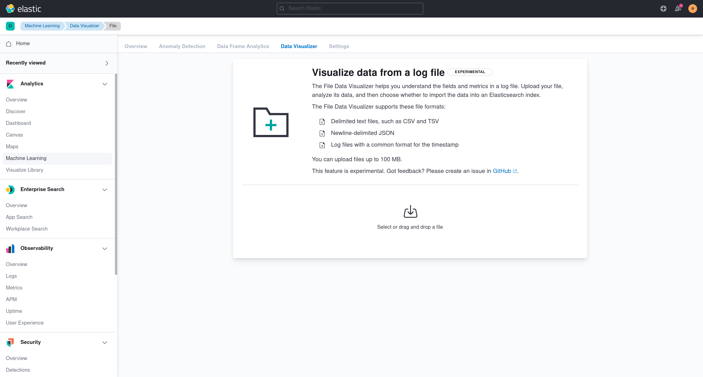

## Installation from the UI

1) Navigate to the home page
1) Click "Add data"
1) Click on the "Sample data" tab
1) Select a dataset by clicking on the "Add data" button


## CSV Upload

1) Navigate to the Machine Learning application
1) Click on the "Data Visualizer" tab
1) Click on "Select file" in the "Import data" container



## makelogs

The makelogs script generates sample web server logs.  Make sure Elasticsearch is running before running the script.

```sh
node scripts/makelogs --auth <username>:<password>
```