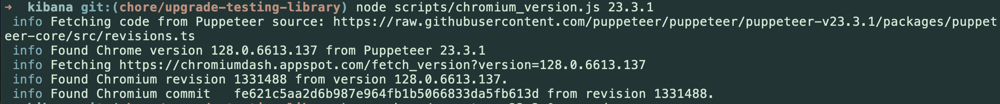

# Updating Puppeteer and Chromium for Kibana

This document builds off of [Keeping Chromium Up-To-Date](https://docs.google.com/presentation/d/19Z6ocVSoNnvY_wPjEG6Wstt-sOuIYkkNr4jqAqT6TGo/edit#slide=id.g6eae63e93f_4_112)

## 1. **Installing new puppeteer version**

- Determine the version for the current latest release by checking [here](https://github.com/puppeteer/puppeteer/releases).
- Install the current version by running `yarn add puppeteer@23.3.1` if we assume for the sake of this guide that the latest version is `23.3.1`. Run `yarn kbn bootstrap` after installing.
- Determine the version of chromium that's been verified to work with this specific version of puppeteer by running the following utility script

 `node scripts/chromium_version.js 23.3.1`
 
 The output of this script looks similar to the following:

  

 Note the Chromium revision and commit values. The revision number is important for selecting the appropriate Chromium that has been pre-built by Google, whilst the commit hash is used to build our variant of headless chromium that gets distributed for Linux variants of Kibana.

## 2. **Specifying Chromium install version for platform variants**

Kibana provides a verified version of Chromium that's guaranteed to work for the version of Puppeteer we are upgrading to. For the Mac and Windows platforms we use the pre-built binaries provided by Google, whilst for Linux we build our own because a pre-built version doesn't exist. This also allows us to strip down the build to the bare minimum required to run reporting.

For the following tasks, we will be updating the file located at [https://github.com/elastic/kibana/blob/main/src/platform/packages/private/kbn-screenshotting-server/src/paths.ts](https://github.com/elastic/kibana/blob/main/src/platform/packages/private/kbn-screenshotting-server/src/paths.ts).

In this file, you will notice a `ChromiumArchivePaths` definition that specifies platform, version, and checksum information. This is how Kibana knows the appropriate Chromium version to install.

We recommend to creating a separate working directory that all the assets for this upgrade would be accessed from.

### **2.1 Determining and specifying Chromium version for Mac and Windows**

We pull the pre-built binaries for Mac and Windows from Google using the provided [API endpoint](https://github.com/GoogleChromeLabs/chrome-for-testing#json-api-endpoints). Access the `known-good-versions-with-downloads` JSON file and find the desired version and revision. For example, for version `139.0.7258.138`, revision `1477651`, we find

```
{
  "version": "139.0.7258.138",
  "revision": "1477651",
  "downloads": {
    "chrome": [
      {
            "platform": "linux64",
            "url": "https://storage.googleapis.com/chrome-for-testing-public/139.0.7258.138/linux64/chrome-linux64.zip"
      },
      {
            "platform": "mac-arm64",
            "url": "https://storage.googleapis.com/chrome-for-testing-public/139.0.7258.138/mac-arm64/chrome-mac-arm64.zip"
      },
      {
            "platform": "mac-x64",
            "url": "https://storage.googleapis.com/chrome-for-testing-public/139.0.7258.138/mac-x64/chrome-mac-x64.zip"
      },
      {
            "platform": "win32",
            "url": "https://storage.googleapis.com/chrome-for-testing-public/139.0.7258.138/win32/chrome-win32.zip"
      },
      {
            "platform": "win64",
            "url": "https://storage.googleapis.com/chrome-for-testing-public/139.0.7258.138/win64/chrome-win64.zip"
      }
    ],
    "chromedriver": [
      {
            "platform": "linux64",
            "url": "https://storage.googleapis.com/chrome-for-testing-public/139.0.7258.138/linux64/chromedriver-linux64.zip"
      },
      {
            "platform": "mac-arm64",
            "url": "https://storage.googleapis.com/chrome-for-testing-public/139.0.7258.138/mac-arm64/chromedriver-mac-arm64.zip"
      },
      {
            "platform": "mac-x64",
            "url": "https://storage.googleapis.com/chrome-for-testing-public/139.0.7258.138/mac-x64/chromedriver-mac-x64.zip"
      },
      {
            "platform": "win32",
            "url": "https://storage.googleapis.com/chrome-for-testing-public/139.0.7258.138/win32/chromedriver-win32.zip"
      },
      {
            "platform": "win64",
            "url": "https://storage.googleapis.com/chrome-for-testing-public/139.0.7258.138/win64/chromedriver-win64.zip"
      }
    ],
    "chrome-headless-shell": [
      {
            "platform": "linux64",
            "url": "https://storage.googleapis.com/chrome-for-testing-public/139.0.7258.138/linux64/chrome-headless-shell-linux64.zip"
      },
      {
            "platform": "mac-arm64",
            "url": "https://storage.googleapis.com/chrome-for-testing-public/139.0.7258.138/mac-arm64/chrome-headless-shell-mac-arm64.zip"
      },
      {
            "platform": "mac-x64",
            "url": "https://storage.googleapis.com/chrome-for-testing-public/139.0.7258.138/mac-x64/chrome-headless-shell-mac-x64.zip"
      },
      {
            "platform": "win32",
            "url": "https://storage.googleapis.com/chrome-for-testing-public/139.0.7258.138/win32/chrome-headless-shell-win32.zip"
      },
      {
            "platform": "win64",
            "url": "https://storage.googleapis.com/chrome-for-testing-public/139.0.7258.138/win64/chrome-headless-shell-win64.zip"
      }
    ]
  }
}
```

We want to download the archives for `chrome-headless-shell` for the desired platform variants. As of this writing, those are

  - `chrome-headless-shell-mac-x64.zip`
  - `chrome-headless-shell-mac-arm64.zip`
  - `chrome-headless-shell-win64.zip`

For each of these downloads, we want to calculate the `archiveChecksum` and the `binaryChecksum` and update these values in [https://github.com/elastic/kibana/blob/main/src/platform/packages/private/kbn-screenshotting-server/src/paths.ts](https://github.com/elastic/kibana/blob/main/src/platform/packages/private/kbn-screenshotting-server/src/paths.ts).

Let's do this for `chrome-headless-shell-mac-x64.zip`:

- Download the file
- Navigate to the download folder and compute the archive checksum using whatever built in checksum utility you have. For example `sha256sum chrome-headless-shell-mac-x64.zip`.
- Copy the checksum to the `archiveChecksum` field
- Extract the contents of the archive
- Compute the binary checksum of the headless shell inside the extracted folder. For example `sha256sum chrome-headless-shell-mac-arm64/chrome-headless-shell`
- Copy this checksum to the `binaryChecksum` field

At the end of this step, you should have updated `ChromiumArchivePaths` for `platform=darwin` and `platform=windows`.

### **2.2 Building Chromium for Linux**

We build a custom headless chromium variant for Linux on a GCP VM. Before starting this, ensure you have all the required [pre-requisites](#prereqs).

Create a VM in GCP using a VM template (which has been configured with the appropriate compute, network and build requirements):

- Navigate to the [GCP Cloud Console](https://console.cloud.google.com/compute/instances?project=elastic-kibana-184716)
- Click `Create instance` button at the top of the page
- Ignore the form and click `Create VM from...` button at the top of the page. Select `Instance templates`
- Select the `rd-build-chromium-linux` from the flyout and click `Customize` (not `Create`)
- Update the name of the VM. It defaults to something like `rd-build-chromium-linux-20250825-191605`. Update this to something easier to filter on.
- Click `Create` to create the VM.

**Note that this VM costs $4.22/hr to run! Make sure to delete it when you're done and consider stopping it if you're not working continuously on it.**	

Once you have your VM, you can SSH into the instance and follow the instructions for [building chromium](https://github.com/elastic/kibana/tree/main/x-pack/build_chromium).

- Get the SSH command by navigating to the GCP Cloud Console for your instance, clicking the `SSH` dropdown at the top left of the page and selecting `View gcloud command`. The command will look something like
  ```
  gcloud compute ssh --zone "us-central1-a" "rd-eokoneyo-build-chromium-linux" --project "elastic-kibana-184716" --ssh-key-file ~/.ssh/id_ed25519
  ```
  Depending on the setup you have you might not need to pass your SSH key, but if it's slightly different you might need to pass a key that's identifiable by google using the **"--ssh-key-file"** option.
- Run the command in your local terminal to connect to the VM

  **Note**: If you have issues connecting, ensure that your local SSH keys are added to your GCP account. You can do this by navigating to the [Metadata section](https://console.cloud.google.com/compute/metadata/sshKeys?project=elastic-kibana-184716) of the GCP Cloud Console and adding your public SSH key.
- Once you are SSH'd into the instance, follow the instructions in the [build script](https://github.com/elastic/kibana/tree/main/x-pack/build_chromium)  
- It is likely that you will not have permissions within the VM to upload the build artifacts into the destination bucket. In this case, you will see the following error at the end of the script:
  ```
   > gsutil cp /home/ying/chromium/chromium/src/out/headless/chromium-884e54e-locales-linux_arm64.zip gs://headless_shell_staging
  Copying file:///home/ying/chromium/chromium/src/out/headless/chromium-884e54e-locales-linux_arm64.zip [Content-Type=application/zip]...
  ResumableUploadAbortException: 403 Provided scope(s) are not authorized
  Traceback (most recent call last):
  File "/home/ying/chromium/./build_chromium/build.py", line 125, in <module>
    runcmd('gsutil cp ' + path.join(src_path, zip_filename) + ' gs://headless_shell_staging')
  File "/home/ying/chromium/build_chromium/build_util.py", line 15, in runcmd
    raise Exception(cmd + ' returned ' + str(result))
  Exception: gsutil cp /home/ying/chromium/chromium/src/out/headless/chromium-884e54e-locales-linux_arm64.zip gs://headless_shell_staging returned 256
  ```
  This is fine, we'll deal with it later.
- After each build (for `x64` and `arm64`), copy the archives from the VM to your local machine. We want to copy after each build because the build script will clean the directories between builds.
- Exit the VM and run the following commands to copy the build artifacts:
  ```
  # create a working directory to contain the build artifacts
  mkdir ~/chromium; cd ~/chromium

  gcloud compute scp --zone "us-central1-a" --project "elastic-kibana-184716" <instanceName>:~/chromium/chromium/src/out/headless/chromium-884e54e-locales-linux_arm64.zip .
  gcloud compute scp --zone "us-central1-a" --project "elastic-kibana-184716" <instanceName>:~/chromium/chromium/src/out/headless/chromium-884e54e-locales-linux_arm64.sha256 .
  ```
  Note that the exact path on the VM may differ and the filename will differ because it is based on the commit hash.
- Once both files are built and copied, compute the `archiveChecksum` and `binaryChecksum` and update [https://github.com/elastic/kibana/blob/main/src/platform/packages/private/kbn-screenshotting-server/src/paths.ts](https://github.com/elastic/kibana/blob/main/src/platform/packages/private/kbn-screenshotting-server/src/paths.ts). We can use the downloaded `sha256` file as a sanity check.
- Upload the build artifacts and the sha256 files to the GCP storage buckets:
  ```
  gsutil cp ./chromium-fe621c5-locales-linux_* gs://headless_shell_staging
  gsutil cp ./chromium-fe621c5-locales-linux_* gs://headless_shell
  ```

You are done with the build! At this point you can delete the VM and move on to testing!

## 3. Testing

### **3.1 Locally**

The first step of verification is to start kibana, locally. On whatever machine you use kibana should be able to download the new version of chromium from the updated path.ts file, it might help to add the following to your kibana.yml;

```
  logging.loggers:
    - name: plugins.reporting
      level: debug
    - name: plugins.screenshotting
      level: debug
```
so we can verify that on requesting report generation the chromium version being used is indeed the one we just provided;

### **3.2 Docker**

This step is required to validate our linux builds, especially considering that we are mostly developing with machines that have a GUI, For this step you want to follow the instructions outlined in an example puppeteer update PR [https://github.com/elastic/kibana/pull/192345](https://github.com/elastic/kibana/pull/192345)

### 3.3 **CI**

CI also runs against the build too pulling the assets we upload to the buckets, to run integration test.

## <span id="prereqs">Pre-requisites</span>

#### Access to the `elastic-kibana` project

You will need access to the `elastic-kibana` project on Google Cloud Console. Check your access [here](https://console.cloud.google.com/compute/instances?project=elastic-kibana-184716). If you do not have access, contact your manager.

#### Google Cloud CLI and `gsutil`

- Install Google Cloud CLI [as explained here](https://cloud.google.com/sdk/docs/install). Alternatively, you can install using [brew](https://formulae.brew.sh/cask/google-cloud-sdk).
- Install `gsutil` [as explained here](https://cloud.google.com/storage/docs/gsutil_install)
- Set up and authenticate with the CLI: `gcloud init`
- When running `gcloud init`, you will be prompted for some inputs. Here are some suggested responses:

 ```
 Settings from your current configuration [default] are:
 compute:
   region: us-central1
   zone: us-central1-a
 core:
   account: <your email>@elastic.co
   disable_usage_reporting: 'True'
   project: elastic-kibana-184716
 ```

