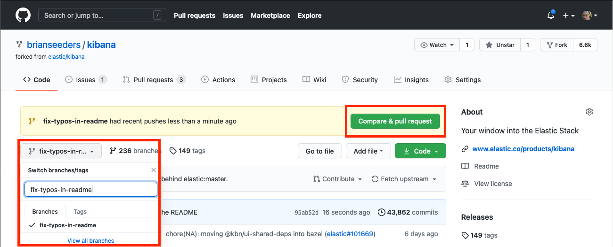
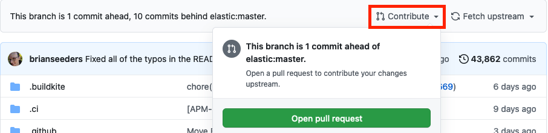
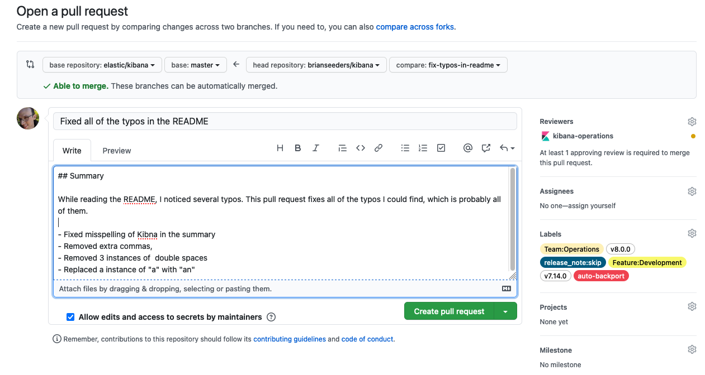

## Create and clone a fork of Kibana

Kibana has hundreds of developers, some of whom are outside of Elastic, so we use a fork-based approach for creating branches and pull requests.

To create and clone a fork:

1. Login to [GitHub](https://github.com)
2. Navigate to the [Kibana repository](https://github.com/elastic/kibana)
3. Follow the [GitHub instructions](https://docs.github.com/en/get-started/quickstart/fork-a-repo) for forking and cloning repos

## Create a branch

After cloning your fork and navigating to the directory containing your fork:

```bash
# Make sure you currently have the branch checked out off of which you'd like to work
git checkout main

# Create a new branch
git checkout -b fix-typos-in-readme

# Edit some code
vi README.md

# Add/commit the change
git add README.md
git commit -m "Fixed all of the typos in the README"

# Push the branch to your fork
git push -u origin fix-typos-in-readme
```

If this is a new branch, you will see a link in your terminal that points you directly to a page to create a pull request for that branch.

## Create a pull request

1. Navigate to your fork in Github
2. If you see your branch at the top of the screen with a `Compare & pull request` button, click that. Otherwise:
   1. Navigate to your branch
   2. Click Contribute, followed by `Open pull request`
3. Fill out the details that are relevant for your change in the pull request template
   1. If your pull request relates to an open issue, you can also reference that issue here, e.g. `Closes #12345`
4. [Elastic employees only] Add any teams/people that need to review your code under Reviewers. There's a good chance one or more teams will automatically be added based on which part of the codebase in which your changes were made.
5. [Elastic employees only] Add any relevant labels
   1. Versions: Add a label for each version of Kibana in which your change will ship. For example, `v8.0.0`, `v7.14.0`
   2. Features: Add labels for any relevant feature areas, e.g. `Feature:Development`
   3. Team: Most PRs should have at least one `Team:` label. Add labels for teams that should follow or are responsible for the pull request.
   4. Release Note: Add `release_note:skip` if this pull request should not automatically get added to release notes for Kibana
   5. Auto Backport: Add `auto-backport` if you'd like your pull request automatically backported to all labeled versions.
6. Submit the pull request. If it's not quite ready for review, it can also be submitted as a Draft pull request.







## Sign the Contributor Agreement

If this is your first pull request, a bot will post a comment asking you to sign our [CLA / Contributor Agreement](https://www.elastic.co/contributor-agreement). Your pull request won't be able to be merged until you've reviewed and signed the agreement.

## Review Process

At this point, your pull request will be reviewed, discussed, etc. Changes will likely be requested. For complex pull requests, this process could take several weeks. Please be patient and understand we hold our code base to a high standard.

See [Pull request review guidelines](https://www.elastic.co/guide/en/kibana/master/pr-review.html) for our general philosophy for pull request reviews.

## Updating your PR with upstream

If your pull request hasn't been updated with the latest code from the upstream/target branch, e.g. `main`, in the last 48 hours, it won't be able to merge until it is updated. This is to help prevent problems that could occur by merging stale code into upstream, e.g. something new was recently merged that is incompatible with something in your pull request.

As an alternative to using `git` to manually update your branch, you can leave a comment on your pull request with the text `@elasticmachine merge upstream`. This will automatically update your branch and kick off CI for it.

## Re-triggering CI

The easiest way to re-trigger CI is to simply update your branch (see above) with the latest code from upstream. This has the added benefit of ensuring that your branch is up-to-date and compatible.
