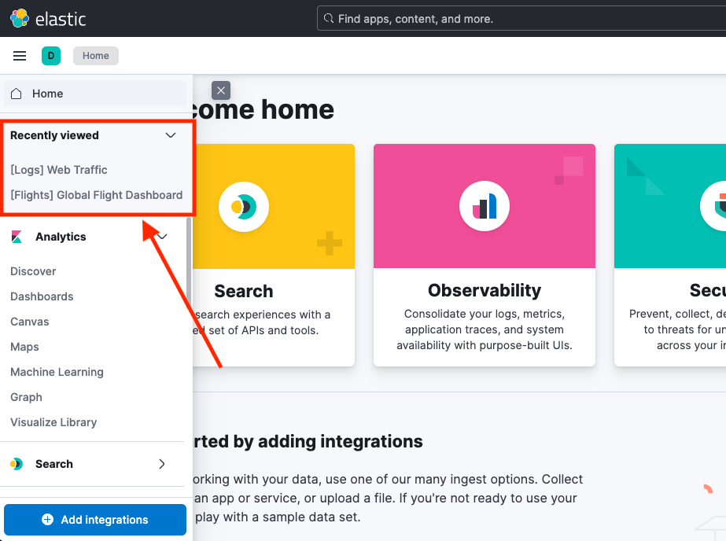

# Recently viewed [chrome-recently-viewed]

`chrome.recentlyAccessed` lets an application register objects the user may want to open again. Use it for durable resources such as a dashboard or saved search, not for every page view or transient UI state.

Register a unique `id`, a `label`, and a `link`. The same `id` replaces the existing entry.

```ts
const link = '/app/map/1234';
const label = 'Map 1234';
const id = 'map-1234';

coreStart.chrome.recentlyAccessed.add(link, label, id);
```

When the current object's state changes, add again with the same `id`:

```ts
coreStart.chrome.recentlyAccessed.add(`/app/map/1234`, label, id);

coreStart.chrome.recentlyAccessed.add(
  `/app/map/1234?timeRangeFrom=now-30m&timeRangeTo=now`,
  label,
  id
);
```



`ChromeRecentlyAccessed` is the chrome service. It is built on `@kbn/recently-accessed`, which stores a local queue of at most 20 items. Apps can instantiate that package themselves for a list that is independent of chrome.