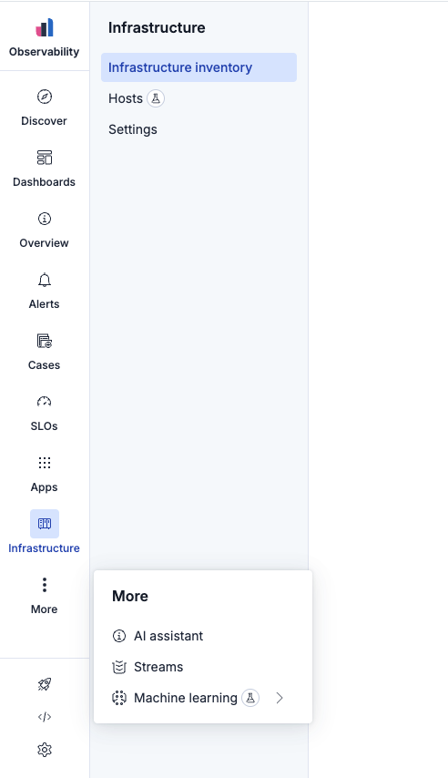
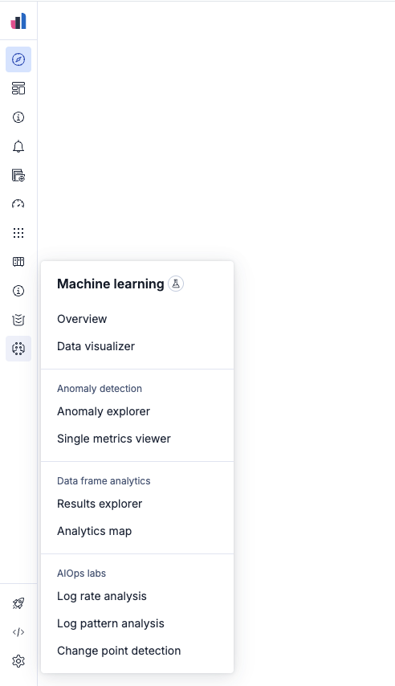

# Side navigation [kbn-ui-side-navigation]

An adaptive side navigation built with [Elastic UI](https://eui.elastic.co/). It handles expanded and collapsed layouts, nested secondary menus, and badges.

This is a component-consumer guide for `@kbn/ui-side-navigation`. The package is a platform implementation, not a supported plugin dependency. App code should not import it. Use chrome navigation APIs instead. See [Package visibility](index.md#kbn-ui-package-visibility).

| Expanded mode | Collapsed mode |
| --- | --- |
|  |  |

## Usage

`setWidth` reports the navigation slot width. The host applies that value to the layout, as Storybook's layout story does with `ChromeLayoutConfigProvider`.

```tsx
import React, { useState } from 'react';
import { Navigation } from '@kbn/ui-side-navigation';
import type { MenuItem, SecondaryMenuItem } from '@kbn/ui-side-navigation';
import { ChromeLayout, ChromeLayoutConfigProvider } from '@kbn/ui-chrome-layout';

const navigationItems = {
  primaryItems: [
    {
      id: 'dashboard',
      label: 'Dashboard',
      iconType: 'dashboardApp',
      href: '/dashboard',
    },
    {
      id: 'analytics',
      label: 'Analytics',
      iconType: 'graphApp',
      href: '/analytics',
      sections: [
        {
          id: 'analytics-section',
          items: [
            {
              id: 'overview',
              label: 'Overview',
              href: '/analytics',
            },
            {
              id: 'reports',
              label: 'Reports',
              href: '/analytics/reports',
            },
          ],
        },
      ],
    },
  ],
  footerItems: [
    {
      id: 'settings',
      label: 'Settings',
      iconType: 'gear',
      href: '/settings',
    },
  ],
};

function App() {
  const [isCollapsed, setIsCollapsed] = useState(false);
  const [activeItemId, setActiveItemId] = useState('dashboard');
  const [navigationWidth, setNavigationWidth] = useState(0);

  const handleItemClick = (item: MenuItem | SecondaryMenuItem) => {
    setActiveItemId(item.id);
  };

  return (
    <ChromeLayoutConfigProvider value={{ navigationWidth }}>
      <ChromeLayout
        navigation={
          <Navigation
            activeItemId={activeItemId}
            isCollapsed={isCollapsed}
            items={navigationItems}
            onItemClick={handleItemClick}
            onToggleCollapsed={setIsCollapsed}
            setWidth={setNavigationWidth}
          />
        }
      >
        {/* page content */}
      </ChromeLayout>
    </ChromeLayoutConfigProvider>
  );
}
```

## Navigation structure

Pass a `NavigationStructure` to `items`. Each primary `MenuItem` can include `sections` of `SecondaryMenuItem`s.

A `MenuItem` with sections can set `secondaryMenuTitle` to show a custom header in its secondary menu instead of `label`. Use it for dynamic context, such as the resource currently in view.

```ts
export const navigationItems = {
  primaryItems: [
    {
      id: 'overview',
      label: 'Overview',
      iconType: 'info',
      href: '/overview',
      badgeType: 'techPreview',
    },
    {
      id: 'analytics',
      label: 'Analytics',
      iconType: 'graphApp',
      href: '/analytics/reports',
      secondaryMenuTitle: 'Acme project',
      sections: [
        {
          id: 'reports-section',
          label: 'Reports',
          items: [
            {
              id: 'analytics',
              label: 'Overview',
              href: '/analytics/reports',
            },
            {
              id: 'sales-report',
              label: 'Sales report',
              href: '/analytics/sales',
              badgeType: 'beta',
            },
            {
              id: 'traffic-report',
              label: 'Traffic report',
              href: '/analytics/traffic',
              isExternal: true,
            },
            {
              id: 'conversion-report',
              label: 'Conversion report',
              href: '/analytics/conversion',
              badgeType: 'new',
            },
          ],
        },
      ],
    },
  ],
  footerItems: [
    {
      id: 'settings',
      label: 'Settings',
      iconType: 'gear',
      href: '/settings',
    },
  ],
};
```

## Badges

`badgeType` accepts `new`, `beta`, or `techPreview`.

- A **dot** appears on a primary item when that item or any of its children is `new`.
- A **New** text badge appears on `new` secondary items, and on `new` primary items folded into More.
- **Beta** and **Tech preview** render as icon badges.

`new` badges dismiss after the user leaves the page. Visited items are stored in `localStorage`. At most two `new` badges show per navigation level (two primary items across main and footer; two secondary items per parent).

## Development [kbn-ui-side-navigation-development]

See [Development](index.md#kbn-ui-development) for the shared Storybook and docs preview. Run this package's tests with:

```bash
yarn test:jest src/platform/kbn-ui/side-navigation
```
