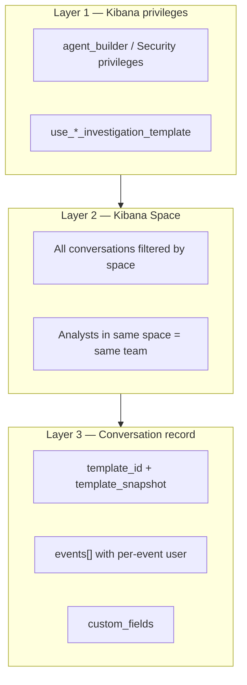

# Option B — Access model (space + templates, no `members[]`)

**Status:** Draft — replaces `members[]` / per-conversation ACL in B5  
**Related:** [B5 design](./agent_builder_option_b_b5_design.md) · [implementation plan](./agent_builder_option_b_implementation_plan.md) · [architecture](./agent_builder_investigation_cases_proposal.md)

---

## 1. Decision

**Drop `members[]` for the Option B POC.**

Collaborative investigations should behave like **Cases in a Kibana space**, not like a Slack channel with an invite list:

| Concern | Where it lives | Not on conversation |
|---------|----------------|---------------------|
| Who posted this note? | `UserMessageEvent.user` on each event | ~~members[]~~ |
| Who can open this investigation? | **Space** + **`chat_mode: collaborative`** + Kibana privileges | ~~members[]~~ |
| Who can create this *type* of investigation? | **Template availability** (role / privilege gated) | — |
| Who can append / invoke `@agent`? | Template **write** privileges + space access | ~~members[]~~ |

**Rationale:** `members[]` duplicates Cases/TheHive concepts poorly, conflicts with space-native team workflows, and adds UI/API surface without helping the SOC pair demo — **authorship on events** + **shared space** is enough.

---

## 2. Mental model (Cases-aligned)



**Cases analogy:**

| Cases | Option B investigation |
|-------|--------------------------|
| Case visible in space if user has `cases:read` for owner | Investigation visible if user has AB read + **`chat_mode: collaborative`** |
| `created_by` / assignees = workload, not per-case ACL list | `Conversation.user` = creator; assignees optional metadata (N1), not chat ACL |
| UserActions = who did what | `events[]` = who said what + agent runs |
| CaseTemplate mapping | `ConversationTemplate` + privileges |

---

## 3. Visibility rule (no separate `access_scope`)

Every conversation lives in a **Kibana space** (`space` on the ES document). That field partitions data — it does **not** mean “everyone in the space can see this.”

| `chat_mode` (from `template_snapshot`) | List / get within space | Typical use |
|---------------------------------------|-------------------------|-------------|
| **`single`** or absent | Creator only | Personal agent chat |
| **`collaborative`** | Any privileged user in the **same Kibana space** | Incident / hunt / investigation templates |

**POC rule:** **`collaborative` investigation ⇒ always team-visible in the space.** No separate `access_scope` field.

Legacy: `conversation_mode === 'group'` maps to `collaborative` for reads and list queries until templates land.

No `members[]` on the document.

---

## 4. Template system extensions (B2 + access)

Extend `ConversationTemplate` (saved object or index — TBD in B2):

```typescript
interface ConversationTemplate {
  id: string;
  profile: ConversationTemplateProfile;
  field_definitions: TemplateField[];
  defaults?: {
    suggested_agent_id?: string;
    initial_prompt?: string;
  };

  /** Who sees this template in create flows (AND with route authz). Empty = default AB users. */
  required_privileges?: string[];

  /** Who may append human messages and invoke @agent on conversations from this template. */
  write_privileges?: string[];

  /** `collaborative` ⇒ team-visible in space + multi-user append / @agent gate. */
  chat_mode: 'single' | 'collaborative';
}
```

### 4.1 Privilege examples (Security / SOC)

| Template profile | `required_privileges` (create) | `write_privileges` (append / @agent) | `chat_mode` |
|------------------|-------------------------------|----------------------------------------|-------------|
| `incident` | `use_incident_investigation_template` | `write_incident_investigation` | `collaborative` |
| `hunt` | `use_hunt_investigation_template` | `write_hunt_investigation` | `collaborative` |
| `general` | *(default AB)* | *(same as converse today)* | `single` |

Register privileges on the Agent Builder feature (see [api-authz skill](../.agents/skills/api-authz/SKILL.md)). Template picker calls `GET …/templates` filtered server-side by `request.authzResult`.

### 4.2 Snapshot on create (immutable)

```typescript
interface TemplateSnapshot {
  template_id: string;
  profile?: ConversationTemplateProfile | string;
  captured_at: string;
  /** `collaborative` ⇒ team-visible in space + multi-user chat behavior. */
  chat_mode: 'single' | 'collaborative';
  /** Optional: copy privilege names for audit / UI badges only — not enforced at read time */
  write_privileges?: string[];
}
```

Enforcement uses **live** privileges at request time; snapshot is for display and audit (“created as incident template v2”).

---

## 5. ConversationClient ACL (B5.2 target)

**Implemented (POC):** `conversation_access.ts` + `client.ts` list/get/update/delete.

```typescript
function isCollaborative(conversation): boolean {
  return (
    conversation.template_snapshot?.chat_mode === 'collaborative' ||
    conversation.conversation_mode === 'group' // legacy
  );
}

function hasAccess({ conversation, user, authzResult, space }): boolean {
  if (conversation.space !== space) return false;

  if (isCollaborative(conversation)) {
    return hasReadPrivilege(authzResult, conversation.template_snapshot);
  }

  return isOwner(conversation, user);
}

function canAppend({ conversation, authzResult }): boolean {
  if (!hasAccess(...)) return false;

  if (isCollaborative(conversation)) {
    return hasWritePrivilege(authzResult, conversation.template_snapshot);
  }

  return isOwner(...);
}
```

**List query (collaborative investigations in space):**

```text
filter: space_id
should:
  - term: user_id = current user              (personal convs)
  - term: chat_mode = collaborative          (team investigations)
  - term: conversation_mode = group          (legacy)
minimum_should_match: 1
```

**Delete (POC):** creator only, even for collaborative investigations (matches Cases reporter ≠ only deleter nuance — refine later).

---

## 6. Collaborative chat without `members[]`

| Capability | Mechanism |
|------------|-----------|
| Analyst A posts triage note | Append `UserMessageEvent` with `user: A` |
| Analyst B opens same investigation | Space + **`chat_mode: collaborative`** |
| B posts follow-up | Append with `user: B`; `canAppend` checks write privilege |
| Reload shows authors | `events[]` round-trip |
| Agent runs | Only when `chat_mode === 'collaborative'` and message contains `@agent` (or single-mode always runs agent) |
| Audit “who touched this” | Scan `events` for distinct `user_message.user` (like Cases participants derived from actions) |

**`conversation_mode`:** prefer **`template_snapshot.chat_mode`**. Keep optional `conversation_mode` on `Conversation` only as a legacy field until templates land; new code should read snapshot first.

---

## 7. Phasing (updated)

| Phase | Access work |
|-------|-------------|
| **B0** ✅ | Metadata only |
| **B5.1** | Persist `events` + per-message `user` |
| **B5.2** | **Collaborative ⇒ team-visible** in space; **no `members[]`** |
| **B5.3–B5.5** | Append route, `@agent` hook, UI authors |
| **B2** | `ConversationTemplate` CRUD + privilege fields + create-from-template + **`template_snapshot`** |
| **B2.1** | Register investigation template privileges; filter template picker by role |
| **N1** | Case attachment; optional copy case assignees into **metadata** only (not ACL) |

**POC without full B2:** hardcode one investigation template (`incident-triage-v2`) in seed/config; on create set `template_id` + inline snapshot `{ chat_mode: 'collaborative', profile: 'incident' }`.

---

## 8. E2E demo script (revised)

1. Analyst A creates **incident investigation** from template (collaborative) in Space `soc`.
2. A posts triage note — no agent — `events` show **A**.
3. Analyst B (same space, write privilege) opens same investigation by link/list.
4. B posts follow-up — `events` show **B**.
5. B sends `@agent summarize` — one agent run.
6. Analyst C in **different space** → 404.
7. Analyst D in same space **without write privilege** → read-only (future: hide composer via UI; server rejects append).

Remove: “non-member denied” → replace with space / privilege denial.

---

## 9. What we explicitly defer

| Topic | Defer to |
|-------|----------|
| Per-conversation invite list | Never (unless compliance demands need-to-know **within** a space) |
| TheHive-style restricted case user list | Enterprise / separate restricted mode + authorized_users if required |
| Live-sync case assignees → ACL | N1 metadata only |
| Thread child ACL copy from parent | B4 — children inherit **`template_snapshot`** (incl. `chat_mode`) from parent at create |

---

## 10. Open questions

1. **Read-only in space:** separate `read_*` vs `write_*` privileges, or single privilege for POC?
2. **List UX:** “My conversations” vs “Team investigations” tabs — filter by `chat_mode` + owner?
3. **Platform:** register template privileges under `agentBuilder` feature or Security solution feature?
4. **@pgayvallet:** collaborative investigation list OK vs Pierre’s removed space-wide `conversation_mode` flag (different — privilege-gated, template-scoped)?

---

*Supersedes `members[]` and `access_scope` sections in [B5 design §7](./agent_builder_option_b_b5_design.md) and [implementation plan B5.2](./agent_builder_option_b_implementation_plan.md).*
