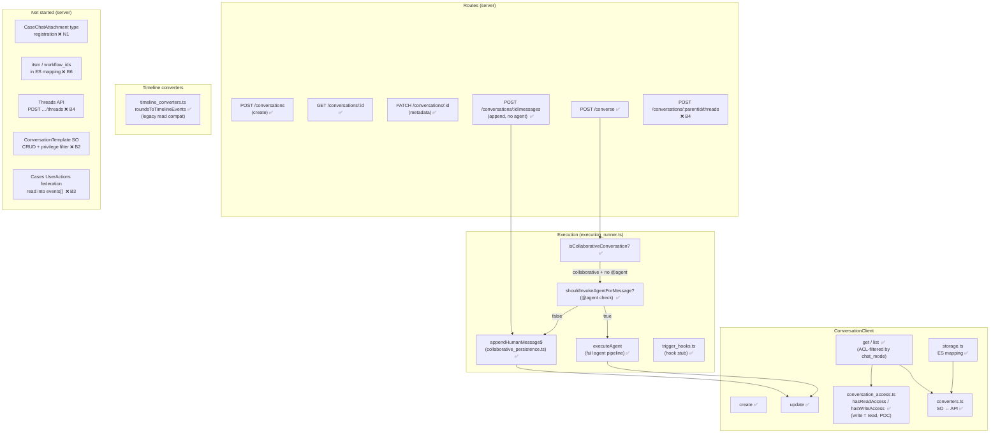
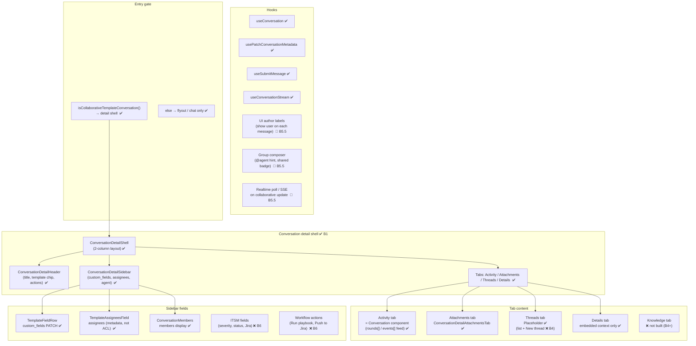
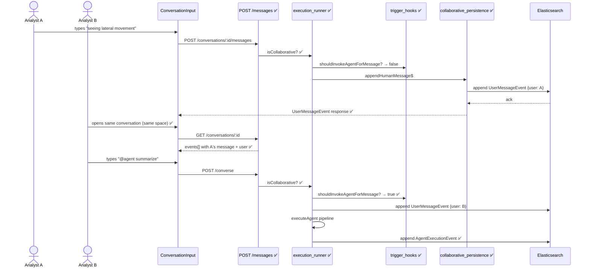

# Option B — Component & Data Flow Diagram

**Legend:** ✅ implemented · 🔄 in progress · ❌ not started · `field` = ES/SO field

**Excalidraw diagrams:** [diagrams/](./agent_builder_option_b_diagrams/) — open `.excalidraw` files in [Excalidraw](https://excalidraw.com) or VS Code with the Excalidraw extension.

---

## 1. Conversation saved object (ES document)

> **Diagram:** [01_conversation_es_document.excalidraw](./agent_builder_option_b_diagrams/01_conversation_es_document.excalidraw)

```
Conversation (ES document)
├── id, agent_id, user, title, created_at, updated_at          ✅ existing
│
├── conversation_rounds[]  (PersistentConversationRound)        ✅ legacy — kept for single-user + rollback
│
├── ── B0 metadata ──────────────────────────────────────────────
│   ├── template_id?                                            ✅ persisted
│   ├── template_snapshot?   { template_id, profile,           ✅ type defined; written on create
│   │                          chat_mode, write_privileges }       (B2: full create-from-template flow ❌)
│   └── custom_fields?       Record<string, unknown>            ✅ persisted + PATCH API
│
├── ── B5 collaboration ─────────────────────────────────────────
│   ├── conversation_mode?   'single' | 'group'                 ✅ persisted (legacy; prefer chat_mode)
│   ├── chat_mode?           denorm from template_snapshot       ✅ persisted (list queries)
│   └── events[]             TimelineEvent[]                     ✅ canonical for collaborative convs
│       ├── UserMessageEvent   { id, timestamp, user, message }  ✅
│       └── AgentExecutionEvent { id, timestamp, agent_id, …}   ✅
│
├── ── B6 ITSM (not started) ────────────────────────────────────
│   ├── itsm?                { severity, status, external_refs } ❌ type exists; not in ES mapping
│   ├── workflow_ids?                                            ❌ type exists; not in ES mapping
│   └── connection_ids?                                         ❌ type exists; not in ES mapping
│
├── ── B4 Threads (not started) ─────────────────────────────────
│   ├── parent_conversation_id?                                  ❌
│   ├── child_conversation_ids[]                                 ❌
│   ├── thread_kind?         'containment'|'deep_dive'|…        ❌
│   └── fork?                { forked_at, fork_anchor_id, … }   ❌
│
└── ── N1/B3 Cases bridge (not started) ─────────────────────────
    └── attachments[]  →  CaseChatAttachment type               ❌ no case attachment type registered
```

---

## 2. Server-side components

> **Diagram:** [02_server_components.excalidraw](./agent_builder_option_b_diagrams/02_server_components.excalidraw)



---

## 3. Client-side components

> **Diagram:** [03_client_components.excalidraw](./agent_builder_option_b_diagrams/03_client_components.excalidraw)



---

## 4. Data flow: collaborative message append

> **Diagram:** [04_collaborative_message_flow.excalidraw](./agent_builder_option_b_diagrams/04_collaborative_message_flow.excalidraw)



---

## 5. What's missing by phase

> **Diagram:** [05_missing_by_phase.excalidraw](./agent_builder_option_b_diagrams/05_missing_by_phase.excalidraw)

| Phase | Component | Gap |
|-------|-----------|-----|
| **B5.5** | `ConversationRound` / Activity feed | Author label on each human message in feed |
| **B5.5** | `ConversationInput` | Group composer: `@agent` hint, "Shared investigation" badge |
| **B5.5** | `useConversation` / `useConversationStream` | Poll/SSE so Analyst B sees A's note without sending |
| **N1** | `attachments/contract.ts` | Register `case` attachment type + snapshot shape |
| **N1** | `ConversationDetailHeader` | Case chip in breadcrumb / header |
| **B2** | Server: `ConversationTemplate` SO | Template registry, CRUD, privilege filter |
| **B2** | UI: create-from-template picker | Template picker filtered by role |
| **B2.1** | `conversation_access.ts` | Enforce `write_privileges` (currently write = read) |
| **B3** | `ConversationClient` | Federate Cases UserActions into `events[]` when case attached |
| **B4** | `Conversation` SO | `parent_conversation_id`, `child_conversation_ids[]`, `fork` fields |
| **B4** | Routes | `POST /conversations/:parentId/threads` |
| **B4** | Threads tab | List children + "Start thread from here" |
| **B6** | `Conversation` SO | `itsm`, `workflow_ids`, `connection_ids` in ES mapping |
| **B6** | Sidebar | ITSM fields, "Push to Jira" / "Run playbook" wired to workflows |
| **B6** | `trigger_hooks.ts` | `conversation.thread.created` etc. workflow event dispatch |
