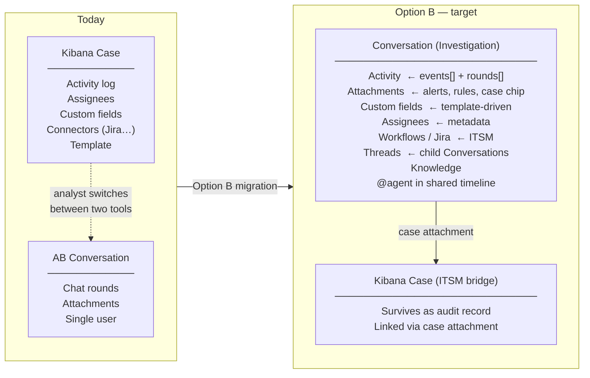
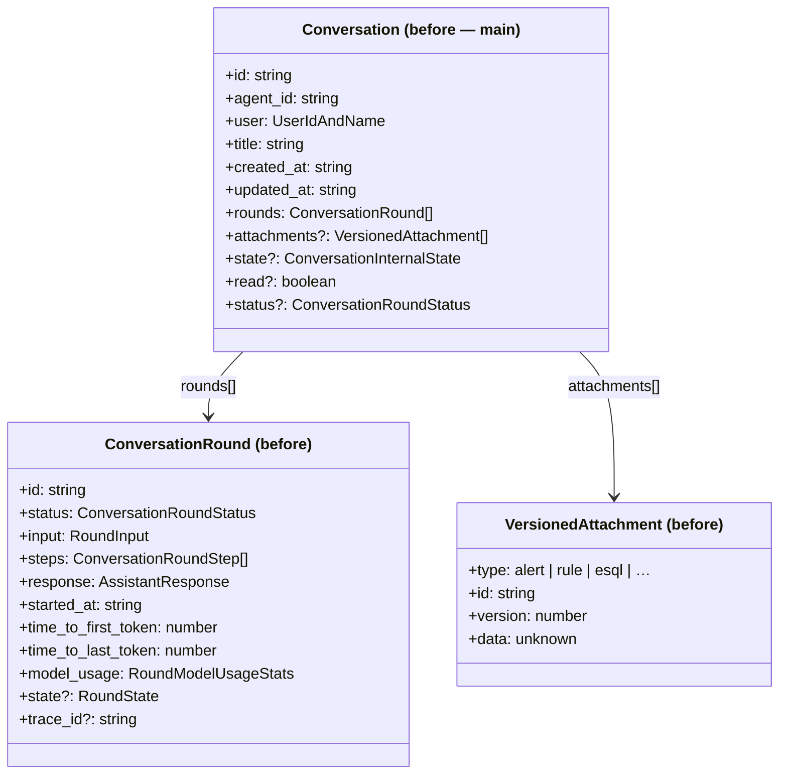
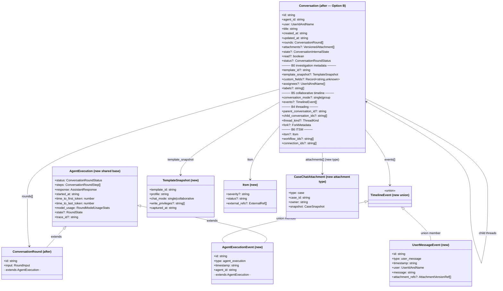
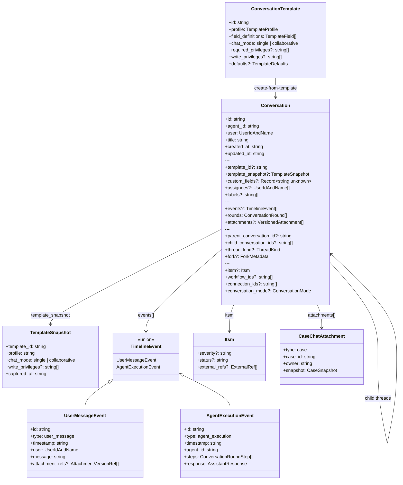
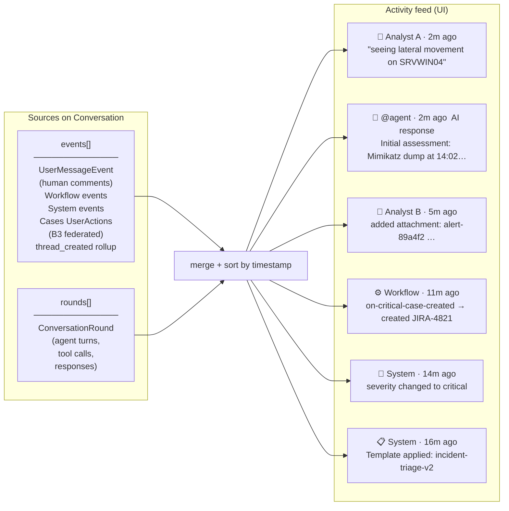
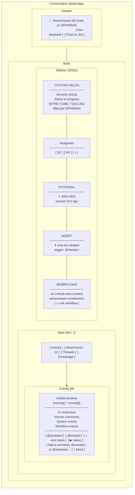
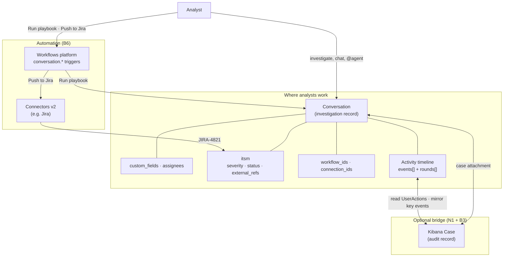
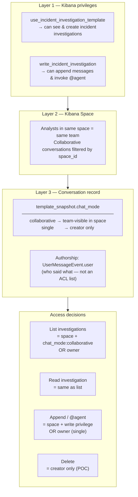
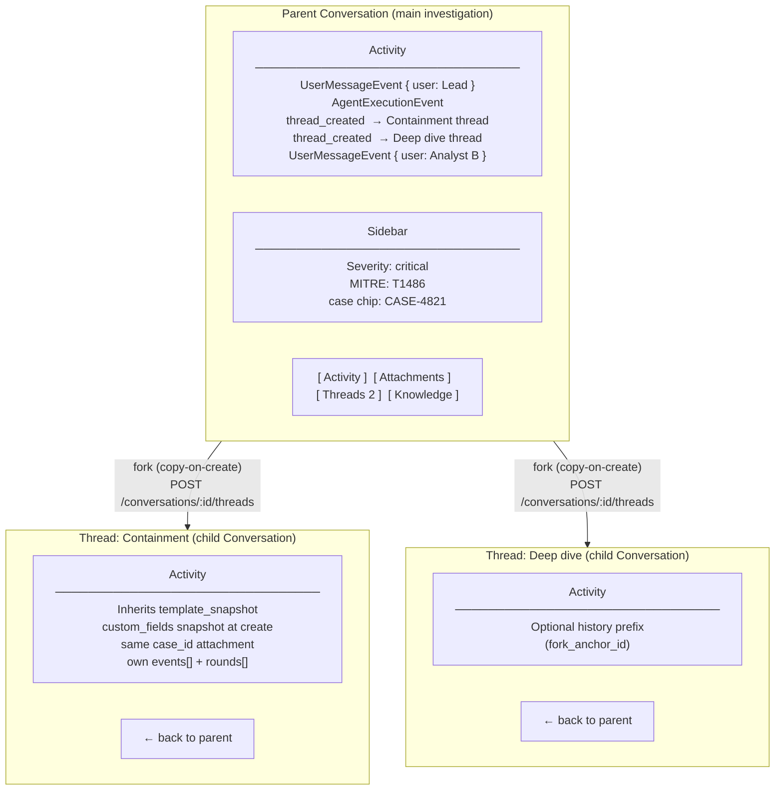
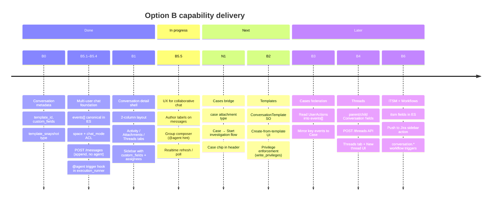

# Option B — Target Architecture Diagrams

Conceptual diagrams for the **Conversation as Case** north star. These show the intended design independent of implementation status.

**Excalidraw diagrams:** [agent_builder_option_b_target_diagrams/](./agent_builder_option_b_target_diagrams/) — open `.excalidraw` files in [Excalidraw](https://excalidraw.com) or VS Code with the Excalidraw extension.

---

## 1. Product concept: what changes

> **Diagram:** [01_product_concept.excalidraw](./agent_builder_option_b_target_diagrams/01_product_concept.excalidraw)

The core shift is moving the investigation record from the Cases saved object to the Conversation.

---

## 2. Conversation data model — before and after

> **Diagram:** [02_data_model_before_after.excalidraw](./agent_builder_option_b_target_diagrams/02_data_model_before_after.excalidraw)

How the `Conversation` type grows from a single-user chat container into a full investigation record.

---

## 3. Conversation data model — target

> **Diagram:** [03_data_model.excalidraw](./agent_builder_option_b_target_diagrams/03_data_model.excalidraw)

---

## 4. Activity feed — unified timeline

> **Diagram:** [04_activity_feed.excalidraw](./agent_builder_option_b_target_diagrams/04_activity_feed.excalidraw)

The Activity tab merges two sources into one chronological feed. Each entry type has a distinct visual treatment.

---

## 5. Conversation detail UX layout

> **Diagram:** [05_ux_layout.excalidraw](./agent_builder_option_b_target_diagrams/05_ux_layout.excalidraw)

---

## 5.1 ITSM at a glance (B6)

> **Diagram:** [09_itsm_at_a_glance.excalidraw](./agent_builder_option_b_target_diagrams/09_itsm_at_a_glance.excalidraw)

One-page view of how ITSM works in Option B: the **Conversation** is where analysts work; **Workflows** handle automation; **Case** is an optional audit bridge.

**Takeaway:** ITSM moves onto the Conversation. Case stays for compliance and legacy Security workflows — linked, not replaced.

---

## 6. Access control layers

> **Diagram:** [06_access_control.excalidraw](./agent_builder_option_b_target_diagrams/06_access_control.excalidraw)

---

## 7. Threads — parallel workstreams

> **Diagram:** [07_threads.excalidraw](./agent_builder_option_b_target_diagrams/07_threads.excalidraw)

---

## 8. Phased delivery — capability roadmap

> **Diagram:** [08_phased_delivery.excalidraw](./agent_builder_option_b_target_diagrams/08_phased_delivery.excalidraw)

