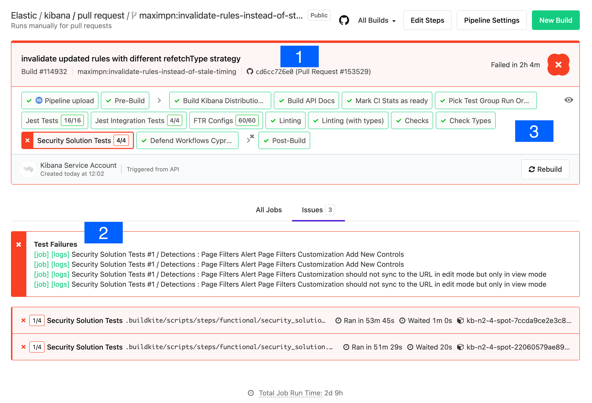
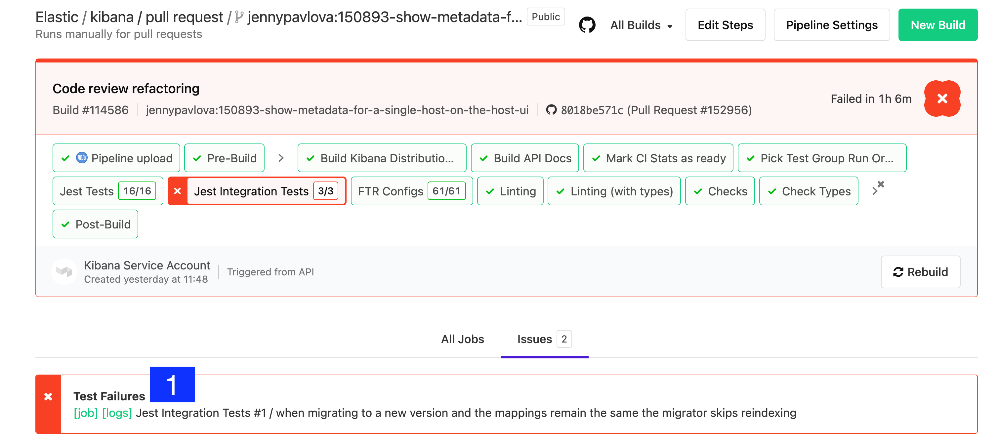
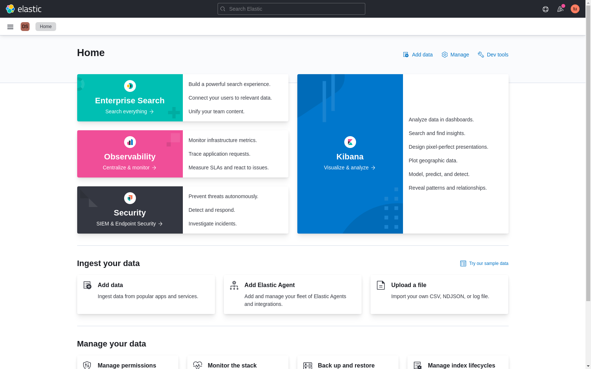
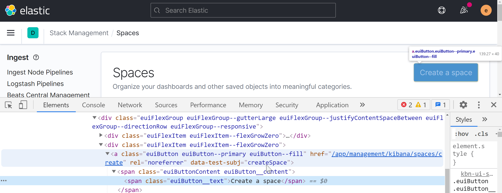

# CI

{{kib}} CI uses [Buildkite Pipelines](https://buildkite.com/docs/pipelines) to run checks against each pull request and tracked branch. Pipeline definitions live in the repository under `.buildkite/pipelines`. Results are posted to pull requests as comments and are viewable in the Buildkite UI.

## PR comments

Comments in pull requests can be used to trigger CI operations:

### `buildkite test this`
Run test suites and checks.

### `@elasticmachine merge upstream`
Merge in the most recent changes from upstream.

### `@elasticmachine run elasticsearch-ci/docs`
Build documentation from the root `docs` folder.


## PR labels [labels]

Labels can be added to a pull request to run conditional pipelines. Build artifacts are available on the "Artifacts" tab of the "Build Kibana Distribution and Plugins" step.

### `ci:all-cypress-suites`
Some Cypress test suites only run when code changes are made in certain files. Adding this label forces all Cypress tests to run.

### `ci:all-ui-test-suites`
Some UI/E2E test suites only run when code changes are made in certain files. Adding this label forces all conditional UI/E2E suites to run.

### `ci:build-all-platforms`
Build Windows, macOS, and Linux archives.

### `ci:build-cdn-assets`
Build an archive that can be used to serve Kibana's static assets.

### `ci:build-cloud-image`
Build cloud Docker images that can be used for testing deployments on Elastic Cloud.

### `ci:build-cloud-fips-image`
Build FIPS cloud Docker images that can be used for testing deployments on Elastic Cloud.

### `ci:build-docker-fips`
Build Docker Wolfi image with FIPS enabled.

### `ci:build-os-packages`
Build Docker images, and Debian and RPM packages.

### `ci:build-serverless-image`
Build serverless Docker images that can be used for testing deployments on Elastic Cloud.

### `ci:build-storybooks`
Build and upload storybooks.

### `ci:build-webpack-bundle-analyzer`
Build and upload a bundle report generated by `webpack-bundle-analyzer`.

### `ci:cloud-deploy`
Create or update a deployment on Elastic Cloud production.

### `ci:cloud-persist-deployment`
Prevents an existing deployment from being shutdown due to inactivity.

### `ci:cloud-redeploy`
Create a new deployment on Elastic Cloud. Previous deployments linked to a pull request will be shutdown and data will not be preserved.

### `ci:collect-apm`
Collect APM metrics, available for viewing on the Kibana CI APM cluster.

### `ci:entity-store-performance`
Run entity store performance tests on Elastic Cloud. A fresh deployment is created for each test run (previous deployments are automatically cleaned up). Results are posted as PR comments.

### `ci:no-auto-commit`
Skip auto-committing changed files.

### `ci:project-deploy-elasticsearch`
Create or update a serverless Elasticsearch project on Elastic Cloud QA.

### `ci:project-deploy-observability`
Create or update a serverless Observability project on Elastic Cloud QA.

### `ci:project-deploy-log_essentials`
Create or update a serverless Observability project (in the Log Essentials tier) on Elastic Cloud QA.

### `ci:project-deploy-security`
Create or update a serverless Security project on Elastic Cloud QA.

### `ci:project-deploy-ai4soc`
Create or update a serverless Security project of type AI for SOC on Elastic Cloud QA.

### `ci:project-persist-deployment`
Prevents an existing deployment from being shutdown due to inactivity.

### `ci:security-genai-run-evals`
Run evaluations for the GenAI security evaluation suite.


## Interpreting CI failures [interpreting-ci-failures]

When a test fails it is reported to GitHub via GitHub Checks. Tests are bucketed into several categories that run in parallel to make CI faster. Groups like `ciGroup{X}` get a single check in GitHub; other tests like linting and type checks get their own checks.

Clicking the link next to a check in the **Conversation** tab takes you to the log output from that section of the tests. If log output is truncated or unclear, Buildkite has more complete information.

### Viewing job executions in Buildkite

To view the results of a job execution in Buildkite, either click the link in the comment left by `@elasticmachine` or search for the `kibana-ci` check in the list at the bottom of the PR.



1. **Git commit:** the git commit that caused this build.
2. **Test Results:** a link to the test results screen, plus shortcuts to the logs and jobs of the failed tests. Functional tests capture and store log output from each specific test.
3. **Pipeline Steps:** a breakdown of the pipeline that was executed, along with individual log output for each step.

### Debugging functional UI test failures

The logs in **Pipeline Steps** contain `Info` level logging. To debug Functional UI tests it is usually helpful to see the debug logging — click through to the test failure details via the **logs** link.



Look at the error and stack trace first. In the example below, the test failed to find an element within the timeout: `Error: retry.try timeout: TimeoutError: Waiting for element to be located By(css selector, [data-test-subj="createSpace"])`

The stack trace shows the test file and line number. For example, line 50 of `test/accessibility/apps/spaces.ts` corresponds to [`x-pack/platform/test/accessibility/apps/group1/spaces.ts`](https://github.com/elastic/kibana/blob/master/x-pack/platform/test/accessibility/apps/group1/spaces.ts#L50). The failing click was invoked from a page-object method in [`test/functional/page_objects/space_selector_page.ts`](https://github.com/elastic/kibana/blob/master/x-pack/platform/test/functional/page_objects/space_selector_page.ts#L58).

```
[00:03:36]             │ debg --- retry.try error: Waiting for element to be located By(css selector, [data-test-subj="createSpace"])
[00:03:36]             │      Wait timed out after 10020ms
[00:03:36]             │ info Taking screenshot "/dev/shm/workspace/parallel/24/kibana/x-pack/platform/test/functional/screenshots/failure/Kibana spaces page meets a11y validations a11y test for click on create space page.png"
[00:03:37]             │ info Current URL is: http://localhost:61241/app/home#/
[00:03:37]             └- ✖ fail: Kibana spaces page meets a11y validations a11y test for click on create space page
```

Stack trace alone doesn't tell you *why* the element wasn't found — it might be on the wrong page, or the element might have changed. Just above the `✖ fail:` line is `info Taking screenshot ...`, which names the screenshot to look for in the **Google Cloud Storage (GCS) Upload Report**.



Inspecting a running Kibana instance can confirm which page the `data-test-subj` attribute belongs to:



If the test arrived at the wrong page, scroll back through the debug log to the first action the test took. Often the failing test depended on a prior test to navigate, and that prior test was skipped:

```
[00:01:30]           └-> a11y test for manage spaces menu from top nav on Kibana home
[00:01:30]           └-> a11y test for manage spaces page
[00:01:30]           └-> a11y test for click on create space page
[00:01:30]             └-> "before each" hook: global before each for "a11y test for click on create space page"
[00:01:30]             │ debg TestSubjects.click(createSpace)
```

```ts
it.skip('a11y test for manage spaces page', async () => {
  await PageObjects.spaceSelector.clickManageSpaces();
```

Best practice: every test should be atomic and not depend on other tests. UI test setup is slow, though, so in practice tests within a `describe` block are often optimized as a group.


## CI metrics [ci-metrics]

In addition to running tests, CI collects metrics about the Kibana build. These metrics are sent to an external service to track changes over time and give PR authors insight into the impact of their changes.

### Metric types

#### Bundle size [ci-metric-types-bundle-size-metrics]

These metrics track the impact of code changes on Kibana bundle sizes, ensuring optimal loading performance.

$$$ci-metric-page-load-bundle-size$$$ `page load bundle size`
:   The size of the entry file produced for each bundle/plugin. This file is always loaded on every page load, so it should be as small as possible. To reduce this metric, put any code that isn't necessary on every page load behind an [`async import()`](https://developer.mozilla.org/en-US/docs/Web/JavaScript/Reference/Statements/import#Dynamic_Imports).

    Code that is shared statically with other plugins contributes to the `page load bundle size` of that plugin. This includes exports from the `public/index.ts` file and any file referenced by the `extraPublicDirs` manifest property.

$$$ci-metric-async-chunks-size$$$ `async chunks size`
:   Tracks the sum size (in bytes, by plugin/bundle ID) of "async chunks" — created for files imported via [`async import()`](https://developer.mozilla.org/en-US/Web/JavaScript/Reference/Statements/import#Dynamic_Imports) statements. This metric reflects the amount of code downloaded when accessing all components within a bundle.

$$$ci-metric-misc-asset-size$$$ `miscellaneous assets size`
:   Tracks the sum size (in bytes, by plugin/bundle ID) of assets that are not async or entry chunks, typically images.

$$$ci-metric-bundle-module-count$$$ `@kbn/optimizer bundle module count`
:   The number of separate modules per bundle/plugin. This metric indicates `@kbn/optimizer` build time for a bundle, highlighting potentially large module imports.


#### Distributable size [ci-metric-types-distributable-size]

Distributable size affects both download and archive extraction times. Some metrics aren't reported on PRs because gzip compression produces different file sizes even from identical inputs. All metrics are collected from the `tar.gz` archive produced for the Linux platform.

$$$ci-metric-distributable-file-count$$$ `distributable file count`
:   The number of files included in the default distributable.

$$$ci-metric-distributable-size$$$ `distributable size`
:   The size, in bytes, of the default distributable. *(not reported on PRs)*


#### Saved Object field counts [ci-metric-types-saved-object-field-counts]

Elasticsearch limits the number of fields in an index to 1000 by default, and we want to avoid raising that limit.

$$$ci-metric-saved-object-field-count$$$ `Saved Objects .kibana field count`
:   The number of saved object fields broken down by saved object type.


### Adding new metrics [ci-metric-adding-new-metrics]

You can report new metrics via the `CiStatsReporter` class provided by the `@kbn/dev-utils` package. This class is automatically configured on CI and its methods noop when running outside of CI. See the [`CiStatsReporter` readme](https://github.com/elastic/kibana/blob/master/packages/kbn-ci-stats-reporter) for more.


### Resolving `page load bundle size` overages [ci-metric-resolving-overages]

`page load bundle size` is limited per plugin. If a PR exceeds this limit — defined in [`limits.yml`](https://github.com/elastic/kibana/blob/master/packages/kbn-optimizer/limits.yml) — the author must resolve the overage before merging.

Limits are usually high enough that PRs shouldn't trigger overages, but when they do:

1. Run the optimizer locally with `--profile` to produce webpack `stats.json` files. Focus on the chunk named `{pluginId}.plugin.js`; the `*.chunk.js` chunks make up the `async chunks size` metric (currently unlimited), which is the main way to move code off the initial page load.

    ```shell
    node scripts/build_kibana_platform_plugins --focus {pluginId} --profile
    # builds and creates {pluginDir}/target/public/stats.json for {pluginId} and its dependencies
    ```

    Tools:
    * Official Webpack tool: [http://webpack.github.io/analyse/](http://webpack.github.io/analyse/)
    * Webpack visualizer: [https://chrisbateman.github.io/webpack-visualizer/](https://chrisbateman.github.io/webpack-visualizer/)

2. Create stats for the upstream branch as well and compare side by side in Webpack visualizer.
3. For smaller changes, try [Beyond Compare](https://www.scootersoftware.com/download.php) on the two `stats.json` files.
4. If the diff is too large, reduce each `stats.json` to a sorted module-id list via [jq](https://github.com/stedolan/jq):

    ```shell
    jq -r .modules[].id {pluginDir}/target/public/stats.json | sort - > moduleids.txt
    ```

5. As a last resort, compare the bundle source directly using the production build:

    ```shell
    node scripts/build_kibana_platform_plugins --focus {pluginId} --dist
    npm install -g prettier
    prettier -w {pluginDir}/target/public/{pluginId}.plugin.js
    # repeat for upstream and compare in Beyond Compare
    ```

6. If all else fails, reach out to Operations for help.

After identifying the files that were added, stick them behind an async import. If the size increase is unavoidable, raise the limit in [`limits.yml`](https://github.com/elastic/kibana/blob/master/packages/kbn-optimizer/limits.yml) directly, or run:

```shell
node scripts/build_kibana_platform_plugins --focus {pluginId} --update-limits
```

This runs the optimizer in distributable mode, which takes longer and spawns a worker per CPU. Changes to `limits.yml` trigger review from the Operations team, who verify the increase is justified — findings from the steps above help that review.

For broader guidance on lazy-loading patterns, see [Plugin performance and optimization](/extend/key-concepts/performance/plugin-performance-and-optimization.md).


### Actions to reduce `page load bundle size` [ci-metric-quick-actions]

In many regressions, a short workflow is enough to avoid raising limits:

:::::{note}
If you are using a coding agent with repository skills, run the `/optimize-bundle-size` skill command to start this workflow for you and help reduce plugin `page load bundle size`.
:::::

1. Build dist metrics and confirm the current value for your plugin in `target/public/metrics.json`:

    ```shell
    node scripts/build_kibana_platform_plugins --focus {pluginId} --dist
    ```

2. Profile the plugin and identify the largest modules in the entry chunk:

    ```shell
    node scripts/build_kibana_platform_plugins --focus {pluginId} --dist --profile --no-cache
    entry_id=$(jq -r '.chunks[] | select((.names|index("{pluginId}")) != null) | .id' {pluginDir}/target/public/stats.json)
    jq -r --argjson cid "$entry_id" '.modules[] | select((.chunks|index($cid)) != null) | [.size, (.name // .identifier)] | @tsv' {pluginDir}/target/public/stats.json | sort -nr | head -40
    ```

3. Move optional UI and large dependencies behind `async import()` boundaries.
4. Avoid importing wide barrel files (`index.ts`) from plugin entry paths; import only required modules.
5. Re-run the dist build and verify that `page load bundle size` is below the existing limit before considering a limit increase.


### Validating `page load bundle size` limits [ci-metric-validating-limits]

While you're tracking down changes that will improve the bundle size, run this locally:

```shell
node scripts/build_kibana_platform_plugins --dist --watch --focus {pluginId}
```

This builds the front-end bundles for your plugin and the plugins it depends on. When you make changes, the bundles rebuild and you can inspect `target/public/metrics.json` to see if your changes lower `page load bundle size`.

To run the build once:

```shell
node scripts/build_kibana_platform_plugins --validate-limits --focus {pluginId}
```

This applies production optimizations to get the right sizes, which means the optimizer takes significantly longer to run. On most developer machines it consumes all resources for 20+ minutes. Use `--workers` to cap concurrency if you want to multi-task.
