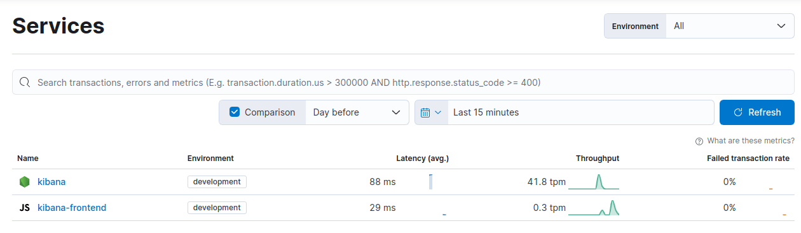

# Debugging in development

There are multiple ways to go about debugging Kibana when running from source.

## Debugging using Chrome DevTools

You will need to run Node using `--inspect` or `--inspect-brk` in order to enable the inspector. Additional information can be found in the [Node.js docs](https://nodejs.org/en/docs/guides/debugging-getting-started/).

Once Node is running with the inspector enabled, you can open `chrome://inspect` in your Chrome browser. You should see a remote target for the inspector running. Click "inspect". You can now begin using the debugger.

Next we will go over how to exactly enable the inspector for different aspects of the codebase.

### Jest Unit Tests

You will need to run Jest directly from the Node script:

`node --inspect-brk node_modules/.bin/jest --runInBand --config [JestConfig] [TestPathPattern]`

Additional information can be found in the [Jest troubleshooting documentation](https://jestjs.io/docs/troubleshooting).

### Functional Test Runner

`node --inspect-brk scripts/functional_test_runner`

### Development Server

`node --inspect-brk scripts/kibana`

## Debugging using VS Code

See [Debug code with Visual Studio Code](https://code.visualstudio.com/docs/editor/debugging) and [Node.js debugging in VS Code](https://code.visualstudio.com/docs/nodejs/nodejs-debugging) for more information.

### Kibana Server

There are two options for debugging server code in Kibana: Attach to process or Launch Kibana from VS Code.

#### Attach to process

1. Create or modify your `.vscode/launch.json` file with the following configuration. See the [Visual Studio Code debug configuration documentation](https://code.visualstudio.com/docs/editor/debugging-configuration) for more information.

```json
{
  "version": "0.2.0",
  "configurations": [
    {
      "type": "node",
      "request": "attach",
      "name": "kibana-9229",
      "port": 9229,
      "presentation": {
        "hidden": true,
        "group": "Kibana Debug",
        "order": 1
      },
      "skipFiles": ["<node_internals>/**", "**/node_modules/**"]
    },
    {
      "type": "node",
      "request": "attach",
      "name": "kibana-9230",
      "port": 9230,
      "presentation": {
        "hidden": true,
        "group": "Kibana Debug",
        "order": 1
      },
      "skipFiles": ["<node_internals>/**", "**/node_modules/**"]
    },
    {
      "type": "node",
      "request": "attach",
      "name": "kibana-9231",
      "port": 9231,
      "presentation": {
        "hidden": true,
        "group": "Kibana Debug",
        "order": 1
      },
      "skipFiles": ["<node_internals>/**", "**/node_modules/**"]
    }
  ],
  "compounds": [
    {
      "name": "Debug Kibana Server",
      "description": "Attaches to Kibana server in debug mode. Requires first starting Kibana with `yarn debug`",
      "configurations": ["kibana-9229", "kibana-9230", "kibana-9231"],
      "restart": true,
      "presentation": {
        "hidden": false,
        "group": "Kibana Debug",
        "order": 1
      },
      "stopAll": true
    }
  ]
}
```

2. Start Elasticsearch with `yarn es snapshot`.
3. Start Kibana with `yarn debug` or `node --inspect scripts/kibana --dev`.
4. In VS Code, click the "Run and debug" icon in the sidebar.
5. Select "Debug Kibana Server" from the dropdown menu.
6. Click the green play button to start debugging.

#### Launch Kibana from VS Code

1. Create or modify your `.vscode/launch.json` file with the following configuration.

```json
{
  "version": "0.2.0",
  "inputs": [
    {
      "id": "runExamples",
      "type": "pickString",
      "description": "Run developer examples?",
      "default": "No",
      "options": [
        {
          "label": "No",
          "value": ""
        },
        {
          "label": "Yes",
          "value": "--run-examples"
        }
      ]
    }
  ],
  "configurations": [
    {
      "type": "node",
      "request": "launch",
      "name": "Launch and Debug Kibana",
      "runtimeExecutable": "node",
      "runtimeArgs": [
        "--nolazy",
        "--inspect=127.0.0.1:9229",
        "scripts/kibana",
        "--dev",
        "${input:runExamples}"
      ],
      "autoAttachChildProcesses": true
    }
  ]
}
```

2. Start Elasticsearch with `yarn es snapshot`, but don't start Kibana and kill any running instances of Kibana.
3. In VS Code, click the "Run and debug" icon in the sidebar.
4. Select "Launch and Debug Kibana" from the dropdown menu.
5. Click the green play button to start debugging. You can choose whether or not to run the developer examples.

### Jest Unit Tests

Install the [Jest extension for VS Code](https://marketplace.visualstudio.com/items?itemName=Orta.vscode-jest).

If necessary, add the following to your `.vscode/settings.json` file.

```jsonc
  // self managed
  "jest.jestCommandLine": "yarn test:jest --runInBand"
```

See the [Jest extension for VS Code documentation](https://marketplace.visualstudio.com/items?itemName=Orta.vscode-jest) for information on how to run and debug your unit tests.

### Functional Test Runner

1. Create or modify your `.vscode/launch.json` file with the following configuration

```json
{
  "version": "0.2.0",
  "inputs": [
    {
      "id": "grep",
      "type": "promptString",
      "description": "Grep pattern to filter tests"
    },
    {
      "id": "ftConfig",
      "type": "promptString",
      "description": "Path to the functional tests config file"
    },
    {
      "id": "ftHeadless",
      "type": "pickString",
      "description": "Run functional tests in headless mode?",
      "options": [
        {
          "label": "No - tests run in Chrome",
          "value": "0"
        },
        {
          "label": "Yes - tests run in headless mode",
          "value": "1"
        }
      ]
    }
  ],
  "configurations": [
    {
      "type": "node",
      "request": "launch",
      "name": "FT Server",
      "program": "${workspaceFolder}/scripts/functional_tests_server",
      "internalConsoleOptions": "openOnFirstSessionStart",
      "outputCapture": "std",
      "presentation": {
        "hidden": false,
        "group": "Functional tests",
        "order": 0
      },
      "args": ["--config", "${input:ftConfig}", "--debug"],
      "skipFiles": ["<node_internals>/**", "**/node_modules/**"]
    },
    {
      "type": "node",
      "request": "launch",
      "name": "FT Runner",
      "env": {
        "TEST_BROWSER_HEADLESS": "${input:ftHeadless}"
      },
      "program": "${workspaceFolder}/scripts/functional_test_runner",
      "internalConsoleOptions": "openOnSessionStart",
      "outputCapture": "std",
      "presentation": {
        "hidden": false,
        "group": "Functional tests",
        "order": 1
      },
      "args": ["--config", "${input:ftConfig}", "--grep", "${input:grep}", "--verbose"],
      "skipFiles": ["<node_internals>/**", "**/node_modules/**"]
    }
  ]
}
```

2. Click the "Run and debug" icon in the sidebar.
3. Select "FT Server" from the dropdown menu and click the green play button to start the functional test server.
4. When prompted, enter the relative path to your functional test config file.
5. Monitor the "DEBUG CONSOLE" tab until the functional test server is ready.
6. Select "FT Runner" from the dropdown menu and click the green play button to start the functional test runner.
7. When prompted, choose to run your tests in headless mode or in a Chrome browser.
8. The path to the functional tests config file should be the same as in step 4.
9. When prompted, optionally enter a grep pattern to filter tests. Leave blank to run all tests.

## Debugging using logging

When running Kibana, it's sometimes helpful to enable verbose logging.

`yarn start --verbose`

Using verbose logging usually results in much more information than you're interested in. The [logging documentation](https://www.elastic.co/guide/en/kibana/current/logging-settings.html) covers ways to change the log level of certain types.

In the following example of a configuration stored in `config/kibana.dev.yml` we are logging all Elasticsearch queries and any logs created by the Management plugin.

```
logging:
  appenders:
    console:
      type: console
      layout:
        type: pattern
        highlight: true
  root:
    appenders: [default, console]
    level: info

  loggers:
    - name: plugins.management
      level: debug
    - name: elasticsearch.query
      level: debug
```

## Instrumenting with OTel Traces

{{kib}} has built-in OpenTelemetry instrumentation for debugging and observability. The following sections cover tracing configuration.

To enable OTel traces, apply the following configuration:

```yaml
telemetry.tracing:
  enabled: true
  sample_rate: 1 # 1 by default
  exporters:
    - proto:
        url: <URL_TO_THE_OTLP_ENDPOINT>
        headers:
          authorization: 'ApiKey [REDACTED]'
```

The OTLP endpoint can be any OTel/EDOT collector. It is recommended to use the mOTLP (Managed OTLP) endpoint that is provided by Elastic Cloud. The instructions to retrieve the OTLP endpoint and the API Key are available in [Get started with traces and APM](https://www.elastic.co/docs/solutions/observability/apm/get-started).

### Supported exporter protocols

{{kib}} supports gRPC, protobuf and plain HTTP protocols to export the OTel Traces. The protocol to use is specified in the config via top property name in the exporter's declaration. The config syntax is the same for all.

```yaml
telemetry.tracing:
  enabled: true
  sample_rate: 1 # 1 by default
  exporters:
    - grpc:
        url: <URL_TO_THE_GRPC_OTLP_ENDPOINT>
        headers:
          authorization: 'ApiKey [REDACTED]'
    - proto:
        url: <URL_TO_THE_PROTO_OTLP_ENDPOINT>
        headers:
          authorization: 'ApiKey [REDACTED]'
    - http:
        url: <URL_TO_THE_HTTP_OTLP_ENDPOINT>
        headers:
          authorization: 'ApiKey [REDACTED]'
```

::::{tip}
gRPC typically operates on a different port to the protobuf and http protocols.

When using the mOTLP endpoint, the port is the same, but the endpoint changes:

- gRPC uses the root path (https://my-ech-deployment.ingest.europe-west1.gcp.elastic-cloud.com:443)
- Protobuf and HTTP use the path `/v1/traces` (https://my-ech-deployment.ingest.europe-west1.gcp.elastic-cloud.com:443/v1/traces)
::::

### Enable OTel Traces on the server + Elastic RUM on the browser in {{kib}}

::::{important}
OTel instrumentation is only available on the server side. For RUM observability, {{kib}} uses [Elastic RUM](https://www.elastic.co/docs/solutions/observability/apm/apm-agents/real-user-monitoring-rum).

OTel instrumentation in the browser will be available in the future, once the [OTel for RUM](https://www.elastic.co/docs/solutions/observability/applications/otel-rum) is ready for production.
::::

When `telemetry.tracing.enabled` is `true`, server-side Elastic APM is disabled by default, but the `kibana-frontend` (RUM) service remains active. Elastic APM and OpenTelemetry tracing cannot be enabled simultaneously; setting `elastic.apm.active: true` while OTel tracing is enabled causes Kibana to fail on startup. You can still collect browser traces with Elastic RUM.

To enable Elastic RUM alongside OTel tracing, define the APM Server's URL in the Kibana config. [Any settings accepted by the agent](https://www.elastic.co/docs/reference/apm/agents/rum-js/configuration) are also accepted:

```yaml
elastic:
  apm:
    serverUrl: https://my-ech-deployment.apm.europe-west1.gcp.cloud.es.io:443
    # RUM is enabled by default when telemetry.tracing.enabled is true; serverUrl is required to send data to your deployment.
    # Below are optional
    environment: localhost
    transactionSampleRate: 1
```

::::{tip}
RUM sends traces from the browser without embedded credentials. Prefer an Elastic Cloud Hosted (ECH) APM endpoint configured for RUM intake. Serverless APM endpoints often require authenticated intake and are usually not suitable for RUM unless your deployment explicitly supports unauthenticated browser intake.
::::

## Debugging Kibana with APM

::::{warning}
This approach is deprecated. Use [OTel Traces](#instrumenting-with-otel-traces) instead.
::::

Kibana is integrated with APM's node and RUM agents.
To learn more about how APM works and what it reports, refer to the [documentation](https://www.elastic.co/guide/en/apm/guide/current/index.html).

We currently track the following types of transactions from Kibana:

Frontend (APM RUM):

- `http-request`- tracks all outgoing API requests
- `page-load` - tracks the inidial loading time of kibana
- `app-change` - tracks application changes

Backend (APM Node):

- `request` - tracks all incoming API requests
- `kibana-platform` - tracks server initiation phases (preboot, setup and start)
- `task-manager` - tracks the operation of the task manager, including claiming pending tasks and marking them as running
- `task-run` - tracks the execution of individual tasks

### Enabling APM on a local environment

In some cases, it is beneficial to enable APM on a local development environment to get an initial undesrtanding of a feature's performance during manual or automatic tests.

1.  Create a secondary monitoring deployment to collect APM data. The easiest option is to use [Elastic Cloud](https://cloud.elastic.co/deployments) to create a new deployment.
2.  Open the Kibana from the monitoring deployment (_not_ your local Kibana), go to `Integrations` and enable the Elastic APM integration.
3.  Scroll down and copy the server URL and secret token. You may also find them in your cloud console under APM & Fleet.
4.  Create or open `config\kibana.dev.yml` on your local development environment.
5.  Add the following settings:
```
elastic.apm.active: true
elastic.apm.serverUrl: <serverUrl>
elastic.apm.secretToken: <secretToken>
```
6.  Once you run kibana and start using it, two new services (kibana, kibana-frontend) should appear under the APM UI on the APM deployment.
    

### Enabling APM via environment variables

It is possible to enable APM via environment variables as well.
They take precedence over any values defined in `kibana.yml` or `kibana.dev.yml`

Set the following environment variables to enable APM:

- ELASTIC_APM_ACTIVE
- ELASTIC_APM_SERVER_URL
- ELASTIC_APM_SECRET_TOKEN or ELASTIC_APM_API_KEY