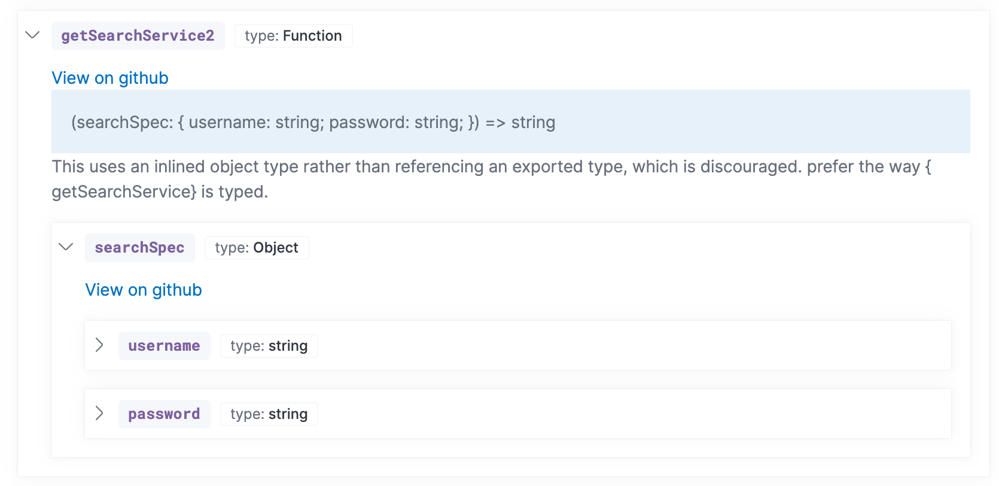
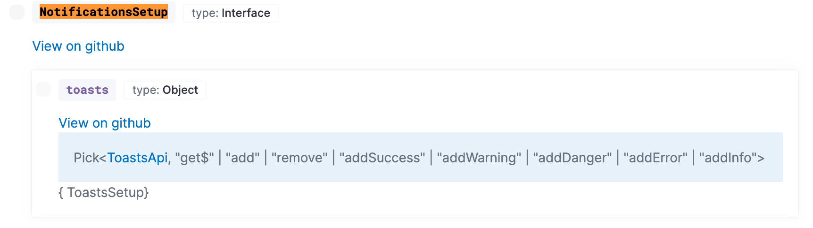

# Documentation

Docs should be written during development and accompany PRs when relevant. There are multiple types of documentation, and different places to add each.

## End-user documentation

User-facing features are documented in Markdown under [docs/](https://github.com/elastic/kibana/tree/main/docs) and published to [elastic.co/docs](https://www.elastic.co/docs) via the [Elastic Docs v3](https://www.elastic.co/docs/contribute-docs) system. Authoring and syntax guidance lives in the [contributor docs](https://www.elastic.co/docs/contribute-docs), and the tooling itself is documented at [elastic.github.io/docs-builder](https://elastic.github.io/docs-builder/).

To preview docs locally, install `docs-builder` and run it from the Kibana repo root.

Install:

```bash
curl -sL https://ela.st/docs-builder-install | sh
```

Run a one-off build to surface warnings and errors:

```bash
docs-builder
```

Start a live-preview server at [http://localhost:3000](http://localhost:3000):

```bash
docs-builder serve
```

## REST APIs

REST APIs are documented via OpenAPI Spec (OAS) generated directly from the route registration code. Define your route schemas with `@kbn/config-schema` or `@kbn/zod`, and the generated OAS will flow through `scripts/capture_oas_snapshot.js` into the published bundles at [elastic.co/docs/api/doc/kibana](https://www.elastic.co/docs/api/doc/kibana/) (ESS) and [elastic.co/docs/api/doc/serverless](https://www.elastic.co/docs/api/doc/serverless/) (Serverless).

Start here:

- [Generating OAS for HTTP APIs](../../tutorials/generating-oas-for-http-apis.md) — how to register routes, attach schemas and examples, capture the OAS snapshot, and get your path included in the published bundle.
- [Guidelines for HTTP API design in Kibana](../api-design/guidelines-for-http-api-design-in-kibana.md) — schema patterns that produce clean OAS, plus documentation, security, and versioning requirements for public APIs.

## Developer documentation

Developer documentation can be segmented into two types: internal plugin details, and information on extending Kibana. This guide is meant to serve the latter.

Internal plugin details can be kept alongside the code it describes. Information about extending Kibana may go in the root of your plugin or package folder.

### Structure

The high-level developer documentation located in the [docs/extend](https://github.com/elastic/kibana/tree/main/docs/extend) folder attempts to follow [divio documentation](https://documentation.divio.com/) guidance. [Getting started](../../getting-started/index.md) and [Key concepts](../../key-concepts/index.md) sections are _explanation_ oriented, while
[Tutorials](../ci-and-build/debugging-in-development.md) falls under both _tutorials_ and _how to_. The [API documentation](../../key-concepts/platform-architecture/api-documentation.md) section is _reference_ material.

Developers may choose to keep information that is specific to a particular plugin or package alongside the code.

### Best practices

#### Keep content fresh

A fresh pair of eyes are invaluable. Recruit new hires to read, review and update documentation. Leads should also periodically review documentation to ensure it stays up to date. File issues any time you notice documentation is outdated.

#### Consider your target audience

Documentation in the Kibana Developer Guide is targeted towards developers building Kibana plugins. Keep implementation details about internal plugin code out of these docs.

#### High to low level

When a developer first lands in our docs, think about their journey. Introduce basic concepts before diving into details. The left navigation should be set up so documents on top are higher level than documents near the bottom.

#### Think outside-in

It's easy to forget what it felt like to first write code in Kibana, but do your best to frame these docs "outside-in". Don't use esoteric, internal language unless a definition is documented and linked. The fresh eyes of a new hire can be a great asset.

### Code comments

Every function, class, interface, type, parameter and property that is exposed to other plugins should have a [TSDoc](https://tsdoc.org/)-style comment.

- Use `@param` tags for every function parameter.
- Use `@returns` tags for return types.
- Use `@throws` when appropriate.
- Use `@beta` or `@deprecated` when appropriate.
- Use `@removeBy {version}` on `@deprecated` APIs. The version should be the last version the API will work in. For example, `@removeBy 7.15` means the API will be removed in 7.16. This lets us avoid mid-release cycle coordination. The API can be removed as soon as the 7.15 branch is cut.
- Use `@internal` to indicate this API item is intended for internal use only, which will also remove it from the docs.

### Interfaces vs inlined types

Prefer types and interfaces over complex inline objects. For example, prefer:

```ts
/**
* The SearchSpec interface contains settings for creating a new SearchService, like
* username and password.
*/
export interface SearchSpec {
 /**
  * Stores the username. Duh,
  */
 username: string;
 /**
  * Stores the password. I hope it's encrypted!
  */
 password: string;
}

 /**
  * Retrieve search services
  * @param searchSpec Configuration information for initializing the search service.
  * @returns the id of the search service
  */
export getSearchService: (searchSpec: SearchSpec) => string;
```

over:

```ts
/**
  * Retrieve search services
  * @param searchSpec Configuration information for initializing the search service.
  * @returns the id of the search service
  */
export getSearchService: (searchSpec: { username: string; password: string }) => string;
```

In the former, there will be a link to the `SearchSpec` interface with documentation for the `username` and `password` properties. In the latter the object will render inline, without comments:



### Export every type used in a public API

When a publicly exported API item references a private type, this results in a broken link in our docs system. The private type is, by proxy, part of your public API, and as such, should be exported.

Do:

```ts
export interface AnInterface { bar: string };
export type foo: string | AnInterface;
```

Don't:

```ts
interface AnInterface { bar: string };
export type foo: string | AnInterface;
```

### Avoid “Pick”

`Pick` not only ends up being unhelpful in our documentation system, but it's also of limited help in your IDE. For that reason, avoid `Pick` and other similarly complex types on your public API items. Using these semantics internally is fine.



### Debugging tips

There are three great ways to debug issues with the API infrastructure.

1. Write a test

[api_doc_suite.test.ts](https://github.com/elastic/kibana/blob/main/packages/kbn-docs-utils/src/integration_tests/api_doc_suite.test.ts) is a pretty comprehensive test suite that builds the test docs inside the [**fixtures** folder](https://github.com/elastic/kibana/tree/main/packages/kbn-docs-utils/src/integration_tests/__fixtures__/src).

Edit the code inside `__fixtures__` to replicate the bug, write a test to track what should happen, then run `yarn jest api_doc_suite`.

Once you've verified the bug is reproducible, use debug messages to narrow down the problem. This is much faster than running the entire suite to debug.

2. Use [ts-ast-viewer.com](https://ts-ast-viewer.com/#code/KYDwDg9gTgLgBASwHY2FAZgQwMbDgMQgjgG8AoOSudJAfgC44AKdIxgZximQHMBKOAF4AfHE7ckPANxkAvkA)

This nifty website will let you add some types and see how the system parses it. For example, the link above shows there is a `QuestionToken` as a sibling to the `FunctionType` which is why [this bug](https://github.com/elastic/kibana/issues/107145) reported children being lost. The API infra system didn't categorize the node as a function type node.

3. Play around with `ts-morph` in a Code Sandbox.

You can fork [this Code Sandbox example](https://codesandbox.io/s/typescript-compiler-issue-0lkwx?file=/src/use_ts_compiler.ts) that was used to explore how to generate the node signature in different ways (e.g. `node.getType.getText()` shows different results than `node.getType.getText(node)`).  Here is [another messy example](https://codesandbox.io/s/admiring-field-5btxs).

The code sandbox approach can be a lot faster to iterate compared to running it in Kibana.

## Example plugins

Running Kibana with `yarn start --run-examples` will include all [example plugins](https://github.com/elastic/kibana/tree/main/examples). These are tested examples of platform services in use. We strongly encourage anyone providing a platform level service or [building block](../../key-concepts/ui/building-blocks.md) to include a tutorial that links to a tested example plugin. This is better than relying on copied code snippets, which can quickly get out of date.

You can also visit these [examples plugins hosted online](https://demo.kibana.dev/8.2/app/home). Note that because anonymous access is enabled, some
of the demos are currently not working.