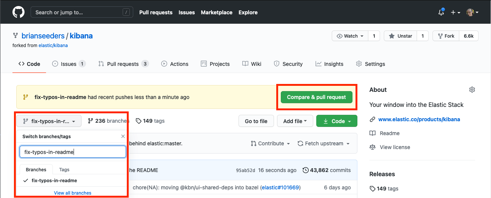
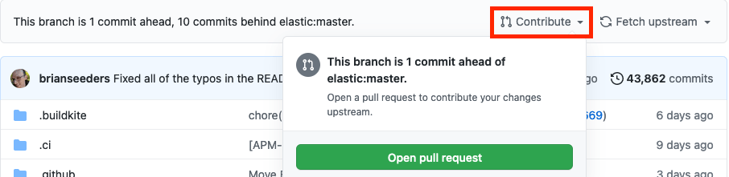
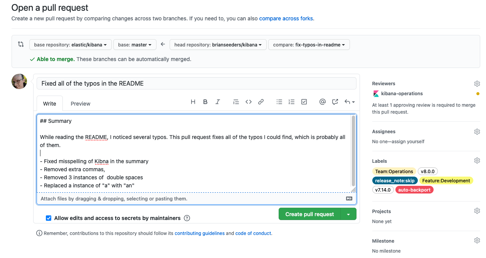

# Submitting a pull request [development-pull-request]

This page covers the end-to-end flow: forking the repo, creating a branch, opening a pull request, signing the CLA, and keeping your PR up to date. For the review philosophy, see [Pull request review guidelines](/extend/contributing/workflow/pr-review.md).


## What goes into a pull request

- Include an explanation of your changes in the PR description.
- Link to relevant issues, external resources, or related PRs. Context is important and saves reviewer time.
- Update any tests that cover your code, and add new tests where appropriate.
- Update or add docs when behavior or usage changes. See [Documentation during development](docs-content://extend/contribute/index.md).


## Create and clone a fork of Kibana

{{kib}} has hundreds of developers, some outside of Elastic, so we use a fork-based workflow for branches and pull requests.

1. Log in to [GitHub](https://github.com).
2. Navigate to the [Kibana repository](https://github.com/elastic/kibana).
3. Follow the [GitHub instructions](https://docs.github.com/en/get-started/quickstart/fork-a-repo) for forking and cloning.


## Create a branch

After cloning your fork and navigating to its directory:

```bash
# Start from the branch you want to branch off of
git checkout main

# Create a new branch
git checkout -b fix-typos-in-readme

# Edit some code
vi README.md

# Stage and commit
git add README.md
git commit -m "Fixed all of the typos in the README"

# Push the branch to your fork
git push -u origin fix-typos-in-readme
```

When you push a new branch, GitHub prints a URL in the terminal that takes you directly to the "create a pull request" page for that branch.


## Create a pull request

1. Navigate to your fork on GitHub.
2. If your branch is visible at the top of the page with a **Compare & pull request** button, click it. Otherwise navigate to your branch, click **Contribute**, then **Open pull request**.
3. Fill out the pull request template with the details relevant to your change.
    - If your PR relates to an open issue, reference it (for example, `Closes #12345`).
4. **(Elastic employees only)** Add the teams or people who need to review under **Reviewers**. Often one or more teams are auto-assigned based on which part of the codebase changed.
5. **(Elastic employees only)** Add any relevant labels:
    - **Versions**: add a label for each {{kib}} version the change will ship in (for example, `v8.0.0`, `v7.14.0`).
    - **Features**: add labels for relevant feature areas (for example, `Feature:Development`).
    - **Team**: most PRs should carry at least one `Team:` label for the teams responsible for or following the PR.
    - **Release note**: add `release_note:skip` if the PR should not appear in release notes.
    - **Auto backport**: add `backport:version` to automatically backport to all labeled versions.
6. Submit the pull request. If it's not quite ready, open it as a **Draft pull request**.

In the PR description itself:

- Describe what the change does and mention the issue where discussion happened, for example "Closes #123".
- Assign the `review` and `💝community` labels if you're not a member of the Elastic organization — this signals that someone needs to give the PR attention.
- Do **not** assign a version label. Elastic staff will assign one when the PR is ready to be merged.
- Target `main` unless the bug is only present in an older version. If the bug affects both `main` and another branch, say so.








## Sign the Contributor Agreement

On your first pull request, a bot comments asking you to sign the [CLA / Contributor Agreement](https://www.elastic.co/contributor-agreement). Your PR cannot be merged until the agreement is signed.


## Review process

Most PRs go through several iterations of feedback and updates. Depending on scope and complexity, the process can take weeks. Please be patient — we hold the codebase to a high standard.

See [Pull request review guidelines](/extend/contributing/workflow/pr-review.md) for the general review philosophy.


## Updating your PR with upstream

If your pull request hasn't been updated with the latest code from the upstream target branch (for example, `main`) in the last 48 hours, it can't be merged until it is. This prevents stale code from merging into upstream (for example, something recently merged that's incompatible with your change).

Instead of `git` commands, leave a comment on your PR with `@elasticmachine merge upstream`. This automatically updates your branch and kicks off CI.


## Re-triggering CI

The easiest way to re-trigger CI is to update your branch (see above) with the latest upstream code. That also ensures your branch is up to date and compatible.
